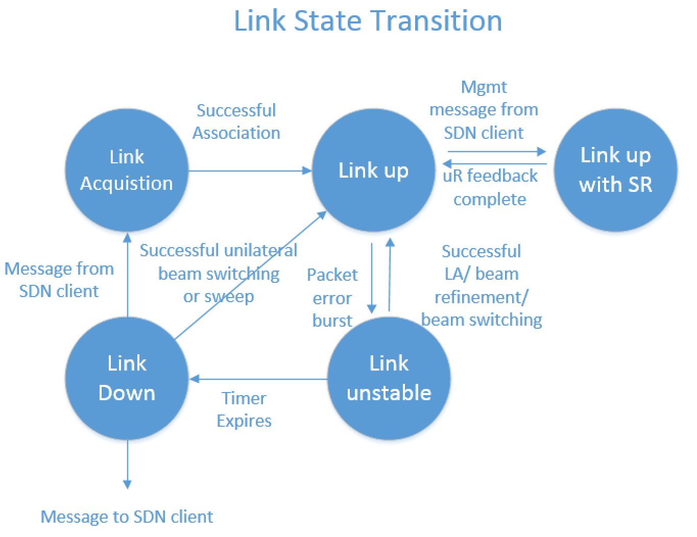
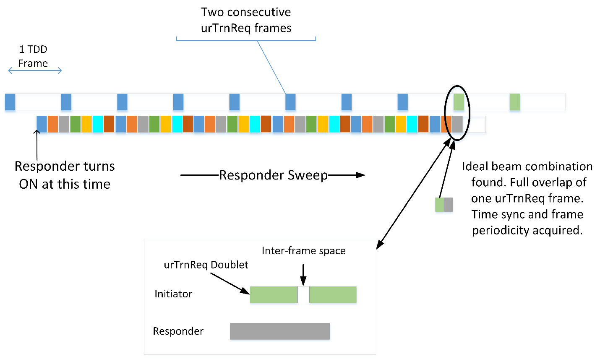
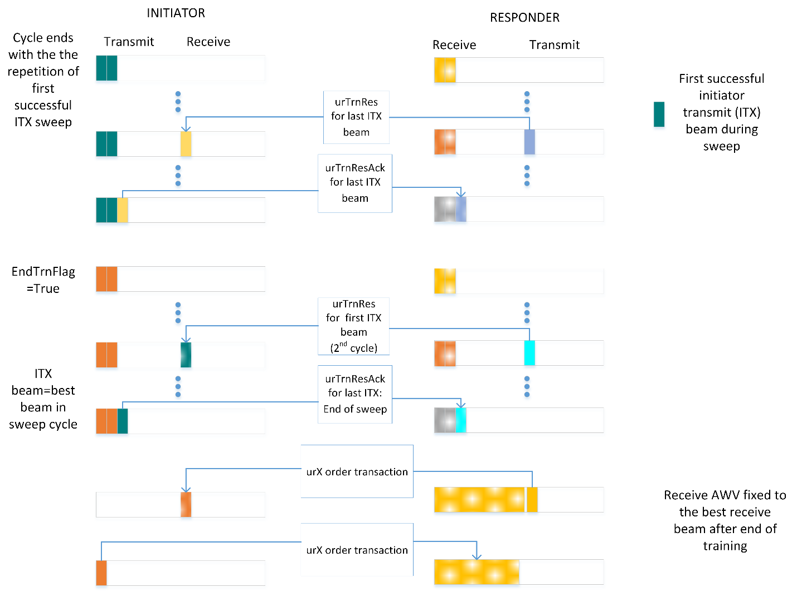
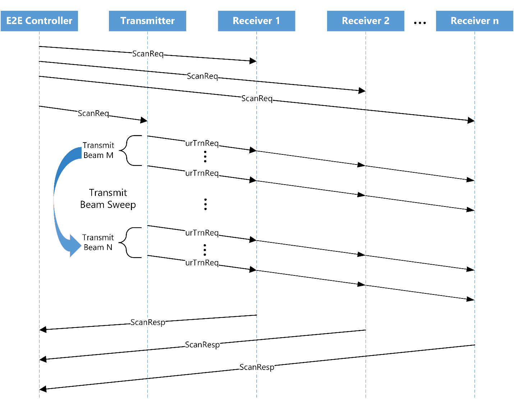

# Beamforming and Link Adaptation
Beamforming (BF) is the process of using signal propagation information between
two antennas and modifying antenna characteristics to maximize the signal
quality between those antennas. The BF process accomplishes this in a few
discrete states, including passive acquisition, active signaling, and continuous
refinement.

This document describes the Terragraph beamforming procedures, messages, and
other information related to the beamforming process.

The [Glossary](#beamforming-link-adaptation-glossary) collects the acronyms and
defines the terms used in this document.

## Link States and Transitions
A link represents the directional connectivity between a transmitter and a
receiver. The transmitter and receiver shall independently maintain the state of
the link. Conditions can exist where the state of a link as determined by the
transmitter differs from the state of the link as determined by the receiver.

There are five link states: *Link Down*, *Link Unstable*, *Link Acquisition*,
*Link Up*, and *Link Up with Simultaneous Reacquisition*. Figure 1 illustrates
these states and the transitions between them. This link state machine exists
independently for each link of a node.

<p align="center">
  
  <br />
  <em>Figure 1, Link States and Transitions</em>
</p>

A link enters into a *Link Acquisition* state when an existing node in the
network and a new node perform the BF acquisition procedure to establish
connectivity with the network. After successful BF acquisition and association,
the link moves to the *Link Up* state. In the *Link Up* state, the node monitors
the link periodically and takes actions at the link level to operate the link at
the maximum throughput (link adaptation).

From the steady state, the node moves the link to the *Link Unstable* state,
whenever there is a packet error burst. In the *Link Unstable* state, the node
takes actions to resolve the error burst. The actions taken to attempt
resolution of the error burst include link adaptation, beam refinement, and beam
switching. Upon successful resolution, the link moves back to *Link Up* state.

If the node is unable to resolve the issue causing the link to be in the *Link
Unstable* state within the time allowed, the node moves the link to the *Link
Down* state. In the *Link Down* state, the node attempts several procedures to
revive the link. If the attempts are successful, the node moves the link back to
the *Link Up* state.

If the attempts to revive the link are not successful, the node moves the link
to the *Link Acquisition* state or the *Link Down* state. If the node is a DN,
the link moves to the *Link Down* state and the node waits for direction from
the E2E controller. If the node is a CN, the link moves to the *Link
Acquisition* state.

Table 1 summarizes the procedures associated with each link state and the
purpose of those procedures.

| **Link State**                            | **Procedures**                 | **Purpose**                                             |
| ----------------------------------------- | ------------------------------ | ------------------------------------------------------- |
| *Link Acquisition*                        | Beamforming acquisition        | Establish the link and determine a list of micro-routes |
| *Link Up*                                 | 1. Link adaptation             | 1. MCS adjustment                                       |
|                                           | 2. Micro-route order update    | 2. Micro-route order update (micro-route switching)     |
|                                           | 3. Beamforming reacquisition   | 3. Micro-route update (detect new micro-routes and remove nonexisting micro-routes |
| *Link Up with Simultaneous Reacquisition* | Beamforming reacquisition      | Find list of micro-routes from neighboring nodes to perform interference management |
| *Link Unstable*                           | 1. Link adaptation             | 1. MCS and transmit power adjustment                    |
|                                           | 2. Micro-route update          | 2. Micro-route order update (micro-route switching)     |
|                                           | 3. DN handoff                  |                                                         |
| *Link Down*                               | 1. Unilateral beam switching (Basic) | 1. Change to an existing backup micro-route       |
|                                           | 2. Transmit and receive mini-sweep (advanced) | 2. Find an existing micro-route          |
|                                           | 3. DN handoff                  | 3. Change to an existing micro-route with a micro-route with a different DN |
|                                           | 4. Beamforming reacquisition   | 4. Acquire new micro-routes                             |

*Table 1, Link States and Procedures*

### Link Down State
This is the initial state for the link. A node initializes the link information
and transitions to the *Link Acquisition* state as a responder.

### Link Acquisition State
A CN always performs the responder role during beamforming procedures in this
state. A DN enters the link acquisition state upon link initialization or when
directed by the E2E controller while in the *Link Down* state. The DN always
performs the responder role when entering the link acquisition state after link
initialization. The DN performs the initiator role only when directed to enter
this state by the E2E controller. After successfully completing the beamforming
acquisition procedure and association with the neighboring node, the link
transitions to the *Link Up* state.

### Link Up State
In this state, both DN and CN monitor the link quality for variations causing
decreased signal quality or increased packet error rate. Based on the variation
of signal quality or packet error rate, the node performs link adaptation or
micro-route reordering. Periodically, the node performs beamforming
reacquisition. On direction of the E2E controller, the node transitions to the
*Link Up* with Simultaneous Reacquisition state. On detection of a packet error
burst exceeding a preset error threshold for which link adaptation or
micro-route, reordering is unable to correct, the node transitions to the *Link
Unstable* state.

### Link Up with Simultaneous Reacquisition State
In this state, the node performs beamforming reacquisition under the direction
of the E2E controller. After completing the beamforming procedure, including the
exchange of new micro-route ordering, the node transitions to the *Link Up*
state.

### Link Unstable State
In this state, the node attempts to recover from rapid, dramatic increases in
packet error rate. If the node successfully completes the beamforming
acquisition procedure, the node exchanges micro-routes and transitions to the
*Link Up* state. If the node does not successfully complete the beamforming
acquisition procedure, the node transitions to the *Link Down* state.

## Beamforming Procedures
The Terragraph MAC performs all beamforming procedures using the frames defined
in the [MAC & PHY Specification](MAC_PHY_Specification.md). The following
defines the beamforming procedures.

- **Beamforming Acquisition** – discovery and establishment of all possible link
  level connections (LLC, also referred to as "micro-routes") between any two
  nodes in the network
- **Beamforming Re-acquisition** – repopulation of the 2D LLC used for routing
  on Layer 3 (L3); triggers periodically in the steady state, upon transition to
  a catastrophic failure state, or add new node states
- **Beamforming Refinement** – fine adjustments to beamforming weights in the
  steady state to maximize link quality based on a pre-established 2D LLC
- **Micro-route Update** – changing the prioritized list of micro-routes in
  steady state based on changes in link quality and packet error rate
- **Link Adaptation** – changing the modulation and coding scheme (MCS) and or
  transmit power to react to varying link conditions

### Beamforming Acquisition and Reacquisition
The beamforming acquisition and reacquisition procedures use MAC frame exchanges
between an initiator node and a responder node. The beamforming acquisition and
beamforming reacquisition procedures share similar workflows. This section
describes both of these procedures. Beamforming acquisition operates using
either the synchronous sweep or the asynchronous sweep at the responder.
Beamforming reacquisition operates only using the synchronous sweep.

#### Asynchronous Beamforming Sweep
A node shall use an asynchronous sweep when the frame and slot boundary timing
is unknown. This condition can exist when a node has not yet received
synchronization information or when a link moves to the *Link Down* state and
previously acquired synchronization information has become stale. The purpose of
the asynchronous sweep is to establish initial communication between an
initiator node and responder node, as well as to synchronize the timing of the
responder node to that of the initiator node. Figure 2 shows the Asynchronous
sweep procedure.

<p align="center">
  
  <br />
  <em>Figure 2, Asynchronous Sweep</em>
</p>

When an initiator node attempts to perform beamforming acquisition or
reacquisition with a node with which it has not yet established synchrony or
with which the synchronization information has become stale, the initiator shall
transmit two consecutive `urTrnReq` frames, separated by the minimum interframe
gap, in each TDD frame. The two consecutive `urTrnReq` frames are a `urTrnReq`
frame doublet. The initiator shall sweep through all of the transmit beams,
repeating the same transmit beam index for *N-1* repetitions (31 or 61 for the
current implementation) of the two consecutive `urTrnReq` frames (2*N `urTrnReq`
frames with the same transmit beam index). After the *N-1*st repetition, the
initiator shall move to the next transmit beam index. The purpose of this is to
provide the responder node the maximum likelihood of correctly receiving and
decoding one of the `urTrnReq` frames.

The responder node, when it has not established synchrony with an initiator
node, shall sweep its receiver through every receive beam, dwelling on each
receive beam for a period of time equal to the minimum interframe time plus
twice the time to transmit the `urTrnReq` frame. At the end of the dwell time on
a receive beam, the responder shall continue to the next receive beam. The
responder shall loop through all receive beams, until successfully receiving and
decoding the `urTrnReq` frame.

Upon receipt of the `urTrnReq` frame, the responder shall synchronize its local
time, frame boundary and slot boundary to that of the initiator. After the
responder synchronizes with the initiator, the responder shall terminate the
asynchronous sweep and begin the synchronous sweep.

<a id="beamforming-link-adaptation-synchronous-beamforming-sweep"></a>

#### Synchronous Beamforming Sweep
Synchronous beamforming acquisition and reacquisition are the processes of
exchanging frames between an initiator node and a responder node, exhaustively
attempting to find pairs of transmit beams from the initiator and receive beams
from the responder that allow reliable communication between the two nodes to
occur. A node shall use synchronous beamforming acquisition or reacquisition
only when the responder node synchronizes to the frame and slot boundaries of
the initiator node.

The acquisition and re-acquisition procedures involve testing *N_i* transmit and
*N_r* receive beam combinations. Figure 3 illustrates this procedure. The
procedure assumes link reciprocity. The initiator and responder shall send all
frames in the control slot, the first slot, of a frame.

<p align="center">
  
  <br />
  <em>Figure 3, Beamforming Training Flow Diagram</em>
</p>

#### Initiator Operation
The initiator shall transmit two Beamforming Training Request (`urTrnReq`)
frames with a particular transmit beam index, separated by the minimum
interframe time (a `urTrnReq` doublet) to begin the procedure. The initiator
shall transmit the doublets in the first slot of the transmit subframe of each
frame. The initiator shall reserve the slots used to transmit the `urTrnReq` and
receive the `urTrnRes` frames in the slot maps exchanged with all other
associated nodes.

The initiator shall transmit the `urTrnReq` doublet for 31 consecutive TDD
frames. The value of `FrmNumInBfWin` in the `urTrnReq` frame indicates the
number of transmissions, minus 1. The initiator shall repeat the transmission of
the 31 `urTrnReq` doublets N times, with each repetition using a new transmit
beam index. The N repetitions allow the receiver to test all possible receive
beam indexes against that transmit beam index.

Fifteen TDD frames after the transmission of the last of the 31 `urTrnReq`
doublets for a transmit beam index, the initiator shall set the node's receive
beam index to the value of the transmit beam index of the previously transmitted
`urTrnReq` doublets. This allows the initiator to receive any urTrnRes frame
returned from a responder.

Upon receipt of the urTrnRes frame, the initiator shall populate its 2D LLC
matrix for the corresponding transmit beam with the values returned by the
responder in the `urTrnRes` and shall send a Beamforming Training Response ACK
frame (`urTrnResAck`) using the transmit beam indicated as the `TxBeamIdx` of
the received `urTrnRes` frame. The initiator shall transmit the `urTrnResAck 15
TDD` frames after the receipt of the `urTrnRes` frame. If the initiator does not
receive the `urTrnRes` from the responder, the initiator shall not send the
`urTrnResAck` and shall populate its 2D LLC matrix with values indicating a lack
of response from the responder for the corresponding transmit beam.

The number of transmit beam indexes may differ between the beamforming
acquisition procedure and the beamforming reacquisition procedure. The
beamforming acquisition procedures shall use all possible transmit beam indexes.
The beamforming reacquisition procedure may use a subset of all of the transmit
beam indexes.

The initiator shall increment the transmit beam index and repeat the exchange of
`urTrnReq`, `urTrnRes`, and `urTrnResAck` frames for each transmit beam index,
until all indexes for the relevant procedure have been attempted. Because a
responder synchronizes with the initiator at a random point during the
initiator's transmission of the `urTrnReq` doublets for the first transmit beam
for which the initiator receives the `urTrnRes`, the initiator shall repeat the
31 transmissions of the `urTrnReq` doublets for that same transmit beam after
completing the synchronous sweep for all other transmit beam indexes.

During the transmissions of the `urTrnReq` doublets with the final transmit beam
index of the sweep, the initiator shall set the `EndTrnFlag` in the frame to
indicate to the responder that this is the final set of transmit beam doublets.

#### Responder Operation
The responder shall listen for urTrnReq frames in the first slot of the receive
subframe of each frame, noting the value of `FrmNumInBfWin` that indicates the
number of `urTrnReq` doublets transmitted with the same transmit beam index.
Fifteen TDD frames after the time at which the last `urTrnReq` frame was
transmitted, the responder shall send a Beamforming Training Response
(`urTrnRes`) frame, indicating the index of the transmit beam of the initiator
and the indexes and link quality of the receive beams for which the urTrnReq
frame was successfully decoded.

The responder shall send the `urTrnRes` frame using as the transmit beam the
beam index that has the greatest link quality indicated in the `urTrnRes` frame.
The responder shall send the `urTrnRes` frame in the first slot of the transmit
subframe.

The responder shall also track the value of `FrmNumInBfWin`, indicating how many
`urTrnReq` frame doublets the initiator transmitted with the same transmit beam
index. The responder shall send the `urTrnRes` frame 15 TDD frames after
synchronizing with the initiator and after the `FrmNumInBfWin` indicates the
last `urTrnReq` doublet with the same transmit beam index.

Upon receipt of the `urTrnResAck` frame, the responder shall populate its 2D LLC
matrix with the values from its sweep for the corresponding initiator transmit
beam. If the responder does not receive the `urTrnResAck`, it shall populate its
2D LLC matrix for the corresponding initiator transmit beam with a value
indicating a lack of response from the initiator.

#### Combined Initiator and Responder Operation
When synchronized to the frame and slot boundaries of the initiator node, the
responder node shall use the synchronous sweep, as described in
[Synchronous Beamforming Sweep](#beamforming-link-adaptation-synchronous-beamforming-sweep).
Figure 4 shows the combined operation of the initiator and responder during the
synchronous sweep procedure.

<p align="center">
  
  <br />
  <em>Figure 4, Synchronous Sweep</em>
</p>

<a id="beamforming-link-adaptation-micro-route-ordering-exchange"></a>

#### Micro-route Ordering Exchange
During the synchronous sweep exchanges, the initiator shall order the eight best
initiator transmit and responder receive beams, while the responder shall order
the eight best responder transmit and initiator receive beams, from the
information obtained during the synchronous sweep.

Upon completion of the synchronous sweep exchanges for all transmit beam
indexes, the responder shall send a Beamforming Micro-route Exchange (`urX`)
frame with the Beamforming Order Request (`urOrdReq`), listing the eight best
pairs of responder transmit and initiator receive beam indexes obtained from the
synchronous sweep. The responder shall send the `urX` frame in the first
available control slot to the initiator. The responder shall send this frame
using the transmit beam for which the initiator has indicated the best link
quality in any `urTrnResAck` frame. The responder shall send the `urX` frame in
the next available control slot.

After transmitting the `urX` frame with `urOrdReq`, the responder shall listen
for the `urX` frame from the initiator in the first available receive control
slot from the initiator using the receive beam index for which it has indicated
the best link quality in any `urTrnRes` frame.

Upon receipt of the `urX` frame from the responder, the initiator shall send the
`urX` frame with the Beamforming Order Response (`urOrdRes`), listing the eight
best pairs of initiator transmit and responder receive beam indexes obtained
from the synchronous sweep. The initiator shall send this frame using the
transmit beam for which it has received the best link quality indication in any
`urTrnRes` frame from the initiator. The initiator shall send the `urX` frame in
the first available control slot to the responder.

Figure 5 shows the end of the synchronous sweep and the micro-route exchange.

<p align="center">
  
  <br />
  <em>Figure 5, End of Synchronous Sweep and Micro-route Ordering Exchange</em>
</p>

<p align="center">
  
  <br />
  <em>Preliminary Responder State Diagram</em>
</p>

<p align="center">
  
  <br />
  <em>Preliminary Initiator State Diagram</em>
</p>

### Periodic Beamforming Scan
The periodic beamforming scan (PBS) acquires fresh information about the
micro-routes between a single transmitter and a single receiver.

<a id="beamforming-link-adaptation-pbs-procedure"></a>

#### PBS Procedure
The E2E controller shall initiate the PBS by sending Scan Request Messages to
the transmitter/receiver node pair selected to perform the scan, called the
measurement set. Different from beamforming acquisition, PBS uniquely identifies
the transmitter and receiver to each other by their individual MAC addresses and
can indicate a subset of the micro-routes for scanning.

The MAC shall start the PBS at a bandwidth grant duration (BWGD) boundary
indicated in the Scan Request message. The duration of a PBS varies, dependent
on the number of beams scanned. This duration can be less than or greater than a
single BWGD.

For the duration of the scan, called the Beamforming Training Duration (BFTD),
the transmitter shall communicate slots reserved for beamforming to all
associated nodes in the normal slot map exchange. The transmitter shall send
`urTrnReq` training frames (see
[MAC & PHY Specification](MAC_PHY_Specification.md) for frame details) for the
PBS only in the first transmit slot of each frame for the BFTD. The receiver
shall attempt to receive the transmitted training frames in the corresponding
receive slot.

The PBS proceeds unidirectionally, from the transmitter to the receiver. Unlike
synchronous beamforming, there is no exchange of `urTrnRes` or `urTrnResAck`
frames between the transmitter and receiver and no exchange of micro-routes,
`urX` frames, at the conclusion of the scan. The receiver sends feedback on the
scan to the controller, when the scan is complete, using the Scan Response
Message.

Figure 6 illustrates the PBS messaging exchange.

<p align="center">
  
  <br />
  <em>Figure 6, PBS Message Exchange</em>
</p>

<a id="beamforming-link-adaptation-pbs-scheduling"></a>

#### PBS Scheduling
A scan of the beams selected for a PBS has a duration BFTD. The BFTD derives
from the number of transmit beams, the number of receive beams, and the BWGD.

The node shall calculate BFTD, in BWGDs, as shown in Equation 1.

$$
BFTD = \frac{N_{t} \times N_{r}}{N_{f} \times N_{s}}\ ,
$$

<p align="center">
  <em>Equation 1, Calculation of BTFD</em>
</p>

where *N_t* is the number of transmit beams, *N_r* is the number of receive
beams, *N_f* is the number of frames in a superframe, and *N_s* is the number of
superframes in a BWGD. Figure 7 illustrates the calculation of the BFTD.

<p align="center">
  
  <br />
  <em>Figure 7, Beamforming Training Duration</em>
</p>

The E2E controller shall schedule PBSs such that the duration of an individual
scan is significantly shorter than the period of the scans.

### Interference Measurement Scan
The interference measurement scan (IMS) uses the PBS mechanism with additional
receivers to determine the interference caused by the transmissions of one
sector on other sectors. The E2E controller directs each IMS between one
transmit sector and one or more receive sectors in close geographic and/or
angular proximity. The sectors involved in an IMS do not necessarily have link
level connectivity. The sectors selected for the scan called, collectively, the
measurement set, perform the scan as directed by the E2E controller and report
the results back to the controller.

#### IMS Procedure
The E2E controller shall initiate an IMS by sending Scan Request Messages to the
transmitter node and receive nodes in the measurement set. When the measurement
set includes one or more CNs, the controller also shall send Scan Request
Messages to the DNs with which the CNs are associated. The nodes in the
measurement set shall start the IMS at the BWGD indicated in the Scan Request
Message. Each of the nodes in the measurement set will receive or create slot
maps reserving slots for beamforming, during which the nodes perform the IMS.
The IMS shall proceed as described in
[PBS Procedure](#beamforming-link-adaptation-pbs-procedure).

For the duration of the BFTD, the DNs in the measurement set shall communicate
slots reserved for beamforming to all associated nodes in the normal slot map
exchange. The transmitter shall send `urTrnReq` training frames (see
[MAC & PHY Specification](MAC_PHY_Specification.md) for frame details) for the
IMS only in the first transmit slot of each frame for the BFTD. The `urTrnReq`
frames shall use the broadcast address as the destination address of the frame.
The receivers shall attempt to receive the transmitted training frames in the
corresponding receive slot.

The IMS proceeds unidirectionally, from the transmitter to the receivers. Unlike
synchronous beamforming, there is no exchange of `urTrnRes` or `urTrnResAck`
frames between the transmitter and receivers and no exchange of micro-routes,
`urX` frames, at the conclusion of the scan. The receivers send feedback on the
scan to the controller, when the scan is complete, using the Scan Response
Message.

Figure 8 illustrates the IMS messaging exchange.

<p align="center">
  
  <br />
  <em>Figure 8, Interference Measurement Scan Message</em>
</p>

#### IMS Scheduling at the MAC
The node shall schedule the IMS as specified in
[PBS Scheduling](#beamforming-link-adaptation-pbs-scheduling).

### Scheduling Scans at the Network Level
Individual PBS and IMS operations present little difficulty to schedule in an
operational network, as they consume relatively small amounts of bandwidth over
short periods. In a large network, however, it can be necessary to schedule
several scans to be operating at the same time. In order not to have one scan
interfere with another, it is necessary that a sector participate in only one
scan at a time; that is, a sector can be a member of only one measurement set
for which a scan is taking place. To facilitate the scheduling of parallel scans
in a network, the controller determines a sector adjacency matrix, a list of
measurement sets, and a scheduling exclusion matrix.

#### Sector Adjacency Matrix
The controller shall compute a sector adjacency matrix, where the elements in
the matrix indicate the possibility of the sectors interfering with one another.
The sector adjacency matrix is a square matrix with the dimensions equal to the
number of sectors in the network. Each element of the matrix,
`sector_adjacency_matrix(i,j)`, holds a binary value indicating that the sector
*i* is adjacent to sector *j*, in the sense that the sectors could cause
interference to one another. The controller can populate this matrix
conservatively, initially, based on deployment measurements of distance, angle,
and obstructions between sectors. As the controller conducts PBS and IMS, the
controller can prune the adjacencies from the matrix based on these
measurements.

### Measurement Set Determination
The controller determines a list measurement sets from the sector adjacency
matrix. Each element of the measurement set list holds the sectors of a unique
row of the sector adjacency matrix. The controller ignores duplicate rows of the
sector adjacency matrix, as they would produce a measurement set identical to
that derived from the row duplicated.

#### Scheduling Exclusion Matrix
The controller shall compute a scheduling exclusion matrix, where the elements
of the matrix indicate whether two measurement sets contain any sectors in
common. The scheduling exclusion matrix is a square matrix with the dimensions
of the total number of measurement sets in the network. Each element of the
matrix, `scheduling_exclusion_matrix(i,j) = scheduling_exclusion_matrix(j,i)`
holds a binary value indicating that measurement set *i* contains at least one
sector in common with measurement set *j*.

#### Scheduling Identifiers
The controller creates a set of scheduling identifiers and assigns one or more
measurement sets to the identifier, such that all of the measurement sets with
the same scheduling identifier can conduct scans simultaneously. The controller
assigns scheduling identifiers to measurement sets using a graph vertex coloring
algorithm, where the vertices of the graph correspond to an individual
measurement set and the edges between vertices correspond to a scheduling
exclusion indicated in the scheduling exclusion matrix.

### Link Adaptation Procedure
The link adaptation procedure provides a method for a node to adjust the MCS and
transmit power of a link to maximize the throughput of that link.

If the link adaptation procedure is enabled and the control parameters for link
adaptation have been configured, a node shall perform the link adaptation
procedure for each of its links, while in the *Link Up* state. Out of band
management currently enables and configures the link adaptation procedure.

#### Receiver Operation
The node shall measure the signal-to-noise ratio (SNR) of all received data
frames from each transmitter on a link. The node shall measure the received SNR
per transmitter over a minimum period of three superframes. The node shall
filter the received SNR per transmitter as shown in Equations 2, 3, and 4 to
create a set of link adaptation feedback parameters.

$$
\text{AvgstfSNR} = \frac{1}{N}\sum_{k = 0}^{N - 1}{stfSNR\lbrack k\rbrack}
$$

<p align="center">
  <em>Equation 2, Average Short Term Feedback SNR</em>
</p>

$$
\text{AvgpostSNR} = \frac{1}{N}\sum_{k = 0}^{N - 1}{postSNR\lbrack k\rbrack}
$$

<p align="center">
  <em>Equation 3, Average Post SNR</em>
</p>

$$
\text{AvgRSSI} = \frac{1}{N}\sum_{k = 0}^{N - 1}{RSSI\lbrack k\rbrack}
$$

<p align="center">
  <em>Equation 4, Average Received Signal Strength Indication</em>
</p>

The node shall send the link adaptation feedback parameters to the transmitter
in the Heartbeat, Keep Alive, and/or Uplink Bandwidth Request frames, as
appropriate for the types of node at each end of the link.

#### Transmitter Operation
A node receiving the link adaptation feedback parameters may filter the
parameters to reduce instantaneous variability. The receiving node shall use the
link adaptation feedback parameters to choose a new MCS and/or transmit power
level, should the parameters indicate that a change is necessary to improve the
link throughput with the node sending the feedback parameters. The node also may
modify the choice of a new MCS and/or transmit power level using local
measurements of successful and unsuccessful frame transmissions, that is the
counts of frames for which the node receives acknowledgements and those for
which the node receives no acknowledgement. The node shall perform link
adaptation independently for each link on which it operates.

The outer loop link adaptation (OLLA) uses short-term frame statistics for total
number of frames sent, the number of frames received successfully and the number
of frames failed, along with the target error rate, the minimum and maximum
amounts to offset the signal-to-noise ratio (SNR), and the weight to apply to
failed frames (NACKWeight).

The inner loop of the algorithm uses the result of the outer loop computation to
offset the filtered SNR feedback from the receiving node to compute the
"effective signal to interference and noise ratio (SINR)". The effective SINR
and offset select the MCS for future transmissions to the receiving node. Figure
9 illustrates the transmitter link adaptation algorithm.

<p align="center">
  
  <br />
  <em>Figure 9, Transmitter Link Adaptation</em>
</p>

#### Transmit Power Control
Terragraph nodes implement transmit power control (TPC) to balance two opposing
requirements. The first requirement is to maximize the utilization of each
transmit opportunity by using the highest MCS providing minimal error rates. The
second requirement is to minimize the interference caused by transmissions at
nodes other than the intended receiver. Meeting the first requirement generally
requires greater transmit power to increase the SNR at the intended receiver.
Meeting the second requirement generally requires reducing the transmit power to
reduce interference at nodes other than the intended receiver. The algorithm
used by Terragraph nodes for TPC operates in several phases.

#### TPC Phase 0
This phase of TPC occurs during beamforming acquisition. In this phase, the node
shall use the maximum allowable transmit power for the MCS of each transmission.
At the conclusion of beamforming acquisition, the nodes exchange Micro-route
Exchange frames (see
[Micro-route Ordering Exchange](#beamforming-link-adaptation-micro-route-ordering-exchange)
and [MAC & PHY Specification](MAC_PHY_Specification.md)).

#### TPC Phase 1
This phase of TPC occurs after the exchange of Micro-route Exchange frames at
the conclusion of beamforming acquisition. In phase 1, the nodes shall attempt
to reduce transmit power, using the received signal strength indication (RSSI)
indicated by the peer node and returned in the Micro-route Exchange frame and a
reference value for the RSSI expected at the peer node. If the RSSI indicated by
the peer node is greater than the reference RSSI value, the difference between
the two RSSI values is calculated. The algorithm reduces the difference to the
maximum allowable power reduction step size, if the difference is greater than
the allowable step size. In this phase, power the algorithm only reduces
transmit power, as needed.

```c
if ((peerStfSnrQ2 > tp->refStfSnrStep1Q2) &&
    (peerRssiQ2 > tp->refRssiQ2)) {
     delPowerQ2 = (peerRssiQ2 - tp->refRssiQ2);
     if (delPowerQ2 > tp->delPowerStep1Q2) {
         delPowerQ2 = tp->delPowerStep1Q2;
    }
}
```

#### TPC Phase 2
This phase of TPC occurs after the exchange of the Association Request,
Response, and Response Ack frames. In phase 2, the nodes shall attempt to reduce
transmit power, using the SNR value returned by the peer node in the Association
Response or Association Response ACK frame and a reference SNR value for the MCS
expected at the peer node to provide a high probability of error-free reception.
If the SNR indicated by the peer node is greater that the reference SNR value,
the difference between the two SNR values is calculated. The algorithm reduces
the difference to the maximum allowable power reduction step size, if the
difference is greater than the allowable step size. In this phase, the algorithm
only reduces transmit power, as needed.

```c
if (updEvt == TPC_UPD_AFTER_ASSOC) {
        if (peerStfSnrQ2 > tp->refStfSnrStep2Q2) {
            delPowerQ2 = (peerStfSnrQ2 - tp->refStfSnrStep2Q2);
            if (delPowerQ2 > tp->delPowerStep2Q2) {
                delPowerQ2 = tp->delPowerStep2Q2;
            }
        }
}
```

#### TPC Phase 3
This phase of TPC occurs after the link between the peer nodes is active and the
nodes exchange Heartbeat, Keep Alive, and/or Uplink Bandwidth Request frames.
In phase 3, the nodes shall attempt to increase and reduce transmit power, as
required, to maintain the peer SNR minimally greater than the reference SNR
value.  The algorithm speculatively calculates a power reduction value by
calculating the difference between the peer SNR value and the reference SNR
value.

If the peer SNR value is greater than the reference value, the power reduction
value is the minimum of the maximum allowable step value and the speculative
power reduction value reduced by a hysteresis amount. In this case the power
reduction value is used to reduce the transmit power.

If the peer SNR value is less than or equal to the reference value, the power
reduction value is the maximum of the allowable step size and the speculative
power reduction value increased by a hysteresis amount. In this case, the power
reduction value is used to increase the transmit power.

```c
if (updEvt == TPC_UPD_DURING_LINK_UP) {
        delPowerQ2 = peerStfSnrQ2 - tp->refStfSnrStep3Q2;
        if (delPowerQ2 > 0) {
            delPowerQ2 -= tp->tpcHysteresisdBQ2Step3;
            delPowerQ2 = MIN(delPowerQ2, tp->delPowerStep3Q2);
        } else {
            delPowerQ2 += tp->tpcHysteresisdBQ2Step3;
            delPowerQ2 = MAX(delPowerQ2, -tp->delPowerStep3Q2);
        }
}
```

## 2D Scans, Massive & Diversity Modes
The objective of **1D scans** is to find the best beam/sector on the Azimuth
(AZ) plane, while **2D scans** search on both the Azimuth (AZ) and Elevation
(EL) planes.

**Massive mode** refers to multiple antenna tiles connected to multiple RFICs
which are combined by the baseband (BB). In Massive mode, antenna tiles are in
the same plane and pointing in the same directions.

**Diversity mode** allows a single BB chip to operate RFIC/Antenna modules that
are not in the same plane and are pointing in different directions by selecting
only one of them for use at a time. The region of coverage of the different
RFIC/Antenna modules may or may not overlap.

### General Beamforming Firmware Flow
* There are two modes for how the RFICs are programmed with the correct antenna
  weight vectors (AWVs) for a specific beam:
    * **Legacy mode**, where vendor FW uses the board file in BRD format to load
      AWVs used to program the RFICs. Board files have only 61 beams.
    * **Codebook variant mode**, where FB FW uses a master codebook of 120 beams
      (stored on the host in JSON format) that covers a specified scan range to
      load specific AWVs corresponding to that beam to program the RFICs.
* For simplicity, there is a one-time download of the master codebook from the
  host to FW.
* The master codebook on the host will have 120 beams.
* The main codebook configurations to support will be (as an example):
    * **2D:** 3 EL beams and 40 AZ beams
    * **1D:** 1 EL beam and 120 AZ beams
* The master codebook will be defined per tile, per Tx/Rx, and per channel.
* For either Massive or Diversity mode, beamforming consists of two stages:
    * *Initial Beamforming (IBF)* to find coarse beams during initial link
      establishment, using beams 0-60
    * *Periodic Beamforming (PBF)* to perform beam refinement

### Initial Beamforming
General IBF notes:
* During IBF, FW uses beams in IBF scan range in the protocol.
* Those beams are loaded to the IBF scan range in RFIC; beams 0-60 (i.e. IBF
  sweep size is 61).
* Whenever a beam is programmed in slot programming for a diversity node, an
  implicit mapping of the tile is determined from the beam index:
    * Beams 0-29 are for `set1RficBitmap` (Tile 0) and beams 30-60 are for
      `set2RficBitmap` (Tile 1)
    * Beams 0-29 typically has the same AWV as beams 30-59

#### Legacy Mode
Massive:
* Vendor FW loads beams to program RFIC from a board file that has 61 beams.

Diversity:
* Vendor FW loads beams to program RFIC from a constructed board file that has
  61 beams organized as follows:
    * Beams 0-29 are distinct and used for Tile 0
    * Beams 30-59 are a copy of beams 0-29 and used for Tile 1
    * Beam 60 is a copy of Beam 59

For both massive and diversity modes:
* Beam 38 is ignored due to vendor HW limitation.
* Beam 38 is always mapped to beam 64 due to vendor HW limitation.

#### 2D Codebook Variant Mode
Massive:
* FB FW uses a master codebook of 120 beams at the host to load 61 beams (3 EL x
  20 AZ beams + 1) to program RFIC using get/set AWV.
* FB FW skips every other beam from the master codebook to load those 61 beams.

Diversity:
* FB FW uses a master codebook of 120 beams at the host to load 30 beams (3 EL x
  10 AZ beams) to program RFIC using get/set AWV for Tile 0.
* FB FW skips every fourth beam from the master codebook to load those 30 beams;
  beams 0-29 for Tile 0.
* FB FW copies beams 0-30 to beams 31-60 for Tile 1.

#### 1D Codebook Variant Mode
Massive:
* Same as Codebook 1 except the 61 beams from the master codebook corresponds to
  1 EL x 60 AZ beams + 1.

Diversity:
* Same as Codebook 1 except the 30 beams from the master codebook corresponds to
  1 EL x 30 AZ beams + 1.

### Periodic Beamforming
Fine PBF refines over the entire scan range:
* **Legacy mode:** FW uses beams in the same IBF scan range in RFIC; beams 0-60
  already programmed by vendor FW via board file.
* **Codebook variant mode:** FW uses beams in the same IBF scan range in RFIC;
  beams 0-60 already programmed by FB from the master codebook using get/set
  AWV.

Relative PBF refines over Azimuth (±2):
* **Legacy mode:** FW uses the current beam ±2 AZ from beams in the same IBF
  scan range in RFIC; beams 0-60 already programmed by vendor FW via board file.
* **Codebook variant mode:** FW loads scan beams according to the current beam
  ±2 AZ from the master codebook and programs them to a scratch pad scan range
  starting at AWV index 69 using the updateAwv API. PBF sweeps through beams
  programmed to the scratch pad scan range.

### Firmware Configuration Parameters
* `ibfProcedureType`:
    * "0": Massive Mode
    * "1": Diversity Mode
* `ibfCodebookVariant`:
    * "0": Legacy Mode
    * "1": 1D Codebook Variant Mode
    * "2": 2D Codebook Variant Mode
* RFIC bitmap is an 8-bit mask that maps which RFIC is active.
    * `ibfSet1RficBitmap`:
        * Massive Mode: RFIC bitmap used for IBF and as MTPO reference tile
          (which is typically a middle tile), default is XIF2.
          *ibfSet1RficBitmap = 4* for XIF2 is mapped as the reference tile.
        * Diversity Mode: RFIC bitmap that corresponds to Tile 0.
    * `ibfSet2RficBitmap`:
        * Massive Mode: Corresponds to massive tiles configuration after MTPO
          calibration and PBF. *ibfSet2RficBitmap = 85* for 4 tiles.
        * Diversity Mode: RFIC bitmap that corresponds to Tile 1.
* `useUpdateAwvForPbf` (should be set to 1):
    * "0": PBF sectors are taken from IBF scan range.
    * "1": PBF sweeps through beams programmed to the scratch pad scan range.
* `ibfNumberOfBeams`: Number of beams in the IBF scan range.
* `maxTxPowerSet1`: Used to configure single tile IBF power when operating in
  massive mode with `set1RficBitmap != set2RficBitmap`.

|                               | `ibfProcedureType` | `ibfNumberOfBeams` | `ibfCodebookVariant` | `useUpdateAwvForPbf` | `ibfSet1RficBitmap` | `ibfSet2RficBitmap` |
| ----------------------------- | ------------------ | ------------------ | -------------------- | -------------------- | ------------------- | ------------------- |
| Massive w/ Legacy Mode        | 0 | 61 | 0 | ignored | 4 | 85 |
| Diversity w/ Legacy Mode      | 1 | 61 | 0 | ignored | bitmap for tile 0 | bitmap for tile 1 |
| Massive w/ 1D Codebook Mode   | 0 | 61 | 1 | 1 | 4 | 85 |
| Diversity w/ 1D Codebook Mode | 1 | 61 | 1 | 1 | bitmap for tile 0 | bitmap for tile 1 |
| Massive w/ 2D Codebook Mode   | 0 | 61 | 2 | 1 | 4 | 85 |
| Diversity w/ 2D Codebook Mode | 1 | 61 | 2 | 1 | bitmap for tile 0 | bitmap for tile 1 |

### Examples

#### 1D Codebook Variant
Master Codebook Variant 1 (1D), same for Massive and Diversity modes:

| Beam Index | Geometric Direction           |
| ---------- | ----------------------------- |
| 0-119      | (-45 : 0.75 : 44.25) AZ, 0 EL |

Massive board file w/ 61 beams (0-60):

| Beam Index | Angular Representation     |
| ---------- | -------------------------- |
| 0-37       | (-45 : 1.5 : 9) AZ, 0 EL   |
| 38         | ignored                    |
| 39-59      | (12 : 1.5 : 43.5) AZ, 0 EL |
| 60         | 43.5 AZ, 0 EL              |
| 64 (38)    | 10.5 AZ, 0 EL              |

Diversity board file w/ 61 beams (0-60):

| Beam Index | Angular Representation  | Tile Selected in board file | Tile selected in FW |
| ---------- | ----------------------- | --------------------------- | ------------------- |
| 0-29       | (-45 : 3 : 42) AZ, 0 EL | Tile 1 & 0                  | Tile 0              |
| 30-37      | (-45 : 3 : 24) AZ, 0 EL | Tile 1 & 0                  | Tile 1              |
| 38         | ignored                 | Tile 1 & 0                  | Tile 1              |
| 39-59      | (-18 : 3 : 42) AZ, 0 EL | Tile 1 & 0                  | Tile 1              |
| 60         | 42 AZ, 0 EL             | Tile 1 & 0                  | Tile 1              |
| 64 (38)    | -21 AZ, 0 EL            | Tile 1 & 0                  | Tile 1              |

#### 2D Codebook Variant
Master Codebook Variant 2 (2D), same for Massive and Diversity modes:

| Beam Index | Geometric Direction           |
| ---------- | ----------------------------- |
| 0-39       | (-30 : 1.5 : 28.5) AZ, -18 EL |
| 40-79      | (-30 : 1.5 : 28.5) AZ, 0 EL   |
| 80-119     | (-30 : 1.5 : 28.5) AZ, 18 EL  |

Massive board file w/ 61 beams (0-60):

| Beam Index | Angular Representation     |
| ---------- | -------------------------- |
| 0-19       | (-30 : 3 : 24) AZ, -18 EL  |
| 20-37      | (-30 : 3 : 18) AZ, 0 EL    |
| 38         | ignored                    |
| 39         | 24 AZ, 0 EL                |
| 40-59      | (-30 : 3 : 24) AZ, 18 EL   |
| 60         | 24 AZ, 18 EL               |
| 64 (38)    | 21 AZ, 0 EL                |

Diversity board file w/ 61 beams (0-60):

| Beam Index | Angular Representation    | Tile Selected in board file | Tile selected in FW |
| ---------- | ------------------------- | --------------------------- | ------------------- |
| 0-9        | (-30 : 6 : 24) AZ, -18 EL | Tile 1 & 0                  | Tile 0              |
| 10-19      | (-30 : 6 : 24) AZ, 0 EL   | Tile 1 & 0                  | Tile 0              |
| 20-29      | (-30 : 6 : 24) AZ, 18 EL  | Tile 1 & 0                  | Tile 0              |
| 30-37      | (-30 : 6 : 12) AZ, -18 EL | Tile 1 & 0                  | Tile 1              |
| 38         | ignored                   | Tile 1 & 0                  | Tile 1              |
| 39         | 24 AZ, -18 EL             | Tile 1 & 0                  | Tile 1              |
| 40-49      | (-30 : 6 : 24) AZ, 0 EL   | Tile 1 & 0                  | Tile 1              |
| 50-59      | (-30 : 6 : 24) AZ, 18 EL  | Tile 1 & 0                  | Tile 1              |
| 60         | 24 AZ, 18 EL              | Tile 1 & 0                  | Tile 1              |
| 64 (38)    | 18 AZ, -18 EL             | Tile 1 & 0                  | Tile 1              |


<a id="beamforming-link-adaptation-glossary"></a>

## Glossary

| Term      | Definition                                                                                                      |
| --------- | --------------------------------------------------------------------------------------------------------------- |
| **ACK**   | **Acknowledgement;** a receipt of data transmission                                                             |
| **BF**    | **Beamforming;** the process of using signal propagation information between two antennas and modifying antenna characteristics to maximize the signal quality between those antennas |
| **BLER**  | **Block error rate;** a ratio of the number of erroneous blocks to the total blocks received in a circuit       |
| **BWGD**  | **Bandwidth grant duration**                                                                                    |
| **C-PHY** | **C Physical Layer;** a physical layer standard based on 3-phase symbol encoding                                |
| **E2E**   | **End-to-End Service**; a service responsible for runtime operations within a single Terragraph network         |
| **FW**    | **Firmware**                                                                                                    |
| **IEEE**  | **Institute of Electrical and Electronics Engineers**                                                           |
| **IMS**   | **Interference measurement scan**                                                                               |
| **L3**    | **Layer 3;** the network layer of the multilayered communication model                                          |
| **LA**    | **Link adaptation;** the matching of modulation, coding, and other signal and protocol parameters               |
| **LLC**   | **Link level connection**                                                                                       |
| **LoS**   | **Line of sight**                                                                                               |
| **MCS**   | **Modulation and coding scheme**                                                                                |
| **PBS**   | **Periodic beamforming scan**                                                                                   |
| **PER**   | **Packet error rate**                                                                                           |
| **RSSI**  | **Received signal strength indication**                                                                         |
| **SNR**   | **Signal-to-noise ratio**                                                                                       |
| **TPC**   | **Transmit power control**                                                                                      |
