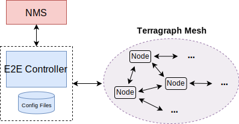

# Configuration Management
This document describes the configuration management system.

## Architecture
Terragraph implements a centralized configuration management architecture. The
E2E controller serves as the point of truth for all node configurations, and is
responsible for keeping all nodes' local copies in sync with its own view. All
config changes are applied using the controller.

<p align="center">
  
</p>

Node configuration is a JSON-serialized Thrift structure (`thrift::NodeConfig`),
and is generally manipulated using [folly::dynamic] objects. A node's full
configuration is computed by applying several "override" layers on top of the
base configuration for its software version. All configuration files are stored
under the `/data/cfg/` directory on disk for both the E2E controller and
Terragraph node.

### Operations
The controller's `ConfigApp` accepts the following *user operations* on the node
configurations:

| User Operation        | Commands |
| --------------------- | -------- |
| Get Node Config       | `GET_CTRL_CONFIG_REQ`<br />`GET_CTRL_CONFIG_PATHS_REQ` |
| Get Config Layers     | `GET_CTRL_CONFIG_BASE_REQ`<br />`GET_CTRL_CONFIG_FIRMWARE_BASE_REQ`<br />`GET_CTRL_CONFIG_HARDWARE_BASE_REQ`<br />`GET_CTRL_CONFIG_AUTO_NODE_OVERRIDES_REQ`<br />`GET_CTRL_CONFIG_NETWORK_OVERRIDES_REQ`<br />`GET_CTRL_CONFIG_NODE_OVERRIDES_REQ` |
| Set Config Overrides  | `SET_CTRL_CONFIG_NETWORK_OVERRIDES_REQ`<br />`SET_CTRL_CONFIG_NODE_OVERRIDES_REQ`<br />`MODIFY_CTRL_CONFIG_NETWORK_OVERRIDES_REQ`<br />`MODIFY_CTRL_CONFIG_NODE_OVERRIDES_REQ`<br />`CLEAR_AUTO_NODE_OVERRIDES_CONFIG` |
| Get Config Metadata   | `GET_CTRL_CONFIG_METADATA_REQ` |
| Get Config Actions    | `GET_CTRL_CONFIG_NETWORK_OVERRIDES_ACTIONS_REQ`<br />`GET_CTRL_CONFIG_NODE_OVERRIDES_ACTIONS_REQ`<br />`GET_CTRL_CONFIG_ACTIONS_RESULTS_REQ` |
| Perform Optimizations | `TRIGGER_POLARITY_OPTIMIZATION`<br />`TRIGGER_GOLAY_OPTIMIZATION`<br />`TRIGGER_CONTROL_SUPERFRAME_OPTIMIZATION`<br />`TRIGGER_CHANNEL_OPTIMIZATION` |

All `SET` operations on the controller are validated using the *config
metadata*, which is a separate JSON file describing every configuration
parameter. All `GET` operations are served locally except for getting
post-config actions, which sends out `GET_MINION_CONFIG_ACTIONS_REQ` messages to
minions to request the actions that they would take for a given configuration
change; responses can then be polled from the controller. Additionally, the
controller handles the `EDIT_NODE` command from `TopologyApp` to migrate a
node's configuration upon a node name change.

The controller pushes the full node configuration to a minion's `ConfigApp`
through the `SET_MINION_CONFIG_REQ` command. The minion updates its copy of
the configuration on disk (`/data/cfg/node_config.json`) and takes any required
post-config actions. These actions are determined by taking the
*JSON difference* between the current and new node configurations, then applying
all actions defined in the local metadata file.

Note that much of the functionality described above is implemented within helper
classes:
* `ConfigHelper` (*e2e-controller*) manages reading, modifying, and writing to
  all separate configuration layers.
* `NodeConfigWrapper` (*e2e-common*) manages reading and writing the full node
  configuration.
* `ConfigMetadata` (*e2e-common*) manages reading the config metadata file,
  validating configuration, and extracting post-config actions.
* `ConfigUtil` (*e2e-common*) contains miscellaneous static utilities, such as
  version string parsing.

### Syncing Configuration
To keep config in sync, nodes send an MD5 hash of their local configuration to
the controller in their periodic status reports (`STATUS_REPORT`) from
`StatusApp`. The controller's `ConfigApp` periodically iterates over all
received status reports and looks for mismatches with its computed
configuration. For each mismatch, the controller will push a new node
configuration to the minion, as described above. There is a fixed interval
between consecutive pushes to the same node, as a protective measure in case the
new configuration causes a fatal error on the node; this delay is reset when the
controller receives a configuration change.

The automatic config sync can be disabled by "un-managing" the network or
specific nodes via a special boolean configuration field
`sysParams.managedConfig`. This may be needed temporarily for testing purposes.

### Staged Rollout
The controller's `ConfigApp` contains an optional scheduling algorithm, similar
to that of `UpgradeApp`, to roll out configuration changes that affect multiple
nodes in batches (e.g. when changing network overrides). This protects against
network-wide service disruption and network isolation, but will delay the
propagation of configuration changes.

To enable this staging algorithm, set the `config_staged_rollout_enabled` flag
on the controller; by default, all config updates to nodes are sent
simultaneously.

### Interoperability
When the controller finds a node with an unrecognized hardware board ID and
version, it will disable config updates for that node because unknown
hardware-specific configs may exist.

Additionally, if the `unknown_hw_queries_enabled` flag is set (default on), the
controller will send `GET_MINION_BASE_CONFIG` queries to these nodes
(rate-limited per node and board ID). In response, each minion will return a
`MINION_BASE_CONFIG` message containing its latest base configuration and
metadata. The controller merges these minion structures into its existing config
data (non-persistently), and can afterwards re-enable config updates for all
nodes with the same hardware board ID. Any conflicting metadata entries are
dropped, and unknown post-config actions are parsed but ignored.

## Layered Configuration Model
Terragraph follows a layered configuration model, with a node's "full"
configuration computed as the union of all layers in the following order:

* **Base configuration** - The default configuration, which is tied to a
  specific software version and is included as part of the image. The controller
  finds the closest match for a node's software version string, and falls back
  to the latest if no match was found.
```
/etc/e2e_config/base_versions/<version>.json
```
* **Firmware-specific base configuration** - The default configuration tied to a
  specific firmware version, which is also included as part of the image. Values
  are applied on top of the initial base configuration layer.
```
/etc/e2e_config/base_versions/fw_versions/<version>.json
```
* **Hardware-specific base configuration** - The default configuration tied to a
  specific hardware type, which is also included as part of the image. Each
  hardware type supplies configuration that changes with software versions.
  Values are applied on top of the firmware base configuration layer. The
  mapping between hardware types and hardware board IDs is defined in
  `/etc/e2e_config/base_versions/hw_versions/hw_types.json`.
```
/etc/e2e_config/base_versions/hw_versions/<hw_type>/<version>.json
```
* **Automated node overrides** - Contains any config parameters for specific
  nodes that were automatically set by the E2E controller.
```
/data/cfg/auto_node_config_overrides.json
```
* **Network overrides** - Contains any config parameters that should be
  uniformly overridden across the entire network. This takes precedence over the
  base configuration and automatic overrides.
```
/data/cfg/network_config_overrides.json
```
* **Node overrides** - Contains any config parameters that should be overridden
  only on specific nodes (e.g. PoP nodes). This takes precedence over the
  network overrides.
```
/data/cfg/node_config_overrides.json
```

The E2E controller manages and stores the separate config layers. Terragraph
nodes have no knowledge of these layers, *except* the base configuration on the
image. The nodes will copy the latest base version (via natural sort order) if
the configuration file on disk is missing or corrupt.

## Config Metadata
A separate config metadata file (`/etc/e2e_config/config_metadata.json`) is used
for per-config documentation, verification, and actions. Every configuration
field has a corresponding entry in this file.

### Data Types
Whereas node configuration is a JSON-serialized Thrift structure, the metadata
is freeform JSON that is recursively parsed into C++ structures defined in
`ConfigMetadata.h`.

Each root metadata entry is parsed into the `CfgParamMetadata` structure, which
inherits the `CfgRecursiveParam` base type. A root entry is identified by the
presence of its required properties ("desc", "type", "action"). Depending on the
associated configuration field's data type, the root structure may or must also
contain a type-specific sub-structure (e.g. required for maps and objects). The
table below shows the association between all possible data types (defined in
the Thrift enum `thrift::CfgParamType`), the name of their type-specific field,
and the C++ structure for the field:

| Type      | Field      | Sub-Structure     |
| --------- | ---------- | ----------------- |
| `INTEGER` | *intVal*   | `CfgIntegerParam` |
| `FLOAT`   | *floatVal* | `CfgFloatParam`   |
| `STRING`  | *strVal*   | `CfgStringParam`  |
| `BOOLEAN` | *boolVal*  | `CfgBooleanParam` |
| `MAP`     | *mapVal*   | `CfgMapParam`     |
| `OBJECT`  | *objVal*   | `CfgObjectParam`  |

Note that these data types constitute all JSON types *except arrays*. Arrays are
not supported in the configuration model due to ambiguity in layering. Also
note that map keys must be strings, in accordance with JSON specifications.

### Post-Config Actions
A post-config action is associated with each metadata entry, determining what
the minion should do when the configuration field is changed. These are defined
in the Thrift enum `thrift::CfgAction`:

| Action                      | Description                                   |
| --------------------------- | --------------------------------------------- |
| `NO_ACTION`                 | Do nothing                                    |
| `REBOOT`                    | Reboot the node                               |
| `RESTART_MINION`            | Restart e2e_minion                            |
| `RESTART_STATS_AGENT`       | Restart stats_agent                           |
| `RESTART_LOGTAIL`           | Restart logtail                               |
| `RESTART_ROUTING`           | Restart openr and pop_config                  |
| `RESTART_SQUIRE`            | Restart squire                                |
| `REDO_POP_CONFIG`           | Restart pop_config and fib_nss                |
| `RESTART_FLUENTD_AGENT`     | Restart fluent-bit                            |
| `RELOAD_DNS_SERVERS`        | Reload nameservers listed in /etc/resolv.conf |
| `RELOAD_NTP_CONFIG`         | Restart NTP service with updated config       |
| `RELOAD_RSYSLOG_CONFIG`     | Rewrite rsyslog.conf and restart rsyslogd     |
| `RELOAD_SSHD_CA_KEYS`       | Restart sshd with updated CA keys file        |
| `RESTART_KEA`               | Restart kea (dhcp)                            |
| `SYNC_LINK_MONITOR`         | Sync link metrics with openr LinkMonitor      |
| `INJECT_KVSTORE_KEYS`       | Sync keys with openr KvStore                  |
| `UPDATE_FIREWALL`           | Rewrite firewall(ip6tables) rules             |
| `UPDATE_LINK_METRICS`       | Update MCS-based link metric config for openr |
| `UPDATE_GLOG_LEVEL`         | Update glog's VLOG level                      |
| `RELOAD_FIRMWARE`           | Reload firmware, usually by restarting e2e_minion |
| `SET_FW_PARAMS`             | Dynamically change this firmware parameter    |
| `SET_FW_PARAMS_SYNC_OR_RELOAD_FIRMWARE` | Dynamically change this firmware parameter at a specific BWGD index, or reload firmware if not possible |
| `SET_FW_STATS_CONFIG`       | Set firmware stats config                     |
| `SET_AIRTIME_PARAMS`        | Dynamically change link airtime allocation    |
| `RESTART_UDP_PING_SERVER`   | Restart UDP ping server                       |
| `RELOAD_SSHD`               | Restart SSH daemon                            |
| `UPDATE_CHANNEL_ASSIGNMENT` | Reassign channels across topology             |
| `RESTART_SNMP`              | Restart NET-SNMP and TG snmp agent daemons    |
| `RESTART_WEBUI`             | Restart WebUI (HTTP server)                   |
| `RELOAD_TUNNEL_CONFIG`      | Reload tunnel configuration                   |
| `RELOAD_VPP_CONFIG_AND_MONITOR` | Run vpp_chaperone to re-apply VPP config and restart monitor services |
| `UPDATE_ZONE`               | Redo POP config if required or do nothing     |
| `RELOAD_TOPOLOGY_NAMES`     | Restart stats_agent and fluent-bit services   |

It is possible that multiple actions will be triggered for a single parameter,
e.g. if an object property defines an action different from the root entry. The
object property action does *not* simply replace the root entry action. Note
that `SET_FW_PARAMS` and related actions are a special case and will *only* take
effect when set on an object property (not on a root entry).

The code handling each action is located in the minion's
`ConfigApp::performNodeActions()` method. The minion is responsible for applying
actions in a sensible order, e.g. rebooting or restarting minion last.

### Structure
Each root metadata entry must include these fields:
* **desc:** A string description of the field
* **action:** The post-config action (`thrift::CfgAction`)
* **type:** The data type of the field (`thrift::CfgParamType`)

Type-specific constraints can be defined using the previously-listed
sub-structures:
* *intVal*
    * **allowedRanges:** An array of allowed ranges, where each range is a
      two-element integer array [min, max] (inclusive)
    * **allowedValues:** An array of allowed integer values, separate from
      allowedRanges (e.g. for special values like -1)
* *floatVal*
    * **allowedRanges:** An array of allowed ranges, where each range is a
      two-element floating-point array [min, max] (inclusive)
    * **allowedValues:** An array of allowed floating-point values, separate
      from allowedRanges
* *strVal*
    * **regexMatches:** A regular expression string which the value must match
    * **intRanges:** An array of allowed integer ranges (like above); the string
      value is parsed as an integer
    * **floatRanges:** An array of allowed floating-point ranges (like above);
      the string value is parsed as a floating-point number
    * **allowedValues:** An array of allowed string values, separate from
      regexMatches
* *boolVal*
    * *n/a*
* *objVal*
    * **properties:** A map of string property names to objects with the
      following fields:
        * **desc:** A string description of the object property
        * **action:** An *additional* post-config action (`thrift::CfgAction`)
        * **required:** Whether defining this property is required (default
          false)
        * **type:** The data type of the property value (`thrift::CfgParamType`)
        * *intVal, floatVal, strVal, boolVal, objVal, mapVal*
* *mapVal*
    * **type:** The data type of the map values (enum, see above)
    * *intVal, floatVal, strVal, boolVal, objVal, mapVal*

### Deprecation
A configuration field can be marked as "deprecated" by setting the optional
property `"deprecated": true` on any root or object-property metadata entry.
Deprecated configuration fields will still be initially read from disk, but only
allow `GET` operations during runtime.

### Read-only
A configuration field can be marked as "read-only" by setting the optional
property `"readOnly": true` on any root or object-property metadata entry.
Read-only configuration fields will still be initially read from disk, but only
allow `GET` operations during runtime.

### Preprocessing
The config metadata parser supports a simple form of macro expansion. Macro
expansion blocks are denoted with a "copy-block" marker (`__copy_block__`),
which is a normal JSON property that takes as a string value the absolute
location of the target block to copy (with all properties delimited by a
period). The target JSON value will be copied into the source location (i.e.
where copy-block was used). Any other properties defined within the original
object with copy-block will *override* those same properties in the copied
target block.

In the example below, the "mcs" block under "radioParamsBase" will be copied
into "linkParamsBase", but with the action "SET_FW_PARAMS" instead of
"RESTART_MINION":

```json
{
  "linkParamsBase": {
    "desc": "Link parameters",
    "action": "NO_ACTION",
    "type": "OBJECT",
    "objVal": {
      "properties": {
        "fwParams": {
          "desc": "Firmware parameters for links",
          "action": "RESTART_MINION",
          "type": "OBJECT",
          "objVal": {
            "properties": {
              "mcs": {
                "__copy_block__": "radioParamsBase.objVal.properties.fwParams.objVal.properties.mcs",
                "action": "SET_FW_PARAMS"
              }
            }
          }
        }
      }
    }
  },
  "radioParamsBase": {
    "desc": "Radio parameters",
    "action": "NO_ACTION",
    "type": "OBJECT",
    "objVal": {
      "properties": {
        "fwParams": {
          "desc": "Firmware parameters for radios",
          "action": "RESTART_MINION",
          "type": "OBJECT",
          "objVal": {
            "properties": {
              "mcs": {
                "desc": "MCS used by transmitter (1-12: Static MCS, 35: Joint LA-TPC)",
                "type": "INTEGER",
                "intVal": {
                  "allowedRanges": [[1, 12]],
                  "allowedValues": [35]
                }
              }
            }
          }
        }
      }
    }
  }
}
```

The current implementation handles circular- and self-references (throw error),
as well as dependencies (parse with no order requirement).

## E2E Configuration
The controller and aggregator are configured using separate configuration files
with a similar overall design as the node configuration, and are managed by the
`E2EConfigWrapper` class. The configuration model does not have any layers (or
"base" configuration), but the user operations on these configurations are
otherwise the same as for nodes.

These E2E configuration files are shown in the table below.

| Thrift Structure           | Configuration File                 | Metadata File                                       |
| -------------------------- | ---------------------------------- | --------------------------------------------------- |
| `thrift::ControllerConfig` | `/data/cfg/controller_config.json` | `/etc/e2e_config/controller_config_metadata.json`   |
| `thrift::AggregatorConfig` | `/data/cfg/aggregator_config.json` | `/etc/stats_config/aggregator_config_metadata.json` |

The following actions are supported in the E2E configuration files:

| Action                  | Description                   |
| ----------------------- | ----------------------------- |
| `NO_ACTION`             | Do nothing                    |
| `REBOOT`                | Send SIGTERM to the process   |
| `RESTART_STATS_AGENT`   | Restart stats_agent           |
| `UPDATE_GLOG_LEVEL`     | Update glog's VLOG level      |
| `UPDATE_GFLAG`          | Reload associated gflag value |
| `UPDATE_SCAN_CONFIG`    | Update scan configuration     |

The E2E configuration structures contain a special "flags" map, which defines
command-line flags to be passed into the E2E controller and NMS aggregator on
startup. The systemd service scripts will pass the flags, and utilize the
`config_print_flags` script which reads a configuration file and returns the
command-line flags as a formatted string.

### Config Metadata
Certain metadata properties are specific to E2E configuration, and are described
in the sections below.

#### Tags
Descriptive tags can be set on any root or object-property metadata entry via
the optional `"tag"` string property. Tags are purely informational.

#### Sync
Controller configuration is partially synced between peers under High
Availability mode (refer to [High Availability](High_Availability.md) for
further details). Configuration fields must be marked "syncable" by setting the
optional property `"sync": true` on any root or object-property metadata entry.
In general, only network-level configuration is synced, and host-level
configuration is not synced.

## Software Version Strings
Selection of the correct *base configuration* and *hardware-specific base
configuration* is determined by each node's software version string, contained
in the file `/etc/tgversion`.

Optionally, "major" and "minor" version numbers are extracted from version
strings that contain one of the following substrings:
```
[...] RELEASE_M<major> [...]
[...] RELEASE_M<major>_<minor> [...]
```

For example, the string below represents major version 60, minor version 7:
```
Facebook Terragraph Release RELEASE_M60_7-0-g5bec98eb9 michaelcallahan@devvm1112 2020-12-04T15:49:48
```

If major and minor versions are present, they are used to compare different
software versions. Otherwise, string-type comparisons are done on the full
version string. Order is important when determining the latest known
configuration, for example during node startup where the initial node
configuration file is generated if absent (via `/usr/sbin/config_read_env`).
There is an assumption that the "latest" base configuration file present on a
node's filesystem is the one it should use locally.

## Adding New Configuration
The sections below describe the steps required to write new configuration.

### New Hardware
Hardware-specific configuration is applied based on a *hardware board ID*,
*hardware type*, and *software version*.
* The *hardware board ID* is defined by the value of `HW_BOARD_ID` in the node
  info file (`/var/run/node_info`). This file is generated by a startup script
  `gen_node_info_file.sh` which must be modified for new hardware platforms. See
  [Service Scripts](Service_Scripts.md#service-scripts-environment-variables)
  for more details.
* The *hardware type* is defined in `hw_types.json` (described above),
  which is a mapping between board IDs and subdirectory names (within
  `./base_versions/hw_versions/`). One hardware type can represent multiple
  board IDs (e.g. for related platforms with identical configuration).
* The *software version* is used to match both the base configuration and
  hardware-specific configuration. If any hardware-specific configuration should
  be applied, then a file should exist for each supported software version in
  both `./base_versions/<version>.json` and
  `./base_versions/hw_versions/<hw_type>/<version>.json`.

*For interoperability, vendors **must** define a new, unique hardware board ID
for each product.*

### New Configuration Fields
All configuration fields must have the following parts:
* *Definition* - Within the appropriate Thrift structure (i.e. `NodeConfig`,
  `ControllerConfig`, or `AggregatorConfig`), as described above.
* *Metadata* - Within the corresponding metadata file (i.e.
  `controller_metadata.json`, `controller_config_metadata.json`, or
  `aggregator_config_metadata.json`).
* *Default value* - Within the base configuration JSON file. For
  hardware-specific fields, the default value should be placed in the
  hardware-specific base configuration file instead; in these cases, an empty
  value is usually added to the base configuration as well (for visibility).

*For interoperability, vendors should follow these guidelines:*
* Choose obviously non-conflicting key names for custom fields. For example,
  include the company name in every field name (for top-level structures).
* Pick indices for new Thrift fields within unique ranges to avoid serialization
  and/or merge conflicts. For example, start at 20000 (random number) instead of
  the next consecutive integer.

### New Command-Line Flags
When adding new command-line flags to the E2E controller or NMS aggregator, it
is recommended (but not required) to add an entry to corresponding metadata
file. This provides better visibility (e.g. in the NMS), enables input
validation, and allows post-config actions to be applied.

Flags for other services (e.g. E2E minion) are not supported here; consider
using explicit configuration fields instead.

<a id="configuration-management-breaking-changes"></a>

### Breaking Changes
For configuration changes which are not backwards compatible (e.g.
moving/renaming fields), it is recommended to support automatic migration
between the old and new configuration versions to avoid the need for user
intervention. This migration procedure is implemented in the script
`src/terragraph-e2e/lua/migrate_e2e_data.lua`, which should be run automatically
during software upgrades (e.g. when using the NMS installer) and will modify
data files as needed. Follow instructions in this script to add additional
migration functions.

## Resources
* [folly::dynamic] - Meta's C++ dynamically-typed value abstraction

[folly::dynamic]: https://github.com/facebook/folly/blob/master/folly/docs/Dynamic.md
