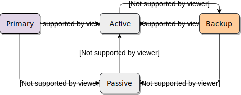

# High Availability
This document describes the high-availability protocol used by the E2E
controller.

## Overview
The controller supports a high-availability configuration using a primary-backup
protocol, loosely based on the [Binary Star Pattern]. In this setup, two
controllers (or "peers") are run on separate machines, and are designated as
either "primary" or "backup". If the primary catastrophically fails (e.g. power
outage, network failure, hardware failure), the backup will assume control of
the Terragraph network.

These are the major components:
* The underlying *finite state machine (FSM)*, determining each controller's
  state in response to events (either receiving the peer's state or a client
  request). This state machine is defined within `BinaryStarFsm`.
* The *FSM driver* for heartbeating between peers and passing events to the
  state machine. This is done jointly by `BinaryStarApp` and the controller's
  `Broker`.
* The *data synchronization layer*, which syncs persistent controller data
  (e.g. node configuration, network topology) from the active to passive
  controller. This is done in `BinaryStarApp`, with handlers in the associated
  apps.
* The *client layer*, which switches between the primary and backup controllers
  whenever its current connection times out. This logic is handled by the
  minion's `Broker`.

## Protocol
### Finite State Machine
<p align="center">
  
</p>

Each controller's state is comprised of two pieces:
* The *initial* fixed configuration (*primary*, *backup*)
* The *runtime* FSM state (`PRIMARY`, `BACKUP`, `ACTIVE`, `PASSIVE`)

Each controller stays in its initial state (`PRIMARY`/`BACKUP`) until it hears
its peer's state, triggering the FSM state change to `ACTIVE`/`PASSIVE`. Thus,
there are two "steady states" for the high-availability pair:
* `ACTIVE` *primary* <--> `PASSIVE` (or offline) *backup*
* `ACTIVE` *backup* <--> `PASSIVE` (or offline) *primary*

The peers exchange periodic heartbeats to determine liveness. A controller will
consider its peer "dead" if a set interval elapses without receiving any
heartbeats. However, a *passive* (`BACKUP`/`PASSIVE`) controller will only
become *active* (`ACTIVE`) if two conditions are met simultaneously:
* Its peer is dead (*peer timeout*)
* It receives a message from an E2E minion (*client request*)

The E2E minion (client) only connects to one controller at any given time. If it
receives no response from the current controller for a set period
(*controller timeout*), it will disconnect and try connecting to the other
controller. This is the only way to trigger controller failover.

#### Split-Brain
Split-brain (i.e. dual-actives) is avoided **only** if it is impossible to
partition the network such that a subset of nodes can see each controller while
the controllers cannot see each other.

#### Automatic Recovery
The FSM additionally supports *automatic recovery* of the primary controller. If
an `ACTIVE` *backup* sees that the *primary* has come back online, it will yield
control once it deems the `PRIMARY` to be stable (i.e. it has received a set
number of consecutive heartbeats). All connected clients will be explicitly
notified to switch controller URLs to avoid timeouts.

#### Exceptional States
If an exceptional FSM state occurs (ex. peers reconnecting after a network
partition to find they have split-brained), peers will attempt to recover by
reverting to their initial states (`PRIMARY`/`BACKUP`).

### Data Synchronization
The `ACTIVE` controller sends new *application data* to the `PASSIVE` as part of
the heartbeat message. It also attaches a *sequence number*, which the `PASSIVE`
echoes back in its heartbeat. Lastly, both controllers include their *software
version*, and will **not** sync data if these versions mismatch. This heartbeat
Thrift structure is shown below.

```c
struct BinaryStarSync {
  1: BinaryStarFsmState state;
  2: i32 seqNum;
  3: BinaryStarAppData data;
  4: string version;
}
```

If the `ACTIVE` controller receives a heartbeat with a mismatching sequence
number, it will send a full copy of its data with the next heartbeat. Otherwise,
it will only send data that changed since the last heartbeat, if any. The
sequence number is only incremented when new data or the full data is sent, not
on every heartbeat.

When a controller becomes `ACTIVE`, it will reset its sequence number, then
request current data to be sent from all its applications. Sequence numbers are
initialized to 0, but the first heartbeat from the `ACTIVE` peer will have a
sequence number of 1 because new application data was requested.

Only a `PASSIVE` controller will update its sequence number when receiving a
heartbeat. This guarantees that the first heartbeat sent to the `ACTIVE` will
mismatch (since 0 cannot match), and thus trigger full data sync on the next
heartbeat.

Note that the data synchronization protocol is strictly best-effort; it is
**not** fully fault-tolerant.

## Architecture
### Controller
* `BinaryStarFsm` - Contains a static function representing the state machine.
  The actual states, events, and structs are defined in `Controller.thrift`.
* `Broker` - Maintains a copy of the FSM. When receiving a client request, the
  FSM will indicate whether to drop the request (when *passive*), forward it
  (when *active*), or trigger controller failover (to become *active*).
* `BinaryStarApp` - Maintains a synchronized copy of the FSM, as well as ZMQ
  PUB/SUB sockets with the peer (for sending and receiving heartbeats). This is
  the main driver for the FSM, and also handles data synchronization between
  peers and with controller apps.
* Controller apps with persistent data (e.g. `ConfigApp`, `TopologyApp`) -
  Install handlers to send data (if *active*) or receive data (if *passive*)
  to and from `BinaryStarApp`.

### Minion
* `Broker` - Read the primary and backup controller URL, and switch between them
  if the current connection times out.

## Usage
### Controller Configuration
The primary and backup controllers must know each other's identity and initial
configuration on startup. This initial configuration is passed as flags:

| Flag                  | Description                                                         |
| --------------------- | ------------------------------------------------------------------- |
| `bstar_primary`       | Whether this controller is the primary (*true*) or backup (*false*) |
| `bstar_pub_port`      | The port that the controller publishes heartbeats on                |
| `bstar_peer_host`     | The hostname or IP address of the peer controller                   |
| `bstar_peer_pub_port` | The publisher port on the peer controller                           |
| `disable_bstar`       | Whether to disable the high availability feature                    |

High-availability mode is only enabled if `bstar_peer_host` is explicitly set,
and `disable_bstar` is off or not set. The primary should be started **before**
the backup, or else the backup may become `ACTIVE`.

There are additional flags to tune timings:

| Flag                                | Description                                                                                               |
| ----------------------------------- | --------------------------------------------------------------------------------------------------------- |
| `bstar_heartbeat_period_ms`         | Heartbeat interval (in ms)                                                                                |
| `bstar_failover_missed_heartbeats`  | Number of missed heartbeats before declaring the peer "dead"                                              |
| `bstar_primary_recovery_heartbeats` | Number of consecutive heartbeats before an `ACTIVE` *backup* performs *automatic recovery* (0 to disable) |

The backup controller URL is passed to the minion using Open/R's `KvStore`, the
same way as the primary URL. The key is `e2e-ctrl-url-backup`, and can be added
to any node's configuration (e.g. a POP node) as part of `kvstoreParams`.

### Viewing Runtime State
The controller can be queried for the current FSM state using the
`BSTAR_GET_STATE` message. This is sent as part of the `tg version controller`
command in the TG CLI, and is returned via the `/api/getHighAvailabilityState`
endpoint in the REST API service.

### Upgrade Procedure
When performing software upgrades on both controllers, upgrade the *backup*
controller first, then the *primary* controller. Note that the controllers will
not sync data when the versions mismatch, so any changes from the `ACTIVE`
controller will **not** propagate to the `PASSIVE` during this time. This is
done to prevent any potential issues with configuration management between
different controller versions, especially if migration steps are required as
part of a software upgrade.

## Resources
* [Binary Star Pattern] - ZMQ's primary-backup high-availability design

[Binary Star Pattern]: http://zguide.zeromq.org/php:chapter4#High-Availability-Pair-Binary-Star-Pattern
