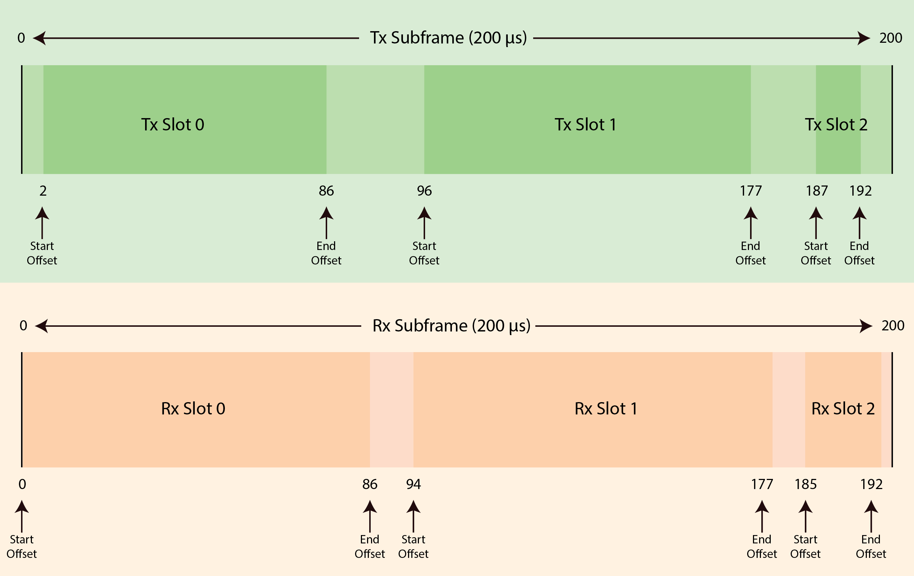
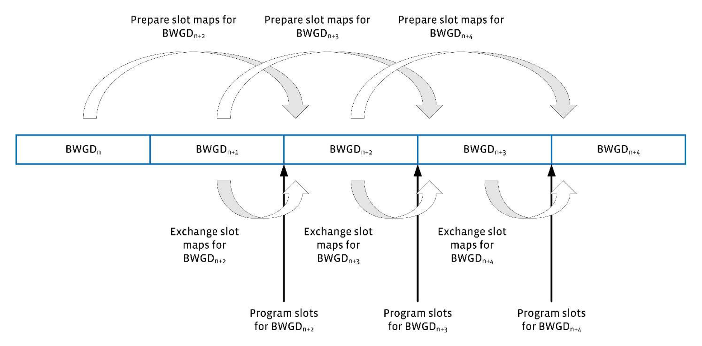

# MAC & PHY Specification
The link protocol used between Terragraph nodes is a modified version of the
Directed Multigigabit (DMG) physical layer (PHY) in clause 20 of IEEE Standard
IEEE 802.11-2016, previously the IEEE 802.11ad-2012 amendment to IEEE Standard
IEEE 802.11-2012. Terragraph uses the DMG PHY, or radio, and a significantly
slimmed down Media Access Control (MAC) layer. This document presents the
specifications for these layers.

The [Glossary](#mac-phy-spec-glossary) defines the terms and acronyms used in
this document.

## Terragraph Physical Layer
The Terragraph PHY connects one Terragraph node to another. All communication
between Terragraph nodes occurs over this PHY. With slight modifications,
Terragraph uses the DMG Single Carrier PHY and the DMG control mode of IEEE
802.11-2016. For more information on the DMG PHY, refer to clause 20 of IEEE
802.11-2016.

### DMG Control Mode
Terragraph nodes use the DMG Control Mode to transmit the ACK Control frames and
the Management Action frames. This maximizes the likelihood of successful
reception of these frames at the destination and minimizes the consumption of
the available bandwidth.

Table 1 shows the modulation and coding scheme for the DMG Control Mode.

| **MCS Index**  | **Modulation** | **Code Rate** | **Data Rate(Mbps)** |
| -------------- | -------------- | ------------- | ------------------- |
| 0              | DBPSK          | 1/2           | 27.5                |

*Table 1, Modulation and Coding Scheme for DMG Control Mode PHY*

### DMG Single Carrier PHY
Terragraph nodes use the DMG Single Carrier (SC) PHY. Terragraph nodes may
include the optional addition to select the Golay codes used in the PHY
preamble. Because the Terragraph network might operate on a single channel, the
potential for self-interference from other Terragraph nodes as well as
interference from other DMG networks is a possibility.

The Terragraph SC PHY assigns alternative Golay codes from the DMG PHY preamble
as a means for early rejection of interfering signals. Assigning different codes
to nodes that could interfere with each other mitigates that interference. The
E2E controller programs the Golay codes used by each sector in the Terragraph
network.

Terragraph nodes use the DMG SC PHY to transmit all data frames and the Block
ACK control frame. Terragraph uses commercial DMG radio chips for the radio link
between nodes.

Table 2 shows the modulation and coding scheme of the DMG SC PHY. Note that
"N_CBPS" represents the number of code bits per symbol.

| MCS Index | Modulation        | N_CBPS | Repetition | Code rate | Data rate (Mbps) |
| --------- | ----------------- | ------ | ---------- | --------- | ---------------- |
| MCS-1     | &#120529;/2 BPSK  | 1      | 2          | 1/2       | 385              |
| MCS-2     | &#120529;/2 BPSK  | 1      | 1          | 1/2       | 770              |
| MCS-3     | &#120529;/2 BPSK  | 1      | 1          | 5/8       | 962.5            |
| MCS-4     | &#120529;/2 BPSK  | 1      | 1          | 3/4       | 1155             |
| MCS-5     | &#120529;/2 BPSK  | 1      | 1          | 13/16     | 1251.25          |
| MCS-6     | &#120529;/2 QPSK  | 2      | 1          | 1/2       | 1540             |
| MCS-7     | &#120529;/2 QPSK  | 2      | 1          | 5/8       | 1925             |
| MCS-8     | &#120529;/2 QPSK  | 2      | 1          | 3/4       | 2310             |
| MCS-9     | &#120529;/2 QPSK  | 2      | 1          | 13/16     | 2502.5           |
| MCS-10    | &#120529;/2 16QAM | 4      | 1          | 1/2       | 3080             |
| MCS-11    | &#120529;/2 16QAM | 4      | 1          | 5/8       | 3850             |
| MCS-12    | &#120529;/2 16QAM | 4      | 1          | 3/4       | 4620             |

*Table 2, Modulation and Coding Scheme for DMG Control Mode PHY*

### Configuration of PHY Parameters
The E2E controller manages the configuration of PHY parameters using the Node
Parameters Message. The selection of polarity, Golay code, and link adaptation
algorithm parameters derive from values in the Node Parameters Message.

## Terragraph Media Access Control Overview
The version of the DMG MAC used in a Terragraph node is highly modified from
that in IEEE 802.11-2016. The modifications make it a highly efficient TDD MAC
by substituting TDD access for all other access mechanisms specified in IEEE
802.11. Terragraph uses only the following frames:

- Data
- QoS-Null
- Management Action (vendor specific)
- Block ACK (with Facebook proprietary modification)
- ACK

Terragraph maximizes efficiency of the MAC, by aggregating the MAC Service Data
Units (MSDUs) and the MAC Protocol Data Units (MPDUs) as much as possible to
reduce overhead and to eliminate interframe spacing that results in dead air
time.

The A-MSDU format is proprietary to Terragraph, but the A-MPDU is standard
compliant.

The MAC also utilizes block acknowledgement to minimize the number of frames
exchanged between sender and receiver. The block acknowledgement does not
require prior setup, as the format and reordering buffer size are fixed. The TDD
slots assigned to block acknowledgement are also fixed.

### Initiator and Responder Nodes
A Terragraph network is a software defined network (SDN) controlled by an
End-to-End (E2E) controller. The E2E controller typically runs in the cloud. The
Terragraph nodes communicate with the E2E controller.

The point at which the Terragraph network connects to the network through which
communication with the E2E controller is established is called a point of
presence (PoP). This document defines "upstream" as communication toward the PoP
by a Terragraph node and "downstream" as communication from the PoP toward a
Terragraph node.

In the MAC protocol and procedures, one node typically begins the procedure and
another node reacts. This document defines the node that begins a procedure as
the initiator node, and the node that reacts to the procedure as the responder
node. The initiator node is upstream from the responder node.

### Multirate Operation
Multirate operation enables different rates for data, management, and control
frames.

#### Data Frames
A node sends data frames using MCS 2 through MCS 12 of the DMG single carrier
PHY, as determined by the link adaptation algorithm.

#### Management Frames
A node sends all management frames using the DMG control mode PHY, MCS 0.

#### Control Frames
A node sends the ACK frame using the DMG control mode PHY, MCS 0. A node sends
the Block ACK frame using the DMG single carrier PHY, MCS 1.

## Terragraph MAC Frame Definitions

### Data Frames
Data frames are standard compliant QoS data frames.

### A-MPDU Format
A-MPDU format is standard compliant.

#### A-MSDU Format
Terragraph uses a proprietary A-MSDU format. A Terragraph A-MSDU data frame
shall have the following MAC header fields:

- **RA:** Receiver Address field, 6 bytes
- **TA:** Transmitter Address field, 6 bytes
- **Type:** Type field, 2 bytes
- **NX:** Network Accelerator field, 6 bytes
- **SL:** Subframe Lengths field

Figure 1 illustrates the format of the Terragraph A-MSDU data frame.

<p align="center">
  
  <br />
  <em>Figure 1, A-MSDU Frame Format</em>
</p>

#### RA field
The Receiver Address (RA) field shall contain the MAC address of the intended
receiver node of the data frame.

#### TA field
The Transmitter Address field (TA) contains the MAC address of the node
transmitting the data frame.

#### Type field
The Type field has the value 0x89FB.

#### NX field
The Network Accelerator (NX) field includes the following subfields:

- **Type:** 1 byte
- **CtxID:** 1 byte
- **NoS:** 1 byte
- **Reserved:** 3 bytes

#### Type field
The NX Type field indicates the type of A-MSDU subframes contained in the data
frame.

- A value of zero (0) indicates short A-MSDU subframes.
- A value of 1 indicates basic A-MSDU subframes.

Currently, the NX Type field value is always zero (0), indicating short A-MSDU
subframes.

##### CtxID field
The Context ID (CtxID) field carries an opaque value of significance to the
network accelerator. If the context is unknown or none, the value of the CtxID
field is 0xFF.

#### NoS field
The Number of Subframes (NoS) field carries a value that indicates the number of
A-MSDU subframes contained in the data frame. The value of this field shall be
greater than 0.

#### Reserved field
The Reserved field is 3 bytes, set to the value of zero (0). On reception, a
node ignores the reserved field.

#### SL Field
The Subframe Lengths Field (SL) field carries the lengths of the first NoS-1
A-MSDU subframes. The length of each A-MSDU subframe is carried in 2 bytes. The
length of the SL field is `2 * (NoS-1)` bytes.

#### MSDU fields
The A-MSDU subframe fields carry only the MSDU submitted to the MAC for
delivery. The A-MSDU subframes shall modify the short A-MSDU format, as
specified in IEEE 802.11-2016. Terragraph A-MSDU subframes shall not include the
length or padding bytes fields of the IEEE 802.11-2016 short A-MSDU subframe
format.

### Control Frames
Terragraph transmits only ACK and Block ACK control frames.

#### Block ACK
Terragraph uses a proprietary Block ACK format based on the compressed Block ACK
variant for fast link adaptation.

#### ACK
ACK is standard compliant.

### Management Message
Terragraph uses vendor-specific Action frames, as shown in Table 3.

|       | MAC Header | Action Category | OUI      | Vendor Specific | FCS |
|-------|------------|-----------------|----------|-----------------|-----|
| Value | −−         | 127             | 48-57-DD | −−              | −−  |
| Bytes | 24 or 28   | 1               | 3        | Variable        | 4   |

*Table 3, Format of Vendor-Specific Action Frame*

- The Action Category value of the Action field of the Action frame is Vendor
  Specific (127), as specified in section 9.4.1.11 of IEEE 802.11-2016.
- The OUI, as required in section 9.6.6 of IEEE 802.11-2016, is 48-57-DD, the
  organizational unique identifier allocated to Facebook by the IEEE.
- The Vendor Specific field contains the `fbActionType`. The `fbActionType` is
  sent in a management message to indicate the type of message.
- The FCS field (Frame Check Sequence field) is an optional variable length
  field that is determined by the value of `fbActionType`.

#### FB Action Type

```c
typedef enum _fbActionType {
  ASSOC_REQ = 0,
  ASSOC_RSP = 1,
  ASSOC_RSP_ACK = 2,
  HEART_BEAT = 3,
  BF_TRAINING_REQ = 4,
  BF_TRAINING_RSP = 5,
  BF_TRAINING_RSP_ACK = 6,
  BF_TRAINING_URX = 7,
  KEEP_ALIVE = 8,
  DISASSOC_REQ = 9,
  UPLINK_BWREQ = 10,
  BF_RETRAINING_REQ = 11,
  BF_RETRN_URX_CHG_REQ = 12
  BF_RETRN_URX_CHG_REQ_ACK = 13,
  FB_MAX_ACTION_TYPE,
} fbActionType;
```

| **Field**                   | **Description**                              |
|-----------------------------|----------------------------------------------|
| `ASSOC_REQ`                 | Association request message.                 |
| `ASSOC_RSP`                 | Sent in response to `ASSOC_REQ`.             |
| `ASSOC_RSP_ACK`             | Sent in response to `ASSOC_RSP`.             |
| `HEART_BEAT`                | Management message sent every 25.6ms from a DN to a CN. |
| `BF_TRAINING_REQ`           | Initial beamforming request.                 |
| `BF_TRAINING_RSP`           | Initial beamforming response.                |
| `BF_TRAINING_RSP_ACK`       | Initial beamforming response ACK.            |
| `BF_TRAINING_URX`           | Initial beamforming URX. URX is the final stage of initial beamforming before `ASSOC_REQ` is sent. |
| `KEEP_ALIVE`                | Management message sent every 25.6ms between DNs. |
| `DISASSOC_REQ`              | Disassociation request message to terminate communication with the recipient node. |
| `UPLINK_BWREQ`              | Management message sent every 25.6ms from a CN to a DN. |
| `BF_RETRAINING_REQ`         |                                              |
| `BF_RETRN_URX_CHG_REQ`      | From scan responder to initiator.            |
| `BF_RETRN_URX_CHG_REQ_AC`   | From scan initiator to responder.            |
| `FB_MAX_ACTION_TYPE`        |                                              |

*Table 4, `fbACtionType` Field Descriptions*

#### Structures Common to Management Frames
This section describes several structures and values that are common to
different management frames.

#### Layer 2 Scheduler Statistics

```c
typedef struct _l2SchedulerStats {
  usint16 queueSize;
  usint16 arrivalRate;
  usint8 mcs;
  usint16 reqTxPercent;
} __attribute__((__packed__)) l2SchedulerStats;
```

| **Field**      | **Description**                                     |
|----------------|-----------------------------------------------------|
| `queueSize`    | Queue size in 256-byte units.                       |
| `arrivalRate`  | Arrival rate (in units of 128 Kbps or 16 bytes/ms). |
| `mcs`          | MCS value.                                          |
| `reqTxPercent` | Requested Tx percentage in units of 0.01 percent.   |

*Table 5, `l2SchedulerStats` Field Descriptions*

<a id="mac-phy-spec-link-adaptation-feedback-parameters"></a>

##### Link Adaptation Feedback Parameters

```c
typedef struct _laFeedbackParams {
  sint8 stfMgmtSnr;
  sint8 stfMsmtSnr;
  sint8 rssi;
  usint8 updCount;
} __attribute__((__packed__)) laFeedbackParams;
```

| **Field**    | **Description**                                             |
|--------------|-------------------------------------------------------------|
| `stfMgmtSnr` | The SNR measured during the short training field, in Qn format. `Qn = (value / 2^n)` |
| `stfMsmtSnr` | The SNR measured during data packets, in Qn format. `Qn = (value / 2^n)`             |
| `rssi`       | Received signal strength indication (RSSI). The measured RSSI in Q0 dBm.             |
| `updCount`   | Not used.                                                                            |

*Table 6, `laFeedbackParams` Field Desciptions*

#### Polarity
Polarity refers to the timing of the transmit and receive slots relative to the
slot timing of the DN at the PoP.

- Even polarity represents transmit and receive slots that are synchronized with
  the DN PoP.
- Odd polarity represents transmit and receive slots that are opposite to that
  of the DN PoP.

A node that is not a PoP node receives its initial polarity information from the
Beamforming Training Request message, `urTrnReq`. See
[Beamforming Training Request](#mac-phy-spec-beamforming-training-request).

The PoP node receives polarity information in the Set Node Parameters message
from the E2E controller.

#### Association Request
The initiator node sends an association request frame to begin an association
procedure with a peer node. The initiator node sends the association request
after it receives a request, from the E2E controller, to set the link status on
the peer node to Link Up.

```c
typedef struct _fbAssocReqElement {
  usint8 timestamp[8];
  usint8 swTimestamp[8];
  usint8 rxGolayIndex:4;
  usint8 txGolayIndex:4;
  usint16 frameWidth;
  usint16 polarity: 2;
  usint16 superframeSize: 6;
  usint16 associationIndex: 4;
  usint16 respNodeType:2;
  usint8 controlSf;
  laFeedbackParams laFbParams;
  VendorIeElement vndrIeEl;
  MeasSlotIeElement measSlotIeEl;
  CapsIeElement capsIeEl;
  PolarityIeElement polarityEl;
  RsnIeElement rsnIeEl;
} __attribute__((packed)) fbAssocReqElement;
```

| **Field**           |   **Description**                                         |
| ------------------- | --------------------------------------------------------- |
| `timestamp[8]`      | Hardware timestamp. This is a byte array to avoid unaligned access. |
| `swTimestamp[8]`    | Software timestamp offset from the hardware timestamp. This is a byte array to avoid unaligned access. |
| `rxGolayIndex`      | Golay code index used in the receive direction, responder to initiator. When sending an association request, the initiator specifies the Golay code index used in both directions. |
| `txGolayIndex`      | Golay code index used in the transmit direction, from initiator to responder. When sending an association request, the initiator specifies the Golay code index used in both directions. |
| `frameWidth`        | Duration of the frame: 400 microseconds.                   |
| `polarity`          | Polarity can be even (2), odd (1), or invalid (0).         |
| `superframeSize`    | Size of the superframe with the control slot allocations.  |
| `associationIndex`  | Index for the association.                                 |
| `respNodeType`      | CN or DN.                                                  |
| `controlSf`         | Superframe with the control slot allocations.              |
| `laFbParams`        | See [Link Adaptation Feedback Parameters](#mac-phy-spec-link-adaptation-feedback-parameters) for the feedback parameter field desciptions. |
| `vndrIeEl`          | Vendor Information Element (IE) element.                   |
| `measSlotIeEl`      | Measurement slot Information Element (IE) element.         |
| `polarityEl`        | Polarity Information Element (IE) element.                 |
| `rsnIeEl`           | (Optional) This must be the last IE sent. This is sent only when security is enabled. |

*Table 7, `fbAssocReqElement` Field Descriptions*

#### Association Response
The responder node sends an association response frame in response to an
association request frame.

#### Association Response ACK
An initiator node sends an association response acknowledgement frame to the
responder node after receipt of the association response frame from the
responder node.

```c
typedef struct _fbAssocRspAckElement {
  usint8 txSlotBitmap[TGF_CEIL(SLOTS_IN_BWGD, BITS_PER_BYTE)];
  usint8 rxSlotBitmap[TGF_CEIL(SLOTS_IN_BWGD, BITS_PER_BYTE)];
  laFeedbackParams laFbParams;
} __attribute__((__packed__)) fbAssocRspAckElement;
```

The slot bitmaps in the `ASSOC_RSP_ACK` message sent to a peer node indicate the
reserved (control) slots that are allocated for that peer node within the Tx and
Rx slot maps. These Tx and Rx control slots are always allocated to the peer
node within each Bandwidth Grant Duration (BWGD) and remain static throughout
the lifetime of the connection with the peer node.

The DN uses the following enumeration values to set the transmit and receive
slot bitmaps.

```c
typedef enum _slotAttributes {
  eSLOT_DATA = 0,
  eSLOT_RSVD_BF = 1,
  eSLOT_RSVD_MGMT = 2,
  eSLOT_RSVD_ASSOC = 3,
  eSLOT_RSVD_INTF_SCAN = 4,
  eSLOT_RSVD_OFFLINE = 5
} _eSlotAttributes;
```

| **Field**               | **Description**                                    |
| ------------------------| ---------------------------------------------------|
| `eSLOT_DATA`            | Data slot.                                         |
| `eSLOT_RSVD_BF`         | Slot is reserved for Beamforming.                  |
| `eSLOT_RSVD_MGMT`       | Slot is reserved for Management Messaging.         |
| `eSLOT_RSVD_ASSOC`      | Slot is reserved for Association Messages.         |
| `eSLOT_RSVD_INTF_SCAN`  | Slot is reserved for Interference Scan.            |

*Table 8, `slotAttributes` Field Descriptions*

#### Heartbeat
The initiator node sends a heartbeat frame once during each Bandwidth Grant
Duration (BWGD) period to update the parameters in the responder node. A DN
sends heartbeat frames only to CNs. CNs shall not send heartbeat frames.

```c
typedef struct _fbHeartbeatElement {
  usint8 timestamp[8];
  usint8 swTimestamp[8];
  usint16 bwgdNumber;
  usint8 txSlotBitmap[TGF_CEIL(SLOTS_IN_BWGD, BITS_PER_BYTE)];
  usint8 rxSlotBitmap[TGF_CEIL(SLOTS_IN_BWGD, BITS_PER_BYTE)];
  laFeedbackParams laFbParams;
  usint8 syncMode : 1;
  usint8 linkImpaired : 1;
} __attribute__((__packed__)) fbHeartbeatElement;
```

| **Field**          | **Description**                                                                                        |
|--------------------|--------------------------------------------------------------------------------------------------------|
| `timestamp[8]`     | Hardware timestamp. This is a byte array to avoid unaligned access.                                    |
| `swTimestamp[8]`   | Software timestamp offset from the hardware timestamp. This is a byte array to avoid unaligned access. |
| `bwgdNumber`       | Bandwidth Grant Duration (BWGD) index number, common across the network.                               |
| `txSlotBitmap`     | `[TGF_CEIL(NSF * NF * SLOTSPERFRAME, BITS_PER_BYTE)]`                                                  |
| `rxSlotBitmap`     | `[TGF_CEIL(NSF * NF * SLOTSPERFRAME, BITS_PER_BYTE)]`                                                  |
| `laFbParams`       | See [Link Adaptation Feedback Parameters](#mac-phy-spec-link-adaptation-feedback-parameters) for the feedback parameter field desciptions. |
| `syncMode`         | Indicates the synchronization mode: RF or GPS.                                                         |
| `linkImpaired`     | Indicates that the link is impaired as reported in the heartbeat message.                              |

*Table 9, `fbHeartbeatElement` Field Descriptions*

For the receive and transmit slot attributes, refer to Table 8, slotAttributes
Field Descriptions.

<a id="mac-phy-spec-beamforming-training-request"></a>

#### Beamforming Training Request
The initiator node sends a beamforming training request frame to the responder
node as part of the Beamforming Acquisition Procedure. The beamforming training
request frame has the following format:

```c
typedef struct {
  usint32 txbeamidx : 6;
  usint32 frmnuminbfwin : 6;
  usint32 frmnuminsf : 2;
  usint32 dblpktidx : 1;
  usint32 endtrnflag : 1;
  usint32 polarity : 1;
  usint32 hybrid : 1;
  usint8 swTimestamp[2];
} __attribute__((__packed__)) urTrnReq_t;
```

| **Field**          | **Description**                                          |
|--------------------|----------------------------------------------------------|
| `TxBeamIdx`        | Initiator Tx Beam Index                                  |
| `FrmNumInBfWin`    | Frame number in BF window                                |
| `FrmNumInSf`       | Frame number in SF                                       |
| `DblPktIdx`        | Double packet Index                                      |
| `EndTrnFlag`       | End of TRN flag                                          |
| `Polarity`         | Initiator Polarity                                       |
| `hybrid`           | 0 = BF Normal<br />1 = BF Hybrid                         |
| `swTimestamp`      | We send only 2 bytes for software timestamp. BF trn req has a duration limitation. This is used along with hw_ts in bssid+seq_num to see if the nodes are in time sync if GPS is enabled at both ends. |

*Table 10, `urTrnReq_t` Field Descriptions*

#### Beamforming Training Response
The responder node sends the beamforming training response frame to the
initiator node after receipt of a beamforming training request frame.

```c
typedef struct {
  usint32 TxBeamIdx : 6;
  usint32 RxBeamCnt : 2;
  usint32 MissAckFlag : 1;
  usint32 EndTrnFlag : 1;
  usint32 BeamIdx01 : 6;
  usint32 BeamLqm01 : 9;
  usint32 BeamIdx02 : 6;
  usint32 BeamLqm02 : 9;
  usint32 BeamIdx03 : 6;
  usint32 BeamLqm03 : 9;
  usint32 BeamIdx04 : 6;
  usint32 BeamLqm04 : 9;
  usint32 BeamIdx05 : 6;
  usint32 BeamLqm05 : 9;
  usint32 BeamIdx06 : 6;
} __attribute__((__packed__)) urTrnRes_t;
```

| **Field**      | **Description**                 |
| -------------- | ------------------------------- |
| `TxBeamIdx`    | Responder Tx Beam Index         |
| `RxBeamCnt`    | Number of Decoded Rx Beams      |
| `MissAckFlag`  | Missing ACK Report              |
| `EndTrnFlag`   | End of TRN Flag                 |
| `BeamIdx01`    | RxDcdBeamIdx01                  |
| `BeamLqm01`    | RxDcdBeamLqm01                  |
| `BeamIdx02`    | RxDcdBeamIdx02                  |
| `BeamLqm02`    | RxDcdBeamLqm02                  |
| `BeamIdx03`    | RxDcdBeamIdx03                  |
| `BeamLqm03`    | RxDcdBeamLqm03                  |
| `BeamIdx04`    | RxDcdBeamIdx04                  |
| `BeamLqm04`    | RxDcdBeamLqm04                  |
| `BeamIdx05`    | MissAckRxBeam                   |
| `BeamLqm05`    | MissAckLqm                      |
| `BeamIdx06`    | MissAckTxBeam                   |

*Table 11, `urTrnRes_t` Field Descriptions*

#### Beamforming Training Response ACK
The initiator node sends the beamforming training response ACK frame to the
responder node, to identify the beam index used for transmission by the
responder when transmitting to the initiator. The frame also includes a field to
indicate the conclusion of the beamforming procedure.

```c
typedef struct {
  usint32 TxBeamIdx : 6;
  usint32 EndTrnFlg : 1;
  usint32 TrnRspLqm : 9;
} __attribute__((__packed__)) urTrnResAck_t;
```

| **Field**   | **Description**                      |
| ------------| -------------------------------------|
| `TxBeamIdx` | ACK Tx Beam Index                    |
| `EndTrnFlg` | End of Training Flag                 |
| `TrnRspLqm` | TRN response Link Quality Metric     |

*Table 12, `urTrnResAck_t` Field Descriptions*

#### Beamforming Micro-route Exchange
Both the initiator and responder nodes send the beamforming micro-route exchange
frame at the conclusion of the beamforming process.

- The initiator node sends the frame using the beamforming order request.
- The responder sends the frame using the beamforming order response after
  receiving the beamforming order request from the initiator.

#### Beamforming Order Request

```c
typedef struct {
  usint32 uRouteCnt : 3;
  usint32 beamidx01 : 6;
  usint32 beamidx02 : 6;
  usint32 beamidx03 : 6;
  usint32 beamidx04 : 6;
  usint32 beamidx05 : 6;
  usint32 beamidx06 : 6;
  usint32 beamidx07 : 6;
  usint32 beamidx08 : 6;
  usint32 beamidx09 : 6;
  usint32 beamidx10 : 6;
  usint32 beamidx11 : 6;
  usint32 beamidx12 : 6;
  usint32 beamidx13 : 6;
  usint32 beamidx14 : 6;
  usint32 beamidx15 : 6;
  usint32 beamidx16 : 6;
  usint32 beamlqm : 9;
  sint8 rssi;
} __attribute__((__packed__)) urOrdReq_t;
```

| **Field**      | **Description**                                 |
|----------------|-------------------------------------------------|
| `uRouteCnt`    | Number of uRoutes                               |
| `BeamIdx01`    | Initiator Tx Beam Index 1                       |
| `BeamIdx02`    | Responder Rx Beam Index 2                       |
| `BeamIdx03`    | Initiator Tx Beam Index 3                       |
| `BeamIdx04`    | Responder Rx Beam Index 4                       |
| `BeamIdx05`    | Initiator Tx Beam Index 5                       |
| `BeamIdx06`    | Responder Rx Beam Index 6                       |
| `BeamIdx07`    | Initiator Tx Beam Index 7                       |
| `BeamIdx08`    | Responder Rx Beam Index 8                       |
| `BeamIdx09`    | Initiator Tx Beam Index 9                       |
| `BeamIdx10`    | Responder Rx Beam Index 10                      |
| `BeamIdx11`    | Initiator Tx Beam Index 11                      |
| `BeamIdx12`    | Responder Rx Beam Index 12                      |
| `BeamIdx13`    | Initiator Tx Beam Index 13                      |
| `BeamIdx14`    | Responder Rx Beam Index 14                      |
| `BeamIdx15`    | Initiator Tx Beam Index 15                      |
| `BeamIdx16`    | Responder Rx Beam Index 16                      |
| `BeamLqm`      | Best R->I LQM                                   |
| `Rssi`         | Received signal strength indication (RSSI). The measured RSSI in Q0 dBm. |

*Table 13, `urOrdReq_t` Field Descriptions*

#### Beamforming Order Response

```c
typedef struct {
  usint32 uRouteCnt : 3;
  usint32 BeamIdx01 : 6;
  usint32 BeamIdx02 : 6;
  usint32 BeamIdx03 : 6;
  usint32 BeamIdx04 : 6;
  usint32 BeamIdx05 : 6;
  usint32 BeamIdx06 : 6;
  usint32 BeamIdx07 : 6;
  usint32 BeamIdx08 : 6;
  usint32 BeamIdx09 : 6;
  usint32 BeamIdx10 : 6;
  usint32 BeamIdx11 : 6;
  usint32 BeamIdx12 : 6;
  usint32 BeamIdx13 : 6;
  usint32 BeamIdx14 : 6;
  usint32 BeamIdx15 : 6;
  usint32 BeamIdx16 : 6;
  usint32 BeamLqm : 9;
  sint8 rssi;
} __attribute__((__packed__)) urOrdRes_t;
```

| **Field**      | **Description**                 |
| -------------- | ------------------------------- |
| `uRouteCnt`    | Number of uRoutes               |
| `BeamIdx01`    | Responder Tx Beam Index         |
| `BeamIdx02`    | Initiator Rx Beam Index         |
| `BeamIdx03`    | Responder Tx Beam Index         |
| `BeamIdx04`    | Initiator Rx Beam Index         |
| `BeamIdx05`    | Responder Tx Beam Index         |
| `BeamIdx06`    | Initiator Rx Beam Index         |
| `BeamIdx07`    | Responder Tx Beam Index         |
| `BeamIdx08`    | Initiator Rx Beam Index         |
| `BeamIdx09`    | Responder Tx Beam Index         |
| `BeamIdx10`    | Initiator Rx Beam Index         |
| `BeamIdx11`    | Responder Tx Beam Index         |
| `BeamIdx12`    | Initiator Rx Beam Index         |
| `BeamIdx13`    | Responder Tx Beam Index         |
| `BeamIdx14`    | Initiator Rx Beam Index         |
| `BeamIdx15`    | Responder Tx Beam Index         |
| `BeamIdx16`    | Initiator Rx Beam Index         |
| `BeamLqm`      | Best I->R LQM                   |
| `rssi`         | Received signal strength indication (RSSI). The measured RSSI in Q0 dBm. |

*Table 14, `urOrdRes_t` Field Descriptions*

<a id="mac-phy-spec-beamforming-association-indication"></a>

#### Beamforming Association Indication
A Destination Node (DN) sends a Beamforming Association Indication
(`bfAssocInd`) frame periodically to all of its peer DNs to indicate its
beamforming association status.

```c
typedef enum _bfAssocIndication {
  BFIND_NONE = 0,
  BFIND_ASSOC = 1,
  BFIND_BF_INITIATOR = 2,
  BFIND_BF_RESPONDER = 3,
  BFIND_BF_INTF_SCAN = 4,
} bfAssocInd;
```

| **Field**             | **Description**                                          |
| ----------------------| ---------------------------------------------------------|
| `BFIND_NONE`          | Peer DN is not doing beamforming association.            |
| `BFIND_ASSOC`         | Peer DN is doing beamforming association.                |
| `BFIND_BF_INITIATOR`  | Peer DN is doing beamforming as a beamforming initiator. |
| `BFIND_BF_RESPONDER`  | Peer DN is doing beamforming as a beamforming responder. |
| `BFIND_BF_INTF_SCAN`  | Peer DN is doing interference scan.                      |

*Table 15, `bfAssocInd` Field Descriptions*

#### Keep Alive
A Destination Node (DN) sends Keep Alive frames periodically to all of its
connected DNs to indicate that it is alive and able to communicate.

```c
typedef struct _fbKeepaliveElement {
  usint8 timestamp[8];
  usint8 swTimestamp[8];
  usint16 bwgdNumber;
  usint8 bfAssocIndication;
  usint8 reserved[TGF_CEIL(SLOTS_IN_BWGD, BITS_PER_BYTE)];
  usint8 finalRxSlotBitmap[TGF_CEIL(SLOTS_IN_BWGD, BITS_PER_BYTE)];
  usint8 rsvdMgmtBitmap[TGF_CEIL(NSF, BITS_PER_BYTE)];
  laFeedbackParams laFbParams;
  usint8 syncMode : 1;
  usint8 linkImpaired : 1;
  l2SchedulerStats l2SchedStats;
} __attribute__((__packed__)) fbKeepaliveElement;
```

| **Type**          | **Field**          | **Description**                              |
| ------------------| -------------------|--------------------------------------------- |
| usint8            | `timestamp[8]`     | Hardware timestamp. This is a byte array to avoid unaligned access. |
| usint8            | `swTimestamp[8]`   | Software timestamp offset from the hardware timestamp. This is a byte array to avoid unaligned access. |
| usint16           | `bwgdNumber`       | Bandwidth Grant Duration (BWGD) index number, common across the network. |
| usint8            | `bfAssocIndication`| See [Beamforming Association Indication](#mac-phy-spec-beamforming-association-indication) Indication. |
| usint8            | `reserved`         | `[TGF_CEIL(SLOTS_IN_BWGD, BITS_PER_BYTE)]`     |
| usint8            | `finalRxSlotBitmap`| `[TGF_CEIL(SLOTS_IN_BWGD, BITS_PER_BYTE)]`     |
| usint8            | `rsvdMgmtBitmap[]` | `[TGF_CEIL(NSF, BITS_PER_BYTE)]`               |
| laFeedbackParams  | `laFbParams`       | See [Link Adaptation Feedback Parameters](#mac-phy-spec-link-adaptation-feedback-parameters). |
| usint8            | `syncMode`         | Indicates the synchronization mode: RF or GPS. |
| usint8            | `linkImpaired`     | Indicates that the link is impaired as reported in the heartbeat message. |
| usint8            | `l2SchedStats`     | See [Layer 2 Scheduler Statistics](#mac-phy-spec-layer-2-scheduler-statistics). |

*Table 16, `fbKeepaliveElement` Field Descriptions*

For the receive and transmit slot attributes, refer to Table 8, slotAttributes
Field Descriptions.

#### Disassociation
A node sends the disassociation frame to terminate communication with the
recipient node. The state of the link after sending the disassociation frame is
Link Down. This message has no content.

#### FB Uplink Bandwidth Element
A responder node sends the uplink bandwidth request to an initiator node to
indicate the aggregated state of traffic arriving from downstream. A responder
node sends this frame as required to change the bandwidth grant received from
the upstream node. A CN sends this frame only to a DN. A DN shall not send this
frame.

```c
typedef struct _fbUplinkBwReqElement {
  l2SchedulerStats l2SchedStats;
  laFeedbackParams laFbParams;
  usint8 linkImpaired : 1;
} __attribute__((__packed__)) fbUplinkBwReqElement;
```

| **Field**       | **Description**                                              |
| ----------------| -------------------------------------------------------------|
| `l2SchedStats`  | See [Layer 2 Scheduler Statistics](#mac-phy-spec-layer-2-scheduler-statistics). |
| `laFbParams`    | See [Link Adaptation Feedback Parameters](#mac-phy-spec-link-adaptation-feedback-parameters). |
| `linkImpaired`  | Indicates that the link is impaired as reported in the heartbeat message. |

*Table 17, `fbUplinkBwReqElement` Field Description*

<a id="mac-phy-spec-layer-2-scheduler-statistics"></a>

#### Layer 2 Scheduler Statistics

```c
typedef struct _l2SchedulerStats {
  usint16 queueSize;
  usint16 arrivalRate;
  usint8 mcs;
} __attribute__((__packed__)) l2SchedulerStats;
```

| **Field**      | **Description**                                              |
| ---------------| -------------------------------------------------------------|
| `queueSize`    | Queue size (in 256-byte units)                               |
| `arrivalRate`  | Arrival rate (in units of 128 Kbps or 16 bytes/ms)           |
| `mcs`          | MCS value                                                    |

*Table 18, `l2SchedulerStats` Field Descriptions*

## Channel Access Mechanism
Terragraph uses a time division duplex (TDD) channel access mechanism.

### Timing and TDD Access Mechanism
All Terragraph nodes are time synchronized. Time synchronization is achieved
through GPS, IEEE 1588, or some other reliable mechanism external to the MAC.
Each sector of a node is assigned specific times during which it can transmit or
receive.

### Frames, Slots, Subframes, and Superframes
The Terragraph MAC uses a hierarchical structure of items to exchange
information between nodes. The smallest item used is the slot. A slot is
unidirectional between a single sender and a single receiver. A slot has a fixed
duration. A fixed number of slots are collected together to form a subframe.

A subframe is also unidirectional. From the point of view of a node, a subframe
is either a transmit subframe or a receive subframe. When a single node is
transmitting to multiple receivers, each receiver is assigned to its own slot.
When a single node is receiving from multiple transmitters, each transmitter is
assigned to its own slot.

Combining one transmit subframe and one receive subframe results in a TDD frame.
A TDD frame is not to be mistaken with an 802.11 frame or PPDU. A superframe
combines four TDD frames. Figure 2 shows the relationship of these structures.

<p align="center">
  
  <br />
  <em>Figure 2, TDD Frame Structure</em>
</p>

<a id="mac-phy-spec-slot-timing"></a>

### Slot Timing
The timing constraints on transmit and receive slots are demanding, in order to
provide high capacity frame exchanges. By design, transmit slots are assigned to
a sending node that aligns with receive slots assigned to a recipient node.

There are start and end offsets at the beginning and end of each slot, to
provide time for the transmitter to change radio parameters for each
destination, if necessary. The receive slot is longer than the transmit slot.
The longer receive slot accommodates for small differences in timing without
loss of data. The receive slot surrounds the transmit slot. See Figure 3 and
Figure 4.

<p align="center">
  
  <br />
  <em>Figure 3, Transmit and Receive Slot Relationship</em>
</p>

#### Timing Unit Durations
The following timing unit durations are defined by Terragraph for use by the
MAC:

- **Bandwidth Grant Duration (BWGD)** − comprised of 16 superframes
- **Superframe** − comprised of four frames
- **Frame** − comprised of two subframes
- **Subframe** − comprised of three slots
- **Slot**

The subframe unit is the bases for all the other timing units. The other timing
unit durations are derived from the subframe timing unit duration, which is
200μs. Figure 4 shows a transmit and receive subframe.

<p align="center">
  
  <br />
  <em>Figure 4, Transmit and Receive Subframes</em>
</p>

The timing requirements of transmit and receive slots are as follows:

| **Slot**          | **Start Offset (μs)**       | **End Offset (μs)** |
| ------------------|-----------------------------|---------------------|
| Tx Slot 0         | 2                           | 86                  |
| Tx Slot 1         | 96                          | 177                 |
| Tx Slot 2         | 187                         | 192                 |
| Rx Slot 0         | 0                           | 86                  |
| Rx Slot 1         | 94                          | 177                 |
| Rx Slot 2         | 185                         | 192                 |

*Table 19, Transmit and Receive Slot Timing Requirements*

When a node has a frame to transmit, it begins transmission at the beginning of
the slot duration of the slot allocated to it for transmission. The MAC may
combine adjacent slots to maximize airtime by removing the guard times between
those slots. Specifically, the MAC may combine the following slots:

- Slots 0 and 1
- Slots 1 and 2
- Slots 0, 1, and 2

## Terragraph MAC Procedures
During Terragraph network operation, the Terragraph MAC may perform the
following procedures:

- Frame Aggregation
- Time Synchronization
- Frame Synchronization
- Scanning
- Beamforming
- Association
- Block acknowledgement
- Management Frame Transmission
- Simple Acknowledgement
- Retransmission
- Bandwidth Allocation
- Data Transfer
- Traffic Scheduling
- Link Adaptation
- Link Measurement
- Link Loss Detection

### Frame Aggregation
Terragraph uses both MSDU and MPDU aggregation for efficiency.

### Time Synchronization
The MAC synchronizes its timers to an external, accurate time source, such as
GPS or IEEE 1588. A timing pulse that resets the Timing Synchronization Function
(TSF) on the DN is repeated once every second. This timing pulse occurs exactly
on the turn of each second.

#### Proprietary (pre-11ay) Time Synchronization
Proprietary (pre-11ay) time synchronization uses the `syncMode` field in the
Heartbeat and Keepalive messages. Both the Keepalive (DN to DN) and Heartbeat
(DN to CN) messages have a 1-bit field named `syncMode`:

- `syncMode = 1`: The transmitting station (STA) does *not* have access to a
  local source of timing (local clock) at the time of sending the message and
  uses received timestamps for time synchronization as long as a local clock is
  unavailable.
- `syncMode = 0`: The transmitting STA has access to a local clock and is using
  the local clock at the time of sending the message. The transmitting STA will
  ignore incoming timestamps as long as the local clock is available.

(In the current implementation, the CN ignores the `syncMode` bit in the
Heartbeat message.)

Using a local clock includes holdover periods that occur when a timing source
(such as GNSS) becomes temporarily unavailable for short periods, but the timing
drift is still within the system time error tolerance.

When a DN or CN with `syncMode = 1` joins a network and receives a Terragraph
Proprietary Association Request message (`_fbAssocReqElement`), the DN or CN
sets its local time to the time of the received timestamp. The DN or CN ignores
the received timestamp if it has access to a local clock.

A DN that does not have access to a local clock and receives a Keepalive or
Heartbeat message with `syncMode = 0`, increments or decrements the local time
by 1 µs toward the received timestamp. There is no limit to the total amount of
correction. The rate of correction is limited, by the number of Keepalive or
Heartbeat messages, to ±39-40 µs per second.

A DN that does not have access to a local clock, and receives a Keepalive or
Heartbeat message with `syncMode = 1`, will bring down the link by sending a
Terragraph Proprietary Disassociation message (proprietary action frame with
`actionCode = DISASSOC_REQ = 9`) to the other DN. After this point, the link can
be brought up through initial beamforming.

The peer DNs will not generate any packets to each other after this point, and
the link can be brought up only through initial beamforming.

**Note:** The Terragraph Proprietary Association Request message does not have a
`syncMode` field.

This behavior is link-local. It is enforced between two peer DNs, regardless of
each DN's connectivity to other peer DNs. For example, assume a DN (DN1) has two
peers: DN2 and DN3. If DN1 does not have access to a local clock, and it
receives a Keepalive message from DN2 with `syncMode = 1`, DN1 will bring down
its link with DN2, even if DN1 is still receiving Keepalive messages from DN3
with `syncMode = 0`.

When a DN brings down all of its links to its peer DNs, it also sends a
DISASSOC_REQ message to all of its CNs to bring down the CNs as well.

The `DISASSOC_REQ` message is transmitted as a low-priority management message
in regular data slots if the association procedure has been completed (the link
is in the `LINK_UP` state). When necessary, the `DISASSOC_REQ` message is
transmitted as a high-priority management message in BF slots during association
(as long the link is not in the `LINK_UP` state).

It is possible to see some Rx and Tx packets after a link is brought down
because of the residual packets in the queue or the transient states of some
packets.

To summarize, an operational DN can be at most 1 hop, and a CN can be at most 2
wireless hops, away from an accurate source of timing (such as GNSS in
Terragraph). Otherwise, all links incident on the sector will be brought down.

### Frame Synchronization
Frame synchronization between nodes uses either GPS time or the TSF timer as the
source for its timing. When present, the 1 PPS signal resets the TSF timer to
zero once per second, at the beginning of each second. Frames begin every 200μS.

If GPS time is not present, the TSF timer adopts its value from the timestamp in
the frames from an upstream node.

- For a DN, the TSF timer adopts the value of the timestamp in the association
  request and Keep Alive frames.
- For a CN, the TSF timer adopts the value of the timestamp in the association
  request, heartbeat, and beamforming training request frames.

The first slot of a superframe begins when the TSF timer value is zero.
Subsequent slots begin as determined by the summing of the beginning guard time,
slot duration, and ending guard time. Refer to Table 4, fbACtionType Field
Descriptions.

### Scanning
The MAC synchronizes its timers to an external, accurate time source, such as
GPS or IEEE 1588.

A timing pulse that resets the Timing Synchronization Function (TSF) on the DN
is repeated once every second. This timing pulse shall occur exactly on the turn
of each second.

### Beamforming
The Beamforming Acquisition Procedure is specified in
[Beamforming and Link Adaptation](Beamforming_Link_Adaptation.md).

### Association
Association is the process of exchanging parameters between nodes to establish a
channel for communication. A node uses the association procedure after
beamforming is complete and before attempting to transmit data frames to another
node.

An initiator node begins the association procedure by sending an association
request frame to the responder node. Upon receipt of the association request
frame, the responder node responds to the initiator with an association response
frame.

The initiator node acknowledges the receipt of the association response frame
and concludes the association procedure by transmitting an association
acknowledgement frame to the responder.

### Block acknowledgement
Block acknowledgement is used by a single node to send acknowledgement frames to
multiple nodes at once. The block acknowledgement procedure does not use the
ADDBA/DELBA setup procedure defined in IEEE 802.11-2016. The block
acknowledgement procedure uses a reorder buffer with a fixed size of 64 frames.
The Block ACK frame uses a compressed bitmap.

A node uses the Block ACK frame to acknowledge aggregated MPDUs from multiple
nodes (A-MPDUs). The node sends a Block ACK frame during the first transmit slot
assigned to allow the node to transmit to the source of the frames being
acknowledged. The Block ACK frame may appear at any time during the first
transmit slot. Terragraph nodes shall not transmit or respond to the Block ACK
Request frame.

### Management Frame Transmission
A node will transmit and retransmit one management frame to a single destination
node until the destination node acknowledges receipt of the management frame or
the retransmission process is terminated.

### Simple Acknowledgement
A node may use simple acknowledgement to acknowledge any management frame that
it receives. When a node receives a frame that requires a simple
acknowledgement, the node sends an ACK frame during the first transmit slot
assigned to allow the node to transmit to the source of the frames being
acknowledged.

If an ACK frame is not received in the first slot, the node expecting the ACK
frame considers the corresponding management frame transmission to have failed.
The node then uses the retransmission process to attempt to deliver the
management frame.

### Retransmission
When a data frame or management frame fails acknowledgement, the node
retransmits the failed frame. The Node retransmits a failed A-MPDU as described
in IEEE 802.11-2016, clause 10.24.7.7.

A node retransmits the failed management frames in the next slot that is
allocated to the node. The maximum number of retransmissions allowed is two.

### Bandwidth Allocation
The Terragraph MAC allocates bandwidth for a period known as the Bandwidth Grant
Duration (BWGD). The unit of measurement for the BWGD is the superframe. One
BWGD comprises 16 superframes.

The bandwidth allocation for a DN or CN is constant. A CN shall request an
allocation of bandwidth using the Uplink Bandwidth Request frame. Upon receipt
and processing of the Uplink Bandwidth Request, the DN shall respond with a new
bandwidth allocation, during the Heartbeat frame. The bandwidth allocation that
is granted may differ from the requested bandwidth.

The MAC shall allocate a fixed number of slots as control slots, for each peer
node. Control slots are allocated in pairs, one in the transmit direction and
the corresponding slot in the receive direction. See
[Slot Allocation](#mac-phy-spec-slot-allocation).

A DN sector can communicate with up to 2 other DNs and up to 256 CNs. The
Terragraph MAC allocates bandwidth for each DN with which it communicates and a
bandwidth segment for all CNs with which it communicates.

#### Static Bandwidth Allocation
A node receives its initial static bandwidth allocation from the Association
Response Acknowledgement frame, where the transmit and receive slot bitmaps
indicate which control slots are allocated to the node. The node sending the
Association Response Acknowledgement frame, the initiator node, shall select
which control slots are allocated for the newly associated peer node, as
described in [Slot Allocation](#mac-phy-spec-slot-allocation). The node
receiving the transmit and receive slot bitmaps uses these control slots in the
next BWGD.

A DN shall update the transmit and receive slot bitmaps, that it receives from
the Heartbeat frame, with the new control slots, and transmits the updated slot
bitmaps in the next Heartbeat frame. A DN shall not populate the transmit and
receive slot bitmaps in the Keep Alive frame for static bandwidth allocation.
DNs shall ignore the transmit and receive slot bitmaps in the Keep Alive frames
for static bandwidth allocation.

The E2E controller allocates additional slots at the MAC layer using the
`NodeBwAlloc` structure in the Node Parameters Message.

The E2E controller directs the use of slots by designating them as follows:

- Reserved for management
- Reserved for beamforming
- Unreserved

When a node receives a Node Parameters Message, it designates the slots
identified in the `NodeBwAlloc` structure as unreserved. The node uses the Link
ID for the transmission and reception of data frames and management frames, to
associate the slots with the MAC address of a sector.

A DN will continue to use the `NodeBwAlloc` structure to identify control slots
while the network is operating. The E2E controller sends the Node Parameters
Message to the DNs at both ends of a link. The E2E controller sends the Node
Parameters Message only to DNs.

Upon receipt of the Node Parameters Message in the current BWGD, a DN shall
prepare the transmit and receive slot bitmaps for inclusion in the Heartbeat
frame that is sent to a CN. The MAC sends the new transmit and receive slot maps
in the Heartbeat frame during the next BWGD.

When a CN receives transmit and receive slot bitmaps in a Heartbeat frame, or
when a DN receives a Node Parameters Message, the CN or DN shall adopt those
slot bitmaps and uses them in the next BWGD. For static bandwidth allocation,
the turnaround time for a new slot bitmap is 2 BWGDs, as shown in Figure 6.

<p align="center">
  
  <br />
  <em>Figure 6, Static Bandwidth Allocation</em>
</p>

#### Dynamic Bandwidth Allocation
The Link Level Scheduler (LLS) begins the dynamic bandwidth allocation process
using the initial static slot allocations from the Association Response
Acknowledgement frame. From this initial condition, the LLS performs dynamic
bandwidth allocation, using the minimum, maximum, and ideal airtime allocations
received from the E2E controller for:

- Each peer node in the NodeAirtime structure of the Node Parameters Message
- Arrival rate of data for each peer node
- Local queue length for the peer node

The MAC allocates dynamic bandwidth, beyond the initial control slot allocation,
using the unreserved slots in the Node Parameters Message from the E2E
controller.

During the BWGD, a DN shall prepare a transmit slot bitmap for inclusion in the
Keep Alive frames and in both the transmit and receive slot bitmaps, which will
be sent in Heartbeat frames to the peer DNs and CNs. The MAC sends the new slot
bitmaps in the Keep Alive frames and Heartbeat frames during the next BWGD.

A node receiving Keep Alive or Heartbeat frames prepares a receive slot bitmap
for inclusion in the Keep Alive frames and the Uplink Bandwidth Request frame.
The MAC sends the new receive slot bitmap in the Keep Alive frame or the Uplink
Bandwidth Request frame during the next BWGD.

The DN receiving the receive slot map prepares the combined transmit and receive
slot maps for inclusion in the Keep Alive and Heartbeat frames to be sent to the
peer DNs and CNs. The MAC sends the combined transmit and receive slot maps in
the Keep Alive and Heartbeat frames in the next BWGD.

The MAC shall adopt the combined slot maps received in the Keep Alive or
Heartbeat frame in the BWGD following the receipt of the frame. For dynamic
bandwidth allocation, the turnaround time for a new slot map is 3 BWGDs, as
shown in Figure 7.

<p align="center">
  
  <br />
  <em>Figure 7, Dynamic Bandwidth Allocation</em>
</p>

<a id="mac-phy-spec-slot-allocation"></a>

#### Slot Allocation
The MAC allocates slots for the associated DNs and CNs for one complete BWGD. At
a minimum, the MAC allocates a single, fixed slot per frame, in two superframes,
for each link to an associated node.

The MAC uses this fixed allocation to transmit Keep Alive, Heartbeat, and Uplink
Bandwidth Request frames, guaranteeing a minimum bandwidth allocation to each
link. The slot assigned for this purpose is the final slot of a frame.

When the fixed slot assigned is not required to transmit the Keep Alive,
Heartbeat, or Uplink Bandwidth Request frames, the MAC can use the slot for
transmission of other management frames or data.

The MAC allocates fixed slots, called control slots, to associated nodes in the
Association Response Acknowledgement Message as follows:

- *SFi* represents Superframe *i*. *NSF* is the number of superframes in a BWGD.
  *n* is the number of associated DNs. *m* is the number of associated CNs.
- For *DNi*, where *i=[1,n]*: assign the last slot of each frame in *SFi* and
  *SFNSF/2 + i* to *DNi*.
- For *CNi*, where *i=[1,m]*: assign the last slot of each frame in *SFi + n*
  and *SFNSF/2 + i + n* to *CNi*.

Figure 8 illustrates the fixed slot assignments for one associated DN and three
associated CNs.

<p align="center">
  
  <br />
  <em>Figure 8, Example of Fixed Slot Assignment</em>
</p>

#### Remaining Slot Allocation
The MAC allocates slots differently, depending on the use of the static
bandwidth allocation method or dynamic bandwidth allocation method.

#### Static Slot Allocation
The MAC allocates the slots remaining after the fixed slot allocation only as
directed in the slot maps received in the Node Parameters Message from the E2E
controller.

#### Dynamic Slot Allocation
For dynamic slot allocation, the MAC allocates the slots remaining after the fix
slot allocation according to the following algorithm that attempts to satisfy
these constraints:

$$
\frac{\text{MCS}_{l}T_{l}}{Q_{l}} = \frac{\text{MCS}_{l_{'}}T_{l_{'}}}{Q_{l}},\mathbf{\ \forall}l,\ l^{'},\ \text{such\ that}\ Q_{l},\ Q_{l'}\  \neq \ 0
$$

$$
\sum_{}^{}T_{l} \leq \ Available\ Slot
$$

Where *MCSl* is the MCS for link *l*, Tl is the allocated slot time for link
*l*, and Ql is the queue depth for link *l*.

**Step 1.** During the kth BWGD, speculatively estimate the queue size for
the third following BWGD:

$$
Q_{l}(k + 3) = max\lbrack Q_{l}(k) - D_{l}(k) - D_{l}(k + 1) - D_{l}(k + 2) + 3 \times I_{l}(k),0\rbrack
$$

Where *Dl(n)* represents the departed (served) traffic for link *l* during BWGD
*n* and *Il(n)* represents the arriving traffic during BWGD *n*.

**Step 2.** For all links where

$$
Q_{l}(k + 3) = 0,assign\ T_{l} = T_{l_{\min}\ }\text{and\ update\ }T_{\text{total}} = T_{\text{total}} - T_{l}
$$

**Step 3.** For any link *l*, such that

$$
\frac{Q_{l}(k + 3)}{\text{MCS}_{l}(k)} \leq T_{l_{\text{ideal}}}\text{\ assign\ }T_{l} = \frac{Q_{l}(k + 3)}{\text{MCS}_{l}(k)}\text{\ and\ update\ }T_{\text{total}} = T_{\text{total}} - T_{l}
$$

**Step 4.** For all remaining links, calculate

$$
\sigma_{l} = \frac{Q_{l}(k + 3)/\text{MCS}_{l}(k)}{\Sigma_{i}Q_{i}(k + 3)/\text{MCS}_{i}(k)}
$$

for all links such that

$$
\sigma_{l}T_{\text{total}} < T_{l_{\text{ideal}}}\ {\text{assign}\ T_{l} = T_{l_{\text{ideal}}\ }\text{and\ update\ }T}_{\text{total}} = T_{\text{total}} - t_{l},
$$

until all links have been allocated, or

$$
\sigma_{l}T_{\text{total}} \geq T_{l_{\text{ideal}}\ },\forall\ \text{remaining\ }l
$$

**Step 5.** For all remaining links *l*, calculate

$$
\sigma_{l} = \frac{Q_{l}(k + 3)/\text{MCS}_{l}(k)}{\Sigma_{i}Q_{i}(k + 3)/\text{MCS}_{i}(k)}
$$

for all links *l*, such that

$$
\sigma_{l}T_{\text{total}} > T_{l_{\max}\ }\text{and\ }\sum_{i}^{}\frac{Q_{l}(k + 3}{\text{MCS}_{i}(k)} > T_{\text{total}}
$$

$$
{\text{Assign}\ T_{l} = T_{l_{\max}},\ and\ update\ T}_{\text{total}} = T_{\text{total}} - t_{l},
$$

until all links have been allocated, or

$$
\sigma_{l}T_{\text{total}} \leq T_{l_{\max}\ },\forall\ \text{remaining\ }l
$$

Then, assign

$$
T_{l} = \sigma_{l}T_{\text{total}},\forall\ \text{remaining\ }l
$$

where allocations are greater than a single slot and where possible, the MAC
combines slots as described in [Slot Timing](#mac-phy-spec-slot-timing), in
order to maximize airtime utilization.

### Data Transfer
Data transfer between nodes, both uplink and downlink, use the QoS Data frame,
as defined in IEEE 802.11-2016. When a transmit slot arrives and a node has no
data to send, the node transmits the QoS Null Data frame, as defined in IEEE
802.11-2016. The Terragraph MAC uses the aggregated MSDU (A-MSDU) and aggregated
MPDU (A-MPDU) as much as possible, to transmit as much information as possible
in an allocated transmit slot.

### Traffic Scheduling
For traffic scheduling, the Terragraph MAC observes the following priorities for
the transmission of these types of frames:

1. ACK and Block ACK frames
2. Heartbeat, Keep Alive, and Uplink Bandwidth Request frames
3. Management frames
4. Data frames

In slots reserved for beamforming, the MAC transmits only high priority
management frames related to beamforming.

Terragraph supports QoS for data frames using VPP, as described in the
[TGHQoS section](VPP_Implementation.md#hqos-scheduler-tghqos).

#### ACK and Block ACK Frames
The MAC transmits acknowledgement and Block ACK frames during the first
opportunity for transmission during the control slot or any slot allocated to
the link.

#### Heartbeat, Keep Alive, and Uplink Bandwidth Request
The MAC in a DN schedules a Heartbeat frame for transmission at least once
during each BWGD, when there is at least one associated CN. The MAC in a DN
schedules a Keep Alive frame periodically to other associated DNs. The MAC in a
CN schedules the Uplink Bandwidth Request frame for transmission at least once
during each BWGD. The Keep Alive, Heartbeat, and Uplink Bandwidth Request frames
are transmitted in the fixed control slots allocated to each node.

#### Management Frames
The MAC schedules the transmission of management frames during the first
opportunity for transmission in a control slot or any slot allocated to the
link. Management frames related to beamforming are transmitted only in slots
allocated to beamforming.

#### Data Frames
The MAC schedules the transmission of data frames to maximize the use of the
bandwidth allocation for each destination node. The MAC uses the slot(s)
allocated to the link of the destination node that matches the destination
address of the data frame to transmit the frame. The MAC uses the IEEE 802.11
access classes to prioritize the transmission of data frames.

#### Beamforming
When performing asynchronous, synchronous, or periodic beamforming, the MAC
schedules beamforming transmission and reception frames during the first slot of
each transmit and receive subframe, until the beamforming process is completed.

The MAC indicates to all other associated nodes that these slots are beamforming
slots. More detail on the beamforming procedure can be found in
[Beamforming and Link Adaptation](Beamforming_Link_Adaptation.md). In the slots
allocated to beamforming, the MAC transmits only the high priority management
frames, as follows:

1. `urTrnReq`
2. `urTrnRes`
3. `urTrnResAck`
4. `urX`
5. Association Request
6. Association Response
7. Association Response Acknowledgement

### Link Adaptation
Link adaptation is the procedure of selecting and adjusting the modulation and
coding scheme (MCS) selected for transmission, to maximize the probability of
successful reception of the transmitted frames.

The node uses the `laFeedbackParams` field in the Heartbeat, Keep Alive, and
Uplink Bandwidth Request frames, as well as locally measured parameters, to
perform link adaptation.

### Link Measurement
Link measurement is the process of collecting data on the signal strength and
the signal-to-noise ratio (SNR) of a link, to estimate the path loss of the link
and the link margin at the receiver.

The node uses the information in the `laFeedbackParams` field, carried in the
Association Request, Association Response, Association Response ACK, Heartbeat,
Keep Alive, and Uplink Bandwidth Request frames to perform link measurement.

### Link Loss Detection
Link loss is the condition where the node determines that communication over an
active link is no longer possible. A node determines link loss based on the loss
of the Heartbeat and Keep Alive frames, or the loss of the Acknowledgement of
the Heartbeat frames.

A DN determines that a link to another DN is lost when it fails to receive ten
Keep Alive frames in a row. A DN determines that a link to a CN is lost when it
fails to receive Acknowledgement of ten Heartbeat frames in a row.

A CN determines that a link to a DN is lost when it fails to receive ten
Heartbeat frames in a row. If a CN determines that a link to a previously
connected upstream DN is lost, the CN attempts to regain communication using an
alternative micro-route.

If regaining communication to an upstream DN is not possible, or if an
alternative micro-route is not available, the CN begins a scanning procedure.

If communication cannot be regained, the DN sends a Link Status Message of Link
Down to the E2E controller.

<a id="mac-phy-spec-glossary"></a>

## Glossary

| Term           | Definition                                            |
| ---------------| ----------------------------------------------------- |
| ACK            | Acknowledgement                                       |
| AGC            | Automatic gain control                                |
| A-MPDU         | Aggregated MPDU                                       |
| A-MSDU         | Aggregated MSDU                                       |
| BPSK           | Biphase shift keying                                  |
| BWGD           | Bandwidth grant duration                              |
| CN             | Client node                                           |
| DBPSK          | Differential biphase shift keying                     |
| DMG            | Directed multi-gigabit                                |
| DN             | Distribution node                                     |
| DSCP           | Differentiated Services Code Point                    |
| FCS            | Frame check sequence                                  |
| GPS            | Global positioning system                             |
| GNSS           | Global Navigation Satellite System                    |
| IEEE           | Institute of Electrical and Electronic Engineers      |
| MAC            | Media Access Control                                  |
| MCS            | Modulation and coding scheme                          |
| MSDU           | MAC service data unit                                 |
| MPDU           | MAC protocol data unit                                |
| OUI            | Organizational unique identifier                      |
| PLCP           | Physical layer convergence procedure                  |
| PHY            | Physical layer                                        |
| QAM            | Quadrature amplitude modulation                       |
| QPSK           | Quadrature phase shift keying                         |
| RX             | Receive                                               |
| SC             | Single carrier                                        |
| SF             | Superframe                                            |
| STF            | Short training field                                  |
| TDD            | Time division duplex                                  |
| TRN            | Training                                              |
| TSF            | Time synchronization function                         |
| TX             | Transmit                                              |
