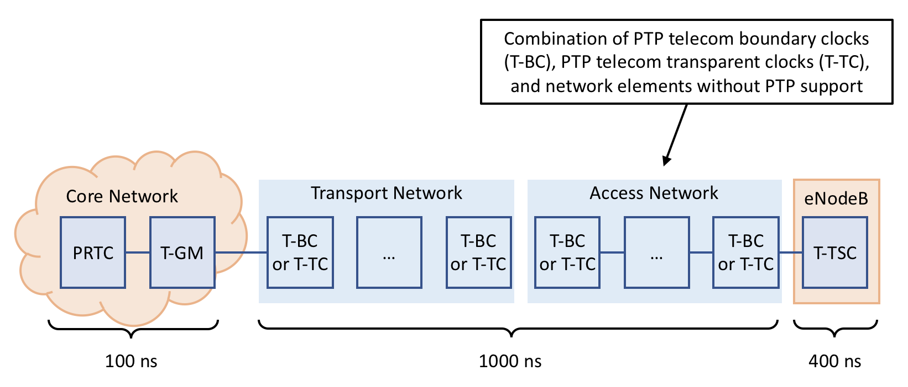
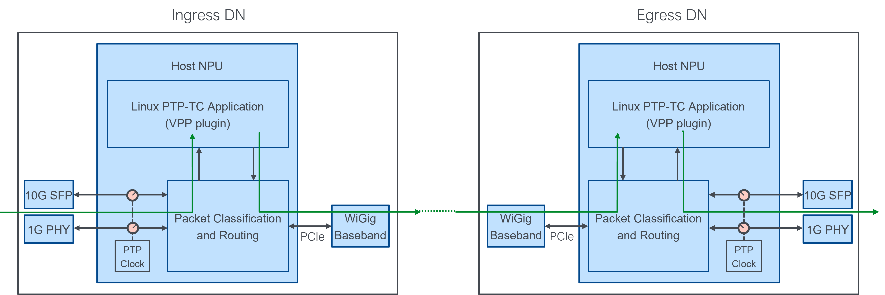
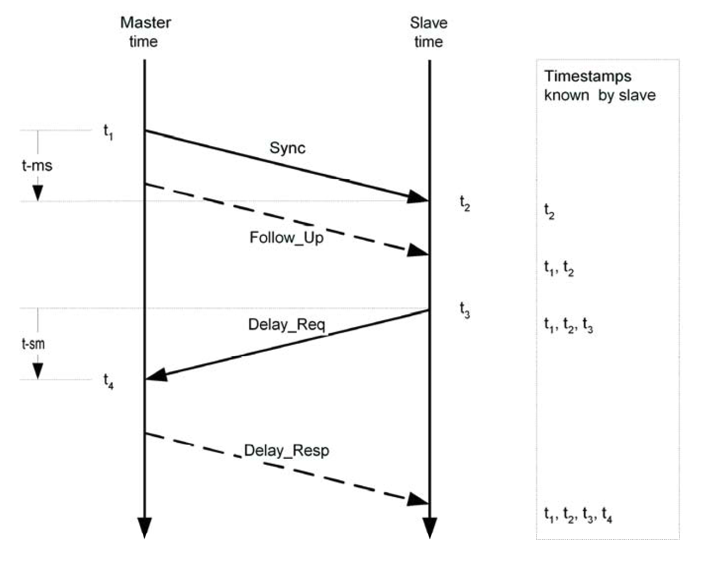
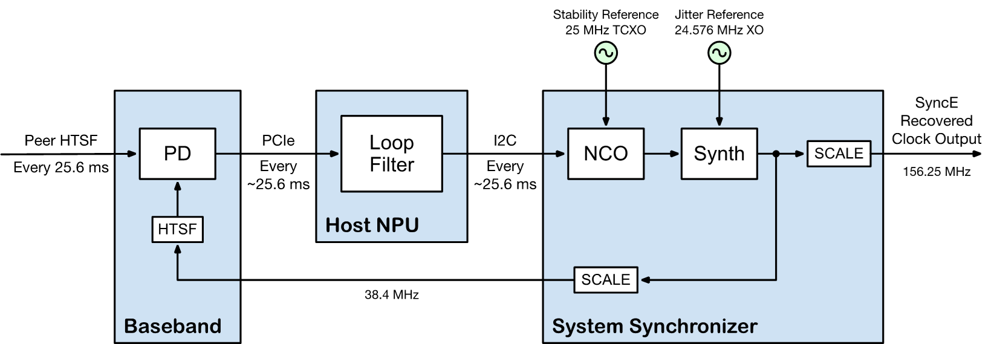

# PTP & SyncE
This document describes Terragraph's software implementations for the IEEE
1588v2 (Precision Time Protocol, or PTP) and Synchronous Ethernet (SyncE)
protocols, which are used to meet the synchronization requirements of cellular
networks.

## Overview
A common requirement for cellular backhaul is to support IEEE 1588 (PTP) and
SyncE transport for time (phase) and frequency synchronization. Although PTP can
be used for both frequency and phase synchronization, in telecom networks it is
rarely used for both in the same network. Instead, in telecom networks PTP is
typically used only for phase synchronization in conjunction with SyncE for
frequency synchronization, or only used for frequency synchronization in systems
that do not require phase sync (e.g. FDD networks).

The ITU device characteristics (conformance tests) for telecom clocks in
G.8273.2 and G.8273.3 explicitly state that the PTP clock's frequency reference
is provided by the physical layer based on ITU G.8262 EEC-Option 1 (SyncE).
Performance requirements for telecom clocks without SyncE for frequency are for
further study.

The block diagram below shows Terragraph's reference implementation described in
this document.

<p align="center">
  
</p>

## IEEE 1588/PTP Distributed Transparent Clock

### Terminology
* PTP: IEEE 1588v2 Precision Time Protocol
* OC: 1588/PTP Ordinary Clock
* BC: 1588/PTP Boundary Clock
* TC: 1588/PTP Transparent Clock
* T-GM: Telecom Grand Master
* T-BC: Telecom Boundary Clock
* T-TC Telecom Transparent Clock
* T-TSC: Telecom Time Slave Clock

### Basics
This section describes the requirements and high level design of a *distributed
PTP end-to-end transparent clock running over Terragraph* that uses a common
clock available to all nodes (GPS) to measure and account for packet residence
time. Although the initial implementation makes use of GPS for the Terragraph
common clock, the architecture extends naturally to using any time reference
available to all Terragraph nodes. Specifically, 802.1AS can be used in
conjunction with standard 802.11 services to synchronize an entire Terragraph
mesh network to the order of 100s of ns *without requiring GPS at any node*.

IEEE 1588v2 (PTP) is the preferred method for frequency and timing distribution
in cellular networks. Supporting PTP transport across the Terragraph network
enables cellular base stations backhauled by Terragraph to also use Terragraph
for frequency and timing distribution rather than requiring a separate
mechanism. 3GPP TS 36.133 specifies timing (phase) synchronization at base
stations to within ±1.5 µs of a common time reference, which is typically
located in the operator's core network. A typical breakdown of the overall
timing budget into different network components is shown in the figure below.

<p align="center">
  
</p>

To meet the end-to-end requirement, a loose upper bound on timing error
introduced by Terragraph is ±1 µs between the ingress node connected to the POP
and egress node connected to the base station. Since TG will be benchmarked
against wired backhaul networks, the synchronization accuracy achievable with TG
should be as good as possible, and with the approach outlined below Terragraph
can transport PTP flows while introducing less than 250 ns of timing
uncertainty. Achieving less than 250 ns accuracy leaves at least 750 ns for
other network components between the T-GM in the core network and the Terragraph
ingress node.

### System Architecture
Because Terragraph's TDD (time division duplex) MAC frame structure necessitates
a common time reference across TG nodes, the same common time reference can be
used to measure the time taken for PTP Sync messages to transit the Terragraph
network. PTP provides a mechanism for tracking residence time through a network
element and removing it from the packet delay calculation. By using this
mechanism PTP packet latency through the TG network can be decoupled from
directly impacting protocol performance for timing synchronization.

From a protocol point of view, using a common time-reference to measure transit
time through a multi-hop network and updating the correction field in the Sync
or Follow Up message can be viewed as a distributed 1588 transparent clock.

<p align="center">
  
</p>

Although residence time (transit time through TG) can be removed from the packet
delay calculation for timing synchronization as outlined in the section below,
G.8273.3 mentions a residence time limit of 10 ms as generally suitable, which
should be viewed as an upper bound on maximum latency allowed for PTP packets
through TG. For frequency synchronization the requirements in G.8261.1 impose
limits on Packet Delay Variation (PDV) for a certain percentage of packets to
within ~150 µs.

The ingress timestamp can be propagated from ingress to egress in-band using a
reserved field (see details
[below](#ptp-synce-propagating-ingress-timestamp-to-egress)).

#### Frequency Syntonization
A PTP transparent clock does not need to maintain a local PTP clock that is
synchronized to another PTP clock. Therefore for Terragraph there is no need to
explicitly syntonize (frequency sync) the common clock used to measure residence
time to a PTP grandmaster clock. In scenarios where tracking clock offset
between the TG common clock and the PTP grandmaster may improve accuracy of the
residence time calculation (e.g. PTP transport over a GPS-less Terragraph
network), the clock offset could be computed in software and used to adjust the
residence time calculation accordingly.

#### Encapsulation and Tunneling
PTP packets sent through the TG network may have various layers of encapsulation
or tunneling, and in all cases PTP hardware timestamping must be supported. The
timestamping is typically done based on the Start-of-Frame (SOF) delimiter.

According to the standard, PTP packets are encapsulated in any of:
* Ethernet, IPv4, and IPv6

The PTP packets can also be encapsulated in any of:
* L2TP or LT2P over GRE (no encryption enabled/needed)
* MPLS
* IPv6 (including segment routing)

The specific encapsulation used for each MNO should be identified and vetted to
ensure HW classification of PTP packets is supported.

#### DN vs. CN
The NPU used for CN hardware may not support PTP. In scenarios where a CN would
normally be deployed but PTP egress is required, DN hardware will be used
instead. This may require minor software changes to treat the PTP-enabled DN as
a CN (e.g. for scheduling purposes).

### Software Requirements
This section describes how PTP packets flow through the Terrragraph network and
what functionality is required to implement a distributed end-to-end transparent
clock over Terragraph. The goal of an end-to-end transparent clock is to measure
packet residence time for PTP event messages and update the correction field
accordingly. An E2E-TC can either be a *one-step clock* or a *two-step clock*:

* A *one-step E2E-TC* updates the correction field in event messages (`Sync` and
  `Delay_Req`) as it egresses on the wire using hardware to perform the update.
* A *two-step E2E-TC* updates the correction field in the corresponding general
  message using software to do the update:
    * Residence time measured by the E2E-TC for `Sync` messages is used to update
      the correction field in the corresponding `Follow_Up` message
    * Residence time measured by the E2E-TC for `Delay_Req` messages is used to
      update the correction field in the corresponding `Delay_Req` message

A PTP end-to-end transparent clock does not participate in the best master clock
algorithm (BMCA), does not need to maintain a Local PTP Clock synchronized to an
external PTP clock, and does not need to do any special handling for most of the
PTP general messages. The table below summarizes the action required by
Terragraph for each PTP message type.

| Message Name            | Message Type | Action Required  |
| ----------------------- | ------------ | ---------------- |
| `Sync`                  | Event        | Special handling |
| `Delay_Req`             | Event        | Special handling |
| `Follow_Up`             | General      | Special handling only for two-step PTP-TC implementation; otherwise pass through |
| `Delay_Resp`            | General      | Special handling only for two-step PTP-TC implementation; otherwise pass through |
| `Pdelay_Req`            | Event        | Peer-delay mechanism not supported |
| `Pdelay_Resp`           | Event        | Peer-delay mechanism not supported |
| `Pdelay_Resp_Follow_Up` | General      | Peer-delay mechanism not supported |
| `Announce`              | General      | Pass through     |
| `Management`            | General      | Pass through     |
| `Signaling`             | General      | Pass through     |

On NXP-based platforms PTP packet processing may be performed by a *Linux PTP-TC
application* running in user space, in *AIOP hardware*, using *DPDK*, or some
combination of the options. For the discussion below, "Linux PTP-TC application"
is used, but that equates to "whatever entity processes/manipulates PTP
packets".

For simplicity, the discussion below assumes the PTP clock used for hardware
timestamping is synchronized to the Terragraph common clock (e.g. GPS). If a
node's PTP clock is syntonized to the Terragraph common clock but has a known
non-zero offset, the Linux PTP-TC application needs to account for the offset
accordingly. For example, the PTP clock may count "ns since power on", in which
case Linux PTP-TC application needs to map "ns since power on" for PTP
timestamps to the Terragraph common clock and vice-versa. The same approach
could be extended to a node whose PTP clock is not syntonized to the Terragraph
common clock if the frequency offset is known and the Linux PTP-TC application
can adjust timestamps accordingly. Such adjustments are mentioned below as "if
necessary" or "for further study".

#### PTP Packet Identification
Software must be able to identify when a PTP message enters and leaves the
Terragraph network at an ingress/egress node. The most straightforward way is to
manually configure nodes as a PTP ingress/egress nodes and consider packets
arriving from or heading to the 1G/10G interface on a PTP ingress/egress node as
entering or leaving the Terragraph network. This approach allows PTP packets to
transit intermediate wired interfaces within the Terragraph network without
terminating the transparent clock, which would result in additional timing
uncertainty.

Packets must be identified by packet classification as PTP if:
* The 2-byte EtherType matches the value reserved for PTP (0x88F7), or
* UDP port matches PTP reserved port (319 or 320)

Packet classification must be performed after removal of any
encapsulation/headers.

#### Timestamp Insertion
PTP timestamps shall be sent from ingress node to egress node in-band using the
4 bytes at octet 16 of the common message header (Table 18, 1588-2008). This
field is renamed `messageTypeSpecific` in 1588v3 and using it for this purpose
is explicitly allowed by the latest draft 1588v3 standard (see details
[below](#ptp-synce-propagating-ingress-timestamp-to-egress)).

For ingress PTP packets the Linux PTP-TC application is responsible for
converting the hardware PTP timestamp (typically 8 bytes) to a 4-byte timestamp
with ns resolution and placing it in the `messageTypeSpecific` field.

For egress PTP packets the Linux PTP-TC application is responsible for
converting the 4-byte timestamp contained in the `messageTypeSpecific` field to
the format expected by the hardware PTP clock for one-step correction field
update (typically 8 bytes) in addition to setting all 4 bytes of the
`messageTypeSpecific` field to 0.

#### Packet Flow
This section describes how PTP Event messages flow through the Terragraph
network and includes platform-specific details for NXP LS1048/1088 based
implementations where necessary. The diagram below shows a single PTP message
entering the Terragraph network at an ingress node, going across one or more
wireless hops (not shown), and leaving the Terragraph network at an egress node.
For PTP `Sync` messages the ingress node is the POP node and the egress node is
the CPE node. For PTP `Delay_Req` messages the ingress node is the CPE node and
the egress node is the POP node.

The discussion below assumes some PTP packets are processed by a Linux PTP
application. Although "fast-path" processing is not strictly required, the
functionality can be implemented on the NXP AIOP instead of as a Linux
application.

<p align="center">
  
</p>

### Software Implementation
Terragraph implements a *distributed end-to-end one-step transparent clock* in
two layers, depending on hardware availability:
* **NPU** (NXP LS1048A) with ~20ns accuracy, implemented on the host in the
  Linux PTP-TC application.
* **10G PHY** (Microsemi VSC8254) with ~1ns accuracy, with hardware timestamping
  statically configured through the `malibu_char` application.

The user must enable timestamping on both the network ingress Ethernet
interfaces and the network egress interfaces via the `timingParams` node
configuration structure. Note that ingress/egress in this case refers to the
Terragraph network as a whole; distribution nodes or network interfaces that are
internal to the network need only to pass frames along without any special
handling.

In order for delay to be accurately captured between ingress and egress nodes,
the clocks of the two systems must be synchronized. The Terragraph driver
interface application synchronizes clocks on the NPU and/or 10G PHY at each 1pps
strobe as follows:
* **NPU** via direct DPAA2 register reads/writes to synchronize the NXP PTP
  hardware clock.
* **10G PHY** via a custom datagram socket protocol in `malibu_char` to
  synchronize the VSC LTC (local time counter) clock.

#### NPU Timestamping
This section discusses the Linux PTP-TC application, a VPP plugin. Refer to
[VPP Implementation](VPP_Implementation.md) for additional context about VPP.

##### Configuration
VPP does not process PTP packets by default. The user must enable the *ptptc*
VPP node via the following node configuration fields:
* `timingParams.PTP_VPP_INTERFACE` - The timestamping interface name
* `timingParams.PTP_VPP_OFFSET_NS` - The factory calibration constant (in ns) to
  compensate for internal timestamping bias
* `timingParams.PTP_VPP_NXP_PORT` - The NXP NPU timestamping port number(s),
  i.e. DPMAC indexes, on which to enable the one-step correction field update in
  hardware (or 0 to use software timestamping)

##### Implementation notes
VPP packets are forwarded along a directed graph beginning at input nodes (e.g.
`dpdk-input`), traversing through one or more internal nodes (e.g.
`ip6-lookup`), and finally terminating at an output node (e.g.
`interface-output`). Internal nodes are generally attached to a *feature arc*: a
list of functions that are called sequentially when processing packets of a
certain type. The Linux PTP-TC application applies associated ingress and egress
packet manipulations based on the direction of the flow of traffic.

The *ptptc* node is attached to the `ip6-unicast` feature arc. Thus, it will
inspect any IPv6 unicast packets that arrive at the ingress node to determine
whether they are one of the PTP packet types that is modified. If the packet is
a UDP packet with destination port 319 and has PTP type `Sync` or `Delay_Req`,
then the lowest order 32 bits of the current 1588 clock timestamp are stored in
the packet's `message_type_specific` field.

The *ptptc* node is also attached to the `interface-output` feature arc. For PTP
packets arriving at this node, the current timestamp is read from the 1588 clock
and combined with the lower 32 bits from the `message_type_specific` field added
by the ingress node, thus recreating the original timestamp. The difference
between the current timestamp and the original timestamp goes into the PTP
`correctionField`, to be consumed by downstream clocks. If requested, the output
node will do the `correctionField` update using DPAA2 hardware facilities by
setting the original (recovered) timestamp and, in the DPDK driver, copying that
timestamp to the frame annotation area.

##### DPAA2 details
The Linux PTP-TC application makes use of a number of features in the DPAA2
Wire-Rate I/O Processor (WRIOP) to support low-latency timestamping, summarized
below:

* **RX timestamping.** This is implemented in DPAA2's DPDK driver for all
  packets, so nothing specific is required; the driver just needs to set the
  `PKT_RX_TIMESTAMP` offload flag and copy the timestamp from frame annotation
  word 2 into the `rx_timestamp` dynfield.
* **TX one-step update.** The WRIOP can directly insert the delta between the
  current (at time of transmit) 1588 timestamp and the timestamp stored in the
  frame annotation area (part of the frame description). To perform the update,
  the hardware needs the following settings:
    * The PTP bit needs to be set in the frame annotation status (frame
      annotation word1)
    * The original RX timestamp needs to be set in the frame annotation (frame
      annotation word 2)
    * The frame control (FRC) field needs to have the WRIOP and the FASV (frame
      annotation status valid) bit set
    * The DPMAC corresponding to the egress interface must have the
      `SINGLE_STEP` register configured with the offset of the `correctionField`
      and the enable and checksum bits set appropriately.
* **Timing offset and drift correction.**
    * There are several registers that determine the rate at which the 1588
      timer counter (`WRIOP_TMR_CNT_{L/H}`) increments:
        * `TMR_ADDEND` scales the input clock frequency to derive a nominal PTP
          clock frequency
        * `TMR_PERIOD`, part of the `TMR_CTRL` field, is the amount by which
          `TMR_CNT` increments
    * By default, the input clock is 700 MHz, `ADDEND` is (32-bit fixed-point)
      5/7, and `PERIOD` is 2, meaning the nominal clock runs at 500 MHz and the
      counter counts by two, giving an effective 1 ns period.
    * To correct the 1588 clock, `TMR_OFFSET_{L/H}` is programmed with the fixed
      difference between the two clocks.
    * To correct for drift, it is necessary to speed up or slow down the nominal
      PTP clock by adjusting `ADDEND` a small amount. The target value can be
      computed as `(1e9/(1e9 + drift_ppb)) * original_addend`.

#### 10G PHY Timestamping
This section discusses the `malibu_char` application used to configure the
Microsemi VSC8254 10G PHY for hardware timestamping. Refer to
[Puma MBH Hardware](Timing_Synchronization.md#timing-synchronization-puma-mbh-hardware)
for specific hardware details.

##### Configuration
The user must configure the `malibu_char` application via the following node
configuration fields:
* `timingParams.PTP_VSC_CTRL_SOCKET` - Enable PTP-TC timestamping and use a
  given control socket path for LTC clock synchronization
* `timingParams.PTP_VSC_PORT` - The port used for PTP-TC timestamping and ESMC
  input/output

##### Implementation notes
The `malibu_char` application is part of the user-space "MESA" library from
Microchip. It is patched to perform PTP-TC and SyncE initialization at boot
time, and also to run as a daemon with a custom datagram socket protocol for the
purpose of synchronizing the LTC (local time counter) clock. The Terragraph
driver interface application synchronizes the LTC clock (e.g. time-of-day and
frequency adjustments) using this interface.

The datagram socket protocol is documented in
`vtss_appl_10g_phy_malibu.c:handle_dgram_sock_msg()` from
`recipes-utils/vsc8254phy/files/0005-Add-datagram-socket-interface.patch`.

### Hardware Requirements
The distributed PTP-TC architecture described in this document imposes the
following *mandatory hardware requirements*:
* Hardware timestamping of PTP packets sent or received over any 1G or 10G
  interface with at least 40 ns accuracy
* PTP timestamping done for all packets with EtherType 0x88F7 or UDP destination
  port 319 or 320
* Checks for EtherType and UDP destination port are done respecting the
  structure of standard protocols when determining attributes of the frame (e.g.
  after removing any encapsulation)
* PTP clock used for timestamping is syntonized to a supported time reference
  (e.g. GPS, HTSF)

The following can *optionally be supported by hardware*:
* The NPU can support one-step correction field update to simplify the software
  requirements for the Linux PTP-TC application
* Timestamping can be done by the external 1G and/or 10G PHY for improved
  accuracy, but with additional complexity and cost

For NXP based-processors:
* LS1012 does NOT support PTP timestamping in hardware
* LS1023/1026/1041 supports PTP timestamping in hardware for 2-step operation
* LS1048/1088 supports PTP timestamping in hardware for 1-step operation
  (superset of 2-step hardware support)

### Additional Background

#### PTP delay request/response measurements

PTP uses an exchange of four timestamps between master and slave devices to
propagate frequency and phase/timing information from the master clock to the
slave clock. The master periodically sends `Sync` messages as unicast or
broadcast messages, depending on the PTP profile.

A single delay request-response procedure is shown in the figure below. The
master sends a `Sync` message at time *t1*, which is received at the slave
device at time *t2*. A 1-step master includes the timestamp *t1* in the `Sync`
message itself, whereas a 2-step master sends a `Follow_Up` message containing
the timestamp — the protocol accuracy is the same in either case. After
receiving a `Sync` message the slave sends a `Delay_Req` to the master at time
*t3*, which the slave records locally. The master receives the `Delay_Req` at
time *t4* and sends the timestamp to the slave in the `Delay_Resp` message.

<p align="center">
  
</p>

Using the four timestamps determined during the delay request-response
procedure, the slave computes the mean path delay and slave clock offset
relative to the master clock as:

```
meanPathDelay = [(t2 – t1) + (t4 – t3)]/2 = [(t2 – t3) + (t4 – t1)]/2
offsetFromMaster = (t2 – t1) – meanPathDelay
```

If any delay asymmetry in the network is known, PTP includes procedures to
correct for it, but unknown or uncompensated delay asymmetry will directly
introduce timing error at the slave.

#### PTP in cellular networks
Using PTP for frequency distribution vs. timing synchronization imposes very
different requirements on the network topology, with the latter being much more
difficult to achieve.

##### PTP for frequency distribution
Frequency distribution can be done over a generic network that does not contain
PTP-capable elements as long as the packet delay variation (PDV) requirements
are met. PTP architectures for frequency distribution and associated performance
requirements are given in ITU-T G.826x series specifications.

Packet delay variation (PDV) performance requirements are quantified using the
"floor packet percentage" (FPP) metric. FPP is defined as the percent of packets
that experience delay within delta µs of the minimum (or floor) packet delay in
every fixed interval.

* G.8260 defines the Floor Packet Percentage (FPP) metric
* G.8261.1 defines a network limit for PDV in terms of FPP
* G.8263 defines the input tolerance expected of a 1588v2 frequency slave

For reference, the FPP limits specified in G.8261.1 for a 10 node optical
network with a mix of 1 and 10 Gbps links requires that in every 200 second
window at least 1% of PTP Event Message packets experience delay within 150 µs
of the minimum delay through the network. Achieving this would impose strict QoS
requirements on Terragraph for delivering PTP packets across the network.

##### PTP for timing distribution
In addition to PDV, timing synchronization is impacted by asymmetric delays in
the network. Network architectures for PTP-based timing distribution typically
assume "full on-path support" (OPS), which means every network element between
master and slave clocks is either a PTP boundary clock or PTP transparent clock.
ITU-T G.827x specifications cover topologies and performance requirements for
PTP-based timing distribution.

* G.8271.1: Network limits
    * Allocates 1000 ns timing error to entire packet network
* G.8273: Framework for time and phase synchronization
* G.8273.2: Telecom boundary and slave clocks (T-BC/T-TSC)
* G.8273.3: Telecom transparent clocks (T-TC)
    * Control of residence time variation is important to limit the irregular
      inter-arrival period of the PTP messages received by a telecom boundary
      clock (T-BC) or by a telecom time slave clock (T-TSC) as this may impact
      their performance or lead to the generation of alarms
    * Considers T-TC syntonized by physical layer frequency synchronization
      (T-TC syntonized by PTP is for further study)
* G.8275.1: Topologies and PTP profile

An example packet network timing budget from G.8271.1 Table V.1 breaks down as
follows:

* 100 ns for PRTC + T-GM
* 1000 ns for packet network broken down as:
    * 550 ns cTE (10 class A T-BC/T-TC + 1 T-TSC all @ 50 ns cTE)
    * 250 ns uncompensated link asymmetries
    * 200 ns random
* 150 ns eNB noise
* 250 ns eNB rearrangement and short holdover

#### Distributed PTP-TC without GPS at ingress/egress
As mentioned earlier, timing information can be propagated from one TG node to
the next with adequate resolution to meet cellular backhaul requirements using
802.1AS and high-resolution time of departure/arrival measurements. 802.1AS
makes use of existing 802.11 services to compute round trip latency and time
offset:

* Timing Measurement (TM) 802.11v (2011)
* Fine Timing Measurement (FTM) 802.11-2016

For 802.11 links, timestamp accuracy determines the per-link and ultimately
end-to-end accuracy; for 802.11ad, in theory, timestamping using a clock
frequency of at least 1760 MHz (~0.5 ns) is possible. Current 802.11ad baseband
chips are expected to achieve at least ~5 ns accuracy without additional
enhancements.

To use the synchronization achieved with TM/FTM as a common time reference for
the distributed transparent clock architecture described in this document,
timing must be propagated from baseband to the PTP clock used for timestamping.
A common 1 PPS signal available to the baseband, NPU, and 1G/10G PHY can be used
for this purpose.

<a id="ptp-synce-propagating-ingress-timestamp-to-egress"></a>

#### Propagating ingress timestamp to egress
Calculating residence time at the egress node requires propagating the ingress
timestamp to the egress node. The way in which the ingress timestamp is
propagated to the egress node is outside the scope of the PTP standard, but
similar functionality is required in many PTP implementations. For example, when
timestamping is done by an external PHY it may be difficult to track sideband
information about corresponding PTP packets, and for conformance reasons
additional bytes cannot be appended to the payload prior to passing it to the
MAC. A common approach in such scenarios is to use reserved fields in the PTP
message for internal timestamps and to zero-out the field before the message is
sent on-the-wire to maintain PTP conformance.

The 1588v3 specification includes a change to explicitly allow the use of a
reserved field in the PTP common header for internal timestamping. The change
renames the 4 bytes at octet 16 of the common message header (Table 18,
1588-2008) to `messageTypeSpecific` and explicitly leaves its use for PTP Event
messages up to internal implementations (but must be sent as all 0 over the
wire). For Terragraph, the 4 bytes can be used to transfer a 32-bit nanosecond
timestamp derived from the common clock. Rollover must be handled at the egress
and the egress node must zero-out the `messageTypeSpecific` field before sending
the message on-the-wire.

## Synchronous Ethernet

### Terminology
* SyncE: Synchronous Ethernet
* ESMC: Ethernet Synchronization Messaging Channel
* PLL: Phase-Locked Loop
* DPLL: Digital Phase-Locked Loop
* NCO: Numerically-Controlled Oscillator
* TSF: Timing Synchronization Function
* HTSF: High Resolution Timing Synchronization Function

### Basics
Synchronous Ethernet (SyncE) is an ITU-T standard for transferring a clock
signal (frequency reference) over an Ethernet physical layer. SyncE is used
extensively in telecom networks for high-accuracy frequency synchronization of
cellular base stations to primary time reference clocks located elsewhere in the
network. The primary standards are:

* ITU G.8261: SyncE architecture and performance limits (network)
* ITU G.8262: SyncE clock requirements (equipment)
* ITU G.8264: Protocol aspects of Ethernet Synchronization Messaging Channel
  (ESMC)
* ITU-T G.781: Synchronization state machine

The main difference between a device that supports SyncE and one that does not
is that in a device that supports SyncE, the Ethernet PHY is clocked by a stable
PLL and is able to extract the frequency of its input signal and pass it to its
system clock. Across maximum time and temperature swings SyncE allows a slave
clock to maintain synchronization to a reference clock many hops away to less
than 100 parts per trillion frequency accuracy when in the locked state.

Although SyncE was designed with (wired) Ethernet interfaces in mind,
non-Ethernet based physical transport is also possible. If both ends of a
wireless link are viewed as part of a single node, it becomes equivalent to a
wired backhaul network element that supports SyncE in from the core and SyncE
out to the base station — cellular network operators may expect this capability
to be present in cellular backhaul products.

From a protocol perspective, SyncE uses a simple layer 2 messaging channel
called the Ethernet Synchronization Messaging Channel (ESMC) to communicate
information about synchronization status and accuracy to peer nodes. *ESMC
information PDU* are sent as heartbeat messages once per second as Ethernet slow
protocol frames to provide a continuous indication of the clock quality level
(QL), which is carried in the ESMC PDU as an SSM code (synchronization status
message from SDH). If a node doesn't receive an ESMC information PDU for five
seconds it triggers a synchronization state change, and anytime the
synchronization state changes a node immediately sends an *ESMC event PDU*
indicating the new QL to peer nodes.

### System Architecture

#### SyncE over Terragraph
The primary technical challenge for SyncE support in Terragraph is frequency
distribution over the wireless link. Unlike microwave backhaul products where
the hardware architecture looks similar to SyncE over Ethernet media:

* Terragraph air interface is TDD (time division duplex) instead of FDD
  (frequency division duplex), so continuous frequency transfer is not possible
* Frequency estimation and compensation is done in the digital domain, so even
  during transmissions there is no analog recovered clock output that could
  drive a PLL (this is an expected consequence of the packet-based PHY protocol
  used in Terragraph)

Despite these differences, a Terragraph node can still recover the clock
frequency used by its peer node via *TSF drift*, or using packet TX and RX
timestamps to measure, track, and compensate for frame timing drift between
nodes over time. The wireless card would periodically determine the phase or
frequency between its own clock and its peer clock and communicate the offset to
a numerically-controlled oscillator (NCO) on the SyncE PLL.

The Terragraph frame structure is based on TSF timestamps with 1 µs granularity,
and these timestamps are already used to synchronize multiple TG nodes over the
air. By driving the upstream node's baseband clock from the synchronized SyncE
PLL, TSF on the upstream node will stay synchronized with the SyncE reference
clock and any TSF drift measured by the downstream node can be attributed to a
frequency offset between the local clock and the reference clock. The SyncE PLL
can then use periodic measurements of TSF drift to correct the frequency of
clock outputs for the 1G/10G SyncE PHYs.

All 802.11ad/ay modems that support fine timing measurements have the hardware
capability to generate TX/RX packet timestamps with nanosecond-level accuracy —
several orders of magnitude better than 1 µs TSF. Throughout this document
support for higher resolution timestamps is referred to as "high resolution TSF"
or HTSF. With HTSF accuracy of 15 ns, a 100 ppt frequency offset results in a
measurable HTSF drift in only 15e-9/100e-12 = 150 seconds. Assuming the
downstream node local clock (TCXO/OCXO) and PLL meet stability requirements for
a SyncE reference clock during holdover (e.g. over time, temperature, voltage,
and load), HTSF (in conjunction with SyncE TCXO/OCXO and PLL) is sufficient to
meet ITU requirements for SyncE transport.

#### Network View
The block diagram below shows the relationship between the clock reference flow
through physical layer components and the corresponding ESMC channel.

<p align="center">
  
</p>

Here, a primary reference clock (PRC) in the packet core provides the SyncE
reference clock. On the ingress Terragraph DN ("DN1"), the hardware SyncE DPLL
recovers the clock from the 10G PHY and uses it as the WiGig baseband clock. The
egress Terragraph DN ("DN2") uses the
[OTA Sync](Timing_Synchronization.md#timing-synchronization-ota-sync) mechanism
with high-resolution timestamps and a software PLL to drive the NCO mode clock
used for egress to the 10G PHY.

### Software Requirements

#### Software PLL
One of the most complicated aspects of supporting SyncE in Terragraph is the
implementation of the slave PLL to lock to and track the reference clock using
HTSF phase error measurements. Every BWGD (25.6 ms) heartbeat/keepalive messages
between DN nodes will contain the full 64 bit HTSF timestamp with nanosecond
resolution. The difference between the slave node's HTSF and peer node's HTSF
provides the phase error signal used to drive the phase-locked loop and keep the
clocks synchronized. The diagram below shows overall PLL operation on the slave
node in the locked state.

<p align="center">
  
</p>

This requires the following:
* Message sent every 25.6 ms from baseband to host with latest phase error
  measurement (needs to be handled in quasi-real time and with high reliability)
* Host application to process phase error measurements at supplied rate
  according to G.8262 filtering requirements
* NCO word updates (output of loop filter) sent from host to system synchronizer
  once every 25.6 ms update cycle over I2C interface

#### ESMC
ESMC support in Terragraph requires software to perform the following actions:
* Handle ESMC heartbeat and event messages on SyncE input ports
* Update sync state according to ESMC messages received
* Generate ESMC messages on SyncE output ports according to current sync state
    * Event messages must be generated upon QL change
    * Heartbeat messages must be generated at 1-second intervals, only when the
      QL is not "DNU" (do-not-use)
    * The maximum ESMC PDUs transmitted per heartbeat interval shall not exceed
      10 (ITU-T G.8264 section 11.3.2.1)
    * The destination address shall be set to the Slow Protocol multicast
      address 0x0180c2000002 (IEEE 802.3 Annex 57B)

Packets must be identified by packet classification as ESMC if:
* The 2-byte EtherType matches the value reserved for Ethernet Slow Protocols
  (0x8809)
* The 1-byte Slow Protocol subtype matches the value 0x0a
* The 3-byte ITU-OUI matches the value 0x0019a7
* The 2-byte ITU subtype matches the value 0x0001

Note that the implementation supports only ESMC protocol version 1, as provided
in the first 3 bits of the "flag" field.

The "best" clock quality level (QL) is determined by the following hierarchy
(ITU-T G.781 section 5.4.2.1), from highest to lowest preference:
* PRC, PRTC, ePRTC
* SSU-A
* SSU-B
* EEC1, eEEC
* DNU

### Software Implementation
Terragraph implements SyncE using two components:
* `zl3079x` driver implementing the slave PLL on the Microsemi ZL30795 system
  synchronizer chip
* Linux ESMC application running inside VPP.

The components communicate over
`ioctl` commands to the `/dev/zl3079x` miscdevice.

#### Software PLL
The `zl3079x` driver is built as a kernel module and loaded during Terragraph
driver initialization. It processes the following messages:
* *Northbound:* HTSF messages from WiGig firmware (`TG_NB_HTSF_INFO`) via
  Terragraph driver hook `tgd_register_htsf_info_handler()`
* *Southbound:* PLL register reads/writes via I2C client

The SyncE PLL loop filter is implemented as a PI controller, and is driven by
phase error measurements contained in HTSF messages every BWGD (25.6ms). When no
messages are received for some timeout period (1 second), e.g. because a WiGig
link went down, then PLL state is reset. In the case of multiple basebands, the
driver locks to only the baseband instructed by the ESMC application and drops
other incoming messages.

The driver registers the miscdevice `/dev/zl3079x` to enable an `ioctl`
interface with the ESMC application. It exposes the following calls:
* `ZL_IOCTL_SET_MODE` - Set the DPLL mode, e.g. between `NCO` (0x4) and
  `REFLOCK_SYNCE` (0x62)
* `ZL_IOCTL_SET_DEVICE` - Switch the WiGig device and reset PLL state, e.g. if
  best received SSM changes
* `ZL_IOCTL_GET_LOCKED` - Return whether the the DPLL is in the "locked" output
  state (1) or not (0)
    * For `NCO` mode (i.e. lock to WiGig interface), lock is inferred after ~10
      seconds (390 received HTSF messages) without reaching the timeout period
    * For `REFLOCK_SYNCE` mode (i.e. lock to wired interface), lock is
      determined by querying the DPLL (i.e. locked to `REF3P` SyncE input,
      holdover-ready status)

#### ESMC
This section discusses the Linux ESMC application, a VPP plugin. Refer to
[VPP Implementation](VPP_Implementation.md) for additional context about VPP.

##### Configuration
VPP does not process ESMC packets by default. The user must enable the
*esmc-input* VPP node via the following node configuration fields:
* `timingParams.ESMC_ENABLED` - Enable the ESMC application
* `timingParams.PTP_VSC_PORT` - Generate and handle ESMC protocol frames on the
  corresponding interface (port 0 = `TenGigabitEthernet1`, port 1 =
  `TenGigabitEthernet0`)

##### Implementation Notes
When enabled, the *esmc-input* node is registered as the handler for Ethernet
Slow Protocols (`ETHERNET_TYPE_SLOW_PROTOCOLS`) via
`ethernet_register_input_type()`. VPP only accepts a single handler for each
EtherType, so *any other Slow Protocol handler is overridden* (e.g. LACP
protocol handler). Any actions that need to be taken in response to received
ESMC packets (e.g. SSM change) are passed to the *esmc-process* node, described
below.

The *esmc-process* node is a VPP "process" node which runs as a separate thread.
It waits for signals from the *esmc-input* node or otherwise runs every 1
second, which is the required ESMC heartbeat interval. ESMC state update logic
is largely contained within this node's `esmc_update()` function, which does the
following:
* Finds the current interface with the best SSM
* If necessary, issues PLL mode/device changes via `ioctl` commands
* Broadcasts an ESMC frame across all configured output interfaces

<p align="center">
  
</p>

### Hardware Requirements
In addition to the hardware requirements for PTP, the SyncE architecture
described in this document requires a system synchronizer clock chip (with SyncE
DPLL). The Terragraph node local clock (TCXO/OCXO) and PLL must meet stability
requirements for a SyncE reference clock during holdover (G.8262 Option 1 and
Option 2 compliance).
