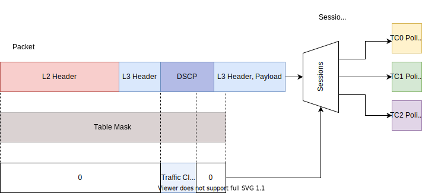

# Routing Layer
This document gives a high-level description of Terragraph's routing layer.

## Network Topology
Terragraph is a wireless mesh network comprised of "distribution nodes" (DN) and
"client nodes" (CN). One or more DNs must have fiber connectivity to the
Internet, and are designated as a "points of presence" (POP). The remaining DNs
are responsible for transferring traffic over multiple hops to and from the CNs.
Both DNs and CNs are connection points for wireless access points (APs) and
other customer premise equipment (CPE) to connect to the Internet.

<p align="center">
  
</p>

## Routing
### About Open/R
Terragraph uses [Open/R] as its routing platform. Open/R is comprised of several
distinct modules, and uses [fbthrift] for serialization and transit. The core
module in Open/R is the distributed, eventually-consistent key-value store,
named `KvStore`, which is used to disseminate information such as routing
adjacencies and network prefixes across the entire network; this is used to
implement a link-state routing protocol.

In short, Open/R computes routes by building a graph using the adjacency and
prefix information in the key-value store. It runs a weighted shortest-paths
algorithm to all other nodes, and uses equal-cost multi-path routing (ECMP) when
multiple "best paths" exist. The best next-hops are then programmed into
hardware.

Open/R's modules are listed below.

| Module          | Description                          |
| --------------- | ------------------------------------ |
| `KvStore`       | Distributed key-value store          |
| `LinkMonitor`   | Link discovery and monitoring module |
| `Spark`         | Neighbor discovery module            |
| `Decision`      | Route computation module             |
| `Fib`           | Route programming module             |
| `PrefixManager` | Prefix management module             |

### Open/R CLI
Open/R provides a Python command-line interface, `breeze`, to interact with each
of its modules over Thrift.

In Terragraph, `breeze` is replaced with a lightweight Lua version called
`puff`. Usage is largely the same, and `puff` implements most of the original
CLI's commands. `puff` source code resides in `src/terragraph-e2e/lua/puff.lua`,
and unit tests are located in `src/terragraph-e2e/lua/tests/puff_test.lua`.

### Terragraph Routing
Each Terragraph node runs an `openr` process. On Puma hardware, nodes run an
additional `fib_vpp` process to program routes into [VPP]'s FIB.

To route Internet traffic, all POP sectors advertise a default prefix `::/0`,
and other sectors forward default traffic to the nearest POP. At the POP sector,
egress traffic is handled by either adding *static routes* in Terragraph's *fib
implementation* or through *BGP peering*. These POP settings are configured in
the `popParams` structure in the node configuration.

Note that Open/R names nodes by their MAC addresses, but with a different
representation from E2E. For example, an E2E MAC address `00:00:00:10:0d:40` is
represented in Open/R as `node-00.00.00.10.0d.40`.

For CNs, Open/R supports running in "leaf" mode via the `set_leaf_node` flag.
Leaf nodes will only track a minimal set of keys in `KvStore`, reducing Open/R's
memory footprint. This mode of operation is not in use on Puma hardware.

### Open/R on WiGig and Wired interfaces
Open/R by default is enabled on the WiGig `terraX` interfaces in the node
configuration using `OPENR_IFACE_REGEX_INCLUDE`. Since Open/R can only listen
and discover peers on the Linux interfaces, Linux tap interfaces are set up on
behalf of its VPP counterparts to allow forwarding of local or "slowpath"
traffic (in Puma VPP/Linux split architecture). Open/R discovers WiGig peers
over `terraX` while the actual VPP routing and FIB route programming is through
the corresponding `vpp-terraX` interface.

For Open/R over wired POP interfaces, `tapX` Linux interface should be added to
the `OPENR_IFACE_REGEX_INCLUDE` regular expression and the routing would be
through the `loopX` L3 interface which functions as a Bridged VLAN interface.
This is enabled by default in Puma configuration.

## Open/R Usage In E2E
All communication with Open/R occurs through the local `openr` process on a
node; the controller never connects to any node's Open/R sockets directly, but
instead issues commands through a minion's `OpenrClientApp`.

### Node Configuration
E2E depends on `KvStore` to distribute important configuration values that are
needed before nodes can reach the controller, such as the controller URL
(`e2e-ctrl-url`) and network seed prefix (`e2e-network-prefix`). These key-value
pairs are located in the `kvstoreParams` map in the node configuration. Because
the key-value store is distributed, only one node needs to have this config set
(usually a POP node). These keys get injected during node startup in the
`pop_config` script, and `OpenrClientApp` periodically polls for them and
overwrites unexpected values.

To isolate access to Open/R, `OpenrClientApp` writes and periodically syncs keys
to a file `/tmp/mynetworkinfo`, which contains a JSON-serialized `NetworkInfo`
Thrift structure. Fields include the controller URL (primary and backup),
aggregator URL(s), network seed prefix, and DHCP/BGP configuration. This file is
read by the minion's `Broker`, as well as the stats modules and Terragraph's
`squire_linux` daemon.

The node configuration contains a number of settings for the Open/R program.
Before Open/R starts, a configuration template file
(`/etc/sysconfig/openr_config_template.txt`) is filled out using the node
configuration and written to `/var/run/openr_config.json`.

### Prefix Allocation
The controller can be set up to centrally allocate node prefixes, in place of
the default distributed allocation procedure. If enabled, the controller
constructs a `StaticAllocation` Thrift structure mapping each node name to its
prefix. This gets sent to `OpenrClientApp`, which then sets the `KvStore` key
`e2e-network-allocations` to this value. Open/R's `PrefixAllocator` will use
this static allocation instead of the network seed prefix
(`e2e-network-prefix`).

### MCS-Based Routing
E2E can be configured to automatically adjust Open/R link metrics (i.e. edge
weights in the shortest-paths routing graph) based on real-time statistics at
each node. Currently, the firmware reports the MCS (modulation and coding scheme
index) on each link to the minion's `StatusApp` approximately every 100ms. The
minion will then set the link metric via `LinkMonitor` so that lower-quality
links (i.e. with lower MCS) are used less frequently than better ones. Link
metric changes are rate-limited to avoid causing frequent shortest-paths
re-computations across the network, using a combination of two methods. First is
a dampening algorithm, which ignores reported MCS values until seeing *N*
consecutive values that would either all increase or all decrease the current
link metric. The second is a token bucket, which fills at a rate *r* with a
maximum burst size *b*. Link metric changes are only allowed when a token is
available. Relevant options are located in the `openrParams.linkMetricConfig`
structure in the node configuration. All link metrics are effectively 1 by
default. `OpenrClientApp` periodically polls link metric information from
`LinkMonitor` and overwrites any unexpected values.

### Soft Draining
Individual links can be "soft drained" via the per-link parameters in the node
configuration, located at
`linkParamsOverride.<macAddr>.openrLinkParams.softDisable`. A soft-drained link
simply has a very high link metric (100000), and will be avoided unless no other
paths are possible. This configuration is handled by `OpenrClientApp`, which
sets the link metric in `LinkMonitor` in the same procedure as described above.

### Fixed Link Metrics
Similar to soft draining, links can have fixed metrics assigned to them via the
same procedure. This setting is defined in the node configuration at
`linkParamsOverride.<macAddr>.openrLinkParams.fixedMetric`.

### Routing Queries
The controller exposes an API to fetch all shortest routes between a source and
destination node. `TopologyApp` periodically queries a node for a dump of
adjacencies (`AdjacencyDatabase`) and prefixes (`PrefixDatabase`) in `KvStore`
for the entire network. To answer route queries, `TopologyApp` then runs the
`Fib` shortest paths solver recursively from the source to destination node,
recording the best-hop at each step.

## BGP Implementation
Terragraph supports multiple [BGP] daemons. Logic for managing BGP applications
is captured in a BGP wrapper script (`/usr/sbin/bgp_wrapper.sh`). Currently,
Terragraph uses [ExaBGP] by default, but will fall back on [FRRouting] if ExaBGP
is not installed. E2E monitors BGP status on PoP nodes via calls to the
respective CLIs in the `BgpUtils` class.

A custom init.d script is installed to gracefully shut down BGP connections
before reboot (`/etc/init.d/bgp_softshut`). This will stop the BGP daemon and
send a BGP Cease Notification message to peers, withdraw the default route from
Open/R, and briefly wait while transit traffic drains from links.

This section will describe Terragraph's BGP implementations for VPP-based
platforms only.

### ExaBGP
[ExaBGP] is a Python-based BGP application offering easy programmatic control.
`exabgpcli` exists to check ExaBGP state, operating on named pipes
(`/run/exabgp/exabgp.in`, `/run/exabgp/exabgp.out`).

ExaBGP forks a plugin named `exabgp-to-openr` which parses BGP messages in JSON
format, redistributes learned prefixes, and produces JSON to advertise prefixes.
The plugin exports and health-checks routes via a [Thrift] API to `fib_vpp` and
Open/R. `fib_vpp` installs the best routes into VPP's [FIB]. `exabgp-to-openr`
also performs health checks before the PoP node will advertise a prefix to its
BGP peers via `OpenRChecker`, which ensures that the PoP node has an allocated
prefix (on Linux's `lo` interface) *or* the Open/R RIB has a subnet in the
desired prefix to advertise. Lastly, the plugin dynamically advertises/withdraws
CPE prefixes found in Open/R to BGP peers.

As ExaBGP starts up, a configuration generation process (`exaconf`) is run to
pull information from node configuration (`popParams` and `bgpParams`) and
generate the following files:
* `/data/etc/exabgp/aioexabgp.conf`: JSON configuration controlling what
  prefixes to advertise and learn
* `/data/etc/exabgp/exabgp.conf`: Standard ExaBGP configuration to control who
  to peer with

Useful log files are:
* `/var/log/exabgp/current`: ExaBGP configuration generation and operation logs
* `/var/log/pop_config/current`: Output from configuring the node to be a PoP

### FRRouting
[FRRouting] (or FRR) is a C-based suite of network routing protocols originally
forked from Quagga. It provides a long list of protocol daemons (such as `bgpd`)
which are centrally managed by a `zebra` process to handle communications with
the data plane. A unified shell, `vtysh`, exists to interface with all daemons.

The BGP wrapper script starts all services used by FRR:
* `bgpd` - The FRR BGP daemon. The startup script generates the initial
  configuration file, `/var/run/bgpd.conf`, from the node configuration via
  `src/terragraph-e2e/lua/update_bgpd_conf.lua`.
* `zebra` - The FRR Zebra daemon. Zebra exposes a "FIB push" interface via a
  Forwarding Plane Manager (FPM) module, which allows an external process to
  connect and receive a complete copy of the forwarding tables over Netlink
  messages.
* `frr_openr_sync` - A Lua service which connects to Zebra's FPM socket and
  syncs BGP routes with the [FIB] (add/delete via [Thrift] API to `Fib` agent)
  and Open/R (advertise/withdraw via `breeze` CLI).
* `frr_bgp_healthcheck` - A Lua service which health-checks and manages the
  announcement of routes to `bgpd`. The service monitors all Terragraph prefixes
  from the node configuration to ensure reachability before advertising them to
  BGP peers (i.e. PoP loopback prefix is within the desired prefix, *or* the
  Open/R RIB has a subnet in the desired prefix), and also monitors all CPE
  prefixes found in Open/R. Any changes to advertised BGP routes are dynamically
  applied to the FRR configuration via the `frr-reload` utility (see below).

#### frr-reload
The `frr-reload` utility (`src/terragraph-e2e/lua/frr_reload.lua`) is a Lua port
of the `frr-reload.py` Python script distributed with FRR. This utility compares
two FRR configurations (e.g. the running configuration against a desired
configuration file) and runs a sequence of `vtysh` commands to achieve the
target configuration without restarting any daemons. Only relevant portions of
the script, relating to BGP features discussed above, have been ported, and
other unused configuration sections are not implemented.

The script uses two internal classes to model FRR configuration:
1. `Context` - Represents a section of the configuration, where a *context* is
   loosely defined as a series of lines with a unique configuration meaning when
   grouped together. Some single-line contexts exist as well.
2. `Config` - Groups together all unique contexts of the configuration.

Contexts are parsed in `Config:loadContexts()` and compared in
`FrrReloadUtils.compareContextObjects()`. Applying the FRR configuration changes
requires two passes, where deletions of lines occurs only in the first pass.

## Routing for IPv4
Terragraph is a native IPv6 network. To enable IPv4-only Terragraph deployments,
where both access networks and/or ISP networks can be IPv4, a combination of L2
tunneling and NAT64 is recommended. L2 tunnels will be set up for all data-plane
traffic between POP nodes and CNs encapsulating IPv4 traffic with the
appropriate tunnel headers. NAT64 will handle IPv4 control-plane traffic to
Terragraph cloud services (e.g. E2E, NMS, Kafka, Fluentd).

### L2 Tunneling
Terragraph supports SRv6 and VXLAN tunneling options for data-plane traffic
between the POP nodes and CNs (currently only in VPP mode).

#### SRv6
SRv6 (Segment Routing) is the recommended solution for L2 tunneling, as it
provides a modular framework for L2 tunneling with SRv6 "segments" using the
native IPv6 header. An SRv6 L2 tunnel can be formed between a POP DN and a CN by
encapsulating an IPv6 header and SRv6 segment headers over an L2 frame carrying
IPv4 traffic.

To create an SRv6 L2 tunnel originating from a POP node and terminating at a CN,
an SRv6 encapsulation policy is defined on the POP interface
(`popParams.POP_IFACE`) or it's VLAN sub-interface, which adds IPv6 + SRv6
headers on all L2 frames received on that interface. The destination for the
encapsulated SRv6 packets is an SRv6 decapsulation policy on the CN's physical
CPE interfaces. The CN's decapsulation policy then removes the IPv6 + SRv6
headers and send the L2 frames out to the CPE interface. Thus an SRv6 L2 tunnel
in the Terragraph network is a single SRv6 segment from one node to another. The
reverse tunnel from CN to POP node will have to be set up with the appropriate
encapsulation and decapsulation SRv6 policies.

In VPP mode, Terragraph supports multiple SRv6 tunnels on a single physical
interface with the help of 802.1Q VLANs by creating corresponding sub-interfaces
and adding SRv6 policies on the individual sub-interfaces. This enables
Terragraph operators to deploy multiple SRv6 tunnels from a POP node to multiple
CNs (for a MDU deployment) with each L2 tunnel having a unique combination of
VLAN, source and destination IP addresses. Hence there is a requirement for all
upstream and downstream traffic to be tagged correctly with a unique C-VLAN tag.

The SRv6 tunnel source and destination IPv6 addresses are formed from the node's
own /64 address and the tunnel's VLAN ID (C-VLAN tag). An SRv6 source
(encapsulation) IPv6 address is derived by adding the C-VLAN tag to `:1001`
along with the node's /64 prefix. Similarly, the SRv6 destination
(decapsulation) address uses the C-VLAN tag added and a base `:2001` address.

Since SRv6 uses native IPv6 headers and the tunnel IP addresses are derived from
the node /64 prefixes, Open/R automatically handles the routing for the SRv6
packets without additional configuration.

#### VXLAN
VXLAN (Virtual Extensible LAN) is another tunnel option that is supported in VPP
mode. VXLAN is an L2 overlay network over existing L3 networks and is
well-supported in both VPP and the Linux kernel. A VXLAN tunnel is formed
between two endpoints (via source and destination IP addresses) and encapsulates
an additional IPv6 + UDP + VXLAN header (56 bytes) on top of the L2 frames
that POP nodes and CNs receive over the wired interfaces. On POP nodes, the
VXLAN tunnel interfaces are created in bridge mode and added to the existing POP
bridge containing the POP interface. For CNs, the VXLAN tunnel interface is
cross-connected to the physical interface. Currently, all VXLAN tunnels are
placed on the same POP bridge and VLANs will be supported in the future.

VXLAN tunnel redundancy is supported in VPP mode. A backup VXLAN tunnel can be
optionally configured on CNs. A tunnel will be considered a backup tunnel if
`tunnelParams.primaryTunnelName` is present, and the value should be the name of
its corresponding primary tunnel. The primary tunnel is always the first choice
for carrying traffic. A CN will only switch to the backup tunnel if it detects
that the primary tunnel's destination node is unreachable. Once the destination
node of the primary tunnel is back online, the CN will switch back to the
primary tunnel.

#### L2 Tunnel Configuration
L2 tunneling can be enabled via the `tunnelConfig` node configuration field, as
illustrated below:
```json
{
  "tunnelConfig": {
    "tunnel1": {
      "enabled": true,
      "localInterface": "TenGigabitEthernet0",
      "dstIp": "2001::1",
      "dstNodeName": "node-fe-19-50-01-00-8f",
      "tunnelType": "VXLAN",
      "tunnelParams": {
        "vlanId": 100
      }
    },
    "tunnel2": {
      "enabled": true,
      "localInterface": "TenGigabitEthernet0",
      "dstIp": "3001::1",
      "dstNodeName": "node-fe-19-22-90-10-ef",
      "tunnelType": "VXLAN",
      "tunnelParams": {
        "vlanId": 100,
        "primaryTunnelName": "tunnel1"
      }
    }
  }
}
```

A `tunnelConfig` in each direction (between a POP node and CN) is required for
bi-directional traffic. While only SRv6 and VXLAN are fully supported in VPP,
any of `SRV6`, `VXLAN`, or `L2GRE` can be configured. The `dstIp` field is
auto-populated by the E2E controller using the given `dstNodeName`.

The `vpp_chaperone` service uses these values to configure the L2 tunnels
appropriately based on node type and tunnel type. For POP nodes, the POP
interface (`popParams.POP_IFACE`) should be the tunnel's `localInterface` and is
the source interface for encapsulation. For CNs, `localInterface` should be the
CPE interface.

### NAT64
Terragraph networks require an IPv6 connection between the Terragraph cloud
services (e.g. E2E/NMS) and the nodes. To support IPv4 E2E/NMS, NAT64 (Network
Address Translation) on the POP 10G interface is the recommended solution to
convert control-place traffic between IPv4 and IPv6.

Stateful NAT64 is supported natively in VPP, and via the [Jool] modules in the
Linux kernel. With stateful NAT64, the POP node's NAT64 interface exposes only
one IPv4 address to an external IPv4 host (e.g. E2E/NMS). For each IPv4 address
seen, it creates a flow using a unique port and performs associated
translations.

NAT64 is intended to be deployed only for control-plane traffic, and thus will
only be enabled on the POP interface (`popParams.POP_IFACE`). Within the IPv4
network, the IPv4 cloud services will only see a single IPv4 address
(`envParams.NAT64_IPV4_ADDR`) and use that to communicate with the IPv6
Terragraph network.

Terragraph uses static routing to handle IPv4 egress traffic. If E2E/NMS and
POP node(s) are deployed on different subnets, each POP node must enable static
routing (`popParams.POP_STATIC_ROUTING`) and specify the IPv4 address of the
upstream router (`popParams.GW_ADDR`).

NAT64 can be enabled via the node configuration fields shown below:
```json
{
  "popParams": {
    "NAT64_POP_ENABLED": "1",
    "NAT64_IPV4_ADDR": "198.51.100.2/24",
    "NAT64_IPV6_PREFIX": "64:ff9b::/96",
    "GW_ADDR": "198.51.100.1",
    "POP_STATIC_ROUTING": "1"
  },
  "kvstoreParams": {
    "e2e-ctrl-url": "tcp://[64:ff9b::203.0.113.1]:7012"
  }
}
```

External IPv4 addresses will be embedded with an IPv6 NAT64 prefix configured
through `NAT64_IPV6_PREFIX` (e.g. the well-known NAT64 prefix `64:ff9b::/96`).
The resulting IPv6 prefix (e.g. `64:ff9b::203.0.113.1`) will be used by the
IPv6 Terragraph nodes to communicate with the IPv4 cloud services. These cloud
services (and any other external IPv4 endpoints) must be configured with the
IPv6 representations for each IPv4 address.

## Policing and Classification
Packets that arrive on CPE interfaces with policers enabled in VPP are first
classified according to the DSCP field in the packet's L3 header. Inbound
traffic is expected to be marked with DSCP corresponding to one of the assured
forwarding (AF) classes with low drop precedence (AFx1). Thus, the policer is
configured to recognize the DSCP values corresponding to each AFx1 class. All
other traffic will be treated by the policer as traffic class 3, green (AF11).
The policer will mark traffic using a two-rate/three-color policing function in
accordance with the assured forwarding per-hop-behavior (AF PHB) defined in RFC
2597. The standard defines 4 traffic classes and 3 colors per class. The AF DSCP
codes and names are as follows:

|             | Class 1     | Class 2     | Class 3     | Class 4     |
| ----------- | ----------- | ----------- | ----------- | ----------- |
| Green       | AF11 (10)   | AF21 (18)   | AF31 (26)   | AF41 (34)   |
| Yellow      | AF12 (12)   | AF22 (20)   | AF32 (28)   | AF42 (36)   |
| Red         | AF13 (14)   | AF23 (22)   | AF33 (30)   | AF43 (38)   |

VPP is configured to use a two-rate/three-color policing function following RFC
4115. A committed information rate (CIR) and excess information rate (EIR) are
defined for each traffic class. The peak information rate (PIR) is the sum of
the CIR and EIR. Committed burst size (CBS) and excess burst size (EBS) are
currently not manually configurable, and are set as the CIR and EIR values over
1 second, respectively. Traffic arriving under the CIR is marked green. Traffic
arriving over the CIR but under the PIR is marked yellow, and traffic over the
PIR is dropped (red). When the EIR is set as 0, a one-rate/two-color policer
will be created instead of a two-rate/three-color policer. Traffic under the CIR
will be marked green, and all other traffic will be dropped. The CIR and EIR are
set in node configuration like so:
```json
{
  "cpeConfig": {
    "TenGigabitEthernet0": {
      "policers": {
        "0": {"cir": 1000, "eir": 2000},
        "1": {"cir": 1000, "eir": 2000},
        "2": {"cir": 1000, "eir": 2000},
        "3": {"cir": 1000, "eir": 2000}
      }
    }
  }
}
```

`cir` and `eir` are both in units of kilobytes per second.

In VPP the policers are bound to network interfaces by first defining a
classification table for that interface, then creating policers that match bits
in the packet header, assigning policing sessions to the classification table,
and finally associating the classification table with a network interface.
`vpp_chaperone` performs these actions according to the node configuration
settings.

The packet classification process is illustrated below:

<p align="center">
  
</p>


## HQoS Configuration
Packets that reach the WiGig net interfaces are scheduled by the TG HQoS module
in [VPP]. Each DSCP value a packet may hold has a corresponding traffic class,
color, and queue.

HQoS configuration is only supported on platforms using the VPP DPDK plugin.

Terragraph's HQoS hierarchy uses 16 pipes per port (1 per WiGig peer), 4 traffic
classes per pipe, and 1 queue per traffic class. The number of traffic classes
and queues are determined by the constants
`TGHQOS_SCHED_TRAFFIC_CLASSES_PER_PIPE` and
`TGHQOS_SCHED_QUEUES_PER_TRAFFIC_CLASS`, and they can be modified to provide
more traffic classes or queues as necessary.

Compiled defaults for all configurations are found in
`vpp/src/plugins/dpdk/tghqos/tghqos.c`.

### vppctl
The DSCP to TC/color can be inspected by executing the following vppctl command:
```
vpp# tghqos show interface <WiGig netif name>
 Packet IPv6 DSCP field is used for tc, color, queue:
  IPv6 DSCP data position offset:    8
  IPv6 DSCP data bitmask: 0x0000000000000fc0
 Stats are being cleared on read: 1
 TC translation table: ([Mapped Value Range]: tc/queue/color tc/queue/color ...)
     [ 0 ..   7]: 3/0/Y 3/0/Y 3/0/Y 3/0/Y 3/0/Y 3/0/Y 3/0/Y 3/0/Y
     [ 8 ..  15]: 3/0/Y 3/0/Y 3/0/G 3/0/Y 3/0/Y 3/0/Y 3/0/R 3/0/Y
     [16 ..  23]: 3/0/Y 3/0/Y 2/0/G 3/0/Y 2/0/Y 3/0/Y 2/0/R 3/0/Y
     [24 ..  31]: 3/0/Y 3/0/Y 1/0/G 3/0/Y 1/0/Y 3/0/Y 1/0/R 3/0/Y
     [32 ..  39]: 3/0/Y 3/0/Y 0/0/G 3/0/Y 0/0/Y 3/0/Y 0/0/R 3/0/Y
     [40 ..  47]: 3/0/Y 3/0/Y 3/0/Y 3/0/Y 3/0/Y 3/0/Y 3/0/Y 3/0/Y
     [48 ..  55]: 3/0/Y 3/0/Y 3/0/Y 3/0/Y 3/0/Y 3/0/Y 3/0/Y 3/0/Y
     [56 ..  63]: 3/0/Y 3/0/Y 3/0/Y 3/0/Y 3/0/Y 3/0/Y 3/0/Y 3/0/Y
 Rate = 275000000 bytes/second
```

The above TC translation table is the default table when VPP launches. The TC
table may be directly edited from vppctl with the following command:
```
tghqos set tctbl entry <dscp> tc <tc> queue <queue> color <color>
```

### vpp_chaperone
`vpp_chaperone` will edit the default TC translation table on boot according to
the node configuration. The TC translation table can be configured with the
following schema:
```json
{
  "qosConfig": {
    "dscpEntries": {
      "0": {"tc":3, "queue":0, "color":"Y"},
      "1": {"tc":2, "queue":0, "color":"Y"},
      "2": {"tc":2, "queue":0, "color":"Y"},
      "3": {"tc":1, "queue":0, "color":"G"}
    }
  }
}
```

Each entry in the TC table mapping is keyed on the DSCP value. Like the vppctl
command, the value of each entry has three attributes, `tc`, `queue`, and
`color`. `tc` may be valued [0, 3], `queue` may only have value 0, and `color`
may be `R`, `G`, or `Y`. Any number of DSCP entries can be specified under
`mapping`. Missing DSCP entries take the default value.

### Weighted Round Robin Scheduling
Weighted round robin scheduling can be enabled for all interfaces using the VPP
startup configuration option `tghqos scheduling <sched_alg>` in the VPP startup
configuration file (`/var/run/vpp/startup.conf`). Traffic classes are assigned
a priority and a weight which can be configured with the VPP startup
configuration option `tghqos tc <tc> priority <priority_level> weight <weight>`.
Example:
```
tghqos {
  scheduling wrr
  tc 0 priority 1 weight 16
}
```
These can also be configured for an interface with the vppctl commands,
`tghqos set interface scheduling <WiGig netif name> <sched_alg>` and
`tghqos set interface wrr <WiGig netif name> tc <tc> priority <priority> weight <weight>`.

Configurations for each interface can be read with the command
`tghqos show interface <WiGig netif name>`.

## CPE Configuration
This section briefly describes some implementation details around CPE
configuration for features which are not already covered above.

Terragraph nodes support one CPE interface in kernel mode and multiple CPE
interfaces in VPP mode. On Puma, a node can have up to 4 CPE interfaces.

CPE interface prefixes can be either manually assigned or automatically derived
based on node prefix. Stateless Address Autoconfiguration (SLAAC) and Router
Advertisement are configured on CPE interfaces automatically to enable prefix
assignment for CPE devices.
* In VPP mode, `vpp_chaperone` performs all CPE interface configuration. DHCPv6
  prefix allocation for CPE devices is also supported through a DHCP relay via
  the `cpeConfig.TenGigabitEthernetX.dhcpRelay` node configuration field.
* In kernel mode, the `squire_linux` service configures and launches the `radvd`
  and/or `dhcpd` daemons to program CPE prefixes and routes into Linux.

A separate `cpe_operations` program handles CPE interface events,
advertises/withdraws CPE prefixes from Open/R, and manages hostapd instances per
CPE interface to provide 802.1X (see
[Wired Security](Security.md#security-wired-security) for details). This program
is invoked periodically by the `coop` service.

## Resources
* [BGP] - Border Gateway Protocol
* [ExaBGP] - Python-based BGP implementation
* [FRRouting] - C-based routing protocol suite
* [FIB] - Forwarding Information Base
* [Open/R] - Meta's routing platform
* [Thrift] - Meta's interface definition language
* [fbthrift] - Meta's branch of Apache Thrift
* [VPP] - Vector Packet Processing
* [Jool] - SIIT and NAT64 for Linux

[BGP]: https://en.wikipedia.org/wiki/Border_Gateway_Protocol
[ExaBGP]: https://pypi.org/project/exabgp/
[FRRouting]: https://frrouting.org/
[FIB]: https://en.wikipedia.org/wiki/Forwarding_information_base
[Open/R]: https://github.com/facebook/openr
[Thrift]: https://thrift.apache.org/
[fbthrift]: https://github.com/facebook/fbthrift
[VPP]: https://wiki.fd.io/view/VPP
[Jool]: https://jool.mx/
