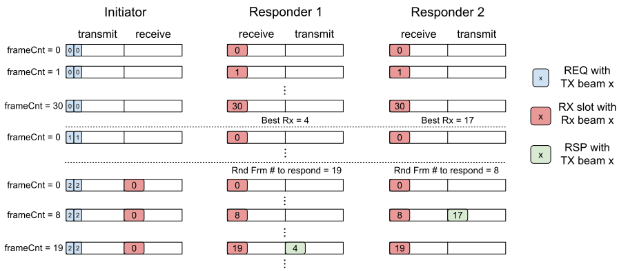

# Scans
This document describes the architecture for scans in Terragraph.

## Overview
`ScanApp` is responsible for initiating scans on nodes and collecting the
measurement results. Scans are scheduled by the controller to run periodically
and in parallel, using a graph coloring algorithm in `ScanScheduler` and a slot
scheduling mechanism in `SchedulerApp`. The minion simply passes controller
commands to the driver, and returns results from the driver to the controller.

There are several scan types, defined in the Thrift enum `thrift::ScanType`.
These are listed in the table below.

| Scan                     | Thrift Type        |
| ------------------------ | ------------------ |
| Initial Beamforming      | n/a                |
| Periodic Beamforming     | `PBF`              |
| Interference Measurement | `IM`               |
| Runtime Calibration      | `RTCAL`            |
| Coordinated Beamforming  | `CBF_TX`, `CBF_RX` |
| Topology Scan            | `TOPO`             |

Note that QTI firmware does **not** support RTCAL and CBF scans.

### Time Units
The time-related terminology used for scan scheduling are defined in the table
below.

| Term                            | Description                                                         |
| ------------------------------- | ------------------------------------------------------------------- |
| UNIX Epoch Time                 | Time that has elapsed since 1 January 1970, *minus* leap seconds    |
| GPS Epoch Time                  | Time that has elapsed since 6 January 1980, *ignoring* leap seconds |
| Superframe                      | 1.6ms (4 frames)                                                    |
| BWGD (Bandwidth Grant Duration) | 25.6ms (16 superframes)                                             |
| BWGD Index                      | Integer index of a BWGD interval since GPS epoch                    |

The controller must convert between its system time (based on UNIX epoch) and
firmware time (based on GPS epoch). There are some utility functions for time
conversions in `ScanScheduler`.

### Scheduling
Scans scheduled over the entire network are referred to as a *scan group*. For
periodic scans, a single scan group can contain scans of different types.

To prevent collisions and ensure proper ordering, a frame structure is defined
with 16 BWGDs in a slot and 128 slots (both configurable) in a period. Using
these default values, the period lasts about 52.4 seconds. The 128 slots are
allocated to scan types as shown in the table below:

| Scan Type                 | Start Slot #                    | Duration (slots) |
| ------------------------- | ------------------------------- | ---------------- |
| `PBF`                     | 13, 77                          | 5                |
| Hybrid `PBF`              | 13, 77                          | 10               |
| `IM`                      | 0, 64                           | 5                |
| `RTCAL`                   | 25, 28, 31, 34, 89, 92, 95, 98  | 2                |
| `CBF_TX`, `CBF_RX`        | 38, 102                         | 5                |
| `CBF_TX`, `CBF_RX` Apply  | 58, 122                         | 1                |
| `TOPO`                    | n/a                             | -                |

For example, 5 slots (about 2 seconds) are reserved for `IM` scans starting at
slots 0 and 64.

An algorithm determines which nodes go in which slots. The algorithm avoids
putting interfering nodes in the same start slot. Depending on the particular
topology of the network, a scan group can take minutes or hours to complete.

Ordering among scans are guaranteed by the controller. `PBF`, `RTCAL`, and `CBF`
scans will always be scheduled in that order. There is no ordering between `IM`
scans and other scan types. If a pair of nodes is scheduled for `PBF` and
`RTCAL` scans, for example, then the slot allocated for `PBF` will come before
the slots allocated for `RTCAL` (`RTCAL` requires two scans per link direction
whereas one `PBF` scan refines both the TX and RX beams in that link direction).

When `RTCAL` runs as part of periodic scans, RX VBS gets enabled by a series of
three consecutive `RTCAL` procedures indicated by the scan subtypes
`TOP_RX_CAL`, `BOT_RX_CAL`, and `VBS_RX_CAL`.

A scheduled scan uses relative PBF (3x3 grid) and fine IM scans (scans all
azimuth beams) by default. To run a `PBF` scan every 4 hours, for example, set
`ScanSchedule` as shown below. Note that the first scan in the schedule will
start `combinedScanTimeoutSec` seconds after issuing the command.

```json
{
  "combinedScanTimeoutSec": 240,
  "pbfEnable": true,
  "rtcalEnable": false,
  "cbfEnable": false,
  "imEnable": false
}
```

### Message Exchange
Scans are initiated by the controller when receiving a `StartScan` message from
any the following sources:
* Automatic scan scheduler within `ScanApp`
* Topology scan scheduler within `TopologyBuilderApp`
* Direct user command (e.g. via TG CLI)

The controller then sends a `ScanReq` message to each minion participating in
the scan; minions use the pass-through framework to forward these requests to
the firmware. When complete, each scan response is sent back to the controller
in a `ScanResp` message. The controller stores all scan results in a
`ScanStatus` structure, which maps scan IDs to `ScanData` structures.

For manual scans, nodes can be specified using a node-wide identifier (i.e. name
or node MAC address) or a radio MAC address. The former is accepted for
backward-compatibility reasons on single-radio nodes only (see
`ScanData::convertMacToName` and related code).

### Scan Results
When an individual scan is scheduled, it is assigned a "token" (`scanId`). Scan
responses are not guaranteed to come back from the nodes in order. When
responses are received from nodes, they are assigned a response ID (`respId`)
that will always be in the order the responses are received.

Scan results can be queried through a `GetScanStatus` request to the controller,
and are available once all nodes involved in a scan have sent a response. There
can be up to two measurements per frame (referring to the slotmap figure above).
Depending on the distance of the link and the geometry, beam combinations for
which the SNR is below the sensitivity (around -10dB) will not be reported.

```bash
$ tg scan status -f json  # (or 'raw' or 'table')
{
  "scans": {
    "1": {
      "responses": {
        "box1": {
          "token": 1,
          ...
        },
        "box2": {
          "token": 1,
          "routeInfoList": [
            {
              "route": {
                "tx": 0,
                "rx": 0
              },
              "rssi": -10.0,
              "snrEst": 27.5,
              "postSnr": 18.0,
              "rxStart": 4104,
              "packetIdx": 0,
              "sweepIdx": 0
            },
            ...
          ],
          ...
        }
      },
      ...
    }
  }
}
```

The `isConcise` flag suppresses the `routeInfoList` in the structure above,
which can be very large as it contains the SNR, RSSI, and other information for
every measurement taken in the scan.

```bash
$ tg scan status --concise
Scan Id 1, tx node box1, rx node box1, start bwgd 47044495072, response bwgd 47044495142, tx power 1
Scan Id 1, tx node box1, rx node box2, start bwgd 47044495072, response bwgd 47044495140
```

### RF State
`ScanApp` stores processed information from periodic scans in a local `rfState_`
variable. The purpose of `rfState_` is not to maintain historical scan results,
but to have an up-to-date snapshot of the network's state in terms of RF
coupling between each sector for all possible beam combinations. `rfState_`
stores averaged routes from fine and relative `IM` scan results and the latest
directional beam for each link as indicated in `PBF` scan results. `ScanApp`
uses `rfState_` to generate the CBF configuration and to adjust LA/TPC
parameters (currently `laMaxMcs`) based on cross-link coupling. It can also be
used for coloring algorithms that rely on RF connectivity between nodes (e.g.
assignment of polarity, Golay, ignition slots, etc.).

Because `rfState_` contains all information needed for various controller
algorithms and can be easily exported to or imported from a file, `rfState_` is
a useful way to unit-test controller algorithm changes, debug new issues, and
perform system studies.

## Topology Scan
The goal of running topology scans is to discover nodes in network without
knowing their MAC addresses or GPS positions in advance. Topology scans make
use of a broadcast beamforming (BF) protocol to collect information from nearby
nodes.

Topology scans are the main piece of the
[Topology Discovery](Topology_Discovery.md) algorithm.

### Broadcast Beamforming Procedure
The broadcast beamforming protocol closely resembles initial beamforming. Two
packet types are involved: a *training request (REQ)* and *training response
(RSP)*.

The initiator node begins the broadcast BF process by transmitting REQ packets
using the same slot allocation as initial BF. These packets are destined towards
the broadcast MAC address (`ff:ff:ff:ff:ff:ff`), but are otherwise identical to
the REQ packets used in initial BF. Two REQ packets are transmitted within each
frame. For each Tx beam, the initiator repeats the broadcast BF REQ packets for
one BF window, or 31 frames (`BEAM_NUM`). Since the channel at a responder may
not be configured, the initiator node performs 4 sweeps over all Tx beams to
ensure that each responder receives at least one entire set of Tx beams. The
duration of topology scan is 124 BF windows (4*`BEAM_NUM`).

For a receiving node to process a REQ packet, it must be in BF responder mode;
this is the initial state, wherein the node will sweep over the Rx beams during
each BF window. The responder collects all REQs in a BF window and picks at most
the best 4 Rx beams in that window. It then sends a RSP for window *i* during
window *i+2* to ensure that it has enough time to process the REQs. Since there
may be multiple responders in a topology scan, each responder randomly picks a
frame in the BF window to transmit the packet (instead of using a fixed frame,
like in initial BF). The RSP will be sent using the best Rx beam as the Tx beam.
Meanwhile, the initiator examines all frames for possible RSPs. A single scan
instance can process up to 15 responders (`MAX_NUM_TOPO_RESP`); any additional
responders are ignored.

An example run of the entire broadcast beamforming procedure is depicted in the
diagram below.

<p align="center">
  
</p>

### Training Packet Formats
The format of the REQ packet is identical to those used in initial beamforming,
as mentioned above.

The RSP packet contains additional fields carrying topology-related information:

```c
typedef struct {
    urTrnRes_t urTrnResp;
    usint8 frmNumInBfWin;
    tgfGpsPos pos;
    usint8 adjAddrs[ETH_ADDR_LEN * TGF_MAX_LOC_ADJ];
} __attribute__((__packed__)) urTopoTrnResp_t;
```

Descriptions of the fields are as follows:
* `urTrnResp` - The RSP from initial beamforming, which includes the `uRoute`
  information.
* `frmNumInBfWin` - The frame number of the response.
* `pos` - The GPS position of the responder. This is read from the stored value
  set by the `TG_SB_GPS_SET_SELF_POS` ioctl, which originates either from
  `driver-if` (on Puma) or `ublox-gps` (on Rev5).
* `adjAddrs` - The MAC addresses of wired neighbors and other local radios on
  the responder node. The firmware populates this by sending a
  `NB_OPENR_ADJ_REQ` request to user-space (handled by the E2E minion's
  `OpenrClientApp`).

### Usage
Topology scans can be managed using the standard scan methods on the E2E
controller.

```bash
# Start a topology scan
$ tg scan start -t topo --tx <tx_node> -d <delay>

# Retrieve the scan results ('topoResps' in ScanResp)
$ tg scan status
```

*It is recommended to wait at least 4 seconds after a topology scan before
performing subsequent beamforming operations.* This is because each responder
will record the initiator in its list of stations during a topology scan, and
will not process any other beamforming requests. The topology scan takes
approximately 1.5 seconds, and the responder may take at most 2.5 seconds to
remove the initiator from its station list.

Nodes can be configured to disallow initiating or responding to topology scans
via the firmware config field `radioParamsBase.fwParams.topoScanEnable`.
