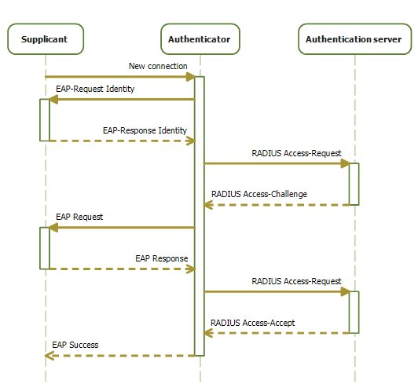

# Security

## Wireless Security
Terragraph links support WPA-PSK and IEEE 802.1X for security. Refer to
[Link-Layer Security](Network_Ignition.md#network-ignition-link-layer-security)
for more details.

<a id="security-wired-security"></a>

## Wired Security
Terragraph provides CPE interface security using the IEEE 802.1X standard.
Security can be enabled on each CPE interface independently by setting
`wiredSecurityEnable` in the node configuration, as well as `eapolParams`, for
example:

```json
{
  "cpeConfig": {
    "TenGigabitEthernet0": {
      "wiredSecurityEnable": true
    }
  },
  "eapolParams": {
    "ca_cert_path": "/data/secure/keys/ca.pem",
    "client_cert_path": "/data/secure/keys/client.pem",
    "private_key_path": "/data/secure/keys/client.key",
    "radius_server_ip": "1234:5678:9abc::def",
    "radius_server_port": 1812,
    "radius_user_identity": "some-user",
    "secrets": {
      "private_key_password": "some-passphrase",
      "radius_server_shared_secret": "some-secret",
      "radius_user_password": "some-password"
    }
  }
}
```

When enabled, the CPE interface will only allow EAPoL frames to pass, and will
drop all other packets until successful authentication. This EAPoL-only
forwarding is only supported in VPP mode, and is implemented in the `vpp-tgcfg`
plugin via the "wired security" interface configuration option.

802.1X authentication involves three parties: an authentication server, an
authenticator, and a supplicant.

<p align="center">
  
</p>

### Authentication Server
IEEE 802.1X requires an authentication server that can tell the authenticator
if a connection is to be allowed. Terragraph expects an authentication server
that supports the RADIUS and EAP protocols. The authentication server must be
reachable by the authenticator (CN or DN with CPE interface enabled).

### Authenticator
When wired security is enabled on a CPE interface, the CPE interface takes the
role of the authenticator. The Terragraph node is responsible for managing one
Linux authenticator process (`hostapd`) for each CPE interface with wired
security enabled, which is configured and launched by the
`start_cpe_security.sh` script. Logs for these processes are written to
`/tmp/hostapd_<iface>`. The authenticator will be restarted upon CPE interface
state changes. So, if a CPE device is removed or replaced, it is strongly
recommended to shut down CPE interface before adding the new device (currently,
Terragraph isn't able to automatically detect connection change and
re-authenticate the same CPE interface).

### Supplicant
The supplicant refers to the CPE device connecting over the Terragraph CPE
interface and sending traffic through the Terragraph network. It is expected
that each CPE device has pre-provisioned certificates and runs a Linux
supplicant process (`wpa_supplicant`) on the interface that connects to the
Terragraph node.

## Firewall Configuration
Terragraph nodes are able to apply `ip6tables` firewall rules via node
configuration and the `/usr/bin/update_firewall` script. This does not support
filtering of throughput traffic, but can protect traffic destined to Linux
itself. More specifically:
* The rules only modify the `INPUT` table.
* The `FORWARD` table is always left to `ACCEPT` all.
* The `OUTPUT` table is always left to `ACCEPT` all.

### Configuration Options
Terragraph's simple `ip6tables` implementation allows the following options
under the `firewallConfig` node configuration structure:
* `allowEstalished`: Allow already-established connections *(recommended)*.
* `allowICMPv6`: Allow all ICMPv6 traffic *(recommended)*.
* `allowLinkLocal`: Allow any packets from source prefix `fe80::/10` (important
  for Open/R's Spark module).
* `allowLoopback`: Allow anything destined to the `lo` interface. This is
  **NOT** recommended, as it effectively allows *anything* to the management
  address, but could be handy for debugging if firewall issues are suspected.
* `defaultPolicy`: Set the table to `ACCEPT` or `DROP` by default (default is
  `ACCEPT`).
* `tcpPorts`: TCP ports to open from any address. This is a comma-separated
  list, e.g. "22,179". It is *recommended* to always keep 22 (SSH) and 179 (BGP)
  open.
* `udpPorts`: UDP ports to open from any address. This is a comma-separated
  list. It is *recommended* to always keep 123 (NTP) open.
