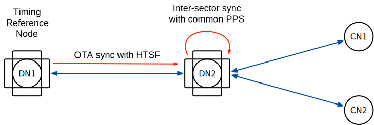
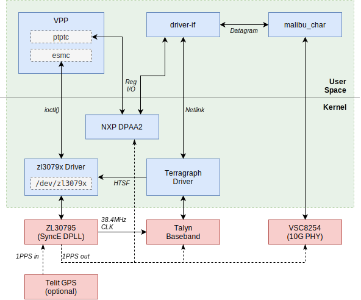
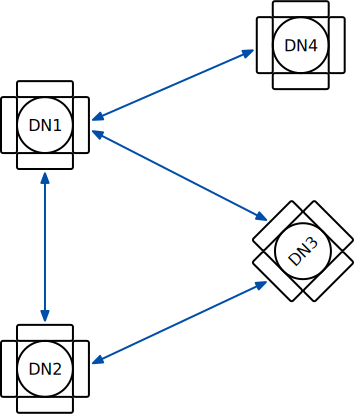
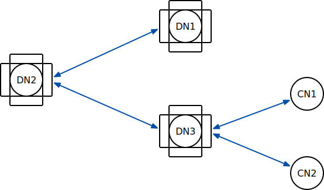
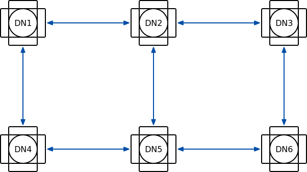

# Timing and Synchronization
This document describes Terragraph's architecture for time synchronization.

## Introduction
Absolute time and phase synchronization are essential for the correct operation
of a Terragraph network. The time division duplex (TDD) slot architecture of the
physical layer requires a timing precision less than the slot guard bands. In
addition, absolute time is required at each sector for the derivation of the
superframe number used for scheduling.

There are two possible approaches, explained further in the sections below:
1. **GPS:** GPS receivers co-located with each node can be used to synchronize
   networks of arbitrary size.
2. **Over-the-air sync (or "OTA sync"):** A single timing source can synchronize
   downstream nodes over a limited number of hops using high-resolution TSF (or
   "HTSF") messages provided by Talyn firmware.

### GPS
The use of precise timing derived from a co-located GPS receiver meets timing
requirements, but it does present trade-offs:
* A node may not have clear sky visibility to at least 5 GPS satellites at all
  times of the day, and thus may fail to provide a 3D fix with timing using GPS.
* The cost of a GPS receiver is high, which reduces the likelihood that client
  nodes (CNs) will have a GPS receiver.

This document will describe the means to meet the network timing requirements
through a design that minimizes the dependence on GPS visibility, while still
meeting the timing precision requirements. The design accomplishes this as
follows:
* **Single satellite mode:** By default, a GPS chip tries to estimate latitude,
  longitude, altitude, and time. To solve for these 4 unknowns, it needs good
  visibility of at least 4 satellites. Since Terragraph nodes are stationary
  (i.e. latitude, longitude, and altitude are already known), and time is the
  only unknown, a single satellite is enough to estimate time. This design uses
  a GPS chip which supports single satellite mode (a.k.a. time-only mode).
* **GPS survey-in mode:** Used to sanitize and refine the position assist, when
  available.
* **RF sync:** Fall back to air interface timestamps from a peer sector when GPS
  is unavailable. Terragraph supports time propagation over 1 hop for DNs, and
  over 2 hops for CNs. This means that a wireless link will stay up even if one
  of the peers has bad GPS signal reception.

<a id="timing-synchronization-ota-sync"></a>

### OTA Sync
OTA sync uses nanosecond Tx/Rx timestamps with roughly 6ns accuracy to
synchronize absolute time between Terragraph nodes. This mechanism involves a
two-way timestamp exchange and compensates for estimated OTA propagation delay,
making timing error independent of link distance.

<p align="center">
  
</p>

Sectors on downstream nodes are synchronized via a common 1pps signal going to
all sectors on the node. Each second a SW-HTSF 1pps message is sent from the
sector that is RF synced to all other sectors on the node. The common 1pps
signal does not need to be phase or frequency aligned to the timing reference;
all phase and frequency correction is done in software so only a fairly reliable
local clock is required.

Hardware requirements:
* Inter-sector sync requires a common 1pps signal to all basebands. The signal
  can be generated by a GPS module, a dedicated clock chip ("system
  synchronizer"), or a PPS output from the host processor if available (ex.
  PTP hardware clock).

Trade-offs and limitations:
* **Max hops:** The default Terragraph frame structure tolerates up to 1µs of
  timing error, which will limit the possible number of wireless hops from the
  timing source. Up to 5 hops of OTA sync has been verified on an OTA network,
  but a larger number of hops should be feasible.
* **Y-street:** The current implementation does not support all deployment
  scenarios with Y-street topologies. Specifically, there is no mechanism for a
  Y-street "root node" to decide which of two DN peers both in PPS sync should
  be used as the source of timing. Additionally, at the Y-street root node time
  cannot flow in one leg and out the other: there is no mechanism in wireless
  firmware to support this scenario, so the second leg will not ignite. There is
  no issue with time flowing from the root node to multiple DN peers.
* **Mesh support:** When a node is configured for SW-HTSF sync, the decision
  about which sector to use as the timing source is made locally by the E2E
  minion without knowledge about the path the timing signal took. In order to
  avoid timing loops in mesh networks (which would result in loss of
  synchronization) any change in the timing path (e.g. due to an upstream link
  going down) requires a full link re-ignition. The current software
  implementation accomplishes this through a configurable timer. This may limit
  the size and complexity of mesh networks where GPS-free operation is practical
  or desired.
* **Dynamic PPS timestamp source:** Current software does not support
  dynamically changing the PPS timestamp source. Therefore, a node cannot
  dynamically switch between using a local GPS as the timing reference and OTA
  sync (e.g. when GPS loses sync). Additional changes in the E2E minion would be
  required to support this scenario, but no wireless firmware changes are
  required.

<p align="center">
  
</p>

## Timing and Synchronization
A node receives timing information in one of two ways:
1. Directly through an input timing source (e.g. GPS, PTP hardware clock)
2. Indirectly through network messages

### Synchronization State Machine
The state machine for timing synchronization in firmware comprises three states,
which are as follows (in order of preference):
* **PPS sync (formerly "GPS sync"):**
    * *Entry condition:* Valid time samples have been received for a few
      consecutive seconds (typically 2 seconds).
    * *Exit condition:* Valid time samples have not been received for a few
      consecutive seconds (typically 10 seconds).
* **RF sync:** Not in "PPS sync", but is reachable to a DN with "PPS sync" over
  wireless links (1-2 hops away, as explained above).
    * *Entry condition:* Conditions for "PPS sync" have not been met, but a link
      exists to at least one other DN from which to derive timing.
    * *Exit condition:* Conditions for "PPS sync" have not been met and no links
      to other DNs exist from which to derive timing.
* **No sync:** Neither in PPS sync nor RF sync. This is the default state.
    * *Entry condition:* Conditions for "PPS sync" or "RF sync" are not met.
    * *Exit condition:* Condition for "PPS sync" or "RF sync" are met.

### Time Sample Validity
Time samples are collected each second. The components of the time sample and
its validity criteria and thresholds are defined as follows:
* The new time must be +1 when compared to the previous sample.
* The TSF value must be greater than the TSF value latched at the previous 1pps
  strobe by 1,000,000 ±20 µs.

Other software layers may contain additional validity checks. For example, the
u-blox driver used on Rev5 enforced the following conditions:
* The internal oscillator offset and uncertainty reported by GPS must be within
  ±500 ppb.
* The 1pps strobe time offset and uncertainty reported by GPS must be within
  ±500 ns.
* There must be no software errors reported pertaining to the GPS, communication
  with the GPS, or failure of the 1pps latch. Examples include I2C communication
  errors between the GPS and CPU, or a stuck microcode for the 1pps latch.

### Timing Constraints
In order to ensure the synchronization of time slots for all sectors, the time
to perform certain operations in a sector must be constrained. A guard time
between slots provides the protection necessary to provide sufficient
synchronization. Additionally, a delayed Tx slot start time is needed for
successful reception of the first packet in the Tx slot.

The following diagram shows a synchronization timing slot, including a guard
time (8µs) and delayed start time for Tx slot (2µs).

<p align="center">
  
</p>

Terragraph timing slots have the following timing error constraints:
* **T_pps:** Worst case is +/- 0.5µs for a 1µs error. For example, this may
  happen due to poor GPS signal reception. Typically, this is 0.1µs.
* **T_stamping, T_quantization:** Worst case is 1µs.
* **T_Propagation:** 1µs for a 300 meter link.
* **T_slot_switch:** Worst case is 5.1µs for **rx_slot** end to **rx_slot**
  start. This includes hardware processing time for the RF and PHY/MAC layers.

Terragraph timing slot subframes have the following timing values:
```
Guard time of 8µs = (T_pps or T_Propagation) + T_quantization + T_Propagation + T_slot_switch
Delayed Tx slot start time of 2µs = (T_pps or T_Propagation) + T_quantization
```

### Timing Correction
The Timing Synchronization Function (TSF) is a 64-bit microsecond counter that
is used as a measure of time for all MAC operations. The software allows and
corrects finite drifts in the frequency.

More specifically, there are two TSF values:
* *Hardware TSF ("HW TSF"):* The raw TSF values captured by the hardware
  free-running TSF counter when events occur (ex. PPS, Tx/Rx). The HW TSF timer
  gets updated only once during the initial setup of the MAC frame structure.
* *Software TSF ("SW TSF"):* The actual TSF time, i.e. HW TSF + TSF offset
  maintained by software. This is the common Terragraph clock time at any
  instant. Terragraph sectors achieve PPS/RF sync by tuning the TSF offset
  values maintained in software.

#### PPS Sync State
In the "PPS sync" state, the Terragraph clock is precisely disciplined by an
input timing source (e.g. GPS at typically 5ppb). Common sources of error
include PLL (phase-locked loop) least counts and GPS oscillator
offsets/uncertainties. The software uses a 1pps strobe to correct any drifts,
and applies the correction once per second at every 1pps strobe. The successive
1pps strobes should be 1 second apart. Any difference is applied as a timing
correction each second. The maximum correction applied is 20µs per second,
allowing correction of timing drifts within 20ppm.

#### RF Sync State
In the "RF sync" state, the software relies on a peer station's timing. Peer
stations exchange management messages over the wireless link every 25ms. These
messages contain a transmit timestamp from the peer station, which must match
the local receive timestamp. Any difference between the local timestamp and the
timestamp in the frame gets applied as a timing correction every 25ms. The
maximum correction applied is 1µs per 25ms. This allows correction of timing
drifts within 40ppm.

## Ignition and Link Management
When a node is in the "RF sync" state, timing is derived from a peer node.
However, timing errors can occur and accumulate at each hop, which degrades
timing. Terragraph places a limit on the number of hops allowed from a timing
source and controls the accumulation of timing errors by implementing the
following constraints:
* A DN may only ignite another DN if it is in the "PPS sync" state.
* A DN may only ignite a CN if it is in the "PPS sync" or "RF sync" state.
* A DN in the "RF sync" state will remove a link to a peer DN if the peer is not
  in the "PPS sync" state.

A *sync state indicator* (SSI) provides this information as follows:
* When a node gets its timing from network messages, the SSI will be the
  number of hops between the local node and the node serving as the timing
  source.
* When a node gets its timing directly from an input timing source, the SSI will
  be zero.
* When a node is in the "no sync" state, the SSI will be 255.

The table below shows the link management actions for each sync state. In the
current Terragraph implementation, X = 1.

| Sync State | Initiate Link to Peer DN | Initiate Link to Peer CN | Accept Link Initiation from Peer DN | Delete Peer DN Link | Delete Peer CN Link |
| ---------- | ------------------------ | ------------------------ | ----------------------------------- | ------------------- | ------------------- |
| PPS Sync | Yes | Yes | Yes | No | No |
| RF Sync [local SSI < X] | Yes | Yes | Yes | No | No |
| RF Sync [local SSI >= X] | No | Yes | Yes | Yes if peer SSI >= X | Yes |
| No Sync | No | No | Yes | n/a | Yes |

## E2E Controller and GPS Survey-In
Where applicable, the configuration of the GPS receiver on each DN is handled by
the E2E controller. The E2E controller enables position-assisted GPS and
minimizes the need for user input. Since the DN is immobile, it uses the
"survey-in" feature to determine its own position. When a node is in "survey-in"
mode, it surveys the sky for satellites from which to get its geographic
coordinates (longitude and latitude). The node will remain in "survey-in" mode
until:
* It gets its GPS coordinates from a satellite.
* "Survey-in" fails.
* A user manually inputs the GPS coordinates.

GPS coordinates are persisted by the E2E controller. When the E2E controller
does not have GPS coordinates recorded for any node, it gets them from
"survey-in" at the time of ignition. "Survey-in" fails only if a node never sees
more than 4 satellites. Such a node cannot be an initiator, but can still be
ignited as a responder. The user does not need to provide GPS coordinates except
in cases where "survey-in" fails, and any GPS coordinates entered manually must
have an accuracy of better than 50 meters.

For supported GPS modules, the E2E controller automatically configures single
satellite mode using its recorded GPS coordinates for each node.

Sectors must self-assert on GPS timing uncertainty greater than 0.5µs and revert
to the "RF sync" state.

## Architecture
This section describes the timing architecture on Terragraph reference
platforms, and how to support additional GPS modules.

### Terragraph Hardware
Details from different Terragraph hardware revisions are summarized below.

#### Rev5 Hardware
Rev5 hardware uses the u-blox LEA-M8F GPS module. The module is connected over
I2C, and NMEA message handling is done via an in-kernel driver (see
`recipes-radio/ublox-mod/kernel-module-ublox_0.1.bb`). Timestamp messages are
forwarded from the u-blox driver to the Terragraph driver, which sends them to
the wireless firmware. Single satellite mode is achieved using the u-blox
`UBX-CFG-TMODE2` ("Time Mode") command.

<p align="center">
  
</p>

Note that per u-blox specification, the GPS module is calibrated for a maximum
drift of 100ppb after 24 hours of holdover (a mode of operation where GPS timing
is temporarily maintained even after synchronization with GPS satellites is
lost). This implies that the GPS holdover state of u-blox in the first few
seconds after loss of GPS lock should be near precise.

#### Puma Hardware
Puma hardware uses the Telit SL869-T GPS module and TG2520SMN crystal. The
module is connected over UART, and NMEA message handling is done via [gpsd].
Terragraph's `driver-if` connects to gpsd to receive timestamps, then forwards
them over Netlink (as `TGD_NLSDN_CMD_SET_GPS_TIME`) to the Terragraph driver to
send to the wireless firmware. Single satellite mode is achieved using the Telit
`$PSTMENABLEPOSITIONHOLD` ("Position Hold") command.

Some functionality depends on a custom PPS source (default `/dev/pps1`) which
asserts on `ETS` interrupts from QorIQ's PTP clock driver:
* gpsd handles the asserts from the PPS source. When `driver-if` receives a
  corresponding PPS message from gpsd, it forwards the attached timestamp to
  the wireless firmware.
* System time is synchronized using a combination of PPS signals and GPS
  messages (default `/dev/ttyS1`). When enabled, `chronyd` is configured to
  sample GPS and PPS messages using the SHM and SOCK mechanisms via gpsd.

<p align="center">
  
</p>

<a id="timing-synchronization-puma-mbh-hardware"></a>

#### Puma MBH Hardware
Specialized "Puma MBH" (Mobile Backhaul) builds include additional hardware to
support 1588v2 (PTP) and SyncE transport for time (phase) and frequency
synchronization. Refer to [PTP & SyncE](PTP_SyncE.md) for more details about
these protocols and implementations.

The additional hardware includes:
* Microsemi ZL30795 system synchronizer (with SyncE DPLL), controlled by the
  `zl3079x` driver (see
  `recipes-radio/microsemi-dpll/kernel-module-zl3079x_0.1.bb`).
* Microsemi VSC8254 dual 10G SFP+ PHY, controlled by the `malibu_char`
  application (see `recipes-utils/vsc8254phy/vsc8254.bb`) built on the
  user-space [MESA] library.

Puma MBH offers PTP Transparent Clock (PTP-TC) Class A/B functionality with or
without GPS, and implements timestamping via one-step correction field update in
either of two layers:
* **NPU** (NXP LS1048A) with ~20ns accuracy, implemented on the host in the
  `ptptc` VPP plugin (see `recipes-facebook/vpp-ptptc/vpp-ptptc_0.1.bb`).
* **10G PHY** (Microsemi VSC8254) with ~1ns accuracy, statically configured
  through `malibu_char`.

The SyncE PLL loop filter is implemented in the `zl3079x` driver as a PI
controller, and is driven by phase error measurements contained in HTSF messages
from Talyn firmware every BWGD (25.6ms) via the Terragraph driver. Support for
the Ethernet Synchronization Messaging Channel (ESMC) protocol (ITU-T G.8264) is
handled by the `esmc` VPP plugin (see
`recipes-facebook/vpp-esmc/vpp-esmc_1.0.bb`).

The E2E minion (`PTPClockHelper` class) synchronizes clocks on the NPU and/or
10G PHY at each 1pps strobe as follows:
* **NPU** via direct DPAA2 register reads/writes to synchronize the NXP PTP
  hardware clock.
* **10G PHY** via a custom datagram socket protocol in `malibu_char` to
  synchronize the VSC LTC (local time counter) clock.

<p align="center">
  
</p>

### GPS Porting Guide
Requirements and instructions for supporting other GPS modules are described
below.

#### Constraints
Terragraph wireless firmware has the following hard requirements:
* The firmware must receive a periodic timestamp message (`TG_SB_GPS_TIME`
  ioctl) shortly after every 1pps strobe to remain in "GPS sync", with a maximum
  gap of roughly 200ms.
* The duty cycle for the PPS pulse should be less than 50%. More specifically, a
  pulse width of roughly 200ms works well, but a width of 500ms results in
  out-of-sync TSF values and subsequent ignition failures.

#### Code Changes
It is recommended to use the gpsd architecture when possible; any GPS module
that can output NMEA0183-compliant messages will work with gpsd. This requires
fairly limited changes in the following places:
* **Node configuration:** Add default hardware-specific node configuration
  values for all `envParams.GPSD_*` entries. This defines the NMEA/PPS serial
  ports, baud rate, NMEA time offset calibration factor, etc.
* **Initial GPS configuration:** Send any commands needed to configure the GPS
  module before gpsd starts (e.g. setting pulse width, configuring NMEA output
  messages). This is done as part of the gpsd SV script in
  `recipes-support/gpsd/files/sv/gpsd.run`.
* **Single satellite mode:** If the GPS module supports single satellite mode
  operation, send the command to configure it via `driver-if`:
  `BaseDriverIf::sendLocationToGpsBase()` in
  `src/terragraph-e2e/e2e/driver-if/BaseDriverIf.cpp`. For instance, this method
  is triggered when the E2E controller sends down the node's precise location.
* **Non-standard NMEA0183 data:** If the GPS module outputs non-standard data in
  any non-proprietary NMEA0183 sentence, corrections should be applied (if
  possible) in `driver-if` before any further processing takes place:
  `GpsdClient::preprocessData()` in
  `src/terragraph-e2e/e2e/driver-if/GpsdClient.cpp`. For example, a GPS module
  may report WGS84 altitude where MSL altitude is expected, which would
  invalidate some calculations within gpsd.

If the GPS module is not compatible with gpsd, an alternative is to write a
kernel module implementing the Terragraph driver's GPS interface, found in
`recipes-radio/wireless-mod/files/nl-driver-if-hdr/fb_tg_gps_driver_if.h`.

## GPS Stats
Stats about GPS state are exported from wireless firmware, the u-blox driver,
and `driver-if` (when connected to gpsd). These are published by `driver-if` on
a ZMQ port (see [Stats, Events, Logs](Stats_Events_Logs.md) for details).

### Firmware Stats
GPS stats from wireless firmware are shown in the table below.

| Key                          | Description |
| ---------------------------- | ----------- |
| `tgf.MAC.gps.driverDelay`    | Driver ioctl delay from PPS tsf boundary (in microseconds) |
| `tgf.MAC.gps.maxDriverDelay` | Max of "driverDelay" |
| `tgf.MAC.gps.numPpsErr`      | Number of PPS tsf read errors |
| `tgf.MAC.gps.numTimelineErr` | Number of errors due to firmware/driver taking more time |
| `tgf.MAC.gps.numMissedSec`   | Number of times driver did not send GPS time (derived from tsf, and can increase by many counts per second) |
| `tgf.MAC.gps.ppsJitter`      | Jitter for the last PPS tsf (in microseconds), only recording *valid* samples (i.e. PPS jitter <= 25us) used for GPS drift correction |
| `tgf.MAC.gps.maxPpsJitter`   | Max of "ppsJitter", but counting *all* received samples (including samples with high PPS jitter) |
| `tgf.MAC.gps.tsfDrift`       | Cumulative drift in tsf |
| `tgf.MAC.gps.ppsHwTsf`       | HW TSF at last PPS |
| `tgf.MAC.gps.ppsHwTsfNs`     | HW TSF at last PPS ns portion |
| `tgf.MAC.gps.ppsSwTsf`       | SW TSF at last PPS |
| `tgf.MAC.gps.ppsSwTsfNs`     | SW TSF at last PPS ns portion |
| `tgf.MAC.tsf.syncModeGps`    | 1 if tsf is in "GPS sync" state, otherwise 0 |
| `tgf.MAC.tsf.syncModeRf`     | 1 if tsf is in "RF sync" state, otherwise 0 |
| `tgf.MAC.tsf.numRfFix`       | Number of times tsf offset fixed on "RF sync" |
| `tgf.MAC.tsf.numGpsFix`      | Number of times tsf offset fixed on "GPS sync" |
| `tgf.MAC.tsf.rfDrift`        | Largest value of tsf drift over current stats interval with regard to the RF link |
| `tgf.MAC.tsf.sumRfFix`       | Sum of tsf fixes for "RF sync" |
| `tgf.MAC.tsf.sumGpsFix`      | Sum of tsf fixes for "GPS sync" |
| `tgf.MAC.tsf.offsetL`        | Low word of current offset (`sw_tsf - hw_tsf`) |
| `tgf.MAC.tsf.offsetH`        | High word of current offset (`sw_tsf - hw_tsf`) |
| `tgf.MAC.tsf.driftPerWin`    | Average drift per window (e.g. per 10s) |

### Driver Stats
A subset of GPS stats from the u-blox driver and/or `driver-if` are shown in the
table below. These sources export a similar, but not identical, set of keys.
u-blox driver keys are constructed in `DriverIfUtil::processGpsStatus()`, and
gpsd keys in `GpsdClient::getStats()`.

| Key                           | Description |
| ----------------------------- | ----------- |
| `tgd.gpsStat.latitude`        | Latitude (decimal) in 1e7 |
| `tgd.gpsStat.longitude`       | Longitude (decimal) in 1e7 |
| `tgd.gpsStat.heightMsl`       | Height above mean sea level in millimeters |
| `tgd.gpsStat.heightEllipsoid` | Height above ellipsoid in millimeters |
| `tgd.gpsStat.fixNumSat`       | Number of satellites used in Nav Solution (from NAV-PVT) |
| `tgd.gpsStat.fixType`         | GNSS fix type: 0=no fix, 3=3D fix, 5=time-only fix (from NAV-PVT) for u-blox driver; or 0=unknown, 1=none, 2=2D fix, 3=3D fix for gpsd |
| `tgd.gpsStat.gnssTmOfset`     | Time offset between the preceding pulse and GNSS top-of-second in nanoseconds (from TIM-TOS) |
| `tgd.gpsStat.gnssTmUncert`    | Uncertainty of GNSS offset in nanoseconds (from TIM-TOS) |
| `tgd.gpsStat.intOscOfset`     | Internal oscillator frequency offset in ppb (from TIM-TOS) |
| `tgd.gpsStat.intOscUncert`    | Internal oscillator frequency uncertainty in ppb (from TIM-TOS) |
| `tgd.gpsStat.discipSrc`       | Disciplining source identifier: 0=internal oscillator, 1=GNSS, 2..5=other (from TIM-TOS) |
| `tgd.gpsStat.timTosFlag`      | Bitmap with information about locked pulse, leap second, RAIM, etc. (from TIM-TOS) |
| `tgd.gpsStat.n.snr`           | Carrier-to-Noise Ratio (signal strength) in dBHz (from NAV-SVINFO) |
| `tgd.gpsStat.n.quality`       | Signal quality indicator: 0=no signal, 1=searching signal, 2=signal acquired, 3=signal detected but unusable, 4=code locked and time synchronized, 5..7=code and carrier locked and time synchronized (from NAV-SVINFO) |
| `tgd.gpsStat.n.flag`          | Bitmap for health, orbit info, etc. (from NAV-SVINFO) |
| `tgd.gpsStat.n.elevation`     | Elevation in integer degrees (from NAV-SVINFO) |
| `tgd.gpsStat.dataLenError`    | Length of invalid `t_gps_stat` buffer |
| `tgd.gpsStat.svDataLenError`  | Length of invalid `t_gps_space_veh_info` buffer |
| `tgd.gpsStat.unixTs`          | The UNIX timestamp associated with this GPS sample |
| `tgd.gpsStat.MAC.numTsSent`   | Number of timestamps sent to firmware from `driver-if` |

## Node Configuration
This section lists the node configuration fields related to the features
described above. For more detailed specifications, refer to the config metadata
file.

| Category | Field(s) | Description |
| -------- | -------- | ----------- |
| PPS Sync | | |
| | `timingParams.PPS_TIMESTAMP_SOURCE` | The time source for 1pps timestamps sent to wireless firmware (e.g. GPS, PTP, HTSF). |
| | `timingParams.HTSF_MAX_LOOP_SIZE`<br />`timingParams.HTSF_SRC_MAC` | Additional parameters for networks using OTA sync (i.e. HTSF sync). |
| | `radioParamsBase.fwParams.forceGpsDisable` | Disable synchronization checks in wireless firmware, and thus allow association in the "RF sync" state on both ends of the link. This will only work over 1 hop for DNs, and over 2 hops for CNs. This *cannot* be used for DN-to-DN links using OTA sync (i.e. HTSF sync). |
| | `radioParamsBase.fwParams.htsfSyncEnable` | Enable HTSF sync. |
| | | |
| GPS | | |
| | `envParams.GPSD_ENABLED` | Enable the gpsd daemon and timestamp forwarding via `driver-if`. |
| | `envParams.GPSD_GPS_MODULE` | The identifier (e.g. name/vendor) of the GPS module, which may enable module-specific functionality. |
| | `envParams.GPSD_DEVICE`<br />`envParams.GPSD_BAUD_RATE` | GPS system parameters. |
| | `envParams.GPSD_POSITION_HOLD_ENABLED` | Enable single-satellite mode opration on supported GPS modules. |
| | `envParams.GPSD_PPS_DEVICE`<br />`envParams.GPSD_NMEA_TIME_OFFSET` | Synchronize system time to GPS/PPS via gpsd and chronyd. |
| | | |
| PTP | | |
| | `timingParams.PTP_TIMER_SOURCE` | The 1pps timestamp source used to synchronize the NXP PTP hardware clock and/or VSC LTC clock. |
| | `timingParams.PTP_DEVICE` | Synchronize the NXP PTP hardware clock via the given device. |
| | `timingParams.PTP_VPP_INTERFACE`<br />`timingParams.PTP_VPP_OFFSET_NS`<br />`timingParams.PTP_VPP_NXP_PORT` | Enable PTP-TC timestamping via NXP NPU in the `ptptc` VPP plugin. |
| | `timingParams.PTP_VSC_CTRL_SOCKET`<br />`timingParams.PTP_VSC_PORT` | Enable PTP-TC timestamping via VSC 10G PHY, as well as LTC clock synchronization. |
| | | |
| SyncE | | |
| | `timingParams.ESMC_ENABLED`<br />`timingParams.PTP_VSC_PORT` | Configure the given VSC 10G PHY port for SyncE, and enable the `esmc` VPP plugin to generate and handle ESMC protocol frames on the corresponding interface (port 0 = `TenGigabitEthernet1`, port 1 = `TenGigabitEthernet0`). |
| | `radioParamsBase.fwParams.htsfMsgInterval` | Enable per-BWGD HTSF messages (`TG_NB_HTSF_INFO`) containing the timing error between nodes in nanoseconds, which is computed by wireless firmware every keepalive. For SyncE operation, set this to 1 in order to pass the timing error signal to the SyncE PLL every BWGD. Otherwise, set this to 0 (default) to disable the messages and avoid unnecessary overhead for systems that do not support SyncE. |

## OTA Sync Deployment Notes
Instructions and considerations for deploying GPS-free Terragraph networks are
given in the sections below.

### Configuration
A network using OTA sync should apply the following node configuration:

* **Timing source node(s):** Set `timingParams.PPS_TIMESTAMP_SOURCE` to `"GPS"`
  (co-located GPS receiver) or `"PTP"` (free-running PTP hardware clock), which
  determines the source of the 1pps timestamps sent to wireless firmware. For
  example, the timing source node can be a single POP node; when using multiple
  nodes, their clocks must be externally synchronized (e.g. via GPS or PTP).
* **Other nodes:** Set `timingParams.PPS_TIMESTAMP_SOURCE` to `"SW_HTSF"` so
  that they derive timing from upstream HTSF messages.
* **All nodes:**
    * Set `envParams.GPSD_ENABLED` to `"0"` to disable gpsd features (unless
      needed on a timing source node).
    * Set `timingParams.HTSF_MAX_LOOP_SIZE` to the largest possible timing loop
      size (mesh networks only).

### Example Scenarios
The following examples highlight several topologies where OTA sync is fully,
partially, or not supported.

*Topology 1:* This topology is not a mesh topology and does not contain
Y-streets, so any DN can be configured as the timing source node. Multiple nodes
could be configured as timing source nodes if each node uses the same external
reference, such as GPS. However, nodes configured as timing source nodes cannot
dynamically switch to OTA sync without a configuration change.

<p align="center">
  
  <br />
  <em>Topology 1</em>
</p>

*Topology 2:* This topology contains a Y-street, so not all scenarios are
supported.
* If DN1 is configured as the timing reference node then the topology is
  supported.
* However, DN4 cannot be the timing reference node because depending on the
  order in which links are ignited, DN1 could become a Y-street root node with
  multiple DN peers in PPS sync, which is not supported.

<p align="center">
  
  <br />
  <em>Topology 2</em>
</p>

*Topology 3:* This topology contains a Y-street, so not all scenarios are
supported.
* If DN2 is configured as the timing reference node then the topology is
  supported.
* If DN1 is configured as the timing reference the DN2-DN3 link will not ignite
  because time cannot flow in one leg of a Y-street root node and out the other
  leg, so this scenario is not supported.

<p align="center">
  
  <br />
  <em>Topology 3</em>
</p>

*Topology 4:* This figure-8 topology does not contain any Y-streets so in
general is supported with any node configured as the timing reference node.
However, there are many possible ways for timing to flow, so to avoid timing
loops any link going down may result in a complete re-ignition of other links in
order to re-arrange the timing path.

<p align="center">
  
  <br />
  <em>Topology 4</em>
</p>

## Resources
* [gpsd] - GPS service daemon
* [MESA] - Microchip Ethernet Switch API

[gpsd]: https://gpsd.gitlab.io/gpsd/index.html
[MESA]: https://github.com/microchip-ung/mesa
