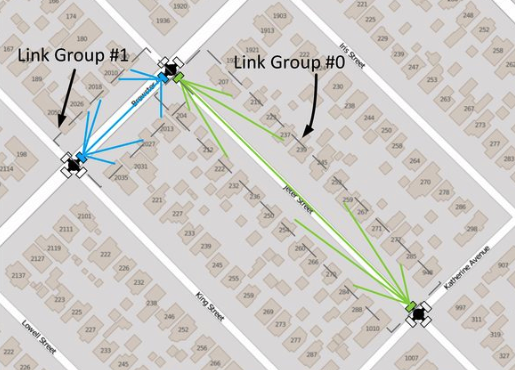

# Topology Management
This document describes the management of the network topology.

## Network Elements
This section briefly describes the elements of a Terragraph network topology in
the context of the E2E service.

The three basic topology elements are listed below:
* **Node** - A general purpose compute unit that controls one or more sectors
  (wireless baseband cards).
* **Site** - A collection of one or more nodes installed at the same physical
  location.
* **Link** - A connection between two sectors or nodes.

*Nodes* have several distinct properties:
* **DN/CN** - Each node is either a *Distribution Node (DN)* or *Client Node
  (CN)*. DNs form the backbone of the Terragraph mesh network, while CNs act as
  the termination point where service delivery takes place.
* **POP** - Any primary DN which is interconnected via fiber to a carrier's
  network is known as a *Fiber Point-of-Presence (POP)*. These POP nodes serve
  as the demarcation between the Terragraph network and the provider's backbone
  network.
* **Sectors** - Nodes control one or more sectors, which are identified by their
  MAC addresses (also referred to as "radio MACs" or "WLAN MACs"). Puma hardware
  supports up to 4 sectors.

*Links* have the following properties:
* **Wired/Wireless** - Each link is either *wired* (Ethernet) or *wireless*
  (RF). Wired links are used mainly between primary and secondary DNs.
* **Primary/Backup** *(DN-to-CN links only)* - CNs can only form one link, but
  additional *backup links* can be provided for use when the *primary link* is
  unavailable.

## Topology Structure
All topology structures are defined in `Topology.thrift`, and are contained
within the parent structure `thrift::Topology`.

```c
struct Topology {
  1: string name;
  2: list<Node> nodes;
  3: list<Link> links;
  4: list<Site> sites;
  5: Config config;
}
```

Currently, the properties captured by the `thrift::Topology` structure can be
categorized as follows:

| Category                      | Examples                                        |
| ----------------------------- | ----------------------------------------------- |
| Network Graph                 | Nodes, links, sites                             |
| Controller Configuration      | Deterministic Prefix Allocation config          |
| Network State                 | Node status, link liveness, link-up counters    |
| Installation/Inventory/Assets | Antenna azimuth, elevation                      |

Most of these properties are persistent. However, the network state properties
are non-persistent and get updated dynamically by the controller.

The full topology is stored only on the controller and is not propagated to
nodes, with the exception of node configuration. In particular, the controller
adds some topology information to the node's `topologyInfo` configuration
structure, which includes the node's "name" and neighboring nodes' properties,
among other details.

Lastly, a node's MAC address (or "node ID") is currently overloaded in several
ways:
* *ZMQ Identity* - Nodes use their MAC address as their ZMQ socket identity.
  Refer to [Communication Protocol](Communication_Protocol.md) for
  further details.
* *Routing* - The Open/R identity of each node is its MAC address. Refer to
  [Routing Layer](Routing_Layer.md) for further details.
* *Radio MAC* - The node MAC is usually not equivalent to the radio MAC(s),
  particularly on hardware providing multiple sectors.

## Topology Changes
The network topology is provided to the controller as a file during startup, and
can be modified during runtime through `TopologyApp`. All requested topology
changes are validated, and the controller will automatically assign any
additional parameters to a new node or link as necessary (discussed later). Most
of the logic for topology changes resides in `TopologyWrapper`.

`TopologyApp` accepts the following *user operations* on the topology:

| User Operation           | Commands                                                                                                                 |
| ------------------------ | ------------------------------------------------------------------------------------------------------------------------ |
| Modify Network Graph     | `ADD_NODE`, `DEL_NODE`, `EDIT_NODE` <br /> `ADD_LINK`, `DEL_LINK` <br /> `ADD_SITE`, `DEL_SITE`, `EDIT_SITE` <br /> `BULK_ADD` |
| Set MAC Address          | `SET_NODE_MAC`, `SET_NODE_MAC_LIST`, `ADD_NODE_WLAN_MACS`, `DEL_NODE_WLAN_MACS`, `CHANGE_NODE_WLAN_MAC`                  |
| Set Network Parameters   | `SET_NETWORK_PARAMS_REQ`                                                                                                 |
| Set Topology Name        | `SET_TOPOLOGY_NAME`                                                                                                      |
| Reset Link-Up Counters   | `RESET_TOPOLOGY_STATE`                                                                                                   |
| Reallocate Node Prefixes | `ALLOCATE_PREFIXES`                                                                                                      |

The topology is also modified upon receiving the following commands from other
apps:
* `SET_NODE_STATUS` - When a previously offline node sends a status report,
  `StatusApp` requests that `TopologyApp` mark the node as "online".
* `SET_NODE_PARAMS_REQ` - When a previously offline node sends a status report,
  `StatusApp` requests that `TopologyApp` send configuration to the node.
* `BUMP_LINKUP_ATTEMPTS` - When attempting to ignite a link, `IgnitionApp`
  requests that `TopologyApp` increment the corresponding link-up counter.
* `LINK_STATUS` - When a link's state changes, the *minion's* `IgnitionApp`
  requests that `TopologyApp` update the corresponding link's liveness state.

## Parameter Assignment and Validation
On startup and before any topology change, the controller performs thorough
validation of all relevant topology parameters. Additionally, when new elements
are added, the controller automatically assigns node and link parameters. These
processes are summarized in the following table, with additional details in the
sections below.

| Parameter          | Element | Dynamic Changes?   | Automatic? | Key(s) | Values |
| ------------------ | ------- | ------------------ | ---------- | ------ | ------ |
| Polarity           | radio   | yes (synchronized) | yes        | `radioParamsOverrides.[radioMac].fwParams.polarity` | 1 (odd), 2 (even), 3 (hybrid-odd), 4 (hybrid-even) |
| Channel            | radio   | no                 | yes        | `radioParamsOverrides.[radioMac].fwParams.channel` | 1-4 |
| Golay Index        | link    | yes (synchronized) | yes        | `linkParamsOverrides.[responderMac].fwParams.txGolayIdx`<br />`linkParamsOverrides.[responderMac].fwParams.rxGolayIdx` | 0-3, 4-7 (copies) |
| Control Superframe | link    | no                 | yes        | `linkParamsOverrides.[responderMac].fwParams.controlSuperframe` | 0, 1, 255 |
| Airtime            | link    | yes                | no         | `linkParamsOverrides.[responderMac].airtimeConfig.*` | - |

Controller-assigned parameters are stored in the automatic node overrides layer
of the node configuration (can be overridden by user configuration if required),
and are accessed and modified via `ConfigHelper` (refer to
[Configuration Management](Configuration_Management.md) for further details).

For firmware parameters which cannot be dynamically changed (i.e. post-config
action is `RELOAD_FIRMWARE`), any update to live radios or links will trigger a
firmware reload. If dynamic changes must be synchronized across affected links
(i.e. post-config action is `SET_FW_PARAMS_SYNC_OR_RELOAD_FIRMWARE`), then the
change will be scheduled at a specific BWGD index as determined by the
controller's `GpsClock` time plus a default delay of 5.12 seconds (controller
flag `--firmware_parameter_update_delay`), with an additional firmware
constraint that no more than 2 parameter updates can be scheduled simultaneously
(otherwise firmware will be reloaded to apply all changes).

### Polarity
Polarity validation and assignment is handled by `PolarityHelper`.

#### Background
Sectors on both ends of a wireless link alternate between transmitting and
receiving in complementary time slots. This dramatically reduces interference,
as nodes only receive very weak interfering signals from at least three hops
away. To achieve this, each sector is assigned a *polarity* of `ODD` or
`EVEN`.

<p align="center">
  
</p>

This simple assignment scheme requires neighbors in the network graph to have
opposite polarities, and only works if the graph can be bipartitioned. To
support topologies with odd cycles, *hybrid polarities* can be used in two
distinct ways:
* *Hardware hybrid* - A site can contain sectors with different polarities.
  These are "hardware" hybrids, which use hardware solutions to avoid inter-node
  transmit and receive interference. However, in a small fraction of cases (on
  the order of 1%), sectors in close proximity on the same site may still cause
  significant self-interference.
* *Software hybrid* - When hardware hybrid solutions are not possible, sectors
  can instead use time-division multiplexing to alternate between odd and even
  polarities. These "software" hybrids are tagged in E2E as `HYBRID_ODD` or
  `HYBRID_EVEN`, and require special handling by the controller (discussed
  below). Software hybrid sectors on a site will access the medium orthogonally,
  resulting in a 50% loss in bandwidth.

In the sections below, "hybrid" will refer to software hybrids unless otherwise
noted, since hardware hybrids are not treated differently from regular
polarities in E2E.

#### Validation
Constraints:
* Nodes on the same site must all be non-hybrid (`ODD`, `EVEN`) or hybrid
  (`HYBRID_ODD`, `HYBRID_EVEN`).
* Wireless links must have different polarity on both ends (`ODD`, `HYBRID_ODD`
  to `EVEN`, `HYBRID_EVEN`).
* A wireless link cannot have hybrid nodes on both ends.
* P2MP (point to multi-point) nodes, such as Y-street nodes, cannot be hybrid.
  In other words, hybrid-polarity DNs support only a single DN to DN link.

Polarity is only relevant when links are formed. Thus, unspecified polarities
are allowed on nodes until a link is added.

#### Assignment
When adding a link:
* If validation succeeds with the given values, do nothing.
* If both nodes had unspecified polarity, forcibly set one of them (to a site
  polarity if one exists, otherwise arbitrarily).
* If one node has no other links, set its polarity to the opposite of the other
  node.

Currently, the controller will not automatically assign a hybrid polarity.
Hybrid polarity must be explicitly set by the user.

#### Network-Wide Reassignment
The controller provides a mechanism to perform a network-wide polarity
optimization, using the *odd cycle cover (OCC)* algorithm in `OccSolver` to find
the minimum set of hardware hybrid sites required to achieve a bipartite graph.
This operation is triggered manually via the `TRIGGER_POLARITY_OPTIMIZATION`
command.

The polarity optimization process has the following features:
* It respects all user-configured polarities, and will fail if any changes to
  user overrides are required. This can be overridden by setting the
  `clearUserPolarityConfig` flag, informing the algorithm to reset all user
  overrides before attempting a polarity optimization.
* It tries to avoid allocating sites with P2MP radios as hybrids, reducing the
  chance of misconfiguration.
* It tries to honor existing polarity assignments as much as possible, reducing
  disruption to the network. Currently, changing polarity requires breaking
  links.
* It does not allocate any software hybrids unless configured by the user.

### Golay Index
Golay index validation and assignment is handled by `GolayHelper`. Note that the
controller will only assign Golay indexes 1 and 2 by default.

#### Background
Every packet transmitted over the air in a Terragraph network contains a PHY
layer preamble consisting of a *Short Training Field* (STF) and a *Channel
Estimation Field* (CEF), as defined in the [IEEE 802.11-2016] standard. The
receiver uses the STF to detect the presence of a packet in the air and thus
start the remainder of the packet acquisition process. Since the same preamble
is used, irrespective of the Modulation and Coding Set (MCS) used for the data
payload, the STF is designed to be detectable even at very low signal to noise
ratios (SNR). As a consequence, a weak interfering packet will trigger packet
acquisition, and any desired packet arriving while the receiver is busy
attempting to decode the interfering packet will be missed. This is known as
*early weak interference* and is especially apparent in Terragraph's current
TDMA network design.

Both the STF and CEF are derived from a 128-bit *Golay Code Sequence*. To
minimize the extent of early weak interference, different Golay Code Sequences
can be applied to interfering links so that the receiver will only begin the
packet acquisition process when it receives the expected preamble.

#### Validation
Constraints:
* Golay codes on both ends of a link must be identical.

#### Assignment
The procedure for assigning Golay codes to new links is detailed in
[Algorithms for Channel and Golay Assignment](#topology-management-channel-golay-assignment).

#### Network-Wide Reassignment
The controller provides a mechanism to perform a network-wide Golay reassignment
to resolve any misconfiguration. This operation is triggered manually via the
`TRIGGER_GOLAY_OPTIMIZATION` command.

The reassignment process implements the network-wide reassignment
procedure detailed in
[Algorithms for Channel and Golay Assignment](#topology-management-channel-golay-assignment).

### Channel
Channel allocation is handled by `ChannelHelper`. Note that the controller will
only use channel 2 unless otherwise configured by the user (via controller
configuration field `topologyParams.enabledChannels`).

#### Background
Terragraph networks utilize the 60GHz (V-Band) spectrum. In many countries,
V-Band is unlicensed and allows for multiple GHz of RF bandwidth. The amount of
available spectrum for use by Terragraph varies depending on local wireless
regulations. Terragraph supports channels 1, 2, 3, and 4 in the 60GHz band. Each
channel, as per the 802.11ad specification, is 2.16GHz wide as shown below.

<p align="center">
  
  <br />
  <em>60GHz band allocation</em>
</p>

#### Validation
Constraints:
* Channels on all links at a node in point-to-multipoint must be identical.
* Receiver and transmitter channels must be identical.

#### Assignment
The procedure for assigning channels to new links is detailed in
[Algorithms for Channel and Golay Assignment](#topology-management-channel-golay-assignment).

#### Network-Wide Reassignment
The controller provides a mechanism to perform a network-wide channel
reassignment to resolve any misconfiguration. This operation is triggered
manually via the `TRIGGER_CHANNEL_OPTIMIZATION` command.

The reassignment process implements the network-wide reassignment
procedure detailed in
[Algorithms for Channel and Golay Assignment](#topology-management-channel-golay-assignment).

### Control Superframe
Control superframe validation and assignment is handled by
`ControlSuperframeHelper`.

#### Background
The control superframe defines the time slot at which both ends of a link
exchange control information (i.e. keep-alive messages). For context, each
superframe is 1.6ms long and consists of 4 TDD frames. The control superframe is
an integer that can take values `0`, `1`, or `255` (equivalent to unspecified).
In order to transmit control information at non-conflicting time slots, a DN
sector must use a different control superframe on all of its wireless links to
other DN sectors. For DN to CN links, the control superframe should be left
unspecified.

Normally, in the P2P (point to point) scenario, the control superframe can be
left unspecified and will be handled automatically by the firmware; this is
equivalent to using the value `0`. However, with P2MP (point to multi-point),
the nodes at the opposite ends of the two links have no way to automatically
pick non-conflicting control superframes. The primary role of E2E is to assign
non-conflicting values (i.e. `0` and `1`) across these links.

#### Validation
Constraints:
* All DN to DN links from a sector must have different (i.e. non-conflicting)
  superframes. An unspecified value is considered a conflict if multiple DN to
  DN links exist.
* DN to CN links may all have unspecified control superframes (`255`).
* Hybrid polarity DNs have pre-defined control superframe values. Links with
  `HYBRID_EVEN` polarity must use `0` and links with `HYBRID_ODD` must use `1`.

#### Assignment
When adding a link:
* If control superframe is unspecified on a DN to DN link, set it to `0`.
* If validation succeeds with the given values, take no other actions (excluding
  the one above).
* Attempt reassignment to all acceptable values remaining (`0` and `1` for DN to
  DN links; `255` for DN to CN links).

#### Network-Wide Reassignment
The controller provides a mechanism to perform a network-wide control superframe
reassignment to resolve any misconfiguration. This operation is triggered
manually via the `TRIGGER_CONTROL_SUPERFRAME_OPTIMIZATION` command.

The reassignment process has the following features:
* It respects all user-configured values, and will fail if any changes to
  user overrides are required. This can be overridden by setting the
  `clearUserConfig` flag, informing the controller to reset all user
  overrides before attempting a reassignment.
* It tries to honor existing control superframe assignments as much as possible,
  reducing disruption to the network. Currently, changing control superframe
  requires breaking links.

### Airtime
Airtime allocation is handled by `BandwidthAllocationHelper`.

#### Background
The default airtime allocation on each node can be overridden through the
`thrift::NetworkAirtime` structure, which defines a per-link map of the minimum,
maximum, and ideal transmit/receive percentages. This can be used, for instance,
to enforce fair resource allocation across the network topology.

This feature is a work in progress and is not currently enabled.

#### Allocation
If automatic airtime allocation is enabled, `TopologyApp` will recompute the
fair airtime allocation map on startup and whenever the topology is modified.
The controller sends any airtime changes to nodes using the `SET_NODE_PARAMS`
(`NETWORK`) command.

The airtime computations currently consider only the network graph and perform
simple shortest-paths computations to POP nodes. The algorithm does not yet take
routing into account.

<a id="topology-management-channel-golay-assignment"></a>

### Algorithms for Channel and Golay Assignment
The algorithms for assigning channel and Golay codes
based on interference estimates are handled by `InterferenceHelper`.

#### Assignment for New Links
There are 4 observed heuristics that affect interference which the
new link assignment algorithm attempts to mitigate:
1. Adjacent links with < 20 degree angles may have interference, regardless of
   polarity.
2. Adjacent links with > 50 degree angles do not show much interference.
3. Links with > 2 links in between do not have interference.
4. Two links with one link in between will have interference (between the
   initial sector of the first link and last sector of the last link). Thus,
   there should not be three consecutive links with the same Golay code
   or channel. Additionally, the Golay/channels must not take the form `a-b-a`;
   their form should be either `a-a-b` or `a-b-b`.

When adding a link:
* Generate a directed graph of all wireless links in the topology and their
  angular differences. Each vertex represents a link in the original network
  graph, and an edge represents links connected to the same site. Edges also
  track the angular difference between a link and its adjacencies.
* Assign the link's Golay code or channel by applying the four heuristics above.
* If, after applying the heuristics, there are no valid options left, simply
  assign one at random.

Currently, only link adjacencies and angle differences are used to assign Golay
codes and channels for a new link.

#### Network-Wide Reassignment

##### Identify all link groups
A set of links belongs to the same *link group* if they must all share the same
Golay code/channel assignment. Links originating from or terminating at the same
radio are part of the same group. For example, all links forming a z-street
setup are part of the same group. The figure below illustrates this concept.

<p align="center">
  
</p>

##### Estimate group interference matrix
The *group-to-group interference estimate* is the sum of the estimated
interference between all links within each group. The controller uses a
topology-based approach to estimate the interference between any two nodes. In
this approach, distance between nodes, Angle-of-Departure (AoD), and
Angle-of-Arrival (AoA) are used to estimate the interference experienced by both
ends of a link caused by transmission on another link.

For this purpose, the controller assumes perfect alignment between the radio
and its corresponding link under consideration. Constant transmission power is
also assumed across all links. When assigning Golay codes, the controller
assumes zero interference between links on different channels.

##### Build the group interference graph
Next, the controller constructs a graph in which the vertices are the
previously-identified link groups. An edge is added between any two groups with
a non-zero interference estimate.

The resultant graph is the *group interference graph*. The task of assigning
Golay codes/channels to different groups is equivalent to solving the graph
coloring problem using a number of colors that is equal to the number of
available Golay codes or channels.

Since only two orthogonal Golay codes are available for allocation
the *odd cycle cover (OCC)* algorithm is used to convert the graph into a
bipartite graph by removing the least number of groups while minimizing the
overall network interference. This uses the same OCC algorithm as the one for
polarity optimization. Channel assignment also uses this algorithm to attempt
to minimize the number of channel allocations that add to the overall
network interference.

##### Allocate Golay codes or channels
Any predetermined Golay codes/channels within the node configuration overrides
are assigned first. These manual configurations can be ignored and overridden by
setting the `clearUserConfig` flag.

Next, Golay codes/channels are assigned for all groups not identified
for exclusion by the OCC algorithm. These groups will form a bipartite graph and
can be allocated Golay codes/channels that avoid all interference between them.

Finally, Golay codes/channels are assigned for the groups identified by the OCC
algorithm. In this case, the Golay code/channel that minimizes the overall
interference experienced by the link group is selected.

**Note**: The recommended order of optimizations is polarity, then channel,
then Golay. This is because the channel assignments depend on polarity, and the
Golay assignments depend on both polarity and channel.

## Network State
### Node Status
Node state is managed by `StatusApp` on the controller and minion. The minion
sends `STATUS_REPORT` heartbeats at regular intervals to the controller, and
includes details such as its ignition/configuration/upgrade state and
software/hardware versions in these heartbeats. The controller replies with
`STATUS_REPORT_ACK` acknowledgements. If the minion does not receive any
acknowledgements or other messages from the controller within a specified
timeout period, it will attempt to tear down the current network socket to the
controller and reconnect (refer to
[Communication Protocol](Communication_Protocol.md) for further details).
Meanwhile, `TopologyApp` periodically computes all node liveness states based on
the last time a heartbeat was received from each node.

A node's liveness is derived from its ignition state. The ignition state
lifecycle differs for DNs and CNs:
* **DN** - `OFFLINE` → `ONLINE` → `ONLINE_INITIATOR`
* **CN** - `OFFLINE` → `ONLINE`

All nodes initially boot into the `OFFLINE` status. For each radio, the minion's
`StatusApp` sends a `NODE_INIT` message to its `DriverApp` containing initial
firmware parameters, then starts sending heartbeats to the controller upon
receiving any `NODE_INIT_NOTIFY` success notification from `DriverApp`. The
minion then sends a `FW_SET_NODE_PARAMS` message to the driver with polarity,
channel, and airtime parameters from its node configuration (if present), and
also a `GPS_ENABLE_REQ` message to enable GPS (if applicable; read below).

When the controller's `StatusApp` receives a heartbeat from a node with an
`OFFLINE` status, it sends a `SET_NODE_PARAMS_REQ` request to `TopologyApp`,
which then sends `SET_NODE_PARAMS` (`INIT`) message(s) to the minion's
`StatusApp` (one message per WLAN MAC address). Upon receipt, the minion marks
itself as `ONLINE` (if GPS is disabled) or `ONLINE_INITIATOR` (if GPS was
already enabled). If the node had not already configured its polarity, channel,
etc. during initialization (i.e. the parameters are not in the node's local
configuration file), it does so now with the parameters sent from the
controller. The controller's `StatusApp` will also request the status of the
node's wireless links at this time.

For DNs, transitioning to `ONLINE_INITIATOR` requires enabling GPS to achieve
time synchronization. This requires knowledge of the node's physical site
location. Periodically, `TopologyApp` looks for DNs that are `ONLINE` and does
the following:
* If the node's site location accuracy is within 50 meters
  (`E2EConsts::kGpsAccuracyThresh`, required for GPS time estimation within
  500ns) *or* the `forceGpsDisable` firmware config flag is set, the controller
  sends a `SET_NODE_PARAMS` (`GPS`) message to the minion's `StatusApp`. Upon
  receipt, the minion sends a `GPS_ENABLE_REQ` to the driver, and marks itself
  as `ONLINE_INITIATOR` after receiving a `FW_ACK` (`GPS_ENABLE_REQ`)
  acknowledgement that the GPS was successfully enabled.
* If the node's location is too inaccurate, the controller sends a
  `GPS_GET_POS_REQ` message to the minion's `StatusApp`, which forwards it to
  the driver. The minion responds with its current GPS position
  (`GPS_GET_POS_RESP`), and the controller uses this to update its topology
  information only if the newly-reported location is more accurate than the
  existing one.

### Link Status
Wireless link state is managed by `IgnitionApp` on the controller and minion.
Every time the status of a wireless link changes, the minion sends a
`LINK_STATUS` message to `TopologyApp`. In some cases, the controller's
`TopologyApp`, `IgnitionApp`, or `StatusApp` will actively request a link status
by sending a `GET_LINK_STATUS` message. If the controller receives a `LINK_UP`
event for a link which does not exist in the current topology, it will
forcefully disassociate the link. When the controller receives a `LINK_DOWN`
event for a DN-to-DN link where either side is a P2MP DN with other active
links, it will disable BF responder mode to avoid throughput loss on these
links. Refer to [Network Ignition](Network_Ignition.md) for further details
about the link ignition process.

Wired intra-site link state is maintained by `StatusApp` on the controller and
minion. Each minion's status report contains status of its wired connections.
When this status changes, the controller's `StatusApp` sends a
`SET_WIRED_LINK_STATUS` message to `TopologyApp`. Wired inter-site link state is
not checked, and these links will always appear as alive.

### GPS Time Synchronization
The controller uses its local clock for scheduling (e.g. scan commands, firmware
configuration changes). To ensure its clock is synchronized with GPS-based node
clocks, the controller updates its clock based on GPS timestamps sent from each
node.

`GpsClock` is a custom clock used to hold GPS time. It is designed to receive
periodic updates from an accurate GPS source, and fill in the remaining
intervals using a `std::chrono::steady_clock` delta since the last GPS time was
received.

#### Minion Procedure
The node firmware attaches the current GPS timestamp to periodic `FW_HEALTHY`
messages sent to minion. The minion's `StatusApp` uses this timestamp to update
its `GpsClock` instance directly (assuming no significant latency on message
passing), and sends GPS time to the controller in periodic status reports
(`STATUS_REPORT` messages).

#### Controller Procedure
Upon receipt of a GPS timestamp, the controller's `StatusApp` uses
[Cristian's algorithm] to address network latency. Nodes are considered the time
servers, and the controller is considered the client. The latency in both
directions is assumed to be symmetric. The latency correction algorithm is
described below.

1. The controller records the GPS time of the last status report received from
   each node (as *t1*), then sends an acknowledgement to the minion.
2. The minion records the GPS timestamp of the latest status report
   acknowledgement it received from the controller (as *t2*).
3. When sending a status report to the controller, the minion includes its
   current GPS time (as *t3*) as well as the GPS timestamp of the latest status
   report acknowledgement it received (*t2*). The controller subtracts out the
   time delay between *t2* and *t3* when computing the round-trip time.
4. On receipt of a status report, the controller records its current GPS time
   (as *t4*). Then, it uses the recorded timestamp values to add a latency
   correction to the GPS timestamp reported by the node (*t3*) as follows:
```
Round-trip time = rtt = (t4 - t1) - (t3 - t2)
Latency of response = latency = rtt / 2
Latency-corrected GPS time = t3 + latency
```

As the controller collects a series of timestamps from nodes, it uses
[Chauvenet's criterion] to determine if incoming timestamps are outliers. The
algorithm used to determine if a timestamp is an outlier is described below.

1. On receipt of a GPS timestamp, calculate the delta between the timestamp
   (after applying Cristian's algorithm to correct for latency) and the
   controller's GPS clock.
2. Calculate the mean and standard deviation of the list of existing timestamps
   that the controller has stored.
3. Use a normal distribution to calculate the probability of seeing the
   timestamp that just arrived, based off of the mean and standard deviation
   calculated above.
4. Apply Chauvenet's criterion to determine if the timestamp is an outlier.
   Multiply the probability of seeing the timestamp by the number of past
   timestamps the controller is tracking. If this value is less than 0.5, the
   timestamp is considered an outlier.
5. Add the timestamp to the list of timestamps stored on the controller.
6. If the new timestamp is not an outlier, use it to set the controller's
   `GpsClock` epoch.

Chauvenet's criterion is not applied until at least 6 timestamps have arrived
(`FLAGS_min_gps_timestamp_queue_size`). The controller only tracks the last 20
timestamps (`FLAGS_max_gps_timestamp_queue_size`).

## References
* [IEEE 802.11-2016] - IEEE 802.11-2016 standard
* [CIDR] - Classless Inter-domain Routing (RFC 4632)
* [Cristian's algorithm] - Clock synchronization algorithm
* [Chauvenet's criterion] - Outlier detection criterion

[IEEE 802.11-2016]: https://standards.ieee.org/findstds/standard/802.11-2016.html
[CIDR]: https://tools.ietf.org/html/rfc4632
[Cristian's algorithm]: https://en.wikipedia.org/wiki/Cristian%27s_algorithm
[Chauvenet's criterion]: https://en.wikipedia.org/wiki/Chauvenet%27s_criterion
