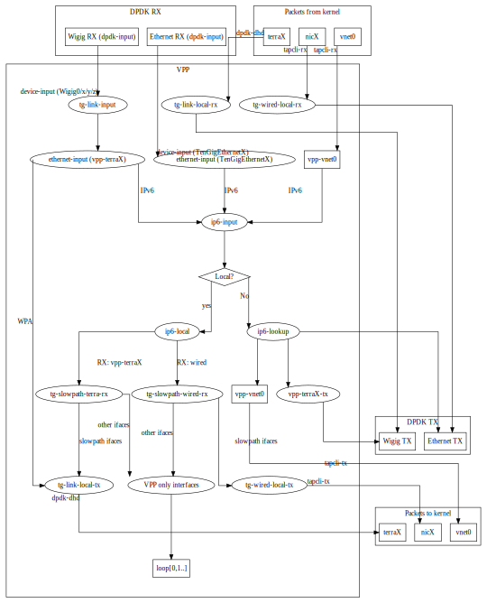
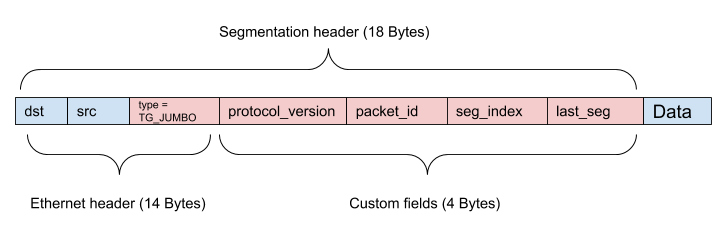

# VPP Implementation
This document describes Terragraph's datapath implementation using VPP.

## Overview
Terragraph uses [VPP] (Vector Packet Processing framework), along with [DPDK]
and a custom wil6210 PMD, to implement its datapath.

### Versioning
Terragraph uses the NXP fork of standard VPP, with a large number of
Terragraph-specific patches applied on top. The current version is NXP release
21.08-LSDK, corresponding to DPDK 20.11.2 and VPP 21.01.

### Code Structure
VPP is installed via `meta-qoriq/recipes-extended/vpp/vpp_21.08-lsdk.bb`. There
are also some scripts related to VPP service management and startup
configuration installed via `meta-qoriq/recipes-facebook/tg-vpp/tg-vpp_0.1.bb`.

Terragraph builds additional features on top of VPP, summarized below:

| Name            | Type        | Source Location                  | Description |
| --------------- | ----------- | -------------------------------- | ----------- |
| `vpp-tgcfg`     | plugin      | `src/vpp_plugins/tgcfg/`         | Configures the Terragraph-specific slow datapath. |
| `vpp-chaperone` | application | `src/vpp_plugins/vpp-chaperone/` | Applies user configs to VPP (e.g. POP, CPE, SR) over the shared memory API. |
| `openr-fib-vpp` | application | `src/vpp_plugins/openr-fib-vpp/` | The [Open/R] FIB (forwarding information base) implementation for VPP. |
| `vpp-ptptc`     | plugin      | `src/vpp_plugins/ptptc/`         | Configures PTP-TC (Precision Timing Protocol Transparent Clock) timestamping in VPP. |
| `vpp-esmc`      | plugin      | `src/vpp_plugins/esmc/`          | Configures SyncE (Synchronous Ethernet) ESMC (Ethernet Synchronization Messaging Channel) operation in VPP. |

### VPP Services
The following VPP services are managed by runit: `vpp`, `fib_vpp`, and
`vpp_chaperone`. Logs for each service are written to
`/var/log/<service>/current` by svlogd. Additionally, DPDK/PMD logs captured by
VPP are extracted from syslog and written to `/var/log/vpp/vnet.log`. For more
details, see [Node Services](Service_Scripts.md#service-scripts-node-services).

The lifetimes of certain services are tied together:
* Restarting `e2e_minion` will also restart `vpp` (since the entire driver stack
  gets unloaded)
* Restarting `vpp` will also forcibly restart `fib_vpp` (since it uses VPP's SHM
  API)
* Restarting `fib_vpp` *may* re-run `vpp_chaperone` (on POP nodes)

Startup configuration for VPP is generated at boot time by
`src/terragraph-e2e/lua/update_vpp_startup_conf.lua` using parameters read from
the node configuration and node info files.

A separate `coop` service monitors the Linux loopback prefix for changes and
reconfigures the VPP loopback prefix if necessary by running `vpp_chaperone`.

Some VPP stats are scraped by the `stats_agent` process and published on a
ZMQ port (see [Stats, Events, Logs](Stats_Events_Logs.md) for details).

### VPP Packet Processing Graph
The flowchart below demonstrates the path that data packets take through VPP and
special hooks established in the VPP packet processing graph by the `vpp-tgcfg`
plugin. This is explained in detail in subsequent sections.

<p align="center">
  
</p>

## Stock VPP Datapath Overview
All data packets received from hardware enter VPP through the `dpdk-input` node.
This node normally passes data to the `ethernet-input` node, which then
classifies packets as IPv4, IPv6, WPA, and so on. This document will focus on
IPv6 packets, which are the primary data packet type being dealt with.

Each IPv6 packet ends up in the `ip6-input` node, which is mostly responsible
for determining if the packet is supposed to transit out of the node. This
involves somewhat complex logic that is covered by the "Local?" decision node,
without going into details on how this is actually implemented. For example, all
unicast packets get their destination address looked up in the IPv6 FIB. All
link-local addresses will hit an entry in the FIB that will redirect them to the
`ip6-link-local` node, which in turn will perform a lookup in a separate FIB to
find out if the destination address matches one of the interfaces that VPP
recognizes. If it does, the packet gets forwarded into the `ip6-local` node to
be handled on the node. Otherwise, the packet is for an invalid address and gets
dropped.

The FIB entry to redirect all link-local packets to `ip6-link-local` looks like
this:
```
fe80::/10
unicast-ip6-chain
[@0]: dpo-load-balance: [proto:ip6 index:7 buckets:1 uRPF:6 to:[162:22458]]
[0] [@15]: ip6-link-local
```

The following trace fragment demonstrates the handling of link-local packets in
VPP by this path:
```
00:53:14:979091: ip6-lookup
  fib 0 dpo-idx 0 flow hash: 0x00000000
  ICMP6: fe80::6ce:14ff:feff:4281 -> fe80::6ce:14ff:feff:428b
    tos 0x00, flow label 0xb271e, hop limit 64, payload length 64
  ICMP echo_request checksum 0xfd87
00:53:14:979102: ip6-link-local
  sw_if_index:14 fib_index:10
00:53:14:979106: ip6-lookup
  fib 10 dpo-idx 14 flow hash: 0x00000000
  ICMP6: fe80::6ce:14ff:feff:4281 -> fe80::6ce:14ff:feff:428b
    tos 0x00, flow label 0xb271e, hop limit 64, payload length 64
  ICMP echo_request checksum 0xfd87
00:53:14:979110: ip6-local
    ICMP6: fe80::6ce:14ff:feff:4281 -> fe80::6ce:14ff:feff:428b
      tos 0x00, flow label 0xb271e, hop limit 64, payload length 64
    ICMP echo_request checksum 0xfd87
```

Similarly, all multicast addresses are looked up in the `ip6-mfib` FIB table and
either get dropped or get forwarded to `ip6-local` to be handled on the node:
```
00:52:58:405106: ethernet-input
  IP6: 04:ce:14:ff:42:81 -> 04:ce:14:ff:42:8b
00:52:58:405118: ip6-input
  UDP: fe80::6ce:14ff:feff:4281 -> ff02::1
    tos 0xc0, flow label 0x5d69e, hop limit 255, payload length 171
  UDP: 6666 -> 6666
    length 171, checksum 0x63e7
00:52:58:405128: ip6-mfib-forward-lookup
  fib 0 entry 4
00:52:58:405136: ip6-mfib-forward-rpf
  entry 4 itf 14 flags Accept,
00:52:58:405144: ip6-replicate
  replicate: 2 via [@1]: dpo-receive
00:52:58:405153: ip6-local
    UDP: fe80::6ce:14ff:feff:4281 -> ff02::1
      tos 0xc0, flow label 0x5d69e, hop limit 255, payload length 171
    UDP: 6666 -> 6666
      length 171, checksum 0x63e7
```

All known unicast addresses for existing interfaces in VPP will get an entry in
the IPv6 FIB, similar to this one, which will redirect matching packets to the
`ip6-local` node as well:
```
71::3/128
  unicast-ip6-chain
  [@0]: dpo-load-balance: [proto:ip6 index:66 buckets:1 uRPF:71 to:[3:312]]
    [0] [@2]: dpo-receive: 71::3 on loop1
```

A sample trace fragment is given below:
```
01:21:15:353214: ethernet-input
  IP6: 04:ce:14:ff:42:81 -> 04:ce:14:ff:42:8b
01:21:15:353224: ip6-input
  ICMP6: 2801:b8:fb:fb9c::1 -> 71::3
    tos 0x00, flow label 0x27108, hop limit 63, payload length 64
  ICMP echo_request checksum 0xbd02
01:21:15:353233: ip6-lookup
  fib 0 dpo-idx 5 flow hash: 0x00000000
  ICMP6: 2801:b8:fb:fb9c::1 -> 71::3
    tos 0x00, flow label 0x27108, hop limit 63, payload length 64
  ICMP echo_request checksum 0xbd02
01:21:15:353243: ip6-local
    ICMP6: 2801:b8:fb:fb9c::1 -> 71::3
      tos 0x00, flow label 0x27108, hop limit 63, payload length 64
    ICMP echo_request checksum 0xbd02
01:21:15:353252: tg-slowpath-terra-rx
```

The important takeaway from the above examples is as follows: any packet that is
to be handled on the node itself eventually goes though a FIB lookup that
returns a `dpo-receive` object. This tells VPP that the packet should be handled
by the `ip6-local` node as the next step. The DPO ("data-path object") also
encodes the interface for which the packet is received, so upon entry
`ip6-local` knows the interface that has received the packet and the interface
for which the packet was sent.

All other packets either match a valid entry in the FIB and are forwarded to the
appropriate interface to be sent out, or they are dropped as invalid.

## Terragraph Config Plugin (vpp-tgcfg)
The `vpp-tgcfg` plugin installs several hooks into the VPP packet graph and
configures certain interfaces and their properties on startup. The primary goal
for these is to handle the Terragraph-specific slow datapath, where some traffic
is handled entirely in VPP (fast path) and some gets forwarded to the Linux
kernel to be handled there (slow path).

The slow path is enabled by default.  It can be switched off by adding the
"slowpath" directive in the "terragraph" section of VPP's startup
configuration:

```
terragraph {
  slowpath off
}
```

### Interfaces
VPP maintains several "split-level" interfaces:
* `vpp-terraX` interfaces, representing Terragraph links. Each instance of a
  `vpp-terraX` interface has a corresponding `terraX` interface on the Linux
  side. The plugin uses a side-channel interface with the wil6210 PMD and
  `dpdk-dhd.ko` kernel module to receive packets from the kernel and to inject
  packets into the kernel on behalf of `terraX`.
* `vpp-nicX` tap interfaces, and corresponding `nicX` endpoints on the Linux
  side. These represent wired Ethernet interfaces and use VPP's built-in
  `tapcli` module to read and inject packets.
* `vpp-vnet0` tap interfaces, and corresponding `vnet0` endpoints on the Linux
  side. This pair is used for L3-routable connection between vpp and the Linux
  kernel. Namely, DNs and CNs will have a default route pointing to `vnet0`.
* `loop0`, a VPP interface that serves as a pure VPP-only L3-routable endpoint.
  It gets assigned a `::2` address from the node's prefix for that interface by
  another process (`vpp_chaperone`). The only useful function of this interface
  at the time of this writing is to serve its global IPv6 address to the ICMPv6
  error source address selection algorithm.

### Configuration
The VPP plugin identifies all Wigig interfaces at startup time, establishes a
side-channel API connection to corresponding PMD and consequently `dpdk-dhd.ko`
running in the kernel automatically. This auto-probe can be switched off by
adding the "auto-probe off" directive in the "terragraph" section of VPP's
startup configuration:
```
terragraph {
  auto-probe off
}
```

VPP creation of the `vpp-vnet0`/`vnet0` tap interface pair is enabled by the
following directive in the startup configuration:
```
terragraph {
  host interface vnet0
}
```

The `vpp-nic0`/`nic0` tap interface pair is created by the following directive
in the startup configuration:
```
terragraph {
  interface TenGigabitEthernet0 {
    tap nic0
  }
}
```

The directive example above will create `nic0` on the kernel side and `vpp-nic0`
in VPP, and arrange for slow path processing similar to processing done for
Wigig/`vpp-terra0`/`terra0`. The MAC address of the `nic0` interface in the
kernel will match the MAC address of the corresponding `TenGigabitEthernet0`
interface in VPP.

### Graph Nodes
The following section lists the graph nodes that `vpp-tgcfg` implements, their
functions, and where they are connected into the packet processing graph.

#### tg-link-input
This node intercepts all packets received from `WigigX/Y/Z/0` interfaces and
examines packet metadata to find out what `vpp-terraX` interface should be
marked as the receiving interface for the packet. The packet metadata is stored
in the `rte_mbuf` structure using a custom dynamic field (or `dynfield`). It
then forwards the packets to the normal VPP data processing path, namely the
`ethernet-input` node. As far as VPP is concerned, the packets are received by
proper `vpp-terraX` interfaces from now on.

The node is inserted into the graph by a call in the `tg_interface_enable()`
function:
```
  /* Let incoming traffic to be assigned to correct link interface */
  vnet_feature_enable_disable ("device-input", "tg-link-input", sw_if_index,
                               enable_disable, 0, 0);
```

#### tg-slowpath-wired-rx, tg-slowpath-terra-rx
These two nodes intercept all packets from `vpp-terraX` and slow path-enabled
wired ports hitting the `ip6-local` node, before any processing has been done
for them. These nodes examine the interface addressed by the packet and if it
happens to belong to any slow path-enabled interface, the packet is forwarded to
`tg-link-local-tx` or `tg-wired-local-tx` nodes for packets received over Wigig
or over wired ports, respectively. The packet will then be forwarded to the
kernel and inserted into the Linux stack as appropriate.

Packets addressed to any other interface are processed by VPP locally. Packets
addressing `loop0` fall into this category.

Instantiated as features on the `ip6-local` arc in the
`tg_wired_interface_enable()` and `tg_interface_enable()` functions.

#### tg-link-local-tx
This node accepts packets and calls into the PMD/dpdk-dhd to get them delivered
to the kernel. The kernel module then injects packets onto the Linux networking
stack using `netif_rx` on behalf of the proper `terraX` interface. The node is
scheduled as the next node explicitly by `tg-slowpath-terra-rx` when necessary.

#### tg-wired-local-tx
This node accepts packets that came from a slow path-enabled wired port (e.g.
`TenGigabitEthernet0`), and forwards them to the interface output of the
corresponding `vpp-nicX` interface. This in turn will make `tapcli-tx` send
packets over to the Linux side and be inserted into the Linux kernel stack on
behalf of the matching `nicX` interface. The node is scheduled as the next node
explicitly by `tg-slowpath-wired-rx` when necessary.

#### vpp-terra-tx
This node accepts all packets that VPP wants to be sent over the air using one
of the `vpp-terraX` interfaces as the source. Since `vpp-terraX` are virtual
interfaces representing the link, the node performs a function logically
opposite to that of the `tg-link-input` node: it uses `vpp-terraX` information
to mark the packet with the desired link to be used and then forwards the packet
to `WigigX/Y/Z/0` for actual transmission.

This is not an actual node, but rather a TX function `tg_link_interface_tx()`
registered as the output handler of the `vpp-terraX` interface class. VPP
creates `vpp-terraX-tx` nodes with this function as the handler automatically.
```
VNET_DEVICE_CLASS (tg_link_interface_device_class) = {
    .name = "TGLink",
    .format_device_name = format_tg_link_name,
    .format_tx_trace = format_tg_link_tx_trace,
    .tx_function = tg_link_interface_tx,
    .admin_up_down_function = tg_link_interface_admin_up_down,
};
```

#### tg-link-local-rx
This node gets scheduled every time the kernel wants to send packets over any
`terraX` interface. The `dpdk-dhd.ko` will relay them into the `AF_PACKET` queue
and make the queue socket FD readable, and that eventually results in VPP
invoking the node's `tg_link_local_rx()` function. It will fetch all packets
from the kernel, convert them into VPP buffers, mark them with the proper link
interface, and invoke TX on the real Wigig interface.
```
      clib_file_main_t *fm = &file_main;
      clib_file_t template = {0};

      template.read_function = tg_link_local_rx_fd_read_ready;
      template.file_descriptor = wi.data_fd;
      template.description = format (0, "%s", "wigig-local-rx");
      template.private_data = vec_len (tm->wigig_devs);

      wdev.clib_file_index = clib_file_add (fm, &template);
```

#### tg-wired-local-rx
This node intercepts packets received from the `nicX` tap interface and sends
them directly over the corresponding wired port. It is similar in function to
`tg-link-local-rx`, but for wired interfaces.

Instantiated in the `tg_wired_interface_enable()` function in the plugin.

## HQoS Scheduler (TGHQoS)
Terragraph uses a custom Hierarchical Quality-of-Service (HQoS) scheduler on
traffic transmitted out of Wigig interfaces for managing prioritization of
different traffic types. The implementation is originally based on [VPP]'s
now-deprecated HQoS functionality that used the [DPDK QoS framework] implemented
in DPDK's `librte_sched` library.

### Code Structure
The HQoS implementation exists as a separate module within VPP's DPDK plugin. It
is included as a series of patches in
`meta-qoriq/recipes-extended/vpp/vpp_19.09-lsdk.bb`, with code added into the
directory `vpp/src/plugins/dpdk/tghqos`.

### Hierarchy
The HQoS scheduler has 4 hierarchical levels, consisting of (1) port, (2) pipe,
(3) traffic class, (4) queue. A port is a Wigig device, and a pipe is a Wigig
peer. Packet IPv6 DSCP headers are used to classify packets into different
traffic classes with 3 different colors. Currently Terragraph uses 4 traffic
classes with 1 queue per traffic class. The color is coded as the drop
precedence of the packet in accordance with RFC 2597.

### RED Dropper
To avoid congestion, packets arriving at the scheduler go through a dropper that
supports Random Early Detection (RED), Weighted Random Early Detection (WRED),
and tail drop algorithms. The RED dropper is the same as the original one in
`librte_sched`, ported into VPP to decouple the HQoS implementation from any
specific DPDK libraries.

### CLI Commands
The HQoS scheduler has many associated CLI commands for configuration, testing,
and stat collection purposes. The HQoS-specific CLI commands are provided in and
documented in `tghqos_cli.c`, including example command invocations and outputs.

### HQoS Operation
The HQoS scheduler is logically part of the VPP Wigig output interface. When a
packet is directed to a Wigig interface for tx (`WigigX/Y/Z/0-tx`), it will
first go through the HQoS scheduler before being passsed to the driver for
transmission.

The HQoS scheduler performs classification, enqueue, and dequeue operations on
each packet. For classification, the scheduler reads the mbuf's link id metadata
stored in a `dynfield` of the mbuf to determine the pipe to which the packet is
assigned, and it maps the DSCP value to the appropriate traffic class, queue,
and color. This information gets stored in the mbuf's `sched` field. The enqueue
operation uses this information to store the packet in the appropriate queue,
dropping the packet as the RED dropper algorithm deems necessary or if the queue
is full. The dequeue operation currently uses strict priority scheduling by
default, where packets are dequeued from the HQoS scheduler in strict priority
order according to traffic class. Since the Wigig driver has separate transmit
rings for each peer, the HQoS scheduler uses feedback from the driver about each
transmit ring's occupancy to determine how many packets to dequeue for each
pipe. Note that the traffic class prioritization is thus applied within each
pipe independently, and not across all pipes at once. After packets are dequeued
from the HQoS scheduler, they are passed to the driver for transmission.

Weighted round robin scheduling with priority levels is also provided as an
option. Traffic classes are assigned a priority level and a weight. Traffic
classes at a higher priority level are served before traffic classes at a lower
priority level. Traffic classes at the same priority level are served in
accordance to assigned weight. Each traffic class must have a non-zero weight
in one priority level. Besides that requirement, weights can be arbitrary
non-negative integers; for each traffic class the scheduler will use the
proportion of its weight to the sum of weights in that priority level to
determine the proportion of packet segments that traffic class can send during
each transmission period.

By default, the HQoS operations for a Wigig device run in the VPP node graph on
the same worker thread used for its rx processing, but it can also be configured
to use separate threads (see
[Interface Thread Assignment](#vpp-implementation-interface-thread-assignment)).

## Wigig Jumbo Frame Support
The Wigig device software has an MTU of 4000 bytes, so any packets of length
greater than 4000 are considered jumbo frames that must be segmented before
being transmitted across a Wigig link.

### VPP and DPDK Buffers
Packets are represented as DPDK `rte_mbuf` structs, and each `rte_mbuf` has 2176
bytes of data space in VPP. Packets of total packet length greater than 2176 are
represented as a chain of `rte_mbuf` segments. Multi-segment packets are also
chained with `vlib_buffer_t` linkage for processing in VPP.

<p align="center">
  
</p>

After VPP receives packets via `dpdk-input`, the vlib buffer's `current_data`
offset pointer, which is used as the start of data to be processed in VPP, is
set to `mbuf->data_off - 128`
(`RTE_PKTMBUF_HEADROOM = VLIB_BUFFER_PRE_DATA_SIZE = 128`):
```
  b[0]->current_data = mb[0]->data_off - RTE_PKTMBUF_HEADROOM;
```
This refers to the same address as `mbuf->buf_addr + mbuf->data_off`.

### Jumbo Frame Segmentation
Jumbo frames can be easily segmented by cutting the mbuf linkage along the mbuf
chain. After inserting a custom header, these segments can be enqueued for
transmission as individual packets.

<p align="center">
  
</p>

Segmented Terragraph jumbo frame packets are identified by the custom Ethernet
type `0xFF71` (`TG_JUMBO`). Since segmented Terragraph packets exist only on a
Wigig segment between two TG nodes, the value of the Ethernet type itself is not
important. The combination of the custom fields `packet_id`, `seg_index`, and
`last_seg` are used in segmentation and reassembly. A `protocol_version` field
is included for futureproofing.

The current maximum supported jumbo frame packet size in VPP is about 18KB. This
is determined by the number of segments that can be stored according to
`TG_JUMBO_FRAME_SEG_ARRAY_LEN`.

#### Transmitting / Segmentation
Segmentation is done prior to the input of the HQoS transmit queue in the DPDK
plugin. Jumbo frames are identified by packet length and are segmented by
breaking the mbuf chain. Custom segmentation headers are prepended to each
segment's packet data.

There is no guarantee that each segment has sufficient headroom to fit the
segmentation header, so packet data must be shifted to allow for enough space
for the header. Each `rte_mbuf` would typically be allocated
`RTE_PKTMBUF_HEADROOM` (128) bytes of headroom, but drivers may choose to leave
0 bytes of headroom for noninitial segments (e.g. DPAA2 driver). Accordingly,
segments that require data shifting will likely not have enough tailroom, and
will require the tail end of its packet data to be copied to the next segment.

After cutting segment chains, shifting and copying data, and inserting headers,
segments are enqueued to the HQoS transmit queue as individual packets. No
further VPP node processing will occur so there is no need to address
`vlib_buffer_t` linkage.

#### Receiving / Reassembly
Reassembly is done as soon as packets are received from the driver in the DPDK
plugin, prior to injecting the packet into the rest of the VPP node graph. Only
one fragmented packet can be in flight at a time, per flow. Since the Wigig has
no concept of traffic class, there is a maximum of one fragmented packet per
peer per sector.

After an array of mbufs is received from the driver, jumbo frame segment packets
are identified by their Ethernet type and removed from the mbuf processing
array. They are stored in an array per device according to the link id found in
a `dynfield` of the mbuf and its `seg_index` field. After a segment with the
`last_seg` field set is received, reassembly is attempted by first checking that
there is a segment for every prior index, and verifying all stored segments have
the same `packet_id`. Then, create the linkage for the packet by chaining the
mbufs, and increment each mbuf segment's data_off field to skip over the custom
segmentation header.

The reassembled single packet is then passed on to `dpdk_process_rx_burst` for
further processing, including creating `vlib_buffer_t` linkage.

## VPP Threads & Core Allocation
The table below lists all VPP and PMD threads along with their CPU core
allocation on Puma hardware (4 cores).

| Thread Name         | Core # | Purpose                                                           |
| ------------------- | ------ | ----------------------------------------------------------------- |
| `vpp_main`          | 1      | Handles CLI, Wigig, and network events, etc.                      |
| `vpp_wk_X`          | 2-3    | Datapath workers (one per CPU core)                               |
| `eal-intr-thread`   | 0      | Primary PCI interrupt dispatcher                                  |
| `wil6210_wmiX`      | 1      | Interrupt handlers (one per Wigig card)                           |
| `poll-dhdX`         | 1      | `ioctl` dispatcher (one per Wigig card)                           |
| `wil-fw-log-poll`   | 1      | Firmware/ucode log polling (one per Wigig card)                   |
| `nl60g-poll`        | 1      | Communicate with `host_manager_11ad` utility (one per Wigig card) |

The core allocation is set by `update_vpp_startup_conf.lua` using the VPP
configuration options `cpu skip-cores`, `cpu workers`, and
`dpdk dev <pci_id> workers`. Threads created by the PMD are set to use the
master lcore ("logical core") for DPDK, i.e. the core used for `vpp_main`.

On Puma, CPU cores 2 and 3 are reserved for the datapath, enforced by passing
`isolcpus=2,3` in the Linux kernel configuration. Most user processes are
expected to run on CPU core 1, configured by runit via `taskset` (refer to
[runit scripts](Service_Scripts.md#service-scripts-runit-scripts) for more
details). However, the remaining core is *not* used for the datapath, as several
firmware crashes have been observed when reserving three datapath cores.

<a id="vpp-implementation-interface-thread-assignment"></a>

### Interface Thread Assignment
When an interface is assigned to a worker thread, its rx processing begins on
that thread, and packets received on that interface continue through the VPP
node graph on that thread. When these packets are directed to tx interfaces
without HQoS enabled, they are sent to the driver of the tx interface on the
same thread as it was received.

When these packets are directed to tx interfaces with HQoS enabled, packets are
not immediately sent to the driver, and the next immediate step is determined
by whether there are separate HQoS threads enabled:
* **No HQoS thread enabled** - Packets are enqueued into HQoS queues. Packets
  are dequeued from HQoS queues and sent to the device driver during the
  execution of the `dpdk-input` polling node associated with the tx interface.
  This happens on the worker thread to which its rx processing was assigned,
  not the worker thread on which the packet was originally received.
* **HQoS thread enabled** - Packets are passed to the HQoS thread via a software
  queue in VPP. The separate HQoS thread will receive these packets and handle
  enqueuing into HQoS queues, dequeueing from HQoS queues, and sending to device
  drivers.

The current default configuration has HQoS enabled on Wigig devices and no HQoS
threads enabled. HQoS threads can be enabled by using the
`cpu corelist-tghqos-threads` option in VPP's startup configuration and moving
all interface rx processing onto one worker thread. Enabling HQoS threads may be
beneficial for certain types of traffic, particularly with small packet sizes on
nodes with 1 or 2 Wigig sectors, but performance suffers when passing traffic at
maximum throughput on 3 or 4 sectors.

## Firmware Message Paths
This section describes the flow of firmware `ioctl` calls (initiated by
user-space programs) and firmware events (initiated by firmware) within VPP. For
a system-level view of these message paths, refer to
[Driver Stack](Driver_Stack.md#driver-stack-example-message-path).

### Firmware `ioctl`
Firmware `ioctl` calls are initiated from user-space programs (e.g. e2e_minion)
and require a completion notification from firmware. The path is as follows:

| Sequence | Entity            | Actions |
| -------- | ----------------- | ------- |
| 1        | `poll-dhdX`       | Wake on `dhdX` network interface `wmi_send()`<br />Write `ioctl` message to PCI |
| 2        | Wigig firmware    | Process `ioctl` and generate completion event |
| 3        | `eal-intr-thread` | Wake on `VFIO_MSI` interrupt<br />Read firmware message from PCI<br />Dispatch to per-interface work thread |
| 4        | `wil6210_wmiX`    | Wake on Linux futex (`pthread_cond_wait()`)<br />Read firmware message from work queue<br />Process completion event |
| 5        | `poll-dhdX`       | Wake on Linux futex (`pthread_cond_wait()`)<br />Send completion event to driver |

### Firmware Event
Firmware events are initiated by firmware and do *not* require a completion
notification. The path is as follows:

| Sequence | Entity            | Actions |
| -------- | ----------------- | ------- |
| 1        | Wigig firmware    | Generate event |
| 2        | `eal-intr-thread` | Wake on `VFIO_MSI` interrupt<br />Read firmware message from PCI<br />Dispatch to per-interface work thread |
| 3        | `wil6210_wmiX`    | Wake on Linux futex (`pthread_cond_wait()`)<br />Read firmware message from work queue<br />Send event to driver |

## Debugging
This section briefly describes possible debugging options for VPP.

### Use Debug Builds
Recompile VPP and any plugins (ex. `vpp-tgcfg`) with debug information by adding
these lines to `conf/local.conf`:
```
DEBUG_BUILD_pn-vpp = "1"
DEBUG_BUILD_pn-vpp-tgcfg = "1"
```

### Enable Core Dumps
VPP core dumps can be enabled via the node configuration field
`envParams.VPP_COREDUMP_ENABLED` (enabled by default). Core dumps are written to
`/var/volatile/cores/` and can be loaded into `gdb`.

### Collect Packet Traces
VPP allows collecting packet traces at different points of the datapath using
the "trace" commands (e.g. `trace add <node>`, `show trace`, `clear trace`).
Some important graph nodes include:
* `dpdk-input`: All traffic arriving into VPP from wired or wigig interfaces
* `tg-link-local-rx`: All traffic arriving into VPP from `terraX` interfaces on
  the Linux side
* `tapcli-rx`: All traffic arriving into VPP from the `vnet0` interface on the
  Linux side
* `vpp-terraX-tx`: All traffic generated in VPP for `vpp-terraX` interfaces
  (replace X with the actual index)
* `pg-trace`: All traffic generated by VPP's packet generator

## Resources
* [DPDK] - Data Plane Development Kit
* [DPDK QoS Framework] - DPDK QoS Framework implemented in `librte_sched`
* [VPP] - Vector Packet Processing
* [Open/R] - Meta's routing platform

[DPDK]: https://www.dpdk.org/
[DPDK QoS Framework]: http://doc.dpdk.org/guides/prog_guide/qos_framework.html
[VPP]: https://wiki.fd.io/view/VPP
[Open/R]: https://github.com/facebook/openr
