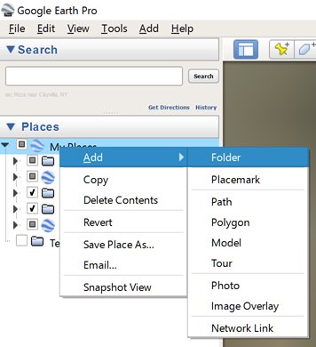
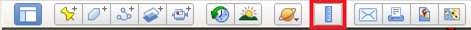
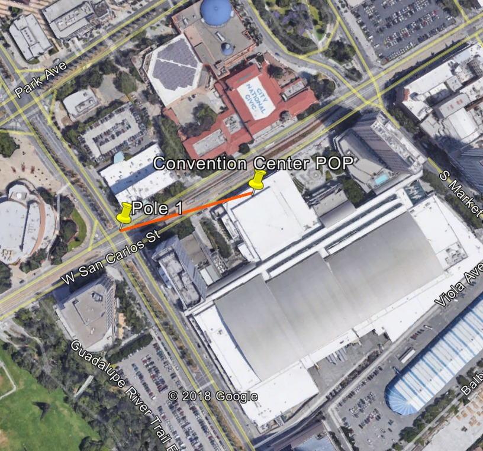
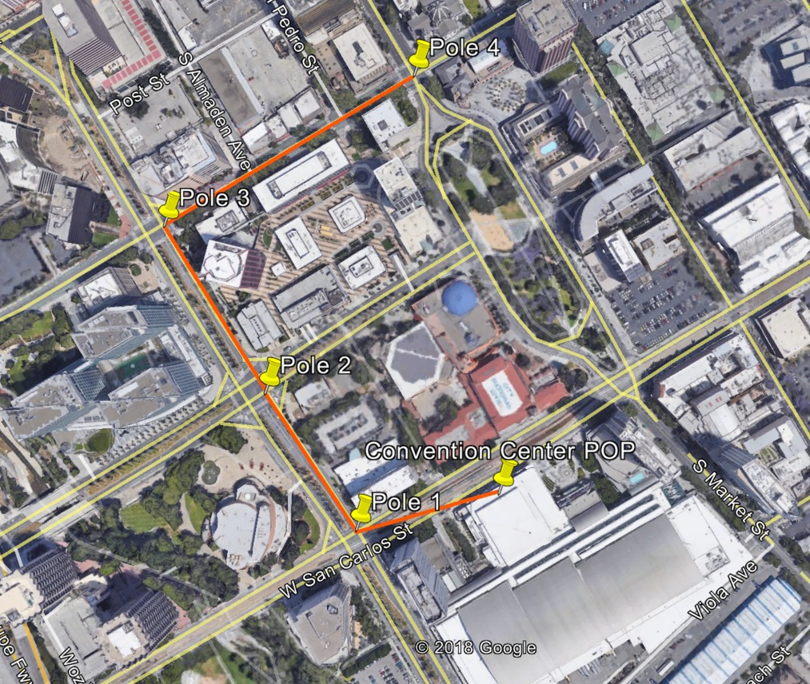
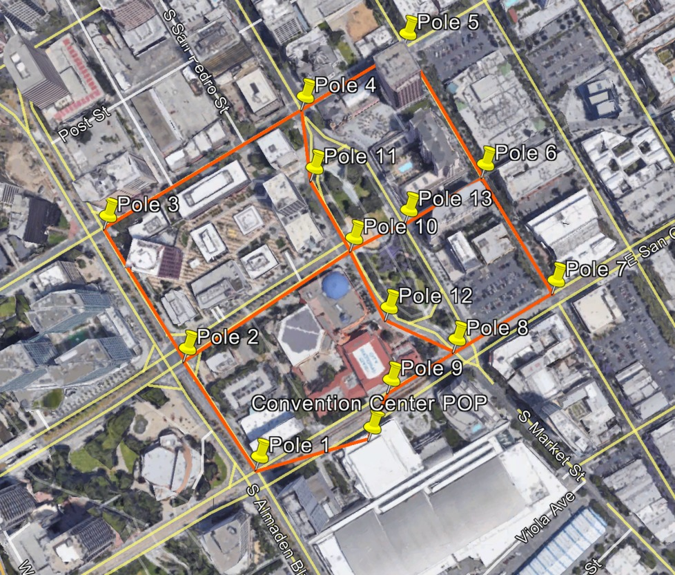
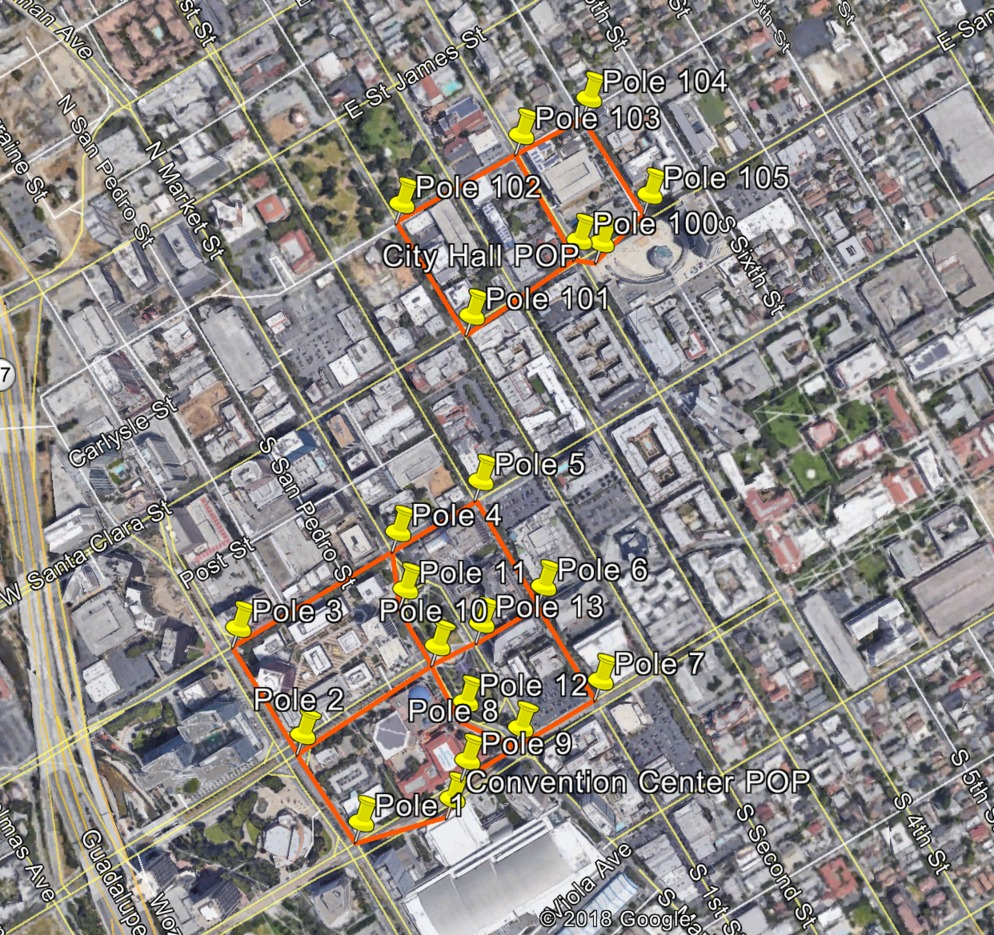
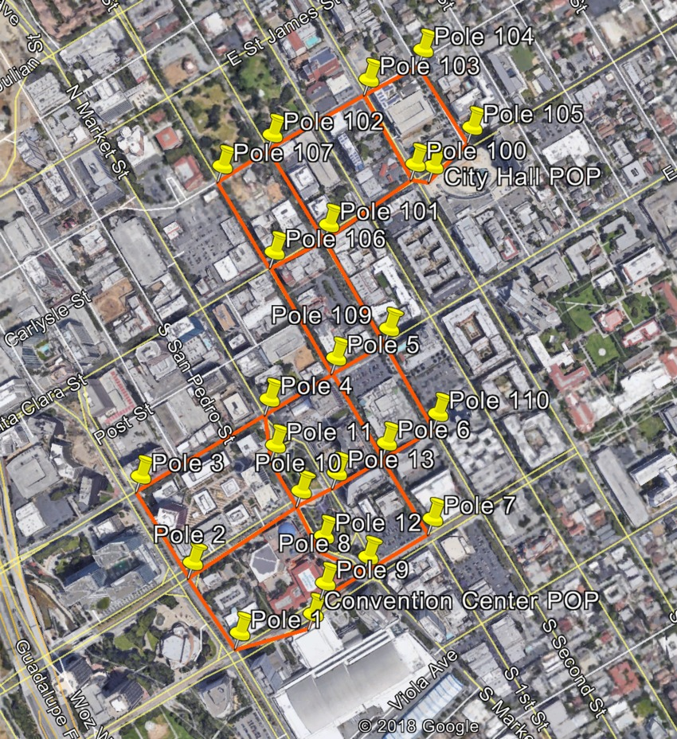

# Appendix

## Appendix A: Network Design Using Google Earth
[Google Earth] can be used as a planning tool for initial site design. All map
images and data are from Google Earth.

Design steps are listed below:

1. Create a folder to save the network design. Under the "Places" work space
   area, right-click on **My Places**, then click **Add** → **Folder**. Provide
   a name for this network design.

  
   
  <em>Map data ©2015 Google</em>

2. Identify fiber distribution locations (fiber PoP sites).
3. Place the map nearby the first fiber distribution location. Use the
   "Placemark" tool to add a site to the map. A new window will appear and draw
   the yellow push pin to the location of the first fiber PoP site. Create a
   unique site name under the "Name" field.

  
   
  <em>Map data ©2015 Google</em>
   
   
  
   
  <em>Map data ©2015 Google</em>

4. Starting at the fiber PoP, expand the network around the target service area
   (using the network design criteria described previously). It is best to
   build the network in a loop topology to allow for network redundancy,
   starting and ending at the fiber PoP. Use the "Placemark" tool to add each
   site.
   * The distance between sites should range between 25-200 meters, and all
     links should have clear line-of-sight and avoid any nearby trees or objects
     which could cause link obstructions. Use the ruler tool to measure the
     distances of the links.
   * Refer to the network design criteria to better understand the implications
     of link distance and angles on network performance.

  

5. Create a "Placemark" one hop away from the fiber PoP. Give this site a
   unique name.

  
   
  <em>Map data ©2015 Google</em>

6. Connect each site by using the "Path" tool to draw a line between both
   locations. The color and weight of the line created by the "Path" tool
   can be customized.

  
   
  <em>Map data ©2015 Google</em>
   
  
   
  <em>Map data ©2015 Google</em>

7. Expand the network outwards one hop at a time — remembering to attempt
   creation of a loop topology.

  
   
  <em>Map data ©2015 Google</em>
   
   
  
   
  <em>Map data ©2015 Google</em>

8. Once the initial loop topology is designed, find ways to interconnect links
   to create smaller and larger loops within the service area. This will turn
   the loop topology into a mesh topology, which allows Terragraph to offer
   better network performance and reliability. Find new poles or rooftops to
   build out the mesh topology and then use the "Placemark" and "Path" tools to
   create the design.

  
   
  <em>Map data ©2015 Google</em>

9. If there is another fiber distribution location, repeat the steps above for
   the next target service area. An example with two fiber PoP sites is shown
   below.

  
   
  <em>Map data ©2015 Google</em>

10. Once the mesh topologies have been designed for all the fiber distribution
    locations, it is important to interconnect the smaller individual mesh
    topologies to build a large mesh topology. This step is important as it
    allows the network to continue functioning if a fiber PoP fails. Find new
    poles or rooftops to build out the larger mesh topology and then use the
    "Placemark" and "Path" tools to create the larger interconnected mesh
    topology.

  
   
  <em>Map data ©2015 Google</em>

11. When the network design is finalized, save the design. Right-click on the
    folder that was created in the first step, then click **Save Place As...**
    to export the design as a Google Earth KMZ file.

  
   
  <em>Map data ©2015 Google</em>

[Google Earth]: https://www.google.com/earth/desktop/
