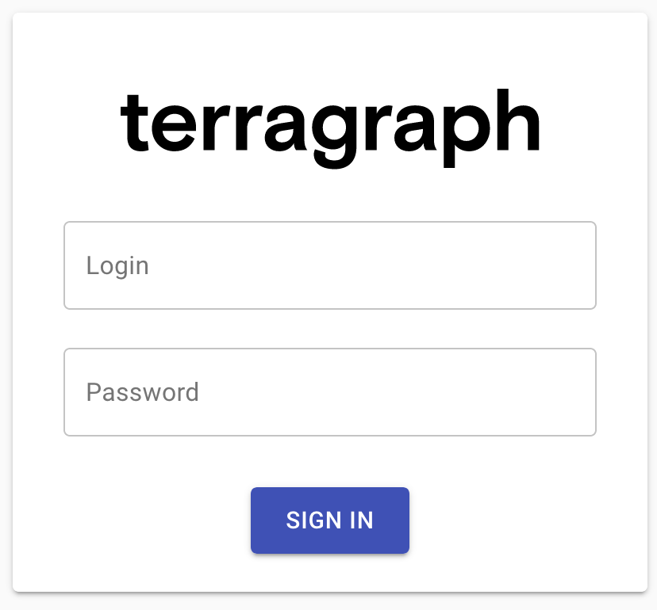
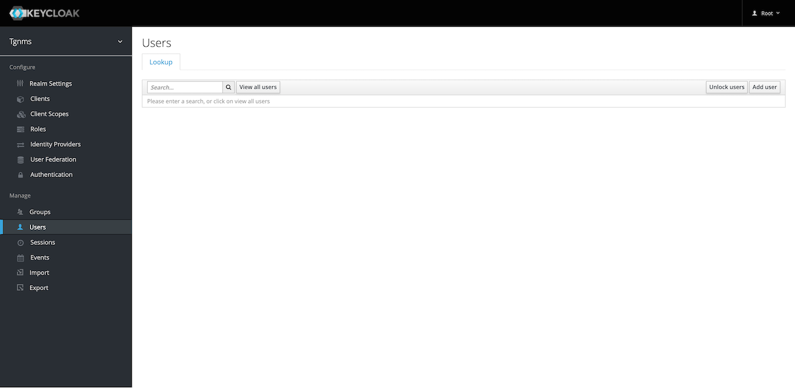
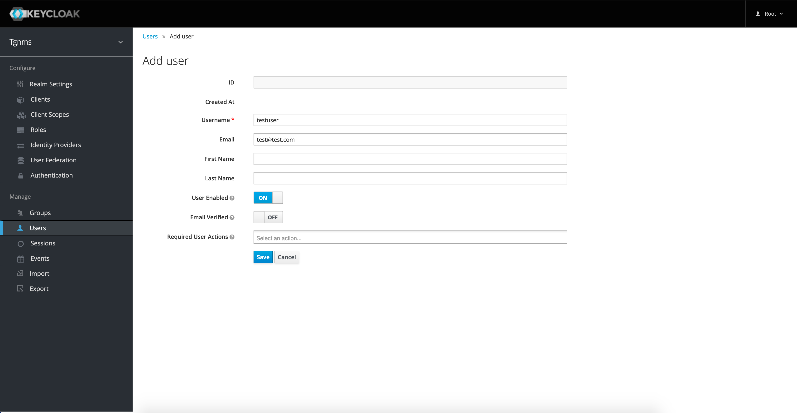

# Deployment and Installation
This document describes the installation procedure for the E2E controller and
configuring nodes for communication with the controller.

<a id="deployment-cloud"></a>

## Cloud Services
This section describes the installation and initial configuration of the full
Terragraph cloud suite, including E2E services and the NMS backend. The
Terragraph cloud suite is deployed as a Docker Swarm.

<a id="deployment-cloud-docker-swarm-installation"></a>

### Docker Swarm Installation
Since Terragraph uses the Docker ecosystem, it would be helpful to be familiar
with [Docker] and [Docker Swarm].

#### System Requirements
Docker Swarm recommends at least 3 (Docker) hosts for redundancy. If redundancy
is not required, the cloud suite can be run on a single host. To support a
network composed of roughly 512 sectors, each Docker host must meet the
following specifications.

* Ubuntu 18.04
* 4 vCPU
* 16GB of RAM
* 200GB of disk space
* Globally addressable IPv6 and private (or global) IPv4
* A unique and static hostname for each Docker node

#### Partitioning Scheme
Below is a suggested filesystem partitioning scheme for the Docker hosts. By
default, all of the Terragraph-specific data is stored in `/opt/terragraph`.

| Partition         | Size  | Description                     |
| ----------------- | ----- | ------------------------------- |
| `/opt`            | 130GB | Storage for all Terragraph data |
| `/var/lib/docker` | 50GB  | Storage for all Docker data     |

#### Installation
Terragraph comes with an installer that deploys and configures the Terragraph
cloud suite. The installer is a PEX file which packages together Ansible, a
Python CLI, and all of their dependencies into a single executable. An
installation host that has SSH access to all the Docker hosts is necessary to
run the installer. The installation host can be one of the Docker hosts.

For up-to-date installation instructions, see the [Terragraph NMS] repository.

1. Download the installer (`nms`) on the installation host.
```bash
$ wget https://github.com/terragraph/tgnms/releases/latest/download/nms
```

2. Make the `nms` binary executable.
```bash
$ chmod +x nms
```

3. Install Python 3.8 (`python3.8`) on the installation host, and optionally
   install `ssh-pass` if password-based SSH is used to access the Docker hosts.
```bash
$ sudo apt-get install python3-distutils-extra
$ sudo apt-get install python3.8
```

4. Create the config file.
```bash
$ ./nms show-defaults > config.yml
```

5. Open and edit `config.yml`. The config options are documented within the
   config file. Replace the "NMS Web Login" credentials and change
   `ansible_user` to be the username on the installation host. If identity and
   access management is desired (recommended), follow the steps in the section
   [Identity and Access Management Configuration](#deployment-keycloak-configuration).

6. Run the installer. `tg-docker-host-XX` are placeholders for the IP addresses
   or hostnames of the Docker hosts. All Docker hosts must be provided to the
   `install` command. Include the private key and SSL certificate file for the
   Nginx server as arguments and set `ext_nms_hostname` to configure the
   location of the certs in the Docker path.
```bash
$ ./nms install -f config.yml -k <ssl-key-file> -C <ssl-cert-file> \
  -h tg-docker-host-01 [-h tg-docker-host-02] [-h tg-docker-host-03]
```

7. Open a web browser and navigate to the IP address of any of the Docker hosts
   to load the NMS UI. Select the "Network Config" menu, then select the
   "Controller" tab and change the configuration fields listed in the table
   below. Be sure to change `<network>` to the name of the network (under
   `controllers_list` in the `nms` installer config file).

| Key | Value |
| --- | ----- |
| `flags.stats_agent_input_sock_url` | `"tcp://stats_agent-<network>:4231"` |
| `statsAgentParams.endpointParams.kafkaParams.config.brokerEndpointList` | `"PLAINTEXT://kafka:9092"` |
| `statsAgentParams.sources.controller.zmq_url` | `"tcp://e2e_controller-<network>:28989"` |

#### Deploying Additional Networks
To add additional networks to a Docker Swarm deployment (i.e. networks managed
by the same NMS instance), edit the `config.yml` file and add new entries to
`controllers_list`, then re-run the `install` command above. Note that this will
cause some downtime to running services, including those for existing networks.

### Legacy Installation
Legacy Terragraph deployments make use of systemd for running the E2E stack.
The NMS stack can no longer be installed with this method.

#### E2E Services
The installation steps for services contained within the E2E software image are
described below.

##### Container Requirements
The following specifications support a network with roughly 512 sectors.
* CentOS 7 or Ubuntu 17+
* 2 vCPU
* 12GB of RAM
* 40GB of disk space

###### Reserved Ports
The cloud services use the following ports by default to communicate with each
other and the Terragraph nodes:

| Port    | External | Description                                                                |
| ------- | -------- | -------------------------------------------------------------------------- |
| `6881`  | Yes      | Used by libtorrent to seed upgrade images.                                 |
| `6969`  | Yes      | Opentracker serves the torrent tracker on this port.                       |
| `7007`  | Yes      | Management communication port between E2E controller and nodes.            |
| `8002`  | Yes      | NMS aggregator listens on this port for stats from nodes.                  |
| `8080`  | Yes      | API service runs on this port.                                             |
| `55555` | Yes      | Used by primary and backup controller to send and receive HA messages.     |
| `17077` | No       | Used for communication between various E2E controller apps.                |
| `17078` | No       | Used for streaming from the controller to API service, currently disabled. |
| `18100` | No       | Used for communication between various NMS aggregator apps.                |
| `27007` | No       | Used by controller to publish stats to cloud-based stats agent.            |
| `28989` | No       | Used by controller to publish stats to cloud-based stats agent.            |

The external column indicates whether or not that port must be externally
accessible. Note that `17077` and `18100` may have to be externally accessible
if API service is not in the same network.

##### Pre-Installation
Have the following information available before installing the E2E controller:
- An IPv6 network prefix that will be used to address the Terragraph nodes. This
  prefix will need to be reachable from the E2E controller when it is installed.
- A route (possibly via a default) from a PoP node to the E2E controller
  machine(s). This can be static or learned from BGP.
- A copy of the Terragraph E2E image (x86).

##### Installation
*Note: The following installation steps have been tested on Ubuntu 17.10. Some
commands and paths may differ for CentOS.*

1. Copy the Terragraph E2E image to the server and extract it to `/opt/rootfs`
   (or another directory).
```bash
$ scp e2e-image-tgx86.tar.gz my-e2e-controller01:/tmp/
$ mkdir /opt/rootfs
$ tar xvzf e2e-image-tgx86.tar.gz -C /opt/rootfs
```

2. Create the environment file in `/etc/default/tg_services`. See
   `/etc/tg_systemd_config/README.md` for additional details.
```bash
$ cat /etc/default/tg_services
E2E_ROOTFS="/opt/rootfs"
API_ROOTFS="/opt/rootfs"
NMS_ROOTFS="/opt/rootfs"
AGENT_ROOTFS="/opt/rootfs"
DATA_DIR="/root/data"
# Relative to DATA_DIR
E2E_TOPOLOGY_FILE="/e2e-topology.conf"
E2E_CONFIG_FILE="/cfg/controller_config.json"
NMS_CONFIG_FILE="/cfg/aggregator_config.json"
# Additional CLI flags
API_ARGS="-http_port 8080"
```

3. Create the external "data" directory (`DATA_DIR` in the environment file).
```bash
$ mkdir /root/data
```

4. Install and enable the systemd service scripts.
```bash
$ cp /opt/rootfs/etc/tg_systemd_config/*.service /lib/systemd/system/
$ systemctl daemon-reload
# E2E controller
$ systemctl enable e2e_controller
$ systemctl enable opentracker
# NMS aggregator
$ systemctl enable nms_aggregator
# API Service
$ systemctl enable api_service
# Stats agent
$ systemctl enable stats_agent
```

5. Create an empty topology file (`E2E_TOPOLOGY_FILE` in the environment file)
   within the "data" directory.
```bash
$ touch /root/data/e2e-topology.conf
```

6. Copy the default E2E controller configuration file into the actual file
   location (`E2E_CONFIG_FILE` in the environment file). If needed, change
   `statsAgentParams.endpointParams.kafkaParams.config.brokerEndpointList` to
   the list of Kafka broker URLs. See
   `/etc/e2e_config/controller_config_metadata.json` for additional details.
```bash
$ cp /opt/rootfs/etc/e2e_config/controller_config_default.json \
    /root/data/cfg/controller_config.json
```

7. Copy the default NMS aggregator configuration file into the actual file
   location (`NMS_CONFIG_FILE` in the environment file). If needed, change
   `dataEndpoints.nms.host` to the URL prefix of the desired data endpoint.
   See `/etc/stats_config/aggregator_config_metadata.json` for additional
   details.
```bash
$ cp /opt/rootfs/etc/stats_config/aggregator_config_default.json \
    /root/data/cfg/aggregator_config.json
```

##### High Availability
The E2E controller can be installed in High Availability (HA) mode, where a
backup E2E controller runs passively on a separate machine and takes over if the
primary controller fails. HA mode is *strongly recommended*, as Terragraph
heavily relies on the E2E controller for normal network operation.

To enable HA mode, follow the installation steps above on both machines, with
the following changes:
* In the E2E controller configuration file (`E2E_CONFIG_FILE`), additional flags
  must be set. `bstar_primary` should be "true" on the primary controller and
  "false" on the backup controller.
```json
{
  "flags": {
    "bstar_peer_host": "<hostname or IPv6 address of the other controller>",
    "bstar_primary": "true"
  }
}
```
* In the environment file (`/etc/default/tg_services`), set a different value
  for `AGENT_MAC` on the backup controller, as shown below.
```bash
AGENT_MAC=0:0:0:0:0:1
```
* Do not enable the nms_aggregator systemd service on the backup machine.

### NMS Post-Installation
Post-installation configuration steps for the Terragraph NMS are described
below.

<a id="deployment-nms-setup-options"></a>

#### Setup Options
NMS parameters can be configured by editing the file
`/opt/terragraph/gfs/nms/env/nms_custom.env`. All available parameters are
described in the table below.

| Key | Type | Description |
| --- | ---- | ----------- |
| `API_REQUEST_TIMEOUT` | integer | When NMS makes an external API request, the request will be canceled if the response takes longer than `API_REQUEST_TIMEOUT` milliseconds. <br /> **Default:** `5000` |
| `COMMIT_DATE` | string | Commit date for the NMS build. Use this to show the user the release date of the NMS. This is normally set automatically. This can be in any format as it's merely displayed in the UI. |
| `COMMIT_HASH` | string | Commit hash for the NMS build. Use this to show the user the exact source control commit that this build was generated from. This is normally set automatically. This can be in any format as it's merely displayed in the UI. |
| `E2E_DL_URL` | string | The URL sent to the E2E controller to download node images uploaded via the UI. The format is `<SCHEMA>://<IP OR HOST>`, ex.`http://nms-domain`. Do not leave a trailing `/`. If the E2E controller and the UI run on the same host, use `http://localhost`. |
| `http_proxy` | string | Send external HTTP requests to the following URL. Note that this environment variable is *lowercase* due to the hosting environment. |
| `ISSUES_URL` | string | URL to a bug tracker for logging issues with the NMS. |
| `LOG_LEVEL` | enum (debug, info, warning, error) | NMS logs information to the console with varying degrees of verbosity. Higher verbosity log levels also show messages from less verbose levels. The most verbose is "debug", the least verbose is "error". <br /> **Default:** `info` |
| `NODE_ENV` | enum (development, production) | Which mode to run the NMS process in. Development mode will reload the server when files change and enable logging to the console. Production mode will generate a static build and will log JSON to standard out. <br /> **Default:** `production` |
| | | |
| **Alerting (BETA)** | | | |
| `ALARMS_ENABLED` | boolean | Enables the unified alarm configuration UI. <br /> **Depends on:** `ALERTMANAGER_CONFIG_URL`, `ALERTMANAGER_URL`, `PROMETHEUS_CONFIG_URL`, `TG_ALARM_URL`  <br /> **Default:** `false` |
| `ALERTMANAGER_CONFIG_URL` | string | URL of the Alertmanager configuration service. <br /> **Default:** `http://alertmanager_configurer:9101` |
| `ALERTMANAGER_URL` | string | URL of the Prometheus Alertmanager. <br /> **Default:** `http://alertmanager:9093` |
| `PROMETHEUS_CONFIG_URL` | string | URL of the Prometheus configuration service. <br /> **Default:** `http://prometheus_configurer:9100` |
| `TG_ALARM_URL` | string | Hostname of the Terragraph event alarms service. <br /> **Default:** `http://alarms:40000`|
| | | |
| **Authentication** | | | |
| `CLIENT_ROOT_URL` | string | Base URL of the NMS. This should be the user-visible URL to access the NMS homepage (i.e. what a user would see in their browser address bar). |
| `KEYCLOAK_CLIENT_ID` | string | Keycloak client ID to use. This must be retrieved from Keycloak if set manually. |
| `KEYCLOAK_CLIENT_SECRET` | string | Keycloak client secret to use. This must be retrieved from Keycloak if set manually. |
| `KEYCLOAK_HOST` | string | URL of the Keycloak server to authenticate with. Full URLs are allowed here for cases where Keycloak is not served under the root hostname. |
| `KEYCLOAK_HTTP_PROXY` | string | Send all Keycloak-related HTTP requests through this proxy. There are occasions where most services are hosted within an internal network behind a proxy, but the Keycloak authorization server may be on the public internet. In this case, Keycloak related requests must be sent through a different proxy than the default HTTP proxy. If this variable is not set, this falls back to http_proxy. If neither is set, this is n/a. |
| `KEYCLOAK_REALM` | string | Keycloak realm to authenticate the user with. This must be retrieved from Keycloak if set manually. |
| `LOGIN_ENABLED` | boolean | Enables authentication for NMS. Authentication is handled by integrating with Keycloak. <br /> **Depends on:** `CLIENT_ROOT_URL`, `KEYCLOAK_HOST`, `KEYCLOAK_REALM`, `KEYCLOAK_CLIENT_ID`, `KEYCLOAK_CLIENT_SECRET` <br /> **Default:** `false` |
| `SESSION_MAX_AGE_MS` | integer | How long a user's login cookie will last. <br /> **Default:** `86400000` |
| `SSO_ENABLED` | boolean | Enables Single Sign-On (SSO) functionality through Keycloak. <br /> **Depends on:** `CLIENT_ROOT_URL`, `KEYCLOAK_HOST`, `KEYCLOAK_REALM`, `KEYCLOAK_CLIENT_ID`, `KEYCLOAK_CLIENT_SECRET` <br /> **Default:** `false` |
| | | |
| **Mapbox** | | |
| `MAPBOX_ACCESS_TOKEN` | string | Access token for the Mapbox account. |
| `TILE_STYLE` | comma separated strings | A comma separated list of tile names and URLs to display in the UI in the format `<NAME>=<TILE STYLES URL>,...`. If specified, at least one style must be listed or the UI will default to **[Mapbox]** styles.  <br /> **Example:** `Night View=night.maptiles.org,Day View=day.maptiles.org`|
| | | |
| **MySQL (or MariaDB)** | | | |
| `MYSQL_DB` | string | The MySQL database to connect to. <br /> **Default:** `cxl` |
| `MYSQL_HOST` | string | The hostname or IP address of the MySQL server to use. <br /> **Default:** `127.0.0.1`|
| `MYSQL_PASS` | string | The MySQL password to connect to the database with. |
| `MYSQL_PORT` | integer | The TCP port of the MySQL server to use. <br /> **Default:** `3306` |
| `MYSQL_USER` | string | The MySQL user to connect to the database as. <br /> **Default:** `root` |
| | | |
| **Software Portal** | | | |
| `SOFTWARE_PORTAL_API_ID` | string | ID of the Terragraph software portal API token. This will be generated when creating the API token. <br /> **Default:** `tgdev` |
| `SOFTWARE_PORTAL_API_TOKEN` | string | API token for the Terragraph software portal. |
| `SOFTWARE_PORTAL_URL` | string | URL to the central Terragraph software portal. This is where official Terragraph releases are stored. Setting this variable will enable the software portal feature. <br /> **Default:** `https://sw.terragraph.link` |
| | | |
| **Stats** | | |
| `GRAFANA_URL` | string | Absolute or relative URL to the Grafana UI. This is used to link to certain Grafana dashboards. By default Grafana is hosted under CLIENT_ROOT_URL/grafana. <br /> **Default:** `grafana`|
| `PROMETHEUS` | string | URL of the Prometheus service. <br /> **Default:** `http://prometheus:9090`|
| `STATS_ALLOWED_DELAY_SEC` | integer | Allowed delay in stats pipeline when showing availability. This is used for stats derived from the Kafka stats stream. <br /> **Default:** `120` |
| | | |
| **Experimental Features** | | | |
| `KAFKA_HOSTS` | comma separated strings | Comma separated list of Kafka hosts to pull node events from (see `NOTIFICATION_MENU_ENABLED`). <br /> **Example:** `[2001::1]:9092,[2001::2]:9092`|
| `SERVICE_AVAILABILITY_ENABLED` | boolean | Enables the service availability display in the overview panel. Service availability represents the link's ability to carry real traffic at layer 4. <br /> **Default:** `false` |
| `NOTIFICATION_MENU_ENABLED` | boolean | Enables the notification menu for streaming events from  Kafka in realtime. <br /> **Depends on:** `KAFKA_HOSTS` <br /> **Default:** `false` |
| `DEFAULT_ROUTES_HISTORY_ENABLED` | boolean | Enables the default routes history feature. <br /> **Depends on:** `DEFAULT_ROUTES_HISTORY_HOST` <br /> **Default:** `false` |
| `NETWORKTEST_HOST` | string | Hostname of the Terragraph Network Test service. |

#### Self-Hosting Map Tiles Using OpenStreetMaps
If fetching remote map data in the NMS UI is not possible, the
**[OpenStreetMaps]** tiles can be generated locally and hosted in a Docker
tile server container.

* Follow the [OpenMapTiles quick-start instructions].
```bash
$ git clone https://github.com/openmaptiles/openmaptiles.git
$ cd openmaptiles
```
* Edit the `.env` file and change `QUICKSTART_MAX_ZOOM` to `14`. Then run the
  `quickstart.sh` script to generate tiles. Generating tiles for a specific
  region is possible by adding the [region name] as the first parameter.
```bash
$ ./quickstart.sh <REGION NAME>
$ make start-tileserver
```
* The tile server will now be running on port 8080 via **[docker-compose]**.
* Specify the `TILE_STYLE` parameter by following the
  [Setup Options](#deployment-nms-setup-options) for the UI.

<a id="deployment-keycloak-configuration"></a>

### Identity and Access Management Configuration

Access management is handled by [Keycloak], an open source Identity and Access
Management (IAM) system. Keycloak is capable of integrating with many identity
providers such as Facebook and Google, as well as storing users inside its own
database.

#### Installing and Enabling Keycloak
The following variables must be set in
[config.yml](#deployment-cloud-docker-swarm-installation):
* `keycloak_enabled`
* `nms_username` - The username of the default NMS administrator.
* `nms_password` - The password of the default NMS administrator.
* `ext_nms_hostname` - Must be set to the externally visible NMS hostname
  (whatever a user would type into their browser's address bar). An
  IP address is also acceptable.
* `keycloak_root_user` - The username of the default Keycloak administrator.
* `keycloak_root_password` - The password of the default Keycloak administrator.
* `keycloak_db_user` - The username of the Keycloak MySQL user.
* `keycloak_db_password` - The password of the Keycloak MySQL user.

It is recommended to change `keycloak_root_password` and
`keycloak_db_password` from their defaults.

#### Logging into the NMS for the first time
After successfully running the Ansible installer, visit the URL set in
`ext_nms_hostname` in a web browser. The user will be shown a login page.

<p align="center">
  
</p>

Enter the `nms_username` and `nms_password` variables from
[config.yml](#deployment-cloud-docker-swarm-installation) as the username and password.
User access to Terragraph NMS may be configured by following the instructions
in the section below.

<a id="deployment-configuring-keycloak"></a>

#### Configuring User Access to Terragraph NMS
User authentication may be handled directly by Keycloak or by an external
Identity Provider such as Facebook or Google. This guide will detail how to add
a new user to Keycloak directly. Please consult the Keycloak documentation for
instructions on configuring an external Identity Provider.

First, the user must sign in to the Keycloak administration dashboard by
visiting `/auth` in a browser.

<p align="center">
  
</p>

Click on the "Administration Console" link. Enter the username and password used
as the `keycloak_root_user` and `keycloak_root_password` variables in
config.yml.

Once logged in to the Keycloak administration dashboard, select the "TGNMS"
realm from the dropdown at the upper-left of the screen. Click the "Users" link
on the left sidebar. To view the users in the "TGNMS" realm, search for a user
using the search bar or click the "View all users" button.

<p align="center">
  
</p>

To give a new user access to Terragraph NMS, click the "Add user" button at the
upper-right corner of the users table. Input a username for the user.
It is also recommended to set a valid email address so the user may reset
their own password using Keycloak. Optionally, select some
"Required User Actions" for the user to perform when they sign-in. For example,
the administrator may require a user to set a new password and verify their
email.

<p align="center">
  
</p>

Click the "Save" button to create the user. The newly created user must now
be given authorization to access the Terragraph NMS. User authorization is
configured by assigning Keycloak Roles to a user. Click on the
"Role Mappings" tab. To assign roles to a user, select the desired role in the
"Available Roles menu" and click the "Add selected" button. The user's new roles
will take effect after their next sign-in.

<p align="center">
  
</p>

Note that the "tg_all_read" and "tg_all_write" roles are called
"Composite Roles". These are roles which contain multiple other roles. For
example, if a user needs full read-access to the NMS, assign them the
"tg_all_read" role and all corresponding read roles will be assigned to them.
This can be demonstrated by assigning either composite role to a user and then
looking at the "Effective Roles" menu on the right side of the "Role Mappings"
screen.

#### Authorization and Roles
Roles are used to protect E2E API endpoints, as well as hide UI components in
the Terragraph NMS. Descriptions of each role can be viewed by selecting the
"Roles" link on the left sidebar. The roles required to access each E2E API
endpoint are listed in the E2E API Documentation.

A role's name is broken up into two main parts: category and level. For example,
the `tg_ignition_read` role has a category of "ignition" and a level of "read".
If a user has the `tg_ignition_write` role, they are also able to access APIs
in the same category that require the "read" level (write access implies
read access). A user with the composite role `tg_all_write` has full
read-write access to all endpoints and UI components.

<a id="deployment-nodes"></a>

## Nodes
Some important node deployment steps are highlighted in the sections below.

<a id="node-information"></a>

### Node Information
On Puma hardware, the MAC address and serial number of each node are encoded in
a QR code on the back of the device. This is parsed as follows:

```
SN:<serial number>:M60:<MAC address>

Example:
    SN:TG100P05241700057:M60:746FF7CA1A76
       ^^^^^^^^^^^^^^^^^     ^^^^^^^^^^^^
    Serial number   =>  TG100P05241700057
    MAC address     =>  74:6F:F7:CA:1A:76
```

<a id="deployment-first-pop-configuration"></a>

### First PoP Configuration
The configuration of Terragraph nodes is handled automatically by the E2E
service. However, the first PoP node must be configured manually since
connectivity to the E2E controller has not yet been established.

1. Add the PoP site and node to the network topology (refer to
   [Monitoring and Alerting](Monitoring.md#monitoring-map-editing) for details).

2. Create the PoP node configuration (refer to
   [PoP Node Config](Maintenance.md#maintenance-pop-node-config) for details).

3. Generate the full PoP node configuration JSON using one of these methods:
    * *Via NMS:* Select the **Node Config** icon from the left-hand toolbar,
      click on the "Node" tab on the top bar, then select the PoP node in the
      left-hand column. Click **Show Full Configuration** on the bottom-left,
      make sure the correct versions are selected, then click **Copy**.

    * *Via TG CLI:* Run the following command (be sure to substitute the correct
      version details):
```bash
$ tg config get node -n pop-node-name full \
  --version RELEASE_M61 \
  --hardware NXP_LS1048A_PUMA \
  --firmware 10.12.0
```

4. Deploy the configuration to the PoP node using one of these methods:
    * *Via SSH (requires a signed SSH key):* Log into the node and write the
      full configuration JSON (obtained above) to the path
      `/data/cfg/node_config.json`.
    * *Via web portal (must be enabled through `envParams.WEBUI_ENABLED`):* On
      hardware that supports Wi-Fi for administrative access, connect to the
      node's Wi-Fi network and submit the full configuration JSON (obtained
      above) using the web portal.

5. Reboot the PoP node. Connectivity to the E2E controller should be established
   when the node comes back up.
```bash
$ reboot
```

### GPS Configuration
When deploying a test network with poor GPS visibility (e.g. indoors), nodes
must be configured to disable the GPS synchronization check during link
ignition. If this is applicable, add a network override for the
`radioParamsBase.fwParams.forceGpsDisable` config to `1` (see
[Maintenance and Configuration](Maintenance.md#maintenance-config)).

<a id="deployment-ssh-configuration"></a>

### SSH Configuration
SSH access to Terragraph nodes is controlled through SSH certificate authorities
(CAs). The CAs that Terragraph nodes trust are managed via node configuration
(see [Maintenance and Configuration](Maintenance.md#maintenance-config)). These
CAs can be used to sign user SSH keys.
1. To generate a CA key, use `ssh-keygen`. It is recommended to use the ed25519
   encryption scheme when generating CA and user keys.
```bash
$ ssh-keygen -f ~/.ssh/tg-CA -t ed25519
```

2. Configure nodes to trust the newly generated CA by adding the contents of
   `~/.ssh/tg-CA.pub` to `sysParams.sshTrustedUserCAKeys`.
```bash
$ cat ~/.ssh/tg-CA.pub
```

3. Optionally, disable the default Terragraph CA on the nodes
   (`/etc/ssh/tg-CA.bak`) by setting `sysParams.allowFactoryCA` to `false`.

<a id="deployment-kafka-configuration"></a>

### Kafka Configuration
Stats, events, and other data can be pushed from nodes to a [Kafka] broker. To
enable this, add a network override for the
`statsAgentParams.endpointParams.kafkaParams.config.brokerEndpointList` config
to the list of Kafka broker URLs.
Example:

```json
{
  "statsAgentParams": {
    "endpointParams": {
      "kafkaParams": {
        "config": {
          "brokerEndpointList": "PLAINTEXT://[2001::1]:9096,PLAINTEXT://[2001::2]:9096,PLAINTEXT://[2001::3]:9096",
        }
      }
    }
  }
}
```

When running in a Docker environment, please note that the node configuration
must use port 9096 (by default), which will differ from the controller
configuration's port 9092 (by default).

<a id="deployment-fluentd-configuration"></a>

### Fluentd Configuration
Log files can be pushed from nodes to [Fluentd] servers via a [Fluent Bit]
client. To enable this, add a network override for the `fluentdParams.endpoints`
config.
Example:

```json
{
  "fluentdParams": {
    "endpoints": {
      "exampleServer": {
        "host": "1111:2222:3333::ffff",
        "port": 24224
      }
    }
  }
}
```

### Time Configuration
The NTP servers that Terragraph nodes use for system clock synchronization are
managed via node configuration (see
[Maintenance and Configuration](Maintenance.md#maintenance-config)). By default,
nodes will connect to `time.facebook.com`. To use custom NTP servers instead, set
a network override for the `sysParams.ntpServers` config. Note that the server
must have IPv6 (unless NAT64 or IPv4 are supported).
Example:

```json
{
  "sysParams": {
    "ntpServers": {
      "ntp1": "1.pool.ntp.org",
      "ntp2": "2.pool.ntp.org"
    }
  }
}
```

The timezone on Terragraph nodes is set using `/etc/localtime`. This can point
at any valid [tz database] entry. By default, Terragraph nodes use the `UTC`
timezone. To change this for all nodes, set a network override for the
`envParams.TIMEZONE` config (see
[Maintenance and Configuration](Maintenance.md#maintenance-config)).

### DNS Configuration
The DNS servers that Terragraph nodes use for DNS resolution are managed via
node configuration (see
[Maintenance and Configuration](Maintenance.md#maintenance-config)). By default,
nodes will use Google's public DNS servers (`2001:4860:4860::8888` and
`2001:4860:4860::8844`). To use additional DNS servers, add their IPv6 addresses
to `sysParams.dnsServers`.
Example:

```json
{
  "sysParams": {
    "dnsServers": {
      "exampleServer": "1234:1234:ffff::1234"
    }
  }
}
```

### WPA-Enterprise (802.1X) Configuration
Terragraph supports 802.1X for link authentication for enterprise-grade
security. This requires a RADIUS server to be available and reachable from the
nodes, and all Terragraph nodes must contain signed certificates. To enable
802.1X, set a network override for the config keys
`radioParamsBase.fwParams.wsecEnable` (to `2`) and `eapolParams`, as shown below:

```json
{
  "radioParamsBase": {
    "fwParams": {
      "wsecEnable": 2
    }
  },
  "eapolParams": {
    "ca_cert_path": "/data/secure/keys/ca.pem",
    "client_cert_path": "/data/secure/keys/client.pem",
    "private_key_path": "/data/secure/keys/client.key",
    "radius_server_ip": "1234:5678:9abc::def",
    "radius_server_port": 1812,
    "radius_user_identity": "some-user",
    "secrets": {
      "private_key_password": "some-passphrase",
      "radius_server_shared_secret": "some-secret",
      "radius_user_password": "some-password"
    }
  }
}
```
By default, 802.1X is disabled, and links are authenticated using WPA-PSK.

### Channel Configuration
The wireless channel can be manually configured for each node or assigned
across the entire network. For automatic assignment, only channel 2 is enabled
by default but the set of enabled channels can be configured via the
`topologyParams.enabledChannels` controller configuration field.

### DHCP, PD, and DS-Lite
*Please note these features are only supported on the Rev5 platform.*

[Dual-Stack Lite] (or DS-Lite) allows IPv4 to work natively in an IPv6 access
network. Terragraph supports DS-Lite as a solution for dual-stack deployments.
DS-Lite involves two network services: AFTR (Address Family Transition Router)
and B4 (Basic Bridging BroadBand). The IPv6 address of the AFTR is required for
setup. The CPE will run the B4 function as long as it supports DS-Lite.

#### DS-Lite Architecture
<p align="center">
  
</p>

DS-Lite requires DHCP prefix delegation. Terragraph Rev5 nodes run [Kea] as a
DHCP server with all the required configuration options.

The figure below shows an example Terragraph network with DS-Lite.

<p align="center">
  
</p>

#### Configuration
The following section describes the node configuration options for setting up
DHCP prefix delegation and DS-Lite.

##### Nodes with CPEs (DHCP)
The table below lists the configuration options in `dhcpParams`.

| Config                  | Description |
| ----------------------- | ----------- |
| `dhcpInterface`         | Interface for DHCP (usually same as CPE interface) |
| `dhcpPdDelegatedLen`    | Length of prefix to be delegated to CPEs |
| `dhcpPdPool`            | Network pool from which prefixes will be delegated (must be larger than `dhcpPdDelegatedLen`, or else only one prefix can be delegated) |
| `dhcpPreferredLifetime` | DHCP lease preferred lifetime; once this expires, the lease should not be used for new communications |
| `dhcpRenewTimer`        | DHCP renew timer (T1), usually set to 50% of the preferred lease time |
| `dhcpRebindTimer`       | DHCP rebind timer (T2), usually set to 87.5% of the preferred lease time |
| `dhcpValidLifetime`     | Length of time that an address remains in the valid state, during which the address can be used for new or existing communications; when the valid-lifetime expires, the address becomes invalid and can no longer be used |
| `dhcpRangeMin`          | Start address for regular leases |
| `dhcpRangeMax`          | Max address for regular leases |
| `keaEnabled`            | Boolean flag to enable or disable Kea (enabling Kea disables isc-dhcpd) |
| `optionData`            | Map of DHCP options, with names as the keys and data as the values (refer to the [DHCPv6 options list]) |
| `prefixSplitEnabled`    | If enabled, splits prefix down to /64 before pushing to hardware (please only enable on Marvell hardware) |

Note that `dhcpPdPool` is an optional parameter. If it is not set, Kea will try
to split the address allocated to the node for delegation, if possible.

DS-Lite auto-configuration will not work without prefix delegation. To disable
prefix delegation entirely, leave both `dhcpPdDelegatedLen` and `dhcpPdPool`
unset. Please note that the DHCP server is only supported in the Rev5 platform.
On the newer VPP-based platforms, CPE provisioning with DHCPv6 is enabled via a
DHCP relay.

##### PoP Nodes (BGP)
The table below lists the configuration options in `bgpParams`.

| Config                     | Description |
| -------------------------- | ----------- |
| `cpeNetworkPrefix`         | Entire prefix used for prefix delegation in a deployment |
| `delegatedNetworkPrefixes` | Comma-separated list of specific prefixes desired to be routed from nearby CPEs (defined in `dhcpParams.dhcpPdPool`) |

<a id="deployment-security-network"></a>

## Terragraph Network Security
It is essential to implement proper access control list (ACL) rules to keep the
Terragraph network infrastructure secure. Running Terragraph without any ACL
rules upstream may expose security vulnerabilities. As such, it is critical that
the `e2e-network-prefix` which the nodes are using be protected from the
Internet by the application of ACL rules upstream.

### Inbound
There is no requirement for connections that must be initiated from the Internet
towards a Terragraph node under regular operation.

A Terragraph node exposed to inbound connections from the internet allows for
vulnerabilities such as:
* SSH access by unauthorized users (by default, trusts the CA in
  `/etc/ssh/tg-CA.bak`)
* NTP amplification attacks
* Route hijacking via BGP (if node is a PoP)

### Outbound
Terragraph nodes may require the following outbound connections (depending on
their configuration):
* DNS -> Google DNS6
* NTP -> `time.facebook.com`
* E2E minion -> E2E controller on TCP port 7007
* Fluent Bit -> configured Fluentd endpoint (TCP)
* Stats agent -> configured Kafka endpoint (TCP)
* Stats agent -> NMS aggregator on TCP port 8002 (*off by default*)
* HTTPS -> `https://graph.facebook.com` (for logging stats, *off by default*)

[Terragraph NMS]: https://github.com/terragraph/tgnms
[Grafana]: https://grafana.com/
[Mapbox]: https://www.mapbox.com/
[OpenStreetMaps]: https://www.openstreetmap.org/
[OpenMapTiles quick-start instructions]: https://github.com/openmaptiles/openmaptiles/blob/master/QUICKSTART.md
[region name]: https://github.com/julien-noblet/download-geofabrik#list-of-elements
[docker-compose]: https://docs.docker.com/compose/install/#install-compose
[Kafka]: https://kafka.apache.org/
[Keycloak]: https://www.keycloak.org/
[Fluentd]: https://www.fluentd.org/
[Fluent Bit]: https://fluentbit.io/
[Kea]: https://kea.isc.org/
[Dual-Stack Lite]: https://tools.ietf.org/html/rfc6333
[DHCPv6 options list]: https://downloads.isc.org/isc/kea/cur/doc/kea-guide.html#dhcp6-std-options-list
[tz database]: https://en.wikipedia.org/wiki/Tz_database
[Docker]: https://docs.docker.com/engine/docker-overview/
[Docker Swarm]: https://docs.docker.com/engine/swarm/
