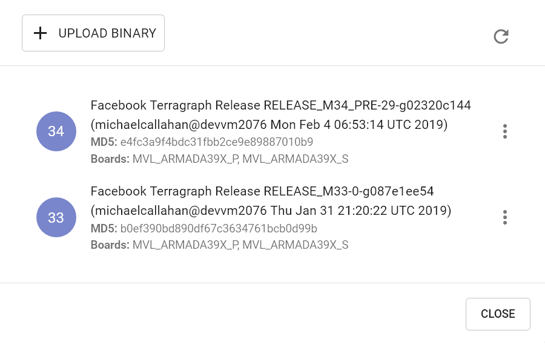
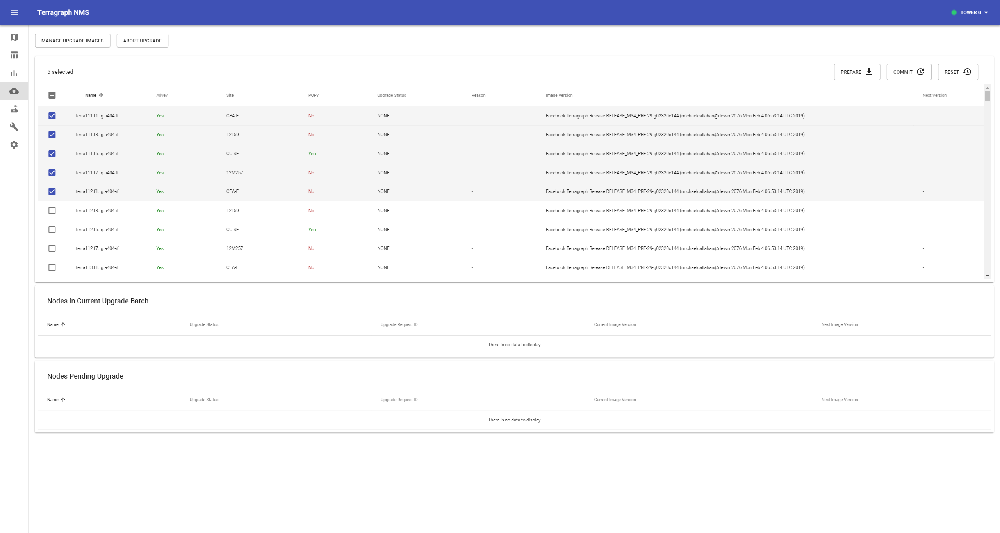

# Maintenance and Configuration
This document describes Terragraph's maintenance and configuration procedures.

<a id="maintenance-upgrades"></a>

## Software Upgrades
Terragraph software releases are tagged with major and minor versions, such as
`M77` and `M77.1`, respectively. Releases contain two separate parts - an E2E
image (x86) and a Terragraph node image. When performing software upgrades, the
E2E controller **must** be upgraded before the Terragraph nodes to ensure proper
backwards compatibility.

### E2E Image
The E2E image contains the cloud software, which includes the E2E controller,
NMS aggregator, and API service.

#### Docker Swarm
Upgrading to a new E2E release requires running the `nms` installer with the
`upgrade` command on the installation host used to initially deploy the Docker
Swarm. The upgrade command takes the controller name (as specified in
`config.yml`) and the new image version as arguments. As part of the upgrade,
E2E files in `/data` may be migrated if necessary. For example, the following
command upgrades (or downgrades) the E2E controller to M78:
```bash
$ ./nms upgrade -f config.yml -c "<controller_name>" \
    -i "secure.cxl-terragraph.com:443/e2e-controller:M78" \
    -h tg-docker-host-01 [-h tg-docker-host-2] [-h tg-docker-host-03]
```

#### Legacy
When using the legacy deployment with systemd, the release file itself is a
tarball (.tar.gz) of the chroot BusyBox image containing the Terragraph
filesystem. Upgrading to a new release involves extracting the new filesystem,
stopping old software processes, and running the new binaries.

The following steps outline the E2E controller upgrade process (using M77 > M78
as an example):

1. Extract the release image to a new directory.
```bash
$ mkdir /opt/rootfs_m78
$ tar -xvzf e2e_image-x86-x86.tar.gz -C /opt/rootfs_m78
```
2. Run the E2E data migration script, which will modify any files if necessary.
```bash
$ chroot /opt/rootfs_m78 /usr/sbin/migrate_e2e_data --from_ver 77
```
3. Update the `tg_services` file with the new image directory by setting the
   `E2E_ROOTFS` variable.
```bash
$ vim /etc/default/tg_services  # or /etc/sysconfig/tg_services
E2E_ROOTFS="/opt/rootfs_m78"
```
4. Restart the systemd service `e2e_controller`.
```bash
$ systemctl restart e2e_controller
```

Repeat steps 3 and 4 with the following changes to upgrade the NMS aggregator
and API service:
- **NMS aggregator** - Edit the `tg_services` variable `NMS_ROOTFS` and restart
   the service `nms_aggregator`.
- **API service** - Edit the `tg_services` variable `API_ROOTFS` and restart the
   service `api_service`.

### NMS
Upgrading Terragraph NMS in the Docker Swarm requires running the `nms`
installer with the `nms` tag on the installation host used to initially deploy
the Docker Swarm. The following command upgrades all the Terragraph NMS services
to their latest versions. Note that only one host is required to upgrade the
Terragraph NMS services.
```bash
$ ./nms install -f config.yml -h tg-docker-host-01 -t nms
```

### Terragraph Nodes
Terragraph node upgrades consist of two phases - "prepare" and "commit". In the
"prepare" phase, the controller distributes the new software image to nodes,
over either BitTorrent or HTTP. Once completed, the nodes will flash the new
image onto a secondary disk partition. The "commit" command instructs nodes to
reboot to the newly-written partition.

The E2E minion will periodically report its upgrade status to the controller.
These statuses are provided below:

| Status              | Description                                                                                       |
| ------------------- | ------------------------------------------------------------------------------------------------- |
| `NONE`              | An upgrade is not taking place, or the previous upgrade status was lost due to a reboot.          |
| `DOWNLOADING_IMAGE` | The image download is in progress.                                                                |
| `DOWNLOAD_FAILED`   | The image download failed or could not be started, or the downloaded image could not be verified. |
| `FLASHING_IMAGE`    | The image flashing is in progress.                                                                |
| `FLASH_FAILED`      | The image could not be flashed.                                                                   |
| `FLASHED`           | The image was successfully flashed, and the node is ready for a "commit".                         |
| `COMMIT_FAILED`     | The "commit" command could not be executed.                                                       |

Upgrades can be done either through the NMS UI or using the TG CLI. Instructions
for each are given below.

#### Upgrading via NMS UI

1. Select the **Upgrade** icon from the left-hand toolbar.
   <p align="center">
   
   </p>

2. Click **Manage Upgrade Images** to view all available images. If the new
   image is already present in this list, then skip the next step.

3. Click **Upload Binary** and locate the image file. After the upload finishes,
   verify that the image appears in the list (this may take a few seconds) and
   close the modal.
   <p align="center">
   
   </p>

4. Select the nodes to upgrade in the table, then click **Prepare** on the
   top-right of the nodes table.
   <p align="center">
   
   </p>

5. Verify that the correct nodes appear in the **Nodes to prepare for upgrade**
   list, then select the image to upgrade via the dropdown menu and click
   **Submit**. This will issue a "prepare" request to the E2E controller, which
   instructs the selected nodes to start the "prepare" process. The whole
   process may take up to a few minutes to complete, depending on the size of
   the network. The current upgrade status of each node is shown on the same
   page.
   <p align="center">
   
   </p>

6. The upgrade status on each node will change to `FLASHED` after the "prepare"
   step succeeds, and "Next Version" should reflect the newly flashed image.
   Select these nodes again (if not already selected), and click **Commit**.

7. Verify that the correct nodes appear in the "Nodes to commit for upgrade"
   list, then click **Submit**. This will issue a "commit" request to the E2E
   controller which in turn will order the nodes to reboot in a coordinated
   manner that minimizes network disruption.
   <p align="center">
   
   </p>

8. The upgrade status on each node will change to `NONE` after the node comes
   back online, and the "Image Version" should reflect the new image.

An upgrade procedure can be cancelled at any time by clicking **Abort**.

#### Upgrading via TG CLI
##### Prepare
The E2E controller can distribute the image either via BitTorrent (recommended)
or HTTP.

###### Using BitTorrent
1. Provide a URL for the controller to download the image.
```bash
$ tg upgrade torrent add_image -u <image_url>
```
2. After the controller has downloaded the image, find its magnet URL and MD5
   hash.
```bash
$ tg upgrade torrent list_images
```
3. Issue a "prepare" command.
```bash
# Prepare all nodes in the network
$ tg upgrade network prepare_torrent -m <magnet_url> --md5 <md5_hash>
```
```bash
# Prepare a subset of nodes in the network
# -n, --names TEXT  Node name list (separated by ,)
$ tg upgrade node -n <node_names> prepare_torrent -m <magnet_url> --md5 <md5_hash>
```

###### Using HTTP
1. Provide a URL for the nodes to download the image. If needed, an HTTP server
   can be started on the current host with the following command:
```bash
$ tg upgrade launch_server -g <interface_name> -s <port_number> -i <image_file_path>
```
2. Issue a "prepare" command to all nodes.
```bash
$ tg upgrade network prepare -i <http_url>
```

##### Commit
Issue a "commit" command to all nodes.

```bash
$ tg upgrade network commit
```

All nodes will reboot to the new image in an order that minimizes network
disruption.

##### Upgrade Status
The upgrade status on all nodes can be monitored using the following command:

```bash
$ tg upgrade state all
```

#### Node Image Revert
Terragraph nodes will automatically revert to the previous image version if an
upgrade causes a critical failure. The revert process is triggered if the node's
E2E minion cannot contact the controller after six minutes. If this happens, the
node will reboot into the partition it was using before the last upgrade was
committed.

<a id="maintenance-config"></a>

## Configuration Management
Terragraph implements a centralized configuration management architecture in
which the E2E controller serves as the single point of truth for configurations
in the network. After establishing communication with the E2E controller,
Terragraph nodes report a hash of their local configuration file and the
controller automatically pushes configuration changes to the nodes upon seeing
any mismatches. This automatic configuration sync can be disabled by
"un-managing" the entire network or parts of it.

<p align="center">
  
</p>

Node configuration is a JSON-serialized Thrift structure. All config files are
stored under the `/data/cfg/` directory for both the E2E controller and
Terragraph node.

### Layered Config Model
Terragraph follows a layered configuration model, where each node's
configuration is computed by applying the following layers in order:

* **Base configuration** - The default configuration, which is tied to a
  specific software version and is included as part of the image.
```json
/etc/e2e_config/base_versions/RELEASE_M78.json
{
  "envParams": {...},
  "kvstoreParams": {...},
  "sysParams": {...},
  ...
}
```
* **Firmware-specific base configuration** - The default configuration tied to a
  specific firmware version, which is also included as part of the image. Values
  are applied on top of the initial base configuration layer.
```json
/etc/e2e_config/base_versions/fw_versions/10.11.0.json
{
  "linkParamsBase": {
    "fwParams": {
      ...
    }
  },
  "radioParamsBase": {
    "fwParams": {
      ...
    }
  }
}
```
* **Hardware-specific base configuration** - The default configuration tied to a
  specific hardware type, which is also included as part of the image. Each
  hardware type supplies configuration that changes with software versions.
  Values are applied on top of the firmware base configuration layer. The
  mapping between hardware types and hardware board IDs is defined in
  `/etc/e2e_config/base_versions/hw_versions/hw_types.json`.
```json
/etc/e2e_config/base_versions/hw_versions/NXP/RELEASE_M78.json
{
  "envParams": {
    "DPDK_ENABLED": "1",
    "GPSD_DEVICE": "/dev/ttyS1",
    ...
  },
  ...
}
```
* **Automated node overrides** - Contains any configuration parameters for
  specific nodes that were automatically set by the E2E controller.
```json
/data/cfg/auto_node_config_overrides.json
{}
```
* **Network overrides** - Contains any configuration parameters that should be
  uniformly overridden across the entire network. This takes precedence over the
  base configuration and automatic overrides.
```json
/data/cfg/network_config_overrides.json
{
  "sysParams": {
    "managedConfig": true
  }
}
```
* **Node overrides** - Contains any configuration parameters that should be
  overridden only on specific nodes (e.g. PoP nodes). This takes precedence over
  the network overrides.
```json
/data/cfg/node_config_overrides.json
{
  "node-name-1": {
    "cpeConfig": {
      "nic1": {
        "prefix": "2001::/64"
      }
    }
  }
}
```

The E2E controller manages and stores the separate configuration layers.
Terragraph nodes have no knowledge of these layers (aside from the base
configuration in the image) and store the full, combined config structure in
`/data/cfg/node_config.json`.

### Zero Config
Terragraph operates under the premise of zero config. That is, a Terragraph node
should be able to communicate with E2E controller out of the box (excluding the
first PoP node). Note that this does *not* mean that nodes never need
configuration.

<a id="maintenance-pop-node-config"></a>

### PoP Node Config
PoP nodes have special configuration parameters that enable them to route
traffic in and out of the network. PoP nodes are typically also responsible for
injecting values into the Open/R key-value store, which distributes them to all
nodes in the network. A sample node overrides section for a PoP node is shown
below.

```json
/data/cfg/node_config_overrides.json
{
  "pop-node-name": {
    "bgpParams": {
      "localAsn": 64675,
      "neighbors": {
        "0": {
          "asn": 64674,
          "ipv6": "2001::2"
        },
        "1": {
          "asn": 64674,
          "ipv6": "2001::3",
          "maximumPrefixes": 64
        }
      },
      "keepalive": 10,
      "cpeNetworkPrefix": "3001::/56",
      "delegatedNetworkPrefixes": "3001:0:0:0010::/60,3001:0:0:0020::/60",
      "cpePrefixesAutoAdvertisement": true,
      "allowNonDefaultRoutes": false
    },
    "kvstoreParams": {
      "e2e-aggr-url": "tcp://[3001::1]:8002",
      "e2e-ctrl-url": "tcp://[3001::1]:7007",
      "e2e-network-prefix": "3001::/56,64"
    },
    "popParams": {
      "POP_ADDR": "2001::10",
      "POP_ADDR_PREFIX_LEN": "64",
      "POP_BGP_ROUTING": "1",
      "POP_IFACE": "nic2"
    }
  }
}
```

If the controller is running in High Availability (HA) mode, an additional key
`kvstoreParams.e2e-ctrl-url-backup` should contain the URL for the backup
controller.

Note that configuration of the first PoP node in the network involves some
additional steps, since connectivity to the E2E controller has not yet been
established. Please refer to the
[First PoP Configuration](Deployment.md#deployment-first-pop-configuration)
section for details.

### CPE Config
CPE interfaces on CNs and DNs need a unique IPv6 prefix for CPE devices to get
connected. The IPv6 prefix can be either manually assigned or automatically
derived based on node prefix (refer to
[CPE Prefix Allocation](Routing.md#routing-cpe-prefix-alloc) for details).
SLAAC and Router Advertisement are configured on CPE interfaces automatically
to enable prefix assignment for CPE devices. DHCPv6 prefix allocation for CPE
devices is also supported through a DHCP relay. Please note that L2 tunnels
(SRv6, VxLAN), if enabled, are terminated at the CPE interfaces. On Puma, a
node can have up to 4 CPE interfaces, each with its own prefix. A sample node
configuration with multiple CPE interfaces is shown below.

```json
{
  "cpeConfig": {
    "TenGigabitEthernet0": {
      "prefix": "2001:0:0:a000::/64"
    },
    "TenGigabitEthernet1": {
      "prefix": "2001:0:0:b000::/64"
    }
  }
}
```

#### DHCPv6 Relay for CPE Provisioning
In addition to SLAAC, Terragraph supports DHCPv6 relay in VPP mode for CPE
prefix provisioning. CPE devices connecting to a CN/DN can be provisioned via a
central DHCPv6 server running on a different subnet from the Terragraph network.
DHCPv6 relays can be enabled per CPE interface. The CPE devices communicate to
the DHCPv6 relay using the multicast DHCP address `ff02::1:2` and the DHCPv6
relay forwards these packets to the central DHCP server, using the CPE interface
prefix as the source address. The DHCPv6 relay implementation also optionally
inserts Remote ID (37) and Subscriber ID (38) DHCPv6 options to relay packets
sent to the DHCP server. The DHCPv6 relay automatically learns the assigned
DHCPv6 addresses and add/deletes these addresses to Open/R and VPP FIB for
proper forwarding of all packets to/from CPE devices. A sample DHCPv6 relay
configuration is shown below.

```json
{
  "cpeConfig": {
    "TenGigabitEthernet0": {
      "prefix": "2001:0:0:a000::/64",
      "dhcpRelay": {
        "enabled": true,
        "dhcpServerIp": "2001:0:0:b001",
        "dhcpOptionRemoteId": true,
        "dhcpOptionSubscriberId": true,
        "enterpriseId": 12345
      }
    }
  }
}
```

#### CPE Prefix Advertisement in BGP
CPE prefixes (`cpeConfig.TenGigabitEthernetX.prefix`) that are configured on CNs
and DNs are automatically distributed to the entire Terragraph network by
Open/R's KvStore. If BGP automatic advertisement is enabled
(`bgpParams.cpePrefixesAutoAdvertisement`) on PoP nodes, these CPE prefixes are
learned by ExaBGP and dynamically advertised via BGP to upstream routers from
each PoP node. If the connections to CNs/DNs are down or the CPE interface is
down, the CPE prefixes will automatically be withdrawn from Open/R and BGP. For
zoned Terragraph networks that use Deterministic Prefix Allocation (DPA), only
the CPE prefixes belonging to a particular PoP's zone are advertised. For all
other prefix allocation schemes, the CPE prefixes from the entire Terragraph
network are advertised to BGP.

In addition, static CPE prefixes can be passed through
`bgpParams.cpeNetworkPrefix` for BGP advertisement, and these will always be
advertised irrespective of reachability of CNs/DNs or CPE interfaces.

### Modifying Configuration
Network and node overrides can be viewed and modified using either the NMS UI or
the TG CLI. Instructions for each are given below.

#### NMS UI
1. Select the **Node Config** icon from the left-hand toolbar. The "Network" and
   "Node" tabs on the top bar switch between network overrides and node
   overrides. Additional options are located in the left-hand column.
   <p align="center">
   
   </p>

2. To change a config value, find it in the table and click on the row to expand
   it. Enter the new value on the rightmost column and click "Save", or remove
   the override using the button under it. To add a new field, click the "+"
   button on the bottom-right.
   <p align="center">
   
   </p>

3. Click **Submit** to review all pending changes, and click **Submit** again to
   publish them to the controller.
   <p align="center">
   
   </p>

#### TG CLI
The commands to retrieve and modify configuration are shown below.

```bash
# Get network overrides
$ tg config get network overrides

# Get node overrides for all or a specific node
$ tg config get node overrides
$ tg config get node -n <node_name> overrides

# Modify network or node overrides
#  -i, --add_int_val <TEXT INTEGER>  Add integer key-value pairs
#  -s, --add_str_val <TEXT TEXT>     Add string key-value pairs
#  -b, --add_bool_val <TEXT BOOLEAN> Add boolean key-value pairs
#  -d, --delete_key TEXT             Delete existing key
$ tg config modify network -b sysParams.managedConfig true
$ tg config modify node -n <node_name> -s popParams.POP_IFACE "nic2"

# Get base config for a all or a specific software version
$ tg config get base
$ tg config get base -v RELEASE_M61

# Get full node config as computed by e2e controller
#  -v, --version TEXT  Base software version to use  [required]
#  -o, --output TEXT   Output file path to write the config JSON
$ tg config get node -n <node_name> full -v RELEASE_M61
```

### Disabling Configuration Management
The E2E controller can be configured not to actively manage a node's
configuration so that nothing occurs upon a config hash mismatch. This is
accomplished via a special configuration field, shown below, that can be
overridden for the entire network or individual nodes (using the same procedure
as described above).

```json
{
  "sysParams": {
    "managedConfig": true
  }
}
```

Note that active management is *disabled* by default, but should normally be
enabled as a network override. However, the operator might opt for disabling
active configuration management to allow for certain types of maintenance or
troubleshooting. The operator might also be instructed to disable this feature
when upgrading the E2E controller if extra steps are needed to support backwards
compatibility.
