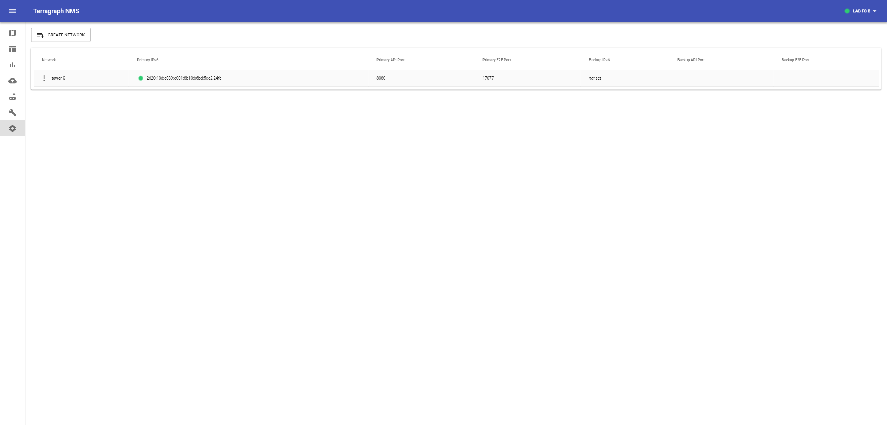
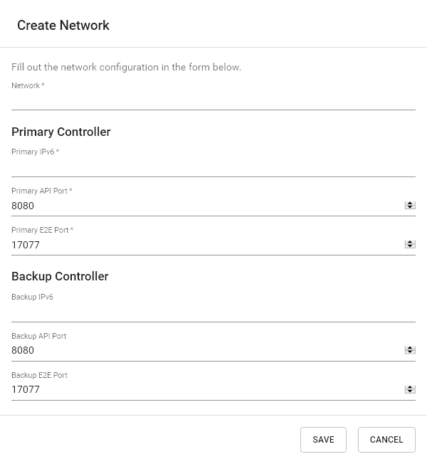
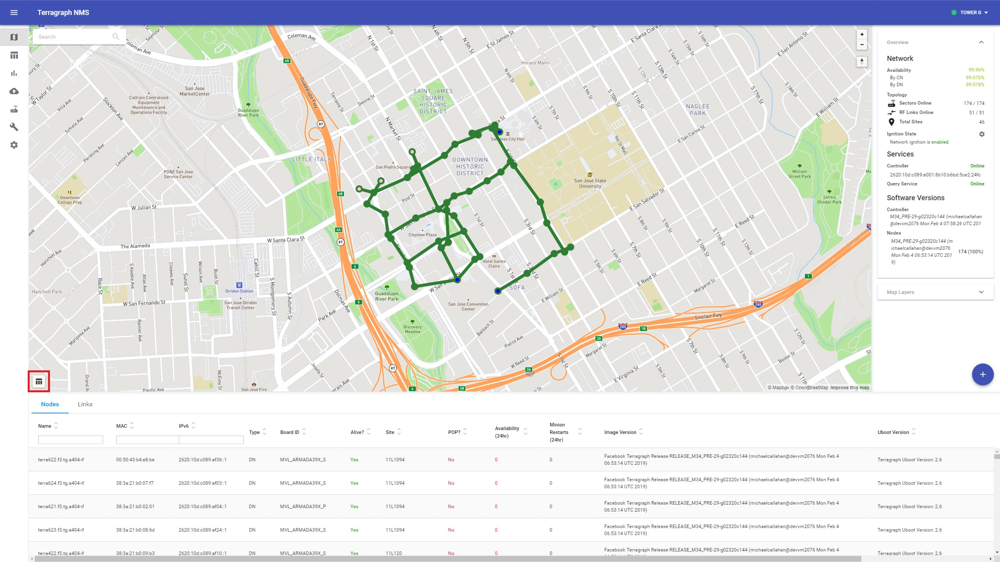
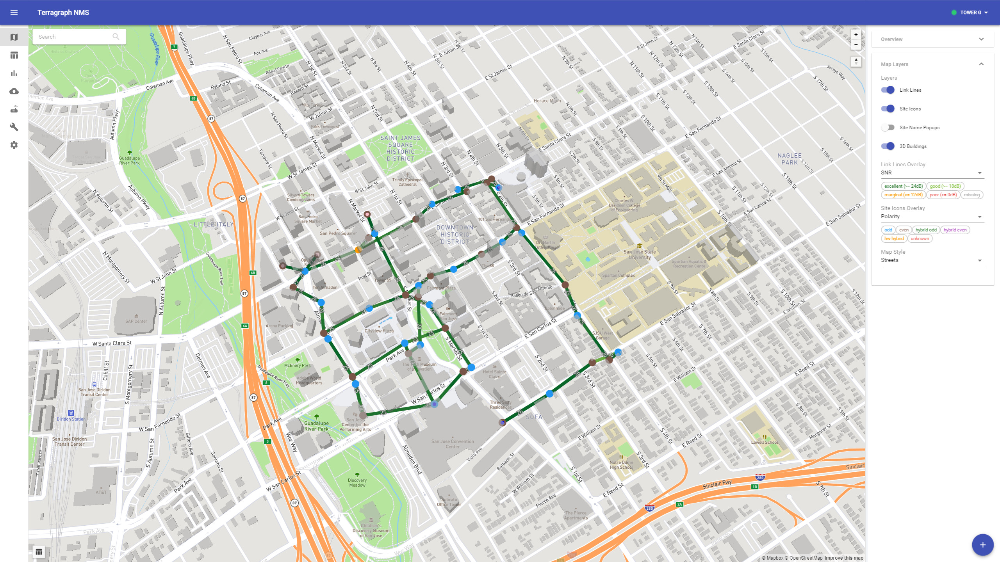
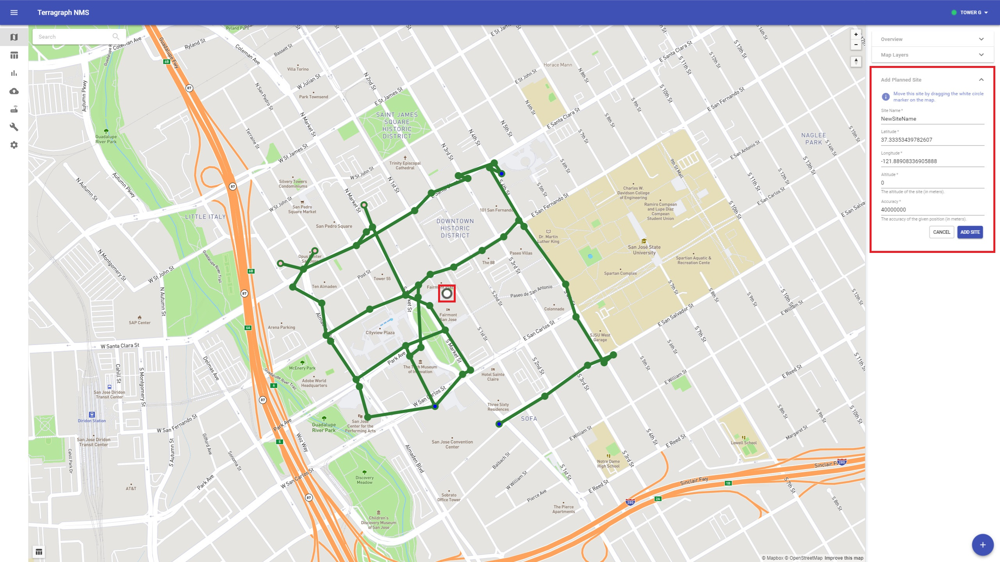
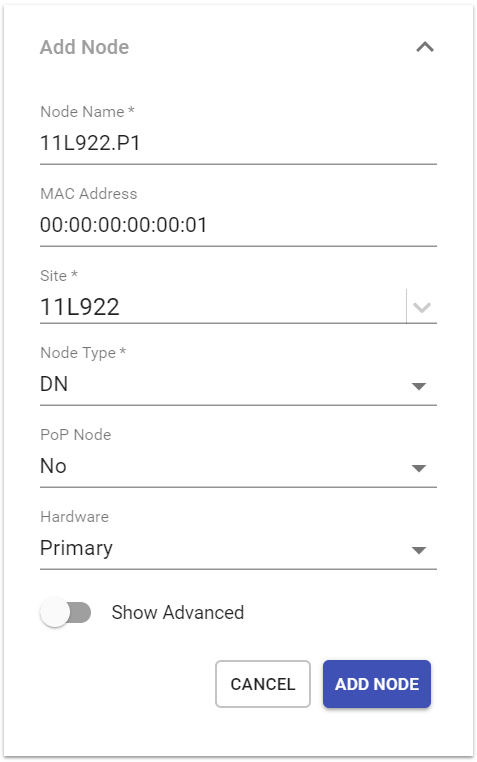
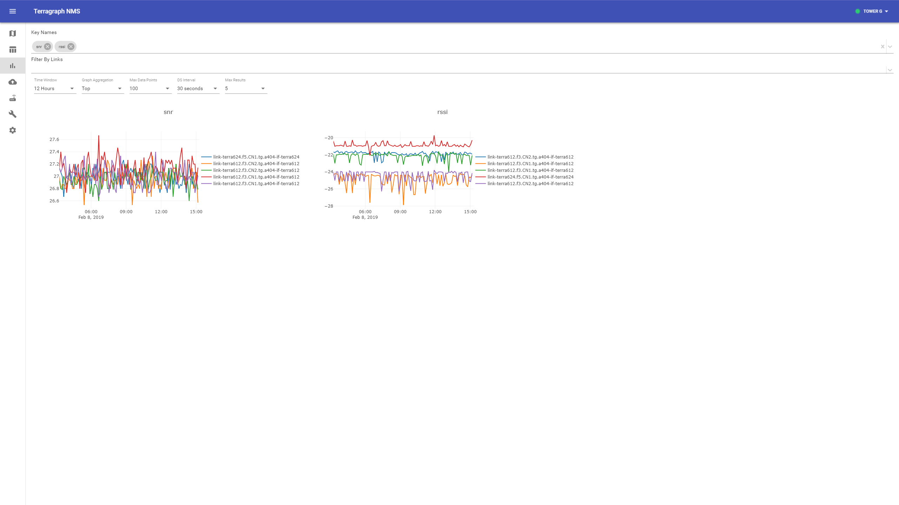
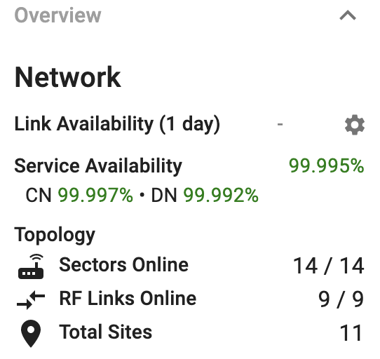

# Monitoring and Alerting
This document describes Terragraph's management software for network monitoring
and alerting.

<a id="monitoring-nms"></a>

## Network Management System (NMS)
The Terragraph NMS is designed to help operators and developers manage their
network. Nearly all operations in the NMS are commands sent directly to an E2E
controller. The NMS can connect to multiple E2E controllers, serving as a
central platform for managing several Terragraph networks.

### UI Overview
#### NMS Configuration
The NMS must be configured to communicate with one or more E2E controllers via
their respective [API service](#monitoring-api) processes. These "networks" can
be added and managed on the **NMS Config** page.

<p align="center">
  
</p>

To add a new network, click **Create Network** at the top of the page. Give a
name for the network, and enter the IP address of the controller and the ports
for the E2E controller and API service processes (if not using the defaults).

<p align="center">
  
</p>

#### Map View
The map view shows the state of the E2E controller and Query Service, and the
status of the network according to E2E controller.

<p align="center">
  
</p>

To view details about a specific sector, link, or site, select it on the map.

<p align="center">
  
</p>

Additional sector and link details can be found in the table view. These tables
can be overlaid on the map by clicking on the table icon on the bottom-left.

<p align="center">
  
</p>

##### Map Layers
Many map features can be adjusted in the "Map Layers" panel:
* **Layers** - Show or hide layers of the map, such as site name labels and 3D
  buildings.
* **Link Lines Overlay** - Use lines to show link health, configuration
  (i.e. Golay index), or metrics (e.g. SNR, MCS, link utilization).
* **Site Icons Overlay** - Use site icons to show sector health or configuration
  (i.e. polarity).
* **Map Style** - Change the map tiles (e.g. street view, satellite view, dark
  mode).

By default, the "Health" view of the network is shown on the map. The meaning of
the site and link colors is as follows:

* Site Health
    * **Green** - All sectors/radios defined for the site are reporting to E2E
      controller.
    * **Red** - No sectors/radios are reporting, but there is at least one
      defined.
    * **Orange** - There are both online and offline sectors/radios present on
      the site.
    * **White** - No sectors/radios are defined.
* Link Health
    * **Green** - The link initiating sector has reported successful link
      ignition. This does not signify that the remote sector is reachable, as
      there could still be routing issues preventing the remote sector from
      communicating with the controller.
    * **Purple** - The E2E controller is attempting to bring this link online
      (i.e. currently an ignition candidate).
    * **Red** - The link is offline, and not a current ignition candidate.

Below is an example highlighting site polarities and SNR levels across each
link:

<p align="center">
  
</p>

<a id="monitoring-map-editing"></a>

##### Editing
New sites, sectors, and links can be added to the topology once the E2E
controller is online by clicking the "+" button on the bottom-right.

###### Add Site
1. Choose **Add Planned Site** from the menu.

2. Either drag the site into place or manually enter the coordinates. Click
   **Add Site** when finished.
<p align="center">
  
</p>

###### Add Node
1. Choose **Add Node** from the menu.

2. Enter all available information for the new sector/node. Some fields can be
   left blank.
<p align="center">
  
</p>

###### Add Link
1. Choose **Add Link** from the menu.

2. Select the node endpoints (in any order).
<p align="center">
  
</p>

#### Stats / Dashboard
The NMS back-end currently stores about 3 days worth of statistics at a 30
second resolution. In the future, support will be added for multiple resolution
intervals to allow showing long-term trending and higher-frequency debug data.

1. Select the **Stats** icon on the left-hand toolbar.

2. Enter the key name for the stat. Link key names include the destination MAC
   address, which would be tedious to look up for each link. Common key names
   are aliased with short names, such as "snr" and "mcs", which are translated
   on the back-end into the full key name on both sides of the link. For
   instance, "snr" translates to `tgf.<mac_addr>.phystatus.ssnrEst` for the A
   and Z endpoints of a link.
<p align="center">
  
</p>

3. Select one or more keys from the type-ahead.
<p align="center">
  
</p>

##### Aggregated Stats
###### Link Availability
The link availability metrics are based on the link keep-alive counts for every
defined wireless link. Each time a link misses too many heartbeats, it is marked
as offline. The one-day availability metric is computed from the last 24 hours
of keep-alive metrics on both sides of each link, and the overall network
availability is an average across all defined links. Note that when a new link
is added, its availability will be 0% and skew the average. In the future, more
flexibility will be added in this high-level metric.

###### Topology Stats
Basic statistics about the network topology are recorded within Query Service,
which requires configuring Query Service to point to the correct API service.
This is not yet configurable through the Docker installation.

##### Troubleshooting Missing Data
The sections below describe troubleshooting missing data in different storage
engines.

###### Kafka
Node statistics generally exhibit a few seconds of delay before they are
available in Prometheus/Grafana. If stats are missing, please follow the
troubleshooting steps below:

* Stats agent must be configured to push to Kafka via `brokerEndpointList`. See
  [Kafka Configuration](Deployment.md#deployment-kafka-configuration) for
  instructions on configuration.
* Prometheus, Prometheus Cache, and Query Service must be running.
```bash
$ docker service ps stats_prometheus stats_prometheus_cache stats_query_service
```
* Verify Kafka is receiving node stats by consuming the `stats` topic from any
  Docker Swarm node. If no stats are shown, verify the Kafka configuration
  is correct and the nodes are able to reach the Kafka endpoint.
```bash
$ docker exec -it \
  $(docker ps --filter='label=com.docker.swarm.service.name=kafka_kafka' --format='{{.ID}}') \
  /opt/kafka/bin/kafka-console-consumer.sh --bootstrap-server kafka:9092 --topic stats
```
* Check Query Service logs for errors.
```bash
$ docker service logs stats_query_service -f
```

###### NMS Aggregator
Node statistics are published to NMS Aggregator via a ZMQ socket from
stats agent running on each node. NMS Aggregator must be configured to publish
its metrics to a URL that can store the time-series data.

* Ensure the aggregator URL is set via `kvstoreParams.e2e-aggr-url` in the PoP
  node configuration. See [PoP Node Config](Quick_Start.md#pop-node-config-1)
  for instructions on configuration.
* Ensure NMS aggregator is configured to publish to an HTTP endpoint via
  `dataEndpoints.nms.host`.

#### Software Upgrades
See [Maintenance and Configuration](Maintenance.md#maintenance-upgrades) for
instructions on performing software upgrades on Terragraph nodes.

#### Configuration Management
See [Maintenance and Configuration](Maintenance.md#maintenance-config) for
instructions on viewing and editing node configuration and E2E configuration.

#### Troubleshooting
If either the E2E controller or Query Service is offline, follow these
troubleshooting steps:
* **E2E** - Check the configuration above and ensure that the Docker instance
  can access the E2E controller on port 17077 (the default E2E controller port
  for applications).
* **Stats** - Ensure that the **Query Service** is running. Check the NMS logs
  for any obvious errors.
```bash
$ docker logs terragraph_nms_1 -f
```

<a id="monitoring-api"></a>

## API Service
The API Service provides an abstraction layer over Terragraph's communication
protocols, and serves as the integration point for external software systems.
The service provides a REST API that enables most of the functionality within
the E2E controller and NMS aggregator. Requests are translated into the
asynchronous, Thrift-serialized ZeroMQ messages used within Terragraph;
responses are returned in plain JSON.

### Components
* **[Proxygen]** - HTTP server, created and open-sourced by Meta.
* **[apiDoc]** - API documentation generator from annotations in source code.

### Prerequisites
The API service requires connectivity to an E2E controller and NMS aggregator
for all functionality.

### Installation
The API service is included as part of the same E2E image that contains the
controller and aggregator.

### Documentation
The REST API documentation is statically hosted by the API service at the
`/docs/` endpoint. For example (assuming the API service is running on
172.17.0.1, port 8088):
```
http://172.17.0.1:8088/docs/
```

Within the E2E image, the directory containing the HTML documentation is `/etc/apidoc/`.

## SNMP
Each node runs a [Net-SNMP] (Simple Network Management Protocol) daemon
alongside the Terragraph SNMP agent which can be polled for statistics.
The SNMP agent registers `TERRAGRAPH-RADIO-MIB` to handle all requests
for the MIB (Management Information Base).

### Basic Configuration
SNMP is disabled by default via `envParams.SNMP_ENABLED`. Once enabled,
configuration must be specified for SNMP V2C (community) or V3 access.

An example base configuration without access rules is shown below:
```json
{
  "envParams": {
    "SNMP_ENABLED": "1"
  },
  "snmpConfig": {
    "contact": "Contact name",
    "location": "State, Country",
    ...
  }
}
```

### Access Configuration Examples
The `TERRAGRAPH-RADIO-MIB` must be configured in the SNMP client to decode the
data from the SNMP daemon. The MIB for Terragraph radio stats is located in
`src/terragraph-stats/src/mib`.

#### SNMP V2C (Community)
Configuration:
```json
"snmpV2C": {
  "nameOrDescription": {
    "community": "public"
  }
}
```

Client request:
```bash
snmpbulkwalk -v 2c -c public <HOST> TERRAGRAPH-RADIO-MIB::tgRadioInterfacesTable
```

#### SNMP V3 Authentication Without Privacy (Encryption)
Configuration:
```json
"snmpV3": {
  "nameOrDescription": {
    "authPassphrase": "MyPassword",
    "authType": "MD5",
    "username": "tg"
  }
}
```

Client request:
```bash
snmpbulkwalk -v 3 -l authNoPriv -a MD5 -u tg -A MyPassword <HOST> \
  TERRAGRAPH-RADIO-MIB::tgRadioInterfacesTable
```

#### SNMP V3 Authentication With Privacy (Encryption)
Configuration:
```json
"snmpV3": {
  "nameOrDescription": {
    "authPassphrase": "MyPassword",
    "authType": "MD5",
    "privProtocol": "DES",
    "privPassphrase": "MyPrivacyPassword",
    "username": "tg"
  }
}
```

Client request:
```bash
snmpbulkwalk -v 3 -l authPriv -a MD5 -u tg -A MyPassword -x DES \
  -X MyPrivacyPassword <HOST> TERRAGRAPH-RADIO-MIB::tgRadioInterfacesTable
```

## UDP Pinger
The `udp_pinger` is a service that runs in the Terragraph cloud suite. The
primary goal of this service is to periodically send UDP probes to all of the
nodes in each network managed by the NMS. Nodes run an `sv` process called
`udp_ping_server` that listens on port 31338 for the probes.

By default, the `udp_pinger` sends ten probes every ten seconds at a rate of
five probes per second. Any responses that do not come back within one second
are dropped and assumed to be lost. All of these parameters are configurable.

At the end of each ping interval, the service computes the following metrics
for each node and across the entire network. Each metric is published to
Prometheus to be displayed in Grafana or later read/consumed by another
service.

| Name                    | Description                                                                                      |
| ----------------------- | ------------------------------------------------------------------------------------------------ |
| `udp_pinger_loss_ratio` | The percentage of packets that were lost in the given ping interval                              |
| `udp_pinger_rtt_avg`    | The average round-trip time (RTT) for all the packets that successfully returned in the interval |
| `udp_pinger_rtt_max`    | The maximum RTT of all the packets that returned succesfully in the interval                     |
| `udp_pinger_rtt_p75`    | The P75 RTT of all the packets that returned successfully in the interval                        |
| `udp_pinger_rtt_p90`    | The P90 RTT for all the packets that returned successfully in the interval                       |

To view the overall network availability in the NMS UI overview panel, add the
`SERVICE_AVAILABILITY_ENABLED` [feature flag](Deployment.md#deployment-nms-setup-options)
to the NMS options.
<p align="center">
  
</p>

[Proxygen]: https://github.com/facebook/proxygen
[apiDoc]: http://apidocjs.com/
[Net-SNMP]: http://www.net-snmp.org/
