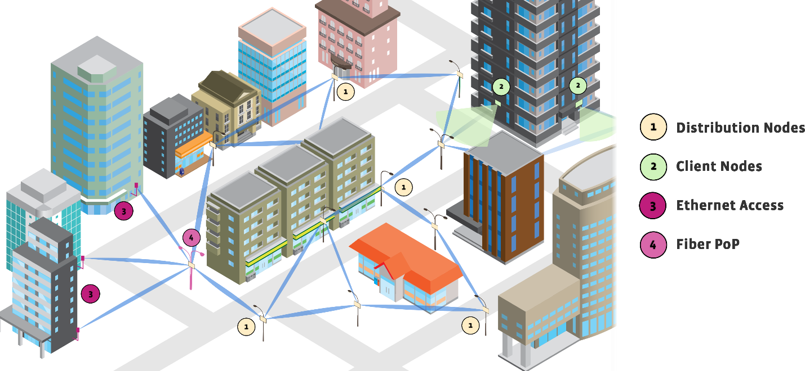
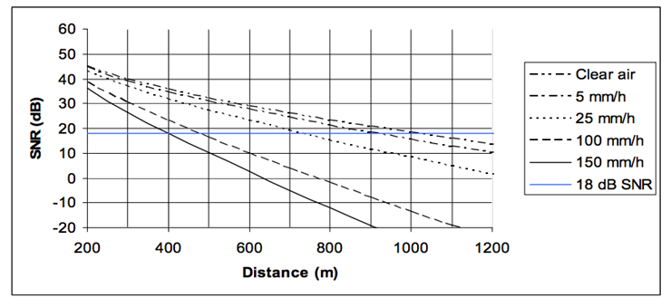
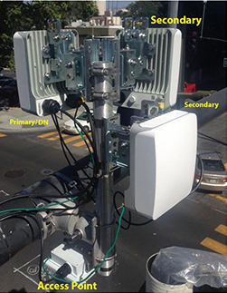

# Overview

## Introduction
Meta believes that people — no matter where they live — deserve a consistent,
high-bandwidth internet experience. In many markets, slow internet speeds are
prevalent given the complexities of expanding existing networks in a timely
manner. Meta has developed the Terragraph system to reduce the time taken to add
these capacity solutions.

Terragraph (TG) is a 60GHz, multi-node wireless Software Defined Network (SDN)
that enables high-speed internet connectivity in multiple environments. It
incorporates commercial, off-the-shelf components and industrial design for
quick and affordable deployments across many markets. The network operates best
in Line-Of-Sight (LOS) conditions to maximize connectivity. In its essence,
Terragraph is "wireless fiber" with gigabit speeds, rapid deployment capability,
and flexible use case support.

Terragraph is a *distribution* level network designed to augment and expand a
fiber optic network. That is, Terragraph is a high-speed backbone network to
which other networks are connected. When combined with fixed access connections
or Wi-Fi access points, Terragraph is a low-cost solution to achieve
street-level coverage with high speeds.

A Terragraph network is composed of individual nodes supported by network
services operating in the cloud. There are two types of nodes in a Terragraph
network – Distribution Nodes (DNs) and Client Nodes (CNs). DNs are the backbone
of the Terragraph network that distribute internet connectivity from one or more
fiber optic Points of Presence (PoPs) over multiple hops to CNs. DNs and CNs are
connection points for client networks, wireless access points, and other
customer premise equipment (CPE) to connect to the internet.

Each node in a Terragraph network is a Layer 3 (L3) router. Nodes route traffic
within and between the Terragraph network and attached access networks using
routing information provided by the [Open/R protocol]. The over-the-air link
protocol between Terragraph nodes uses a modified version of the Directed
Multi-Gigabit (DMG) physical layer (PHY) of the IEEE 802.11-2016 standard,
previously the 802.11ad-2012 amendment to the IEEE Standard 802.11-2012, and a
significantly slimmed down Media Access Control (MAC) layer. Each node uses a
multi-element, phased array antenna and advanced beamforming techniques to form
high-quality communication links between nodes at distances in excess of 250
meters, including primarily LOS paths, while also using reflection paths between
the nodes. The multiple propagation paths between nodes are called micro-routes,
and each micro-route is a potential communication link between nodes. Each node
selects the strongest communication link from the many possible propagation
paths between the nodes. The phased array antenna allows Terragraph to establish
links to mitigate co-channel interference that often prevails in dense urban
environments.

Two services in the cloud — the End-to-End Service (E2E) and the Network
Management Service (NMS) — configure, control, and monitor the Terragraph
network.

## Terragraph Applications and Use Cases
Common use cases for a Terragraph network are described below.

### Fixed Wireless Access
Terragraph can help supply Internet Service Provider (ISP) services to
residential homes, apartment buildings (i.e., multi-dwelling units, or MDUs), or
small/medium-size offices. This may also include distribution in an office
complex, a collection of school buildings, or generally, any area where fiber
connectivity has not been installed and a wireless Gbps solution would
cost-effectively supply high speed broadband to fixed users. The network design
involves a mesh of DNs that distribute broadband and terminate in CNs attached
to homes/buildings – connectivity is further distributed indoors through
existing wired or Wi-Fi systems.

### Wi-Fi Metropolitan Coverage
Smart cities and municipal Wi-Fi systems can provide high capacity Gbps coverage
using a city-wide Wi-Fi network interconnected with a Terragraph network. This
can be utilized for a variety of services, such as public safety, city, and
commercial services. Under this use case, the Wi-Fi access points are connected
to the DNs in the mesh of the city. The distance between Terragraph nodes is
roughly the same as the range of the signal coverage from the Wi-Fi nodes,
making this an ideal scenario.

  
   
  <em>A Terragraph deployment</em>

### Mobile Backhaul
Next-generation cellular networks require denser deployment and multi-gigabit
data rates to backhaul the radio sites. Terragraph-based solutions can help
mobile operators easily augment capacity in areas where fiber is not available
or viable.

## Important Terms
- **Node** - A general purpose compute unit that controls one or more sectors
  and runs on Linux.
- **Sector** - A wireless baseband card attached to a node.
- **Site** - A collection of one or more nodes installed at the same physical
  location.
- **Street Furniture** - Objects placed or fixed in the street for public use,
  such as light poles, utility poles, traffic signals, bus stops, billboards,
  and traffic signals.
- **DN (Distribution Node)** - A node that distributes the bandwidth from a
  fiber PoP to neighboring nodes in the Terragraph mesh network. These are the
  active elements that make up the network itself.
- **CN (Client Node)** - A node serving as the termination point where service
  delivery takes place. These are not a part of the mesh network for
  distribution, but provide connectivity to a fixed client such as an eNodeB,
  Wi-Fi Access point (AP), or a fixed connection to a home or office.
- **CPE (Customer Premise Equipment)** - Equipment connected to a Terragraph
  DN or CN for customer use, such as a Wi-Fi access point.
- **PoP (Point-of-Presence) Node** - A DN that serves as the demarcation
  between the Terragraph network and the provider's backbone network. The PoP
  node is part of the Terragraph network.
- **E2E (End-to-End) Controller** - The cloud service that configures and
  controls various aspects of the Terragraph network.
- **NMS (Network Management Service) Aggregator** - The cloud service that
  collects and aggregates statistics, events, and logs from nodes in the
  Terragraph network. *This component is deprecated in favor of Kafka and
  Fluentd.*
- **Mesh Network** - Terragraph employs a directed mesh network of DNs to
  deliver broadband services. A directed mesh network is designed to use
  multiple connections in several directions from each node thereby providing
  both high reliability and path redundancy.
- **Open/R** - The routing protocol developed for and used by Terragraph.
- **802.11ad** - The IEEE standard which supports high speed wireless
  communication in the 60GHz unlicensed band. Terragraph is based on the IEEE
  802.11ad specification, but portions of the standard have been modified to
  improve reliability and performance over longer link distances.
- **802.11ay** - An extension to the IEEE 802.11ad standard, intended to focus
  specifically on the Terragraph use case (i.e. outdoor, scheduled, and
  directed) that enables up to 40Gbps through channel bonding and MIMO.
- **Path Loss** - The reduction in power density (attenuation) of an
  electromagnetic wave as it propagates through the wireless channel. It is a
  combination of "free space" loss and channel impairments such as diffraction
  and reflection. As distance increases or an obtrusion enters into the link,
  path loss increases. This quantity is expressed in decibels and generally
  exceeds 100dB between the transmitter and receiver at the edge of coverage.
- **Azimuth** - The orientation at which a radio antenna is pointed. This is
  based on a compass angle between 0-360 degrees.
- **dBm** - The power ratio in decibels (dB) of the measured power referenced
  to one milliwatt (mW).
- **RSSI (Received Signal Strength Indicator)** - The power present in a
  received radio signal. The smaller the value, the lower the signal power
  received by the radio.
- **PER (Packet Error Rate)** - A ratio measuring received packets that
  contain at least one error.
- **SNR (Signal-to-Noise Ratio)** - The ratio of intended receive signal to
  the total noise and interference. The limit of connectivity is determined by
  the SNR that is achieved at the receiver, which drives connectivity and the
  speed of the connection.
- **MCS (Modulation and Coding Scheme)** - Based on a link's SNR and PER, link
  adaptation on the Terragraph radio will pick a corresponding MCS to ensure
  that the link remains stable in changing RF conditions. MCS refers to the
  notion of packaging less data in fewer number of bits and mathematically
  protecting it to increase the probability of successful decoding on the
  receiver end. Low MCS is directly proportional to lower throughput. A table
  showing the different MCS rates and corresponding data rates is shown below.
  Note that "N_CBPS" represents the number of code bits per symbol.

| MCS Index | Modulation        | N_CBPS | Repetition | Code rate | Data rate (Mbps) |
| --------- | ----------------- | ------ | ---------- | --------- | ---------------- |
| MCS-1     | &#120529;/2 BPSK  | 1      | 2          | 1/2       | 385              |
| MCS-2     | &#120529;/2 BPSK  | 1      | 1          | 1/2       | 770              |
| MCS-3     | &#120529;/2 BPSK  | 1      | 1          | 5/8       | 962.5            |
| MCS-4     | &#120529;/2 BPSK  | 1      | 1          | 3/4       | 1155             |
| MCS-5     | &#120529;/2 BPSK  | 1      | 1          | 13/16     | 1251.25          |
| MCS-6     | &#120529;/2 QPSK  | 2      | 1          | 1/2       | 1540             |
| MCS-7     | &#120529;/2 QPSK  | 2      | 1          | 5/8       | 1925             |
| MCS-8     | &#120529;/2 QPSK  | 2      | 1          | 3/4       | 2310             |
| MCS-9     | &#120529;/2 QPSK  | 2      | 1          | 13/16     | 2502.5           |
| MCS-10    | &#120529;/2 16QAM | 4      | 1          | 1/2       | 3080             |
| MCS-11    | &#120529;/2 16QAM | 4      | 1          | 5/8       | 3850             |
| MCS-12    | &#120529;/2 16QAM | 4      | 1          | 3/4       | 4620             |

*Table: Modulation code rate for Single Carrier PHY*

## Technical Overview
### RF / mmWave
Terragraph networks utilize the 60GHz (V-Band) spectrum. In many countries,
V-Band is unlicensed and allows for multiple GHz of RF bandwidth. The amount of
available spectrum for use by Terragraph varies depending on local wireless
regulations. Terragraph supports channels 1, 2, 3, and 4 in the 60GHz band. Each
channel, as per the 802.11ad specification, is 2.16GHz wide as shown below.

  
   
  <em>60GHz band allocation</em>

Oxygen is a magnetic dipole that absorbs energy at 60GHz and results in an
attenuation of 16dB/km. In addition, millimeter waves (mmWaves) do not penetrate
well through solid walls, and any obstructions in the link path can cause
significant signal attenuation. Foliage can increase a link's path loss from 5
to 20dB. The path loss due to foliage can be impacted by environmental variables
such as wind and precipitation. Rain also adds significant attenuation at 60GHz,
making it crucial to factor in the peak rain rate during link design.

  
   
  <em>Rain attenuation of a 60GHz system</em>

### Beamforming
Terragraph uses beamforming (BF) to address many of the challenges stated above.
BF is the process of using signal propagation information between two antennas
and modifying antenna characteristics to maximize the signal quality between
them. The BF process is accomplished in a few discrete states, including passive
acquisition, active signaling, and continuous refinement.

Terragraph radios use antennas that are electronically steerable in both the
horizontal (azimuth) and vertical (elevation) directions, where the exact beam
width and scan range supported depends on the specific OEM hardware variant and
software configuration. As an example, each of the four sectors on a Terragraph
Puma radio use 4 RF tiles with 32 elements on each tile, or 128 radiating
elements in total. The beam is steerable over a 90 degree range in azimuth and
approximately 15 degree range in elevation, with 28 dBi gain at boresight and
band center.

Terragraph uses beamforming to maximize the antenna gain between other
Terragraph radios. During each timeslot, the antenna beam can be steered in
another direction to communicate with other DN or CN radios within the coverage
area. Beamforming can also be used to find micro-routes, or other potential
paths to communicate with other DN or CN radios. Micro-routes can be formed
from objects which reflect RF signals in the mmWave band, such as the metal
siding of a building.

### Wireless Mesh
Terragraph is designed around a mesh topology to deliver connectivity up to 15
hops away from a PoP node. Network bandwidth is reduced at each hop, and the
total bandwidth available in the network is limited to a PoP node's network
egress. Terragraph can support multiple PoP nodes to increase the total
bandwidth capacity, and allows multiple points where traffic can ingress and
egress.

Having more sectors per node increases the reliability and potential bandwidth
of the mesh. To maximize network reliability, each Terragraph node should have
at least two sectors connecting to other DNs in the network.

The wireless mesh design in Terragraph allows for route diversity which provides
high network availability. If a link goes down (obstruction, interference, power
issue, etc.), the Open/R routing protocol will automatically find another route
through the network to the destination node. Open/R continuously pre-computes
alternate routes through the Terragraph network to ensure swift route
switchover.

### DMG PHY
Terragraph uses the IEEE 802.11 DMG PHY layer with a small modification – the
optional addition to select the Golay codes used in the PHY preamble. This helps
mitigate the potential interference from other DMG-based networks and
self-interference from other distant Terragraph nodes.

The Terragraph PHY assigns alternative Golay codes other than those specified in
the DMG PHY to provide a means for early rejection of interfering signals.
Assigning different codes to nodes that could interfere with each other
mitigates that interference. The E2E controller configures the Golay codes used
by each sector in the Terragraph network during network ignition.

The 802.11ad PHY layer specifies two types of modulation – OFDM and single
carrier. Terragraph uses the single carrier modulation scheme, which supports
physical data rates of up to 4.6Gbps in half duplex operation.

### Terragraph MAC
The Terragraph MAC is based on the PHY layer of IEEE 802.11ad, but is highly
modified to remove all functions relating to contention-based medium access,
beaconing, scheduled access, and management exchanges. For example, the 802.11
CSMA/CA collision mechanism has been replaced with TDMA-TDD. These changes allow
Terragraph to operate far more efficiently at higher network loads and allow for
longer links than 802.11ad-based networks.

Terragraph uses data, management, and control frames. It maximizes efficiency of
the MAC by aggregating the MAC Service Data Units (MSDUs) and the MAC Protocol
Data Units (MPDUs) as much as possible to reduce overhead and to eliminate
interframe spacing that results in dead air time. The MAC also utilizes delayed
block acknowledgements to minimize the number of frames exchanged between sender
and receiver, and does not require prior setup because the format, reordering
buffer size, and scheduling are fixed.

Operating as a TDD network, all Terragraph nodes are time synchronized. Each
sector is assigned specific time durations during which it can transmit and
receive during every TDD frame. During the transmit portion of the TDD frame, a
sector may transmit to one or more other sectors. Similarly, during the receive
portion of the TDD frame, the sector may receive from one or more other sectors.

Because Terragraph does not use the IEEE 802.11ad MAC layer, it is not
compatible with other 802.11ad hardware. If 802.11ad hardware is operating
nearby on the same frequency, it could cause interference to Terragraph radios.

### Terragraph Software

#### Cloud Software
The following is a comprehensive list of all the services that are part of the
Terragraph cloud suite. The Terragraph cloud suite is typically [deployed as
Docker services](Deployment.md#deployment-cloud-docker-swarm-installation) in a
[Docker Swarm].

  
   
  <em>Terragraph cloud services</em>

##### E2E Services
The E2E services provide the minimal functionality to bring up and run a
Terragraph network. These are shown in the table below.

| Name           | systemd/Docker Name | Description |
| -------------- | ------------------- | ----------- |
| API Service    | api_service         | [Proxygen] webserver exposing an HTTP interface to the **E2E Controller**. Requests are translated into asynchronous, Thrift-serialized [ZeroMQ] messages that are used within Terragraph. Responses are returned in plain JSON. API Service also statically hosts API documentation under the `/docs/` endpoint. |
| E2E Controller | e2e_controller      | Software application that communicates with and manages Terragraph nodes in the network. It primarily provides services that require network topology awareness, including the bring-up of wireless links (or "ignition"), software upgrades, and configuration management. |
| NMS Aggregator | nms_aggregator      | An aggregator that collects raw statistics from `stats_agent` daemons running on all Terragraph nodes. It computes counter values and sends to **Query Service** to store the data in a **Prometheus** back-end. This can be configured to send the computed values to other HTTP endpoints. |
| Stats Agent    | stats_agent         | Agent collecting various system stats off of the controller host. |

##### NMS Backend
The NMS backend encompasses all services concerned with data collection,
visualization, monitoring, and analysis of the Terragraph network. These
services require the E2E services to be running.

| Name             | Docker Name            | Description |
| ---------------- | ---------------------- | ----------- |
| [Nginx]          | proxy_nginx            | The webserver/proxy used to route all UI components via a single port. **NMS UI**, **Grafana**, **Prometheus**, **Keycloak**, **Kibana**, and **Jupyter** are exposed by default. In the Docker Swarm deployment, Nginx is also used as the single point of entry to access any service within the Swarm. |
| [Jupyter]        | msa_jupyter            | A front-end component to analyze and debug the network using statistics within **Prometheus**. Accessible via `/jupyter/` URL. |
| Topology Service | msa_topology_service   | Periodically saves topology changes in MySQL and produces statistics on the assets available in the network to **Prometheus**. |
| NMS UI           | nms_nms                | The front-end component, built using [NodeJS], [React], [Material-UI], [Mapbox GL], [Express], [Webpack], and many other open-source libraries. |
| [cAdvisor]       | nms_cadvisor           | Collects statistics from all Docker services. The processed statistics are collected via **Prometheus** and available within **Grafana**. |
| [Grafana]        | nms_grafana            | Displays statistics data from **Prometheus**. Allows dashboard creation outside of the NMS UI. Accessible via `/grafana/` URL. |
| [Prometheus]     | stats_prometheus       | Stores statistics data for use with **Grafana**. Accessible via `/prometheus/` URL. |
| Prometheus Cache | stats_prometheus_cache | Prometheus push gateway for the Query Service and UDP Ping Client. |
| Query Service    | stats_query_service    | Performs queries against MySQL and **Prometheus** databases and translates the data back to the UI. This is used for fetching and translating statistics data for the UI. The CPU intensive calculations are performed in this C++ service instead of the front-end NodeJS UI. |
| MySQL            | database_db            | MySQL database used by various services, such as **NMS UI**. |
| [Kafka]          | kafka_kafka            | Ingests stats, high-frequency stats, and events from the Terragraph network and relays them to the appropriate services. |
| [Zookeeper]      | kafka_zoo              | Part of the **Kafka** suite that manages the **Kafka** broker cluster. |
| [Elasticsearch]  | efk_elasticsearch      | Distributed log storage and search engine that is part of the **EFK** (Elasticsearch, Fluentd, Kibana) suite. |
| [Fluentd]        | efk_fluentd            | Part of the **EFK** suite that aggregates logs before sending them to **Elasticsearch**. |
| [Kibana]         | efk_kibana             | Part of the **EFK** suite that provides a UI to visualize aggregated logs. Accessible via `/kibana/` URL. |
| [Keycloak]       | keycloak_keycloak      | Identity and access management. Accessible via `/auth/` URL. |
| [Chihaya]        | chihaya_chihaya        | BitTorrent tracker. Terragraph typically uses BitTorrent during software upgrades to distribute images to Terragraph nodes. |
| UDP Pinger       | udp_pinger_udp_pinger  | Sends periodic UDP probes to all nodes in the network to calculate various network statistics such as packet loss and round-trip time. |
| Alarm Service    | alarms_alarms          | Consumes Terragraph network events from **Kafka** and generates alarms based on user-configured rules. |

#### Node Software

  
   
  <em>Terragraph node software (on Puma hardware)</em>

##### E2E Minion
The E2E minion is a client process that connects to the E2E controller. The
minion communicates with the firmware and driver and executes actions from the
controller, such as sending down firmware configuration or bringing up wireless
links to neighbors.

##### Stats Agent
The stats agent is a process on each node that periodically submits stats and
events to configured endpoints, such as a Kafka cluster or an NMS aggregator
instance.

##### Net-SNMP
The [Net-SNMP] daemon is a process on each node that responds to SNMP GET
requests from clients. It collects statistics about the system including
network interfaces, memory, disk, and CPU by default.

##### SNMP Agent
The SNMP agent is a process on each node that connects to the NET-SNMP daemon
acting as an "agent" process. It connects to the E2E driver-if socket to
translate radio statistics for the `TERRAGRAPH-RADIO-MIB`.

##### Logtail
Logtail is a process on each node that connects to the NMS aggregator. It can be
configured to constantly monitor specific log files and push their content as it
becomes available to the NMS aggregator. *This component is deprecated in favor
of Fluent Bit.*

##### Fluent Bit
Fluent Bit is a process on each node that connects to an instance of Fluentd. It
can be configured to constantly monitor specific log files and push their
content as it becomes available to Fluent Bit.

##### Open/R
Open/R is a distributed network application which provides routing and
configuration parameters to the Terragraph network nodes. Open/R generalizes the
concept of a replicated state database found in well-known link-state routing
protocols, such as Open Shortest Path First (OSPF) and Intermediate System to
Intermediate System (IS-IS). In particular, Open/R works similarly to OSPFv6 in
a single OSPF Area with some additional features. In Open/R, each node has an
identical view of the network and a consistent route to reach any other node. If
a node becomes unreachable (e.g., powered off or radio link failure), then
Open/R will select another route through the Terragraph network.

#### External Access
The diagram below illustrates methods to access Terragraph's APIs and data,
along with some related processes.

  
   
  <em>Terragraph software: external access</em>

### Terragraph Hardware
The following sections provide an overview of Terragraph hardware. *Some details
are only applicable to Meta hardware reference designs.*

#### Hardware Types
Terragraph hardware consists of two types of nodes, a DN and CN. Each node can
support up to 4Gbps of combined bidirectional throughput (with a maximum of
2Gbps in each direction). DNs and CNs are designed to support CPEs, such as
Wi-Fi access points.

The DNs form the core of the Terragraph backhaul network. Each DN can support
one or multiple sectors (depending on hardware specifications), and each sector
can form multiple wireless connections. A higher number of sectors per site
allows for greater mesh density, improving redundancy and performance. Each DN
also has a GPS chipset for propagating accurate timing in the network.

  
   
  <em>Rev5 Distribution Node (DN)</em>

The CNs enable client connectivity to the DN backhaul network. A CN can only
communicate with DNs, and is assigned to a single DN but may be reassigned when
necessary and possible. Multiple CNs connected to same DN are time multiplexed
through a dynamically scheduled frame structure. CNs are not GPS-enabled.

  
   
  <em>Rev5 Client Node (CN)</em>

#### Puma Hardware
Terragraph's NXP-based Puma hardware is comprised of a single network processing
unit (NPU) and one to four radio sectors. Each radio sector is comprised of a
QCA6438 baseband IC (BBIC) and 4 antenna modules. Each antenna module has one
QCA6422 60GHz radio frequency IC (RFIC) and multiple antenna tiles. The NPU
communicates with each BBIC over PCI, of which two are PCIe Gen3 and two are
PCIe Gen2.

Some key features of Puma are listed below:
* High-performance 4-core NXP LS1048 network processor SoC
* 4GB DDR4 main memory
* 4GB eMMC flash non-volatile memory
* 1x 10Gbps SFP+ port
* 1x 1Gbps Ethernet port with PoE IN
* 4x 1Gbps Ethernet port with PoE OUT
* IF interface between the BB and RF chips (on the RF module)
* GPS-synchronized timing

The baseband/RF modules reside inside an environmentally sealed enclosure to
protect them from the environment. The enclosure incorporates a radome antenna
assembly. While the radome is not directly part of the baseband/RF modules, it
is an integral part of the antenna's electrical system performance, and the
physical properties of the radome must be considered in the design of the
aperture for maximum performance.

  
   
  <em>Puma Node</em>

##### Puma Hardware Specifications
The hardware specifications for Puma nodes are given in the table below.

| Item                              | Value  |
| --------------------------------- | ------ |
| **Dimensions (with Cable Cover)** | 180 mm (W) x 180 mm (L) x 279.3 mm (H) |
| **Mounting Configurations**       | Pole or Wall |
| **Bracket Freedom of Movement**   | 360° Azimuth, 20° Elevation and Roll |
| **Operating Temperature Range**   | -40°C to +55°C |
| **Ingress Protection**            | IP55 |
| **Interfaces**                    | <ul><li>1 Gigabit Ethernet ports</li><li>10Gb SFP+</li></ul> |
| **Frequency**                     | <ul><li>**Operating Frequency:** 57GHz-66GHz</li><li>**Channels:** configured channel operation out of 4 available</li><li>**Channel Bandwidth:** 2.16GHz</li><li>**EIRP:** 43dBm Peak; 40dBm Average</li><li>**Modulation:** Binary Phase-Shift Keying (BPSK), Quadrature Phase-Shift Keying (QPSK), 16 Quadrature Amplitude Modulation (QAM)</li></ul> |
| **Power**                         | <ul> <li>**Input:** DC 44V-57V, max 4 Amps</li> <li>**Output - Power over Ethernet (PoE):** IEEE 802.3af (15 watts maximum with 48V or 54V power supply) or IEEE 802.3at (25.5 watts maximum with 54V power supply)</li><li>**Consumption (Without PoE):** 75 watts</li></ul> |
| **Certifications**                | <ul> <li>FCC certificate 2AK7S-FBC2001</li><li>UL Listed NWGQ E484144</li><li>Japan MIC certificate 208-200121</li></ul> |

Antenna specifications are listed separately in the table below.

| Item                             | Value                       | Description |
| -------------------------------- | --------------------------- | ----------- |
| **Frequency Bandwidth**          | 57.24 - 65.88 GHz           | WiGig channels 1, 2, 3, 4 |
| **Maximum EIRP**                 | 43dBm peak 40dBm average | Will be limited by firmware |
| **Number of Elements per Array** | 128                         | Assuming 4 tiles of 32 elements each |
| **Half Power Beam Width**        | Az = 20° El = 2.5°       | Typical boresight value at band center |
| **Azimuth Scan Angle Range**     | ±45°                        | Requires ±45° for full azimuthal coverage |
| **Grating Lobe Level**           | -4dB                        | |
| **Average Gain**                 | 28dBi                       | Typical boresight value at band center |
| **Aperture Polarization**        | Linear                      | Vertically polarized in typical installation |
| **Operating Temperature**        | -40°C to +55°C              | |

#### Rev5 Hardware
Terragraph's older Rev5 platform was based on the Marvell Armada 39x SoC and
utilized its hardware accelerator (Marvell A390x Network Subsystem, or NSS).
Each Rev5 node supported a single radio sector, and up to three "secondary"
nodes could be connected to a "primary" node over a USB/Marvell AC3 connection
for power and data transfer.

#### Communications
Terragraph sectors operate on the same radio frequency and transmit using an
adaptive TDMA-TDD frame structure. This requires precise time synchronization to
ensure that frames can be decoded in the proper time-slot. For this reason,
Terragraph DNs are GPS-synchronized.

Sectors on both ends of a wireless link alternate between transmitting and
receiving. This dramatically reduces interference, as nodes only receive very
weak interfering signals from at least three hops away. To achieve this, each
sector is assigned a "polarity" of odd, even, or "hybrid" (hybrid-odd or
hybrid-even). Hybrid polarity sectors operate only half the time, during odd
superframes or even superframes, respectively. This enables additional
flexibility in network design but cuts effective bandwidth in half.

  
   
  <em>Polarity: Sectors alternate between transmission and reception</em>

[Open/R protocol]: https://github.com/facebook/openr
[Docker Swarm]: https://docs.docker.com/engine/swarm/
[NodeJS]: https://nodejs.org/
[React]: https://reactjs.org/
[Material-UI]: https://material-ui.com/
[Mapbox GL]: https://www.mapbox.com/
[Nginx]: https://nginx.org/en/
[Jupyter]: https://jupyter.org/
[Prometheus]: https://prometheus.io/
[Grafana]: https://grafana.com/
[cAdvisor]: https://github.com/google/cadvisor
[Proxygen]: https://github.com/facebook/proxygen
[Express]: https://expressjs.com/
[Webpack]: https://webpack.js.org/
[Kafka]: https://kafka.apache.org/
[Zookeeper]: https://zookeeper.apache.org/
[Chihaya]: https://github.com/chihaya/chihaya
[Proxygen]: https://github.com/facebook/proxygen
[ZeroMQ]: http://zeromq.org/
[iPerf]: https://iperf.fr/
[Kibana]: https://www.elastic.co/products/kibana
[Fluentd]: https://www.fluentd.org/
[Elasticsearch]: https://www.elastic.co/products/elasticsearch
[Keycloak]: https://www.keycloak.org/
[Net-SNMP]: http://www.net-snmp.org/
