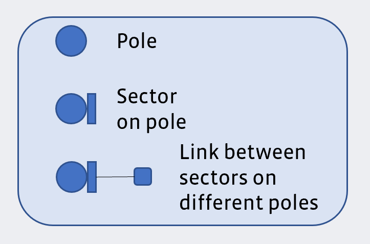
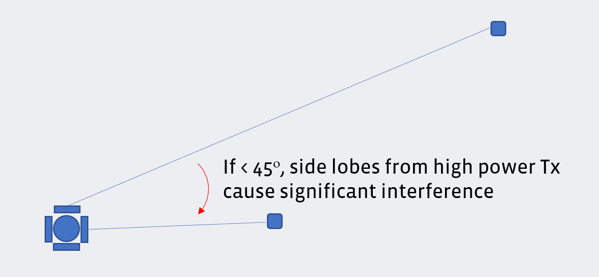
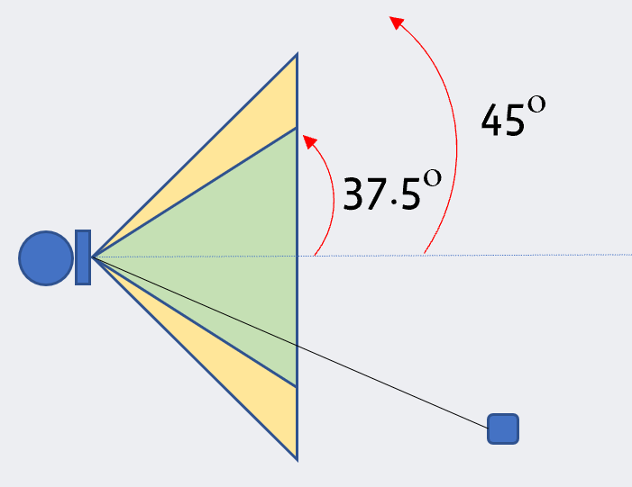
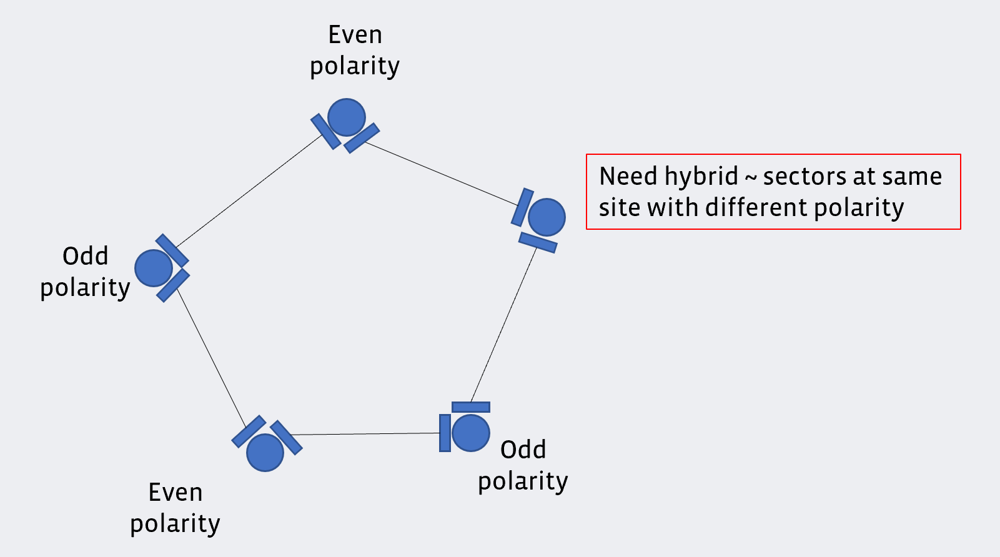

# Network Planning
This document provides guidelines and technical requirements for creating a
Terragraph network design, and is intended for network infrastructure engineers.
*Some details are only applicable to Meta hardware reference designs.*

## Terragraph Network Elements
Terragraph utilizes a hierarchy of different physical and logical elements to
create a network topology. These network elements consists of nodes, sectors,
sites, and links, and are described in further detail below.

#### Node
A node is a general purpose compute unit that controls one or more sectors.
Puma nodes support up to four sectors.

There are two different types of nodes:
* **DN** - Distributes bandwidth to neighboring Terragraph nodes. A DN is
  considered a fiber PoP when the SFP+ port is utilized to connect the
  Terragraph network into a provider's IP network.
* **CN** - Terminates IP connectivity to a customer (similar to a
  modem) and wirelessly connects to a DN.

#### Sector
A sector is a wireless baseband card attached to a node.
* On Puma, each DN sector supports a total of fifteen wireless connections,
  comprised of up to two other DN sectors and up to fifteen CN sectors.
* Each CN sector can only wirelessly connect to a single DN sector.

#### Site
A site is a logical element referring to the physical location at which one or
more nodes are installed. A site is considered a fiber PoP when the Primary-DN
at the site is interconnected to a provider's IP network.

#### Link
A link is the logical element that defines the relationship between two sectors
or nodes. There are two different types of links:
* **Wired** - Ethernet links used for Primary-DN to Secondary-DN connections,
  or occasionally wired cross-site connections.
* **Wireless** - RF links, used for DN to DN or DN to CN connections.

## IP Network Planning
Terragraph is a Layer 3, routed IPv6 network technology where Terragraph nodes
incorporate an RF radio and an IP router. This section focuses on the IP routing
aspect of Terragraph nodes. Terragraph uses Border Gateway Protocol (BGP) as the
exterior gateway protocol (EGP) and Open/R as the interior gateway protocol
(IGP).

The network prefix in Terragraph is usually a /56 allocation, which is further
divided into /64 prefixes to be assigned to individual nodes. The network prefix
bounds the maximum possible number of radios in the deployment. A /56 network,
for example, will yield 256 distinct /64 allocations.

Where possible, it is advisable to choose a network prefix space much larger
than the anticipated number of deployed nodes (e.g. to account for future
network expansion), and which yields at least twice as many allocations as the
number of nodes (e.g. to support network-wide address reassignment). Below are
some commonly used IPv6 network prefixes used in Terragraph.

| Prefix    | Max Number of Radios |
| --------- | -------------------- |
| /60       |           16         |
| /58       |           64         |
| /56       |          256         |
| /48       |        65536         |

Each Terragraph node is assigned an IPv6 /64 prefix as the loopback interface.
This loopback interface address is used by the E2E controller to address the
node. Prefix allocation to the nodes can be done randomly or centrally through
the E2E controller. The /64 address prefix also enables the node to address
downstream CPEs using Stateless Address Autoconfiguration (SLAAC) via router
advertisements or DHCPv6.

Terragraph is an IPv6-only network. To support IPv4 traffic, the use of Layer 2
Tunneling, NAT64, or DS-Lite is recommended.

While Terragraph is a wireless technology, there must be at least one wired
Terragraph PoP node that connects to an upstream IPv6-enabled network.
Terragraph PoP nodes peer with an upstream router using BGP. In the BGP
implementation, the PoP node advertises the Terragraph network prefix (or a
subset of the prefix) and expects to receive a default route from the upstream
router. Upon receiving this default route, the Terragraph PoP advertises the
default route in the Open/R protocol. This ensures that the rest of the nodes in
the network have an egress path to reach upstream networks.

Terragraph networking has two limitations:

1. The subnet size of the Terragraph PoP radio and the upstream router must be
/64, as variable length  subnetting is not supported on revision 5 hardware.
2. All Terragraph PoP nodes must be connected to the same Layer 2 broadcast
domain. This allows Terragraph PoP nodes to forward traffic to other Terragraph
PoP nodes via a wired connection when the routing path of the other PoP node is
closer to the traffic's destination. This concept is known as tromboning,
because the traffic enters a PoP node and then leaves toward another PoP node.

## Network Design Methodology
### Recommended Methodology
For large Terragraph deployments (greater than 1.0 sq. km), the network design
should be broken down into smaller, more manageable sections called "areas".
Using the area technique has the following benefits:
* Terragraph can be deployed faster since only a subset of the entire network
  needs to be designed and permitted before construction can commence.
* Lessons learned in both network design and installation from the first
  deployment area can be incorporated into the subsequent area deployment.

The recommended area breakdown is as follows:
* **Area 1** - Initial area with limited network scale. The goal is to gain
  familiarity with the design of Terragraph network, work through the
  permitting process, and optimize the deployment and installation of the
  network. Lessons learned in Area 1 can be utilized in the subsequent area
  designs.
* **Area 2** - Expansion area designed to test the lessons learned in Area 1.
* **Area 3** - Wide scale expansion of the Terragraph network.

### Network Design Overview
Below is a recommendation on how to design a Terragraph network. This is a
high-level overview, and subsequent sections provide more detail on how to
accomplish many of these steps.
1. Start by determining the target area for the Terragraph deployment based on
   the use case (e.g., Wi-Fi, fixed wireless).
2. Within the target area, identify potential locations for the fiber PoPs where
   Terragraph can interconnect to the provider's IP network.
    * It is recommended to start with more fiber PoPs than necessary, as this
      allows for network capacity to be easily added in the future and for
      certain fiber PoPs to fall out of the design without impacting the overall
      Terragraph network topology.
3. Identity sites which are one wireless hop away from the fiber PoPs.
    * It is essential to have multiple wireless point-to-point (1xDN to 1xDN)
      links branching off from the fiber PoP site into the mesh to maximize
      performance and reliability.
    * Search for nearby sites which are a maximum of 100 meters from the fiber
      PoP. It is important that the first hop sites can achieve the maximum RF
      modulation rate (MCS12/MCS16(EDMG)) to ensure capacity is not choked for
      the remaining hops.
    * The first hop site should ideally allow for three or four wireless links
      to the second hop sites to maximize reliability for the mesh topology.
      Each site should have a minimum of two wireless links to other sites in
      the mesh topology.
4. Identity sites which are two or more wireless hops away from the fiber PoPs.
    * Search for nearby sites which are a maximum of 200 meters from the first
      hop node. While Terragraph can support links up to 200 meters, the
      throughput of the link will decline after 100 meters.
    * Each site should have a minimum of two wireless links to other sites in
      the mesh topology.
5. Continue to expand outwards from the fiber PoP.
6. As sites expand from the fiber PoP, these distinct networks should eventually
   intersect, thus forming a mesh topology between the different fiber PoPs.

### Detailed Network Design Criteria
#### Fiber PoPs
The first element to analyze is where Terragraph can interconnect to a carrier's
existing fiber network. Any Primary-DN that is interconnected via fiber to a
carrier's network is known as a fiber PoP.

Terragraph has the following limitations:
* Terragraph can support nodes up to 15 wireless hops away from a fiber PoP.
* Each wireless Terragraph link can support up to 1.8Gbps of throughput.

The number of fiber PoPs needed in a Terragraph network is based on the
throughput and redundancy requirements of the network. It is recommended to
disperse fiber PoPs throughout the network to maximize performance and to allow
for geographical redundancy in case of a failure — that is, under a fiber PoP
failure, traffic should flow to an alternative fiber PoP.

The following points concern the wireless links at a fiber PoP site:
* Given that a single fiber PoP will likely have to support a large number of
  sites in the mesh (the average could range from 10-50), it is crucial that
  each fiber PoP maximizes the number of wireless links which communicate into
  the mesh.
* If a fiber PoP site only had a Primary-DN, thus utilizing a single wireless
  link to the first hop in the mesh, then the max throughput that the fiber
  PoP could pass would be limited to 1.8Gbps.
* If a fiber PoP site had a Primary-DN and two Secondary-DNs, thus utilizing
  three wireless links into the mesh, then the max throughput that the fiber
  PoP could pass would be up to 5.4Gbps (assuming no transit traffic through
  the node).
* It is important that the wireless links from the fiber PoP to the first hop
  in the mesh only consist of point-to-point (e.g., 1xDN to 1xDN) connections,
  and not a point-to-multipoint (P2MP) connection (e.g., 1xDN to 2xDN). All
  P2MP connections in Terragraph divide the available time slots in half,
  which halves the available throughput for each link.
* Terragraph cannot support a direct wireless link between PoP sites if they
  are already connected at the L2 layer via a wired switch.

The location of fiber PoPs should be determined as follows:
* If there is only a single PoP location, it is best to locate the PoP near
  the center of the Terragraph network topology. A centrally located PoP
  minimizes the hop count to all the nodes in the mesh which helps maximize
  performance.
* In a multi-PoP environment, there are certain locations which maximize the
  performance and redundancy of a PoP. Ideally, PoP nodes should be located at
  least one hop away from any edge of the topology to maximize the number of
  diverse routes through the network.  This also means that PoPs should be
  avoided at the corners of the network since there are only a limited number
  of routes from the corners to the rest of the network. These guidelines will
  vary depending on the actual fiber availability in the deployment. The
  figure below shows an ideal mesh topology and the corresponding ratings for
  the different PoP deployment locations.

  
   
  <em>Ideal PoP deployment locations</em>

#### Terragraph Sites
Terragraph is a line-of-sight (LOS) wireless technology, which means that the
path from one sector to another should be clear of obstructions. If LOS does not
exist between two potential sites, then alternate sites need to be found.

To maintain a high level of reliability, it is recommended that each site have
at least two links to other DNs in the topology. To maximize reliability, the
average number of wireless links per site (i.e., total number of wireless links
divided by the total number of sites) should be at least 3.0, but achieving this
may be logistically difficult and cost prohibitive.

### Network Design Tools
There are a variety of RF and microwave planning tools that can be used to
design a Terragraph network. Meta has utilized [Google Earth] to create visual
representations of the network topology, as it allows for a network to be
quickly designed while offering access to satellite and street imagery.
Depending on the location, Google Earth provides high-resolution imagery which
should help identify any LOS issues missed in the site survey phase. In
addition, Google Earth can be used for the following tasks:
* Identifying potential site locations, through the Street View and 3D
  building modeling features, before a more comprehensive survey is completed.
* Measuring link distance between nodes.
* Creating a graphical view of the Terragraph topology.

For additional information on Google Earth for network planning, refer to
[Appendix A](Appendix.md#appendix-a).

In upcoming releases, Terragraph will allow importing a CSV-format topology
containing a list of sites, sectors, and links. The CSV structure has not yet
been finalized.

## Site/Pole Selection Survey
The first step in creating a Terragraph network design is identifying all
potential locations where Terragraph nodes can be mounted. Depending on the
deployment location, this could include street furniture, buildings, and
existing towers. Once the potential deployment locations have been identified,
it is crucial to perform a site survey at these locations to determine if they
are suitable for Terragraph.

### Site Survey Basics
All potential Terragraph sites need to be physically site surveyed to provide
the proper data during the initial network design. The site survey should
evaluate all the following criteria:
* A clear LOS to other potential sites/poles. Terragraph must also have at
  least partial LOS to the sky to receive a GPS time fix for time
  synchronization.
* The structural capability of the site, given that a fully loaded Terragraph
  site with four nodes and power supply weighs over 14kg. It is essential that
  the site is structurally sound to support the weight, wind loading, and
  long-term maintenance of the Terragraph equipment.
* Continuous electrical power is available to the site/pole. Terragraph does not
  support holdover time, so even a momentary power outage or brownout will cause
  the node to reboot. Additionally, the field team should verify that breakers
  and conductors are sized appropriately for the expected total current draw at
  the site (please refer to the hardware specifications). Appropriate
  remediation should be put in place if the electrical work does not satisfy the
  total load at the site.
* Site security and the likelihood of theft of the Terragraph equipment. If
  theft can be an issue, it is important to identify if there is a way to
  secure Terragraph equipment using the built-in security loop on the back of
  the nodes.

Note that the LOS survey should be completed first, followed by a mechanical
survey and electrical circuit tracing.

### LOS Survey
The LOS survey is one of the most important aspects during the site survey
process. Even if there is a seemingly perfect location for a Terragraph node,
the site can not be utilized unless there is LOS to other nearby sites.

There are two types of LOS surveys:
* **Ground LOS** - Involves performing a LOS survey at the ground level from
  site A to site B and vice versa to establish LOS between two sites.
* **Elevated LOS** - Involves performing an elevated LOS at the device level
  (may require a ladder, bucket truck, or drone) from site A to site B and
  vice versa to establish LOS. This is required when a survey at ground level
  is not sufficient to determine LOS.

The important aspects to consider during LOS surveys are as follows:
* LOS can change over time.
    * Trees grow leaves during spring/summer and they also grow over time. If a
      LOS survey is done in the winter, it is important to anticipate the
      changes to vegetation.
    * If land is developed, buildings can rise and block a previously clear
      path. It is best to avoid wireless links over private land/property that
      is subject to frequent changes.
* LOS from each site should be evaluated to all potential sites within a 250
  meter radius.
    * Identifying all LOS possibilities makes it easier to plan the ideal
      network during the initial network design. Additionally, if it is
      discovered that a site is not feasible during the permitting process,
      having all the LOS survey data will make it easier to find an alternate
      suitable replacement.
    * Terragraph can support link distances beyond 200 meters, but the
      modulation rate could be impacted during inclement weather. Expanding the
      LOS to 250 meters provides additional options if there are few potential
      sites nearby.
* Check whether the site has LOS to the sky.
    * Terragraph has a GPS receiver integrated on top of the radio to allow for
      network timing synchronization. It is best if Terragraph nodes have at
      least partial LOS to the sky. If there are tall buildings surrounding the
      site, this could pose an issue for the GPS receiver.

### Survey Documentation Guidelines
During a site survey, the field engineer should capture sufficient information
to allow for an initial network design which will likely be completed by another
engineer at a later date. Additionally, it is important to capture information
required for permitting, as permits and leases (or equivalent) will likely be
necessary for most deployments given that Terragraph infrastructure is deployed
across public assets and private right of ways.

It is recommended to use a high resolution camera with optical zoom capability
to capture site images and details during the site survey process.

At minimum, the field engineer should do the following:
* Capture site location and access information such as address, site
  identifier, GPS coordinates, directions to access the site, and potential
  access issues, and also take photos of the site to help someone locate it in
  the future.
* Capture information about the existing physical assets deployed/connected,
  such as whether there is any existing telecom equipment, generators, utility
  meters, etc. If the site is a pole, determine the lamp head type, and if
  there are electrical lines running to the pole, determine whether wireless
  access points or traffic cameras are deployed, etc. Take photos of this
  equipment to help assist with structural analysis, permit packages, and site
  safety.
* Gather information of the structural characteristics of the site, such as
  the type of structure (e.g. roof, pole, tower), type of materials (e.g.
  steel, concrete, wood), and size/height of the site. Additionally, any
  structural damage should be documented as this could impact mechanical
  stability. If possible, capture photos of potential areas where Terragraph
  could be mounted.
* Gather information for the LOS portion of the survey discussed above.
    * Document nearby sites (use GPS coordinates or site identifier) which meet
      LOS requirements, and capture pictures showing LOS to these sites. If
      possible, ascertain the best mounting location for Terragraph radios to
      maximize LOS.
    * Capture 360-degree photographs of the site, as design engineers can use
      the 360-degree view to gain a better understanding of the LOS to other
      available surrounding sites. The vantage point for these pictures should
      be where a Terragraph node could be potentially mounted when facing other
      potential Terragraph nodes.

## RF Deployment Guidelines
This section describes important guidelines that should be followed during the
design of a Terragraph network. While it is unlikely that all deployment
guidelines can be followed in a large deployment, these guidelines will maximize
the performance and reliability of a Terragraph network.

### DN Placement Considerations
* Each DN shall be within **15 wireless hops** from the nearest fiber PoP
  location. This requirement is solely to minimize latency for user plane
  traffic.
* The preferred distance between any two DNs connecting over a wireless link
  is approximately **25-150 meters** to achieve MCS12 and a throughput of
  1.6Gbps. However, Terragraph will work reliably up to 250 meters, and should
  be able to achieve MCS9 and a throughput of 1.0Gbps. Terragraph supports
  links up to 300 meters long, but throughput and reliability degrades at
  lengths longer than 250 meters due to the propagation characteristics of the
  60GHz band. The minimum link distance is 25 meters, which is based on the
  power control algorithm running on the nodes. Nodes placed within 25 meters
  of each other will not be able to reduce their transmit power commensurate
  to the link budget requirement. Although links will operate in such
  conditions, interference to other nodes may be a concern depending on the
  environment.
* DN sectors support P2MP communication, and each sector supports a horizontal
  scan range of 75°. P2MP mode divides the bandwidth of the wireless link, so it
  is not recommended for links requiring high capacity such as the first hop
  from the fiber PoP. A single DN sector can support wireless P2MP communication
  with up to 15 other sectors on Puma. Any nodes placed within the distance and
  azimuth constraints of a DN are candidate nodes to form wireless links.
* Each DN must have a clear line-of-sight to the DNs/CNs on the other side of
  the link. There are no exceptions to the rule given the propagation
  characteristics of the 60GHz band.
* It is important to mount Terragraph nodes on a stable structure to minimize
  the effects of Terragraph nodes swaying under windy conditions.

### CN Placement Considerations
* No CN shall connect to a fiber PoP site. This guideline intends to avoid
  creating a P2MP link on the DN at the fiber PoP, which would lead to a
  capacity bottleneck.
* Each CN should have a clear line-of-sight to a DN and be placed within 75°
  azimuth and 25-250 meters of a DN.
* It is important to mount a CN where there is access to both power and
  Ethernet connectivity into a customer's home or business.

### Legend for Diagrams

  

### Mounting Accuracy
* Achieve alignment accuracy of less than 3° in azimuth. Although the antennae
  have a 75° scan, once the scan is complete, the antennae have a 3°
  horizontal beam width.
* Achieve alignment accuracy of less than 0.5° to 1° in elevation. Over a 100
  meter link, a 0.5° alignment error corresponds to a discrepancy of ±0.4
  meters in the height of the remote node.

### Tight Angles
When installing multiple sectors at the same site the angle between links from
the different sector nodes should adhere to the following guidelines:
* For applicable hardware designs, the angle between two nodes (i.e., the angle
  between the links supported by any two nodes) should be greater than 25°.

  

* The angle between the intended link for a sector and the LOS path to any other
  sector which is connected to an adjacent sector on the same pole should be
  greater than 15°.

  

### Near-Far Ratio
When the links formed by adjacent sectors on the same pole must differ
significantly in distance, the following guidelines help to maximize
performance:
* The longer link should not exceed 3 times the distance of the shorter link
  when the angle between the two radios is less than 45°.

A near-far link uses more power to overcome interference from the high power
required for the long link. This creates more interference and raises the
interference profile of the whole network.

  

### Link Distances
Terragraph supports the following maximum distances for target MCS levels:
* In general, MCS 12 is ideal and MCS 9 is acceptable. The values below are
   dependent on following all other deployment guidelines:
    * 150 meters: MCS 12
    * 250 meters: MCS 9
    * Minimum recommended distance: 25 meters (or 35 meters to avoid signal
      distortion due to saturation of the receiver)

Maximum beamsteering angle:
* Keep the links from a Terragraph sector within ±37.5° of the center, as the
  antenna is optimized for this angle.
   * A *grating lobe* is an unnecessary side-lobe that is typically as strong
     as the main lobe. For the Terragraph HS (Huber Suhner Antenna) DN, a scan
     at an angle > 37.5° creates a grating lobe at an angle around -37.5°. This
     results in weaker main lobes and higher interference.

  

* More specifically, keep the links from a Terragraph sector within ±25° of the
  center *in elevation*.
* In P2MP deployments, ensure that the longest link is aligned to the center
  of the DN. Additionally, ensure the shorter links adhere to the beamsteering
  angle requirements specified above. This is because the longest link has the
  highest path loss, and the maximum (beamformed) antenna gain is achieved
  when the sectors' azimuth is 0°.

  

### Node Height
* Mount nodes as high as possible.
* It is important to try to mount Terragraph radios over 5 meters above the
  ground elevation. This minimizes ground bounce and avoids channel
  fluctuations, especially for links over long distances.

## Special Topology Guidelines
This section describes additional guidelines for special topology cases.

### Straight Line Interference
* Unless adjacent links can operate on separate channels, nodes should not be
  placed in a straight line, especially for links that are close together. This
  would cause the desired link and interference link angles to be the same,
  preventing beamforming interference suppression. Note that this is usually not
  a significant issue because of the large distance to the interference point.

  

### Butterfly (Two DNs in P2MP Configuration)
* Avoid tight angles (<15°) in a butterfly topology (i.e., two DNs in P2MP
  configuration).

The same Golay code is used for all links in the butterfly P2MP topology. Early
weak interference is an interference that is weak enough to not create any
Signal to Interference-plus-Noise Ratio (SINR) degradation, but still creates a
blocking effect on the desired packet by locking the receiver before the arrival
of the packet. Early-weak interference can be predominant, especially with tight
angles. DN→DN and DN→CN should have a minimum of 15°.

  

### Y-Street (One DN in P2MP Configuration)
* A DN with two peer DNs should be avoided in links that require high wireless
   capacity. The first few hops away from a PoP node should avoid the Y-street
   configuration.

  

### Hybrid Polarity (Odd Number of Sites)
In a network topology with an odd number of sites in a loop, sectors at one of
the sites must operate in a hybrid mode. Hybrid mode indicates that sectors at
the same site operate with different polarities. Links that need high wireless
capacity, such as the first few hops away from a PoP node, should avoid using
the hybrid polarity feature.

To maximize performance:
* All sectors on a pole should be the same polarity; one never receives while
  the other transmits.
* All loops should have an even number of Terragraph links. This ensures the
  same polarity per site.

When an odd loop exists and a hybrid sector must be used, a site can be either a
*hardware* hybrid or *software* hybrid depending on the following conditions:
* If the sectors have an angular separation > 90° (for hardware designs which
  support this), hardware hybrids can be used. Each sector on the site is
  assigned a normal even or odd polarity.
* If the sectors have an angular separation < 90°, then there is a chance of
  self-interference and a software hybrid sector may be needed ("hybrid-even" or
  "hybrid-odd"). This will reduce the available throughput by half.

  

[Google Earth]: https://www.google.com/earth/desktop/
