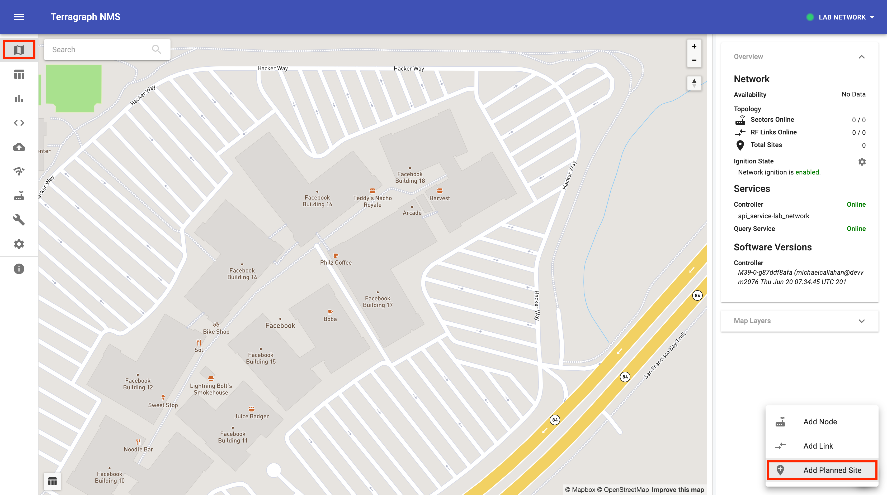
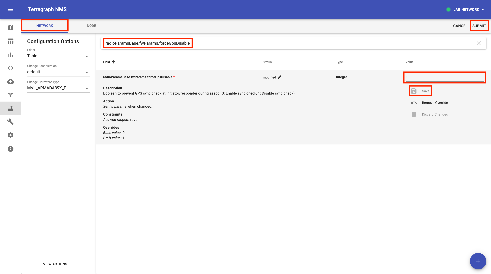

# Quick Start

<a id="quick-start-goals"></a>

## Goals
This quick start guide will walk through a minimal Terragraph network setup
using Meta hardware and software, which includes:

1. Installing Terragraph cloud services via Docker Swarm.
2. Configuring routes between the PoP node and external network using BGP.
3. Bringing up a single Terragraph link using the Terragraph NMS.

This guide will not cover physical installation (e.g. how to mount nodes).

<a id="quick-start-installation"></a>

## Installation

### Prerequisites
* Two Puma nodes.
* A signed SSH key for logging into the PoP node.
* An IPv6-compatible router which can be configured for routing traffic to and
  from the Terragraph network prefix. The router should support BGP, but static
  routing is also possible.
* Any QR code scanner.

### Cloud Services
Terragraph's cloud suite is managed using Docker Swarm and is composed of the
E2E services and the NMS backend. For a list and short description of all
Terragraph cloud services, see [Cloud Software](Overview.md#cloud-software).

Install the Terragraph cloud suite by following the instructions in the
[Cloud Services](Deployment.md#deployment-cloud) section.

### Nodes
This section describes how to construct and configure a single-link Terragraph
network using the Terragraph NMS. Open a web browser and navigate to the IP
address of any of the Docker Swarm hosts to load the NMS.

The Terragraph network topology described here will contain two sites with one
node each, and a single 60GHz link connecting them. The first node will be a PoP
node, and the second will be a CN. See
[Important Terms](Overview.md#overview-terms) for a more detailed description of
these terms.

After completing this section, the final topology should resemble the topology
shown below.
<p align="center">
  
</p>

#### Create the Network Topology
This section describes how to create topology elements using the NMS.

##### Add Sites
1. Select "Add Planned Site" from the menu in the bottom-right corner of the
   "Map" view.
<p align="center">
  
</p>
2. Move the circle marker to the desired location on the map. Then, fill in the
   "Site Name" field in the form ("Site1"). Click "Add Site" when finished.
<p align="center">
  
</p>

##### Add Nodes
1. Scan the QR code on the back of each Puma node to obtain their MAC addresses.
   See [Node Information](Deployment.md#node-information) for details.
2. Select "Add Node" from the menu in the bottom-right corner of the "Map" view.
3. Fill in the form fields for the PoP node ("PopNode") as shown below, using
   the MAC address found in the QR code. Click "Add Node" when finished.
<p align="center">
  
</p>
4. Add the CN ("ClientNode") to "Site2" using the same procedure as above.
<p align="center">
  
</p>

##### Add Link
1. Select "Add Link" from the menu in the bottom-right corner of the "Map" view.
2. Select the two nodes and "Wireless" link type in the form. Click "Add Link"
   when finished.
<p align="center">
  
</p>

#### Configure the Network
This section describes how to configure the network using the NMS.

##### Network-Wide Config
1. Select the "Node Config" view from the left-hand column, and make sure the
   "Network" tab is selected on the top bar.
2. Set the value of `sysParams.managedConfig` to `true`, then click "Save". This
   enables active management of nodes' configuration by the E2E controller.
<p align="center">
  
</p>
3. If the network is deployed indoors, set the value of
   `radioParamsBase.fwParams.forceGpsDisable` to `1`, then click "Save". This
   disables GPS-related checks during link ignition.
<p align="center">
  
</p>
4. Click "Submit" in the top-right corner, then click "Submit" again in the
   confirmation screen to finalize the changes.

##### PoP Node Config
This section briefly describes relevant PoP node configurations and how to set
them. A route from the PoP node to the external network must either be
statically configured or learned from BGP.

* **bgpParams**: Terragraph can be configured to use BGP routing to advertise which
  nodes are available on the routed network.
* **kvstoreParams**: Used to specify important Open/R `KvStore` configuration values
  that are needed before Terragraph nodes can reach the E2E controller.
* **popParams**: Used to specify link-local information for how the PoP node should
  communicate with the upstream router(s). BGP and static routing are mutually
  exclusive.

| Field Name                          | Description                                                        |
| ------------------------------------| ------------------------------------------------------------------ |
| `bgpParams.cpePrefixesAutoAdvertisement` | Enables auto-advertisement of CPE prefixes via BGP |
| `bgpParams.localAsn`                | The autonomous system number (ASN) assigned to the Terragraph PoP nodes |
| `bgpParams.neighbors`               | The list of upstream routers, in the form of an ASN and IPv6 address, that Terragraph PoP nodes can use to route egress traffic |
| `bgpParams.specificNetworkPrefixes` | Specific allocated network prefixes to be advertised via BGP (comma separated) |
| `kvstoreParams.e2e-aggr-url`        | The NMS aggregator URL in ZMQ socket endpoint format (*optional*) |
| `kvstoreParams.e2e-ctrl-url`        | The E2E controller URL in ZMQ socket endpoint format |
| `kvstoreParams.e2e-network-prefix`  | The Terragraph routed network range in CIDR format, followed by a comma and the bit-length of prefixes allocated to each node |
| `popParams.GW_ADDR`                 | IP address of the upstream router (only if using static routing) |
| `popParams.POP_ADDR`                | IPv6 address on the interface (`POP_IFACE`) that the PoP node uses to communicate with the upstream router |
| `popParams.POP_ADDR_PREFIX_LEN`     | IPv6 address prefix length on the interface (`POP_IFACE`) that the PoP node uses to communicate with the upstream router |
| `popParams.POP_BGP_ROUTING`         | Enable BGP routing on the PoP node |
| `popParams.POP_IFACE`               | The interface that the PoP node uses to communicate with the upstream router |
| `popParams.POP_STATIC_ROUTING`      | Enable static routing on the PoP node |
| `popParams.VPP_ADDR`                | The IP address of the interface within VPP on the POP node (Fast Path edge address), only when using DPDK/VPP on Puma hardware |

1. Select the "Node" tab on the top bar.
2. In the left-hand menu, change the "Editor" to "JSON" and select the PoP node
   ("PopNode") from the list.
3. Edit the values in the below JSON text accordingly (i.e. IPv6 addresses,
   ASNs), then paste it into the space on the right.
```json
{
  "bgpParams": {
    "localAsn": 65535,
    "neighbors": {
      "0": {
        "asn": 65530,
        "ipv6": "2001:a20:ff0:c505::1"
      }
    },
    "specificNetworkPrefixes": "2001:a20:c305:ff00::/56"
  },
  "kvstoreParams": {
    "e2e-ctrl-url": "tcp://[2001:a20:ff0:c504:20c:29ff:fe4f:945b]:7007",
    "e2e-network-prefix": "2001:a20:c305:ff00::/56,64"
  },
  "popParams": {
    "GW_ADDR": "2001:a20:ff0:c505::1",
    "POP_ADDR": "2001:a20:ff0:c505::2",
    "POP_ADDR_PREFIX_LEN": "64",
    "POP_BGP_ROUTING": "1",
    "POP_IFACE": "TenGigabitEthernet0",
    "POP_STATIC_ROUTING": "0",
    "VPP_ADDR": "2001:a20:ff0:c505::3"
  }
}
```
4. Click "Submit" in the top-right corner, then "Submit" again in the
   confirmation screen to finalize the changes.
<p align="center">
  
</p>

##### E2E Controller Config
1. Select the "E2E Config" view from the left-hand column, and make sure the
   "Controller" tab is selected on the top bar.
2. Set the value of `prefixAllocParams` fields according to the
   `kvstoreParams.e2e-network-prefix` PoP node config from above, then click
   "Save". See [Node Prefix Allocation](Routing.md#routing-node-prefix-alloc)
   for additional details. For example:
```json
{
  "prefixAllocParams": {
    "allocPrefixLen": 64,
    "seedPrefix": "2001:a20:c305:ff00::/56"
  }
}
```
3. Click "Submit" in the top-right corner, then click "Submit" again in the
   confirmation screen to finalize the changes.

#### Deploy the PoP Configuration
Follow the instructions in the
[First PoP Configuration](Deployment.md#deployment-first-pop-configuration)
section to manually provision the PoP node.

<a id="quick-start-next-steps"></a>

## Next Steps
The following sections describe common Terragraph operations beyond the basic
installation instructions detailed above.

### Configure Stats, Events, and Logs
Nodes can be configured to forward their stats/events to a Kafka broker and
stream their log files to a Fluentd server. Update the network-wide node config
and add the IP/hostname of any Docker Swarm host in the following sections:
* `statsAgentParams.endpointParams.kafkaParams.config.brokerEndpointList` (see
  [Kafka Configuration](Deployment.md#deployment-kafka-configuration) for
  details)
* `fluentdParams.endpoints` (see
  [Fluentd Configuration](Deployment.md#deployment-fluentd-configuration) for
  details)

Afterwards, stats will be viewable in Prometheus (relative URL `/prometheus/`)
as well as Grafana (relative URL `/grafana/`), and logs will be viewable in
Kibana (relative URL `/kibana/`).

### SSH Access
To authorize direct access to the nodes via SSH, follow the instructions below.
For more details on this process, see
[SSH Configuration](Deployment.md#deployment-ssh-configuration).

1. On a secure server, use `ssh-keygen` to generate a certificate authority (CA)
   key pair.
```bash
$ ssh-keygen -f ~/.ssh/tg-CA -t ed25519
```
2. Save the contents of the public key, `~/.ssh/tg-CA.pub`, in a new network
   config field called `sysParams.sshTrustedUserCAKeys.<key_name>` in the
   "Node Config" menu.
<p align="center">
  
</p>
3. Use the private key to sign each user's public key. In this example, the
   user's public key has been saved on the secure server as `/tmp/user.pub`.
   This will generate a certificate in `/tmp` called `user-cert.pub`.
4. Send `user-cert.pub` back to the user.
5. The user should save the certificate to the same directory as the private key
   file (`user`). Usually this is in `~/.ssh` on the user's machine.
6. Start `ssh-agent` and add the keys to the agent.
```bash
$ cd ~/.ssh
$ eval ssh-agent
$ ssh-add user
$ ssh -A root@<node_ipv6_address>
```

### Terragraph API Access
The Terragraph E2E controller and NMS aggregator API documentation can be found
on any of the Docker Swarm hosts.
```
https://<host>/api/<controller_name>/docs/
```

Use cURL to issue a command to the API service from the command line as such.
```bash
# e.g. "Get Topology"
$ curl -id '{}' https://<host>/api/<controller_name>/api/getTopology
```

### Using the TG CLI
`tg` is a Python-based command-line utility for interfacing with the Terragraph
software stack. Documentation for all commands is available via the `tg help`
command. From any node, simply run `tg help`. From any of the Docker Swarm
hosts, run `tg-<controller_name> help`.

### Log Viewing
This section describes how to view logs generated by the nodes and Terragraph
cloud services.

#### Node Logs
See [Logs](Troubleshooting.md#troubleshooting-logs).

#### Cloud Service Logs
To view a list of all Terragraph services, run the following command from any of
the Docker Swarm hosts.
```bash
$ docker service ls
```

To view the logs for a Terragraph cloud service, run the following command from
any of the Docker Swarm hosts. Note that Docker does not guarantee that the
service logs be in order.
```bash
$ docker service logs <service_name>
```

Additional parameters can be provided to follow the log output or specify a time
range.
```bash
$ docker service logs -f --since 5m <service_name>
```

### Software Upgrades
See [Software Upgrades](Maintenance.md#maintenance-upgrades) for how to upgrade
both the E2E and Terragraph node images.
