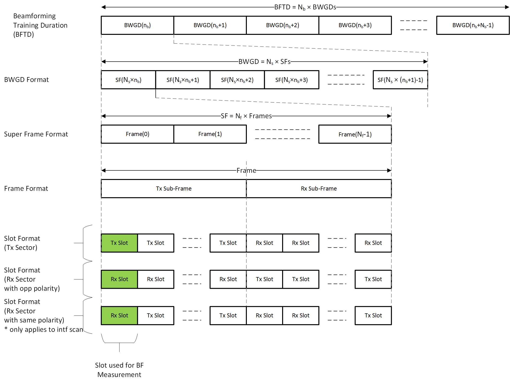

# Testing and Measurements
This document describes the testing and measurement capabilities of Terragraph.

<a id="testing-scans"></a>

## Scans
### Background
Association between two Terragraph nodes begins with initial beamforming.
Initial beamforming does a sweep of transmit (Tx) and receive (Rx) beams on a
coarse, 2x grid, aiming to find the best combination of beams in terms of SNR.
Those beams are used when the link is associated.

A scan is an opportunity to measure SNR and interference and optionally to
refine beams once the link is associated in a dedicated time slot. Scans are
done for multiple reasons:

* **Association** - The initial beamforming scan is required to associate.
* **Refinement** - Other types of scans can refine the 2x grid used in initial
  beamforming. Additionally, scans are used to adjust beams because
  conditions change over time.
* **Measurement and Analysis** - For example, scans can measure
  self-interference across the network.
* **Debugging** - If a particular link is underperforming (e.g., the data rate
  is too low, SNR is too low, or power is too high), one tool for debugging
  is to run a manual scan (PBF). Afterwards, scan results are collected and
  can be viewed in the NMS UI.

During a scan opportunity, there is typically one transmitter (initiator) and
one or more receivers (responders). The initiator and all responders sweep over
a set of beams and report results back to the E2E controller. The initiator
report contains only metadata about the scan; the responder report includes the
measured SNR and RSSI for each Tx/Rx beam combination. SNR can only be measured
if the receiver is able to detect the packet; the receiver sensitivity is around
-10dB SNR.

Scans are generally either wide or selective. A wide scan evaluates the entire
range of beams, while a selective scan evaluates a narrower range of beams
specific to the scan type. Selective scans cause less interference over the
short duration of the scan.

The transmit power of the initiator can be specified, but more commonly, the
transmitter in the scan chooses the transmit power based on the transmit power
it is currently using to send data. All nodes run Transmit Power Control (TPC),
so the power changes over time. When selecting the power for a scan, the node
uses a biased average of the currently used transmit power. It is biased toward
higher transmit power in order to measure worst-case interference. If a node has
multiple attached clients (P2MP), then the transmit power is the maximum over
all links.

Scans are initiated by an E2E controller command or API call. By default, no
scans are run.

### Scan Types
#### Initial Beamforming (IBF)
IBF scans are run by the firmware during ignition, without involving the E2E
controller. The scan finds a good beam angle, but not the "best beam" because it
needs to complete quickly. IBF runs using the maximum allowed transmit power.

#### Periodic Beamforming (PBF)
PBF scans find the best beam angle for the best SNR. These need to be run
periodically since temperature, weather, and other changes affect the SNR of the
selected beam.  A "fine" PBF scan operates over the entire range of beam angles
(roughly +/- 45 degrees), whereas a "selective" PBF scan operates only over the
current beam +/- 1.4 degrees.

#### Interference Measurement (IM)
IM scans measure interference between nearby nodes (not necessarily connected by
a link). These use the same transmit power calculation as PBF.

#### Runtime Calibration (RTCAL)
In contrast to PBF, which attempts to find the best beam angle based on a fine
grid, RTCAL makes very fine adjustments to the antenna weights without changing
the beam angle. Consider the following analogy — if Terragraph were a movie
projector, then PBF would angle the projector until it faces the screen
directly, and RTCAL would make fine adjustments to the focus (but the angling is
done electronically, without motors).

RTCAL scans are **not** supported in QTI firmware. Instead, a combination of PBF
scans and MTPO (multi-tile phase offset) calibration is used to achieve the
similar goal of adjusting the inter-tile phase offsets to maximize beamforming
gain of the antenna array.

#### Coordinated Beamforming (CBF)
CBF scans (i.e., Interference Nulling scans) are used to reduce interference.
These scans are **not** currently supported in QTI firmware.

### Scan Scheduling
The amount of time it takes to run a scan for the entire network depends on the
network topology. For a network with approximately 20 or more nodes, scans will
typically take on the order of 10-20 minutes, but this depends on the specific
locations of the nodes because of the Scheduling Groups described below.
Generally, the time it takes to complete a full-network scan does not depend on
the size of the network once the network reaches over 20 nodes because scans run
in parallel.

This section will explain how scans are scheduled and why it takes tens of
minutes to complete a round of scans for the network.

#### Slotmap
At a high level, a ~52-second slotmap is defined. Within a slotmap, there are
typically one or two opportunities to run a given scan type (e.g., PBF or IM).
Scans can run in parallel on different Terragraph nodes, but only if the two
scans do not cause RF interference with each other. A full network scan can take
tens of minutes because several slotmaps are needed to cover all nodes in the
network.

Scans can be initiated manually for a single link (for debugging), but they are
more commonly scheduled periodically for the entire network (e.g., every 6
hours). Scans need to be scheduled according to certain constraints, and a node
cannot perform more than one scan at a time. Because scans involve a sweep of
beams, simultaneous scans should not be run on nodes that are close to each
other in order to avoid erroneous measurements. For example, during a PBF scan
between nodes A→B, a simultaneous PBF scan between nodes C→D would only be
scheduled if nodes A and B are physically far away from  nodes C and D.

A *slotmap* is defined to coordinate scan scheduling as shown below:
<p align="center">
  
  <br />
  <em>Slotmap Definition</em>
</p>

* `Nf` = 4 frames (1 superframe = 1.6ms)
* `Ns` = 16 superframes (one BWGD = 25.6ms)
* `Nb` = 16 BWGDs (one BFTD = 409.6ms)
* `Nm` = 128 BFTDs (one slotmap ~= 52.5 seconds)

An example slotmap is shown below for the different scan types.
<p align="center">
  
  <br />
  <em>Slotmap Scheduling Example</em>
</p>

For example, two PBF scans can run in each slotmap. The slotmap is configurable.

#### Scheduling groups
Multiple scans of the same type (e.g., PBF) can run at the same time on
different links/nodes in the network in groups. But nodes within a group have to
be separated by a minimum distance to avoid interference. The distance is
configurable (e.g., 350 meters). The E2E controller calculates scheduling groups
based on GPS coordinates and the configured distance.

### Manual and Automated Scans
#### Manual
A manual scan is a one-shot scan (either for a particular set of nodes or once
for the entire network), used primarily for debugging a link. Scans can be
manually initiated using the TG CLI:

```bash
# PBF scan on link node1->node2
$ tg scan start -t pbf --tx node1 --rx node2

# IM scan from node1->node{2,3,4}, even if there are no links between them
$ tg scan start -t im --tx node1 --rx node2 --rx node3 --rx node4

# Run IM scan on whole network (more on this later)
$ tg scan start -t im
```

#### Automated
Scans can be automatically initiated by the E2E controller on a schedule set
using the TG CLI:

```bash
# Start whole-network PBF scans every 30 minutes, starting 30 minutes from now
$ tg scan schedule --pbf 1800

# Start whole-network IM scans every 20 minutes, starting 20 minutes from now
$ tg scan schedule --im 1200
```

Scanning impacts network performance for the short duration of a scan (between
51ms and 1.6s depending on the scan type), and should be run infrequently
(typically every 6 to 12 hours). During a scan, ~60us time slots (shown in green
in the slotmap definition figure above) are reserved for scans and therefore not
used to transmit data; in the 200us subframe, this is approximately a 30%
overhead. Depending on the scan type and network topology, a scan can also cause
interference on neighboring links that are not involved in the scan. This is
because a scan sweeps over multiple beams and therefore can directly transmit
energy in a direction other than the associated link(s). Interference will not
have any long-term impact but can, momentarily, cause a reduction in data rate
on neighboring links.

By default, the controller initiates PBF, RTCAL, and CBF scans every 4 hours
(defined in `/etc/e2e_config/controller_config_default.json`).

#### Scan Results
Completed scan results are processed by Query Service, and can be viewed in the
NMS.
